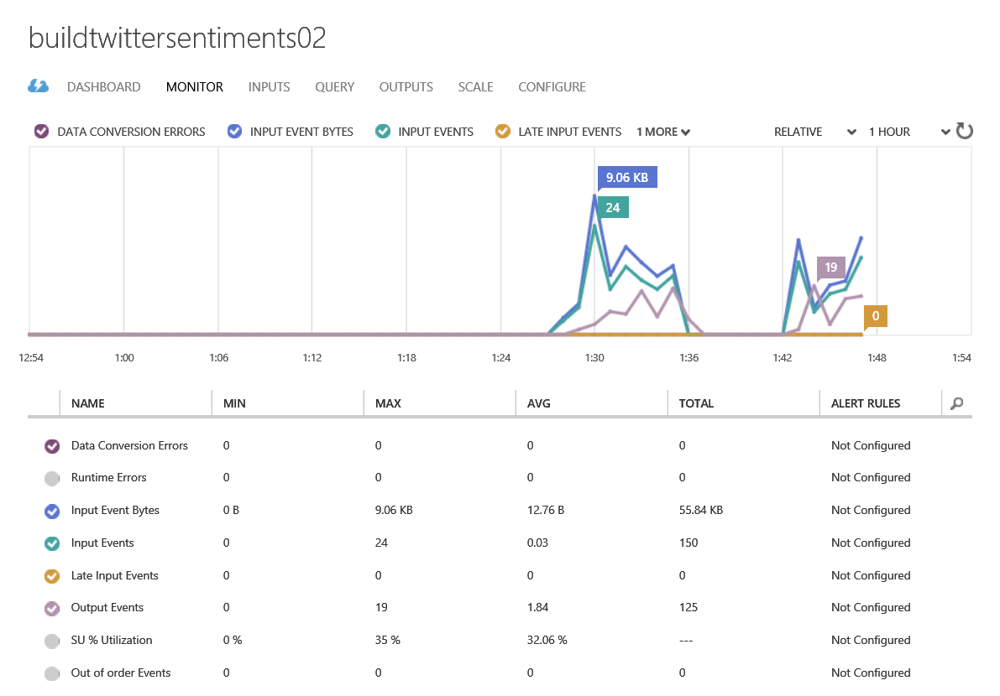
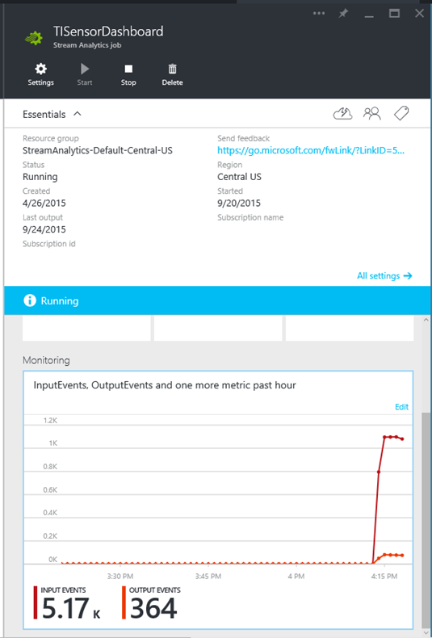
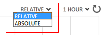
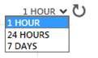
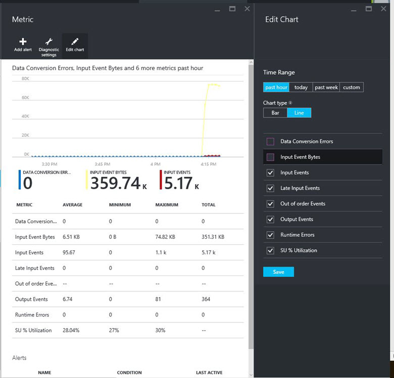
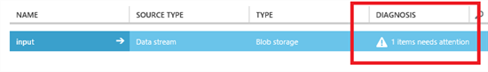
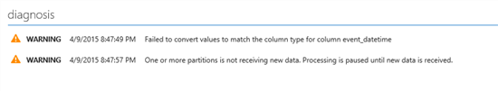

<properties 
	pageTitle="Understanding Stream Analytics Job Monitoring | Microsoft Azure" 
	description="Understanding Stream Analytics Job Monitoring" 
	keywords="query monitor"
	services="stream-analytics" 
	documentationCenter="" 
	authors="jeffstokes72" 
	manager="paulettm" 
	editor="cgronlun"/>

<tags 
	ms.service="stream-analytics" 
	ms.devlang="na" 
	ms.topic="article" 
	ms.tgt_pltfrm="na" 
	ms.workload="data-services" 
	ms.date="07/27/2016" 
	ms.author="jeffstok"/>

# Understand Stream Analytics job monitoring and how to monitor queries

## Introduction: The monitor page

The Azure Management portal and Azure Portal both surface key performance metrics that can be used to monitor and troubleshoot your query and job performance. 

In the Azure Management portal, click on the **Monitor** tab of a running Stream Analytics job to see these metrics. There is a delay of at the most 1 minute in the performance metrics showing up in the Monitor page.  

    

In the Azure Portal, browse to the Stream Analytics job you are interested in seeing metrics for and view the **Monitoring** section.  

    

The first time a Stream Analytics job is created in a region, you will need to configure Diagnostics for that region. To do this, click anywhere in the **Monitoring** section and the **Diagnostics** blade will appear. Here you can enable diagnostics and specify a storage account for monitoring data.  

    

## Metrics available for Stream Analytics

| Metric | Definition |
|--------|-------------|
| SU % Utilization | The utilization of the Streaming Unit(s) assigned to a job from the Scale tab of the job. Should this indicator reach 80%, or above, there is high probability that event processing may be delayed or stopped making progress. |
| Input Events | Amount of data received by the Stream Analytics job, in terms of event count. This can be used to validate that events are being sent to the input source. |
| Input Event Bytes | Amount of data received by the Stream Analytics job, in terms of throughput in bytes |
| Output Events | Amount of data sent by the Stream Analytics job to the output target, in terms of event count. |
| Out-of-Order Events | Number of events received out of order that were either dropped or given an adjusted timestamp, based on the Event Ordering Policy. This can be impacted by the configuration of the Out of Order Tolerance Window setting. |
| Data Conversion Errors | Number of data conversion errors incurred by a Stream Analytics job. |
| Runtime Errors | Number of errors that happen during execution of a Stream Analytics job. |
| Late Input Events | Number of events arriving late from the source which have either been dropped or their timestamp has been adjusted, based on the Event Ordering Policy configuration of the Late Arrival Tolerance Window setting. |

## Customizing Monitoring in the Azure Management portal ##

Up to 6 metrics can be displayed on a chart.

To switch between displaying relative values (final value only for each metric) and absolute values (Y axis displayed), select Relative or Absolute at the top of the chart.

    

Metrics can be viewed in the Monitor chart in aggregations of 1 hour, 12 hours, 24 hours or 7 days.

To change the time range the metrics chart displays, select 1 hour, 24 hours, or 7 days at the top of the chart.

    

You can set rules that can notify you by email in case the job crosses a defined threshold. 

## Customizing Monitoring in the Azure Portal ##

You can adjust the type of chart, metrics shown, and time range in the Edit Chart settings. For details, see [How to Customize Monitoring](../azure-portal/insights-how-to-customize-monitoring.md).

    

## Job status

The status of Stream Analytics jobs can be viewed in the Azure Classic Portal where you see a list of jobs. You can see the list of jobs by clicking the Stream Analytics icon in the Azure Classic Portal.

| Status | Definition |
|--------|------------|
| Created | A job has been created, however has not been started. |
| Starting | A user clicked on Start the job, and the job is starting |
| Running | The job is allocated, processing input, or waiting to process input. If the job shows a Running state without producing output, it is likely that the data processing time window is large or the query logic is complicated. Another reason may be that currently there isn't any data being sent to the job. |
| Stopping | A user clicked on Stop the job, and the job is stopping. |
| Stopped | The job has been stopped. |
| Degraded | This state indicates that a Stream Analytics job is encountering transient errors (for ex. Input/output errors, processing errors, conversion errors etc.). The job is still running, however there are a lot of errors being generated. This job needs customer attention, and the customer can see the Operations logs for the errors. |
| Failed | This indicates that the job has failed due to errors, and the processing has stopped. The customer needs to look into the operations logs in order to debug the errors. |
| Deleting | This indicates that the job is being deleted. |

## Diagnosis

In the Azure Management portal, the job dashboard provides information on where you need to look for the diagnosis, i.e. inputs, outputs and/or the operations log. You can click on the link to go the appropriate location to look at the diagnosis.

    

Clicking on the input or output resource provides detailed diagnostic information. This is refreshed with the latest diagnosis information while the job is running.

    

## Get help
For further assistance, try our [Azure Stream Analytics forum](https://social.msdn.microsoft.com/Forums/en-US/home?forum=AzureStreamAnalytics)

## Next steps

- [Introduction to Azure Stream Analytics](stream-analytics-introduction.md)
- [Get started using Azure Stream Analytics](stream-analytics-get-started.md)
- [Scale Azure Stream Analytics jobs](stream-analytics-scale-jobs.md)
- [Azure Stream Analytics Query Language Reference](https://msdn.microsoft.com/library/azure/dn834998.aspx)
- [Azure Stream Analytics Management REST API Reference](https://msdn.microsoft.com/library/azure/dn835031.aspx)
