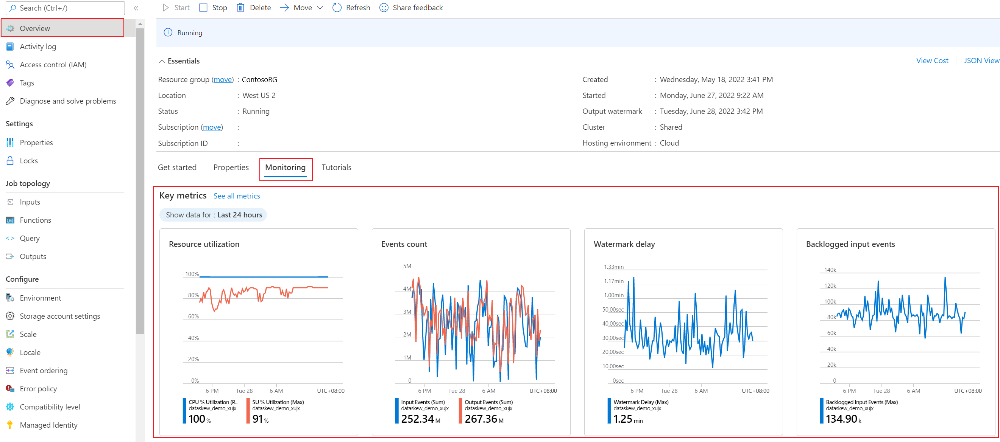

# Understand Stream Analytics job monitoring and how to monitor queries

## Introduction: The monitor page
The Azure portal both surface key performance metrics that can be used to monitor and troubleshoot your query and job performance. To see these metrics, browse to the Stream Analytics job you are interested in seeing metrics for and view the **Monitoring** section on the Overview page.  

The window will appear as shown:

  

## Metrics available for Stream Analytics
| Metric                 | Definition                               |
| ---------------------- | ---------------------------------------- |
| SU % Utilization       | The utilization of the Streaming Unit(s) assigned to a job from the Scale tab of the job. Should this indicator reach 80%, or above, there is high probability that event processing may be delayed or stopped making progress. |
| Input Events           | Amount of data received by the Stream Analytics job, in number of events. This can be used to validate that events are being sent to the input source. |
| Output Events          | Amount of data sent by the Stream Analytics job to the output target, in number of events. |
| Out-of-Order Events    | Number of events received out of order that were either dropped or given an adjusted timestamp, based on the Event Ordering Policy. This can be impacted by the configuration of the Out of Order Tolerance Window setting. |
| Data Conversion Errors | Number of data conversion errors incurred by a Stream Analytics job. |
| Runtime Errors         | The total number of errors that happen during execution of a Stream Analytics job. |
| Late Input Events      | Number of events arriving late from the source which have either been dropped or their timestamp has been adjusted, based on the Event Ordering Policy configuration of the Late Arrival Tolerance Window setting. |
| Function Requests      | Number of calls to the Azure Machine Learning function (if present). |
| Failed Function Requests | Number of failed Azure Machine Learning function calls (if present). |
| Function Events        | Number of events sent to the Azure Machine Learning function (if present). |
| Input Event Bytes      | Amount of data received by the Stream Analytics job, in bytes. This can be used to validate that events are being sent to the input source. |

## Customizing Monitoring in the Azure portal
You can adjust the type of chart, metrics shown, and time range in the Edit Chart settings. For details, see [How to Customize Monitoring](../monitoring-and-diagnostics/insights-how-to-customize-monitoring.md).

    

## Get help
For further assistance, try our [Azure Stream Analytics forum](https://social.msdn.microsoft.com/Forums/home?forum=AzureStreamAnalytics)

## Next steps
* [Introduction to Azure Stream Analytics](stream-analytics-introduction.md)
* [Get started using Azure Stream Analytics](stream-analytics-real-time-fraud-detection.md)
* [Scale Azure Stream Analytics jobs](stream-analytics-scale-jobs.md)
* [Azure Stream Analytics Query Language Reference](https://msdn.microsoft.com/library/azure/dn834998.aspx)
* [Azure Stream Analytics Management REST API Reference](https://msdn.microsoft.com/library/azure/dn835031.aspx)

