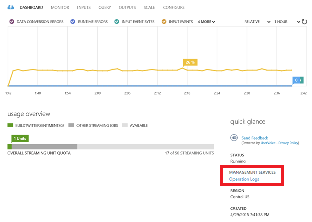
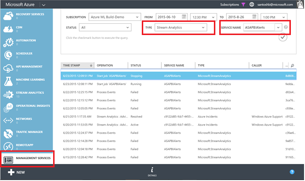
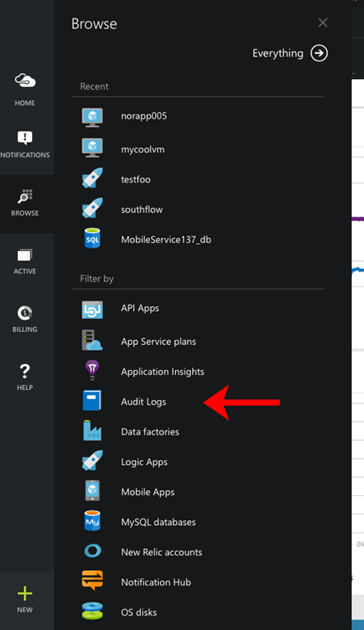
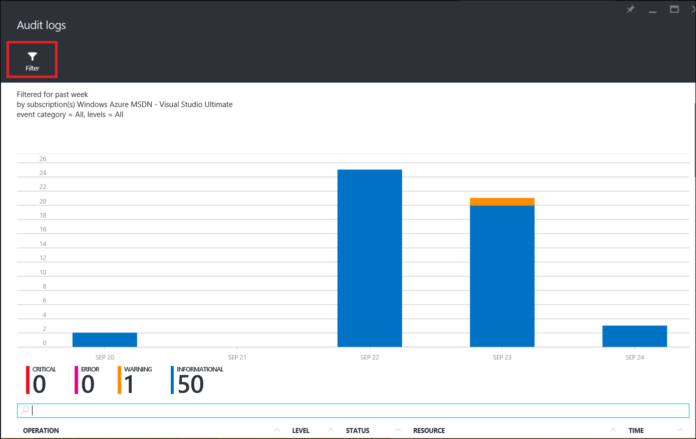
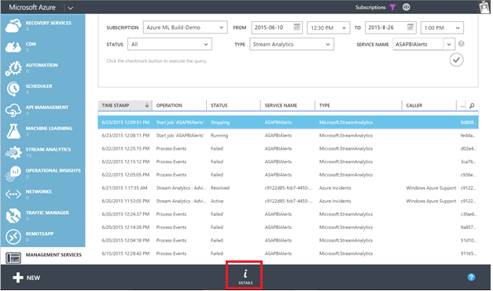
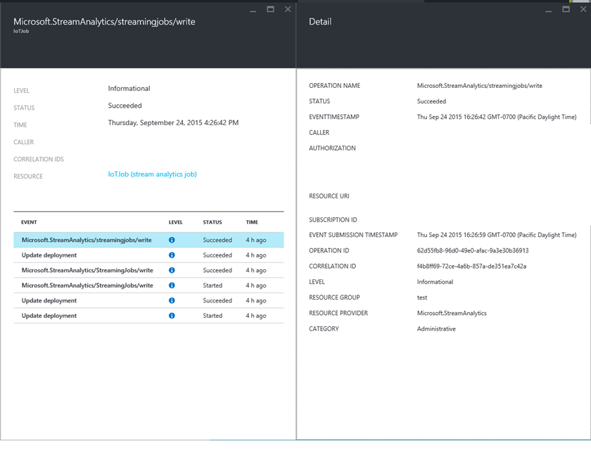
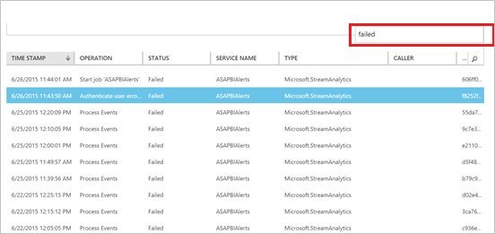
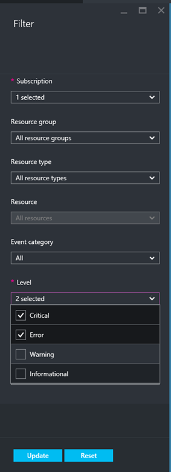
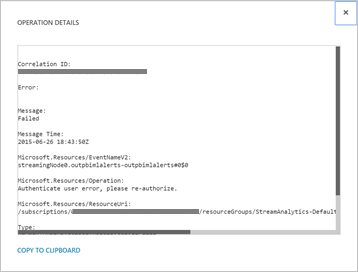

<properties 
	pageTitle="Debug using operation and service logs in Stream Analytics | Microsoft Azure" 
	description="How-to use Stream Analytics operation logs" 
	keywords="service logs"
	services="stream-analytics" 
	documentationCenter="" 
	authors="jeffstokes72" 
	manager="paulettm" 
	editor="cgronlun"/>

<tags 
	ms.service="stream-analytics" 
	ms.devlang="na" 
	ms.topic="article" 
	ms.tgt_pltfrm="na" 
	ms.workload="data-services" 
	ms.date="07/27/2016" 
	ms.author="jeffstok"/>

# Debug Stream Analytics jobs using service and operation logs

All Azure services supply operational logging messages to users to record details related to management operations. In Azure Stream Analytics, this information can be used for debugging purposes such as viewing job status, job progress, and failure messages to track the progress of a job over time, from start to processing to output.

## Find operation logs in the Azure Management Portal

Operation Logs can be accessed in two ways:  

- Dashboard of the Stream Analytics job  
- Management Services in the Azure Classic Portal  

## Dashboard of the Stream Analytics job

A link to the corresponding logs of a Stream Analytics job is displayed on the job’s Dashboard tab. If you click on that link, it will set the filters in a way that it shows latest logs for that specific job.

    

## Management Services

To manually navigate to the Operation Logs for Stream Analytics and other services in the Azure Classic Portal:

1.	Click on **Management Services** in the [Azure Classic Portal](https://manage.windowsazure.com).
2.	Select **Stream Analytics** for **Type** and the name of the job for **Service Name**.  

    

## Find audit logs in the Azure Portal ##

To find operational logs for your Stream Analytics job in the Azure Portal, Click **Browse** and then select **Audit logs**.

    

This will open a blade showing events from the last 7 days for all resources in your subscription.  You can filter to see events of a specify type or time frame by clicking the **Filter** command.

    

## Get log details

You can filter by Time Range and Status to view the logs for your job.

In the Azure Management portal, click on the **Details** button at the bottom of the window to view more details about a selected event. 

    

In the Azure Portal, click on a log entry to see the detailed events inside it.

    

From there, you can open the **Detail** blade by clicking on the event.

    

## Debug a failed job

In the Azure Management portal, click on the Search icon and type ‘failed’. This gives a result of all logs with failures. 

    

In the Azure Portal, you can filter by level of message to view **Critical** events.

    

You can select any one of the failures, and click on the **Details** for more information on the error.  Some error messages also provide information about how the mitigate the issue. 

    

In case you need to contact [Support](https://azure.microsoft.com/support/options/) or provide information to the team via the [MSDN forum](https://social.msdn.microsoft.com/Forums/en-US/home?forum=AzureStreamAnalytics), please note the Operation Details, specifically the **Correlation ID**. 

## Get help
For further assistance, try our [Azure Stream Analytics forum](https://social.msdn.microsoft.com/Forums/en-US/home?forum=AzureStreamAnalytics)

## Next steps

- [Introduction to Azure Stream Analytics](stream-analytics-introduction.md)
- [Get started using Azure Stream Analytics](stream-analytics-get-started.md)
- [Scale Azure Stream Analytics jobs](stream-analytics-scale-jobs.md)
- [Azure Stream Analytics Query Language Reference](https://msdn.microsoft.com/library/azure/dn834998.aspx)
- [Azure Stream Analytics Management REST API Reference](https://msdn.microsoft.com/library/azure/dn835031.aspx)
