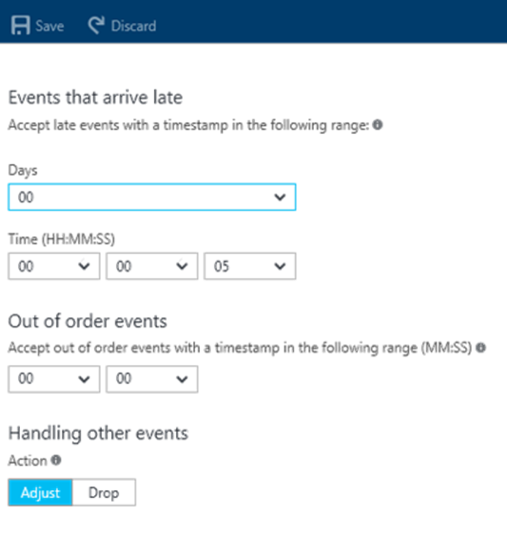
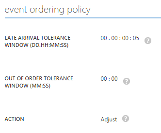

# Azure Stream Analytics event order handling

In a temporal data stream of events, each event is recorded with the time that the event is received. Some conditions might cause event streams to occasionally receive some events in a different order than which they were sent. A simple TCP retransmit, or even a clock skew between the sending device and the receiving event hub might cause this to occur. “Punctuation” events also are added to received event streams, to advance the time in the absence of event arrivals. These are needed in scenarios like “Notify me when no logins occur for 3 minutes."

Input streams that are not in order are either:
* Sorted (and therefore **delayed**).
* Adjusted by the system, according to a user-specified policy.

## Lateness tolerance
Stream Analytics tolerates these types of scenarios. Stream Analytics has handling for "out-of-order" and "late" events. It handles these events in the following ways:

* Events that arrive out of order but within the set tolerance are **reordered by timestamp**.
* Events that arrive later than tolerance are **dropped or adjusted**.
    * **Adjusted**: Adjusted to appear to have arrived at the latest acceptable time.
    * **Dropped**: Discarded.

## Reduce the number of out-of-order events

Because Stream Analytics applies a temporal transformation when it processes incoming events (for example, for windowed aggregates or temporal joins), Stream Analytics sorts incoming events by timestamp order.

When the “timestamp by” keyword is **not** used, the Azure Event Hubs event enqueue time is used by default. Event Hubs guarantees monotonicity of the timestamp on each partition of the event hub. It also guarantees that events from all partitions will be merged in timestamp order. These two Event Hubs guarantees ensure no out-of-order events.

Sometimes, it’s important for you to use the sender’s timestamp. In that case, a timestamp from the event payload is chosen by using “timestamp by.” In these scenarios, one or more sources of event misorder might be introduced:

* Event producers have clock skews. This is common when producers are from different computers, so they have different clocks.
* There's a network delay from the source of the events to the destination event hub.
* Clock skews exist between event hub partitions. Stream Analytics first sorts events from all event hub partitions by event enqueue time. Then, it examines the data stream for misordered events.

On the configuration tab, you see the following defaults:

If you use 0 seconds as the out-of-order tolerance window, you are asserting that all events are in order all the time. Given the three sources of misordered events, it’s unlikely that this is true. 

To allow Stream Analytics to correct an event misorder, you can specify a non-zero out-of-order tolerance window. Stream Analytics buffers events up to that window, and then reorders them by using the timestamp you chose. It then applies the temporal transformation. You can start with a 3-second window, and tune the value to reduce the number of events that are time-adjusted. 

A side effect of the buffering is that the output is **delayed by the same amount of time**. You can tune the value to reduce the number of out-of-order events, and keep the job latency low.

## Get help
For additional assistance, try our [Azure Stream Analytics forum](https://social.msdn.microsoft.com/Forums/home?forum=AzureStreamAnalytics).

## Next steps
* [Introduction to Stream Analytics](stream-analytics-introduction.md)
* [Get started with Stream Analytics](stream-analytics-real-time-fraud-detection.md)
* [Scale Stream Analytics jobs](stream-analytics-scale-jobs.md)
* [Stream Analytics query language reference](https://msdn.microsoft.com/library/azure/dn834998.aspx)
* [Stream Analytics management REST API reference](https://msdn.microsoft.com/library/azure/dn835031.aspx)