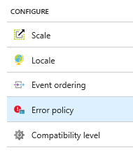

# Azure Stream Analytics output error policy
This article describes the output data error handling policies that can be configured in Azure Stream Analytics.

Output data error handling policies apply only to data conversion errors that occur when the output event produced by a Stream Analytics job does not conform to the schema of the target sink. You can configure this policy by choosing either **Retry** or **Drop**. In the Azure portal, while in a Stream Analytics job, under **Configure**, select **Error Policy** to make your selection.

## Retry
When an error occurs, Azure Stream Analytics retries writing the event indefinitely until the write succeeds. There is no timeout for retries. Eventually all subsequent events are blocked from processing by the event that is retrying. This option is the default output error handling policy.

## Drop
Azure Stream Analytics will drop any output event that results in a data conversion error. The dropped events cannot be recovered for reprocessing later.

All transient errors (for example, network errors) are retried regardless of the output error handling policy configuration.

## Next steps
[Troubleshooting guide for Azure Stream Analytics](stream-analytics-troubleshooting-guide.md)
