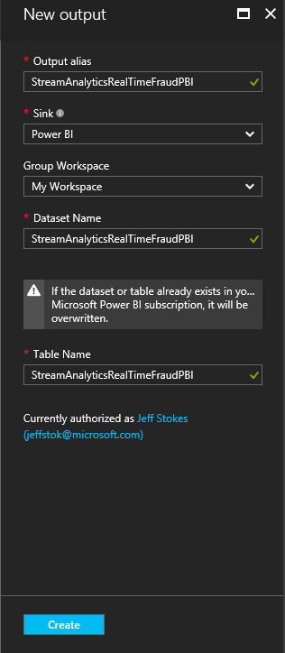
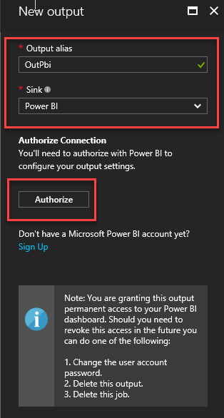
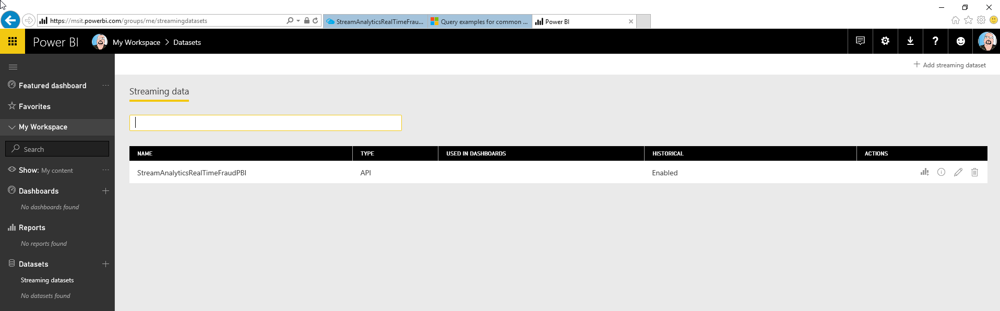
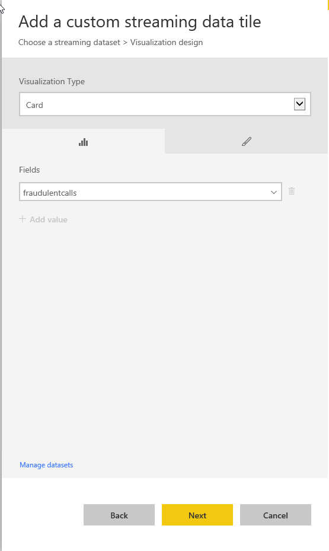
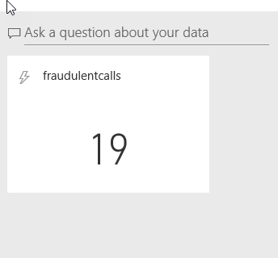
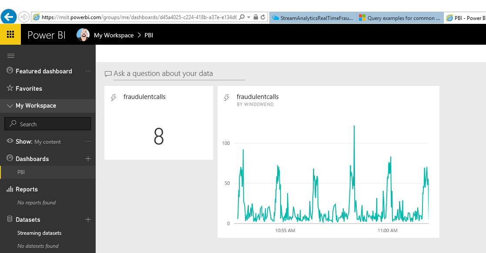

# Stream Analytics and Power BI: A real-time analytics dashboard for streaming data
Azure Stream Analytics enables you to take advantage of one of the leading business intelligence tools, [Microsoft Power BI](https://powerbi.com/). In this article, you learn how create your  business intelligence tools by using Power BI as an output for your Azure Stream Analytics jobs. You also learn how to create and use a real-time dashboard.

This article continues from the [real-time fraud detection](stream-analytics-real-time-fraud-detection.md) tutorial. It builds on the workflow created in that tutorial and adds a Power BI output so that you can visualize fraudulent phone calls that are detected by a Streaming Analytics job. 

You can watch [a video](https://www.youtube.com/watch?v=SGUpT-a99MA)  that illustrates this scenario.


## Prerequisites
* Microsoft Azure Account.
* Work or school account for Power BI.
* Completion of the [Real-time fraud detection](stream-analytics-real-time-fraud-detection.md) scenario. The article you're reading now builds on the workflow that's described in [Real-time fraud detection](stream-analytics-real-time-fraud-detection.md) and adds a Power BI streaming dataset output.

## Add Power BI output
Now that an input exists for the job, an output to Power BI can be defined.

1. Select the **Outputs** box in the middle of the job dashboard. Then select **+ Add** to create your output.

    

2. Provide the **Output Alias**. You can use any output alias that is easy for you to refer to. This output alias is helpful if you decide to have multiple outputs for your job. In this case, you refer to this output in your query. For example, let’s use the output alias value "StreamAnalyticsRealTimeFraudPBI."

3. Select **Authorize**.

    

4. A window opens where you can provide your Azure credentials (for a work or school account). It also provides your Azure job with access to your Power BI area.

    

5. The authorization disappears after you've provided the necessary information. The **New output** area has fields for the **Dataset Name** and **Table Name**.

    

6. Define them as follows:
    * **Group Workspace**: Select a workspace in your Power BI tenant under which to create the dataset.
    * **Dataset Name**:  Provide a dataset name that you want your Power BI output to have. For example, let’s use "StreamAnalyticsRealTimeFraudPBI."
    * **Table Name**: Provide a table name under the dataset of your Power BI output. For example, let's use "StreamAnalyticsRealTimeFraudPBI." Currently, Power BI output from Stream Analytics jobs can only have one table in a dataset.

7. Select **Create**. Now your output configuration is complete.

> [!WARNING]
> If Power BI already has a dataset and table that has the same name as the one in this Stream Analytics job, the existing data is overwritten.
> Also, we recommend that you do not explicitly create this dataset and table in your Power BI account. They are automatically created when you start your Stream Analytics job and the job starts pumping output into Power BI. If your job query doesn’t return any results, the dataset and table isn't created.
>
>

The dataset is created with the following settings:
* **defaultRetentionPolicy: BasicFIFO**: Data is FIFO, with a maximum of 200,000 rows.
* **defaultMode: pushStreaming**: Supports both streaming tiles and traditional report-based visuals (aka push).

Currently, you can't create datasets with other flags.

For more information about Power BI datasets, see the [Power BI REST API](https://msdn.microsoft.com/library/mt203562.aspx) reference.


## Write query
Go to the **Query** tab of your job. Write your query, the output of which you want in Power BI. For example, it could be similar to the following SQL query to catch SIM fraud in the telecommunications industry:


```
/* Our criteria for fraud:
 Calls made from the same caller to two phone switches in different locations (for example, Australia and Europe) within five seconds */

 SELECT System.Timestamp AS WindowEnd, COUNT(*) AS FraudulentCalls
 INTO "StreamAnalyticsRealTimeFraudPBI"
 FROM "StreamAnalyticsRealTimeFraudInput" CS1 TIMESTAMP BY CallRecTime
 JOIN "StreamAnalyticsRealTimeFraudInput" CS2 TIMESTAMP BY CallRecTime

/* Where the caller is the same, as indicated by IMSI (International Mobile Subscriber Identity) */
 ON CS1.CallingIMSI = CS2.CallingIMSI

/* ...and date between CS1 and CS2 is between one and five seconds */
 AND DATEDIFF(ss, CS1, CS2) BETWEEN 1 AND 5

/* Where the switch location is different */
 WHERE CS1.SwitchNum != CS2.SwitchNum
 GROUP BY TumblingWindow(Duration(second, 1))
```

## Create the dashboard in Power BI

1. Go to [Powerbi.com](https://powerbi.com), and then sign in with your work or school account. If the Stream Analytics job query outputs results, you see that your dataset is already created, as shown in the following illustration:

    

2. Select **Add tile**, and then select your custom streaming data.

    

3. Select your dataset from the list.

    

4. Create a visualization card. Then select the **fraudulentcalls** field.

    

    Now we have a fraud counter!

    

5. Walk through the exercise of adding a tile again. This time, however, select the line chart. Add **fraudulentcalls** as the value and **windowend** as the axis. We selected the last 10 minutes, as shown in the following screenshot:




This tutorial demonstrates how to create only one kind of chart for a dataset. Power BI can help you create other customer business intelligence tools for your organization. For another example of a Power BI dashboard, watch the [Getting Started with Power BI](https://youtu.be/L-Z_6P56aas?t=1m58s) video.

For more information about configuring a Power BI output and utilizing Power BI groups, review the [Power BI section](stream-analytics-define-outputs.md#power-bi) of [Understanding Stream Analytics outputs](stream-analytics-define-outputs.md "Understanding Stream Analytics outputs"). [Dashboards in Power BI](https://powerbi.microsoft.com/documentation/powerbi-service-dashboards/) is another helpful resource.

## Learn about limitations and best practices
Power BI employs both concurrency and throughput constraints as described [on this page about Power BI](https://powerbi.microsoft.com/pricing "Power BI Pricing").

Currently, Power BI can be called roughly once per second. Streaming visuals support packets of 15 KB. Beyond that, streaming visuals fail (but push continues to work).

Because of these limitations, Power BI lends itself most naturally to cases where Azure Stream Analytics does a significant data load reduction.
We recommend using Tumbling Window or Hopping Window to ensure that data push is at most one push per second, and that your query lands within the throughput requirements.

You can use the following equation to compute the value to give your window in seconds:

  

For example:
- You have 1,000 devices sending data at one-second intervals.
- You are using the Power BI Pro SKU that supports 1,000,000 rows per hour.
- You want to publish the amount of average data per device to Power BI.

As a result, the equation becomes:

  

This means we can change the original query to the following:

    SELECT
        MAX(hmdt) AS hmdt,
        MAX(temp) AS temp,
        System.TimeStamp AS time,
        dspl
    INTO
        OutPBI
    FROM
        Input TIMESTAMP BY time
    GROUP BY
        TUMBLINGWINDOW(ss,4),
        dspl


### Renew authorization
If the password has changed since your job was created or last authenticated, you need to re-authenticate your Power BI account. If Azure Multi-Factor Authentication is configured on your Azure Active Directory (Azure AD) tenant, you also need to renew Power BI authorization every two weeks. If you don't renew, you could see symptoms such as a lack of job output or an "Authenticate user error" in the operation logs.

Similarly, if a job attempts to start after the token has expired, an error occurs and the job starts to fail. To resolve this issue, stop the job that's running and go to your Power BI output. To avoid data loss, select the **Renew authorization** link, and then restart your job from the **Last Stopped Time**.

After the authorization has been refreshed with Power BI, a green alert appears in the authorization area to reflect that the issue has been resolved.

## Get help
For further assistance, try our [Azure Stream Analytics forum](https://social.msdn.microsoft.com/Forums/home?forum=AzureStreamAnalytics).

## Next steps
* [Introduction to Azure Stream Analytics](stream-analytics-introduction.md)
* [Get started using Azure Stream Analytics](stream-analytics-get-started.md)
* [Scale Azure Stream Analytics jobs](stream-analytics-scale-jobs.md)
* [Azure Stream Analytics query language reference](https://msdn.microsoft.com/library/azure/dn834998.aspx)
* [Azure Stream Analytics Management REST API reference](https://msdn.microsoft.com/library/azure/dn835031.aspx)
