# Stream Analytics & Power BI: A real-time analytics dashboard for streaming data
Azure Stream Analytics allows you to take advantage of one of the leading business intelligence tools, Microsoft Power BI. Learn how to use Azure Stream Analytics to analyze high-volume, streaming data and get the insight in a real-time Power BI analytics dashboard.

Use [Microsoft Power BI](https://powerbi.com/) to build a live dashboard quickly. [Watch a video illustrating the scenario](https://www.youtube.com/watch?v=SGUpT-a99MA).

In this article, learn how create your own custom business intelligence tools by using Power BI as an output for your Azure Stream Analytics jobs and utilize a real-time dashboard.

## Prerequisites
* Microsoft Azure Account
* Work or school account for Power BI
* Sample JSON [datafile](https://github.com/Azure/azure-stream-analytics/blob/master/Sample%20Data/SampleSensorData.json) stored in our GitHub [repository](https://github.com/Azure/azure-stream-analytics).

## Create an Event Hub input
Before a job can be created some pre-work must be completed. An Azure Event Hub needs to be made. This is a quick and easy process to complete. Simply follow the instructions below:

Open the [Azure portal](https://portal.azure.com) and create a new Event Hub by clicking the **+ New** button on the top left of the portal.


Type 'Event Hub' and press enter. Then select **Event Hubs** and click **Create**.

You'll be presented with a screen to create your namespace. This is a container of Event Hubs and other objects. Provide a few items and then you are able to create the namespace.

* **Name** - provide a name for your namespace. In this demo I am using "devicetemperaturesNS"
* **Resource Group** - I created a new resource group named "devicetemperaturesRG"
* **Location** - pick a location and remember it as you'll want everything to be in the same region for performance

You can leave pricing tier and subscription as default (unless you have a need to change them due to your specific environment).

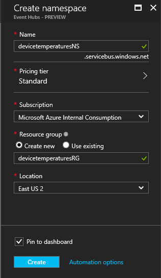

So next select **Create** and let Azure build the resource. When it is complete go into your new namespace object and create an Event Hub.

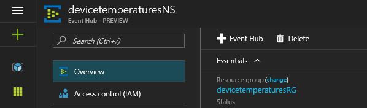

Once your window appears simply provide a name for your Event Hub and select **Create**. I have used "devicetemperaturesEH" in my example.

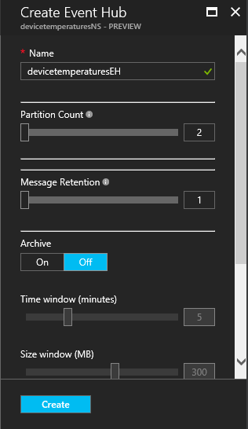

Once you have selected **Create** the Event Hub will be created. Add a shared access policy by selecting **Shared access policies** and then **Add** and giving the policy a name and selecting the claim.

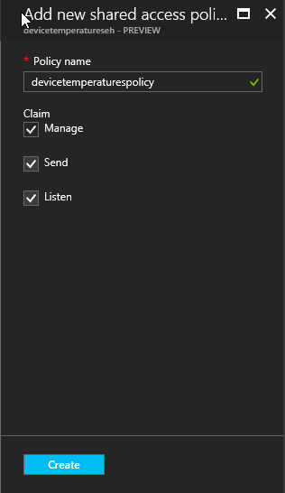

## Create Azure Stream Analytics job
Now it is time to create the job itself.

From [Azure portal](https://portal.azure.com), click the **+ New** button on the top left of the portal and type 'Stream Analytics' and then select **Create**.

This will bring you to a wizard to create your new job.

Specify the following values, then select **Create**:

* **Job Name** - Enter a job name. For example, **DeviceTemperatures**.
* **Resource Group** - Choose the Resource Group that you previously created.
* **Location** - Select the region where you want the job located. Consider placing the job and the Event Hub in the same region to ensure optimal performance and avoid incurring data transfer costs between regions.

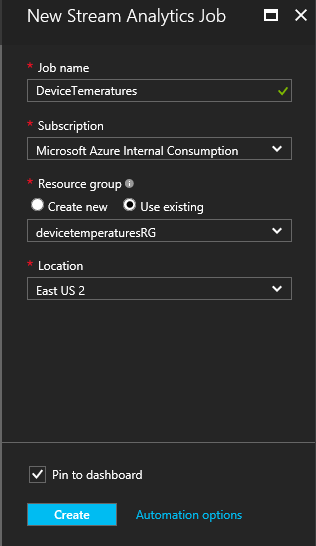

Once the job is created the job dashboard will appear.

> [!TIP]
> The new job will be listed with a status of **Not Started**. Notice that the **Start** button on the bottom of the page is disabled. This is expected behavior as you must configure the job input, output, query, and so on before you can start the job.
> 
> 

## Specify job input
To add an input simply select the inputs box in the middle of your job dashboard.

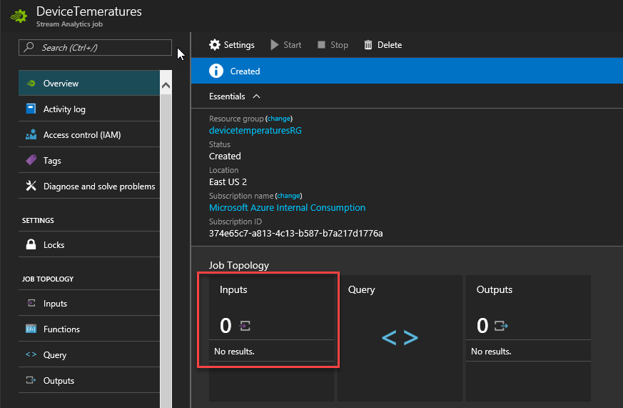

Then select **Add** and create your input.

* **Input Alias** - Enter a friendly name for this job input. Note that you will be using this name in the query later on.
* **Source Type** - Select **Data Stream**
* **Source** -  Select **Event Hub**

For the purposes of this demo the defaults are acceptable for all additional fields present.

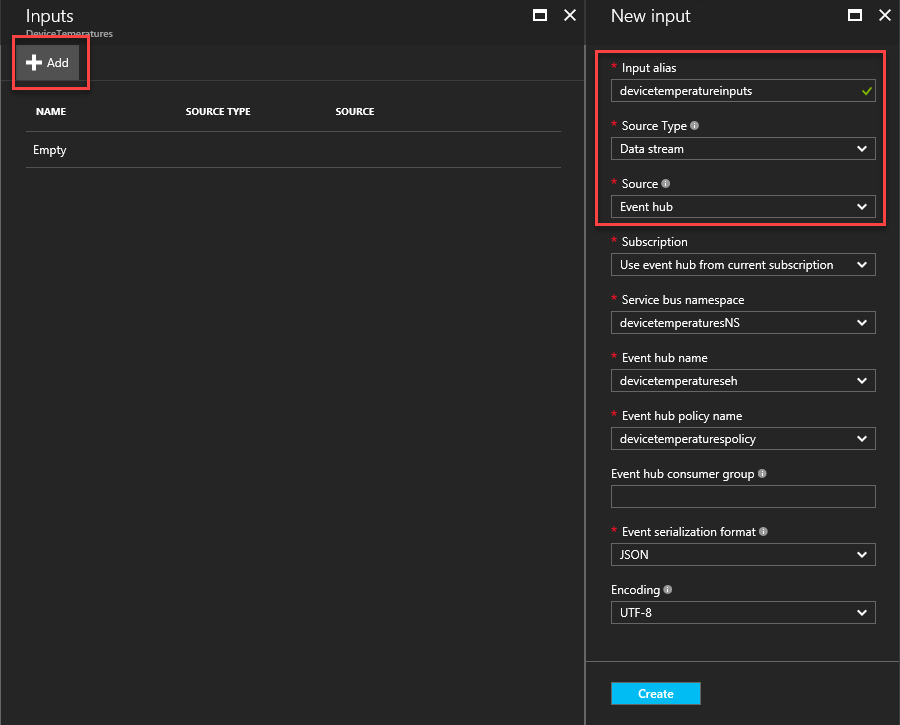

> [!NOTE]
> This sample uses the default number of partitions, which is 16.
> 
> 

Now select **Create** at the bottom. The input will be created.


## Add Power BI output
Now that an input exists for the job, an output to Power BI can be defined. Select the box in the middle of the job dashboard **Outputs**.

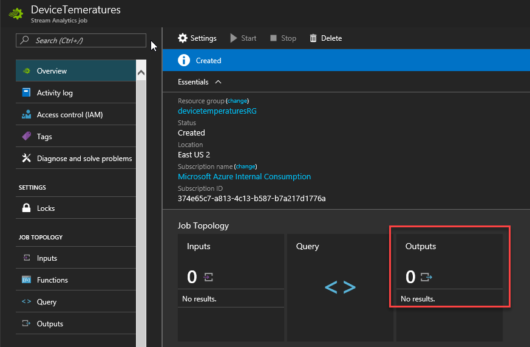

Then click the familiar **+ Add** button and create your output.

Provide the **Output Alias** – You can put any output alias that is easy for you to refer to. This output alias is particularly helpful if you decide to have multiple outputs for your job. In that case, you have to refer to this output in your query. For example, let’s use the output alias value = “OutPbi”.

Then click the **Authorize** button.


This will prompt a window to provide your Azure credentials (work or school account) and it will provide your Azure job access to your Power BI area.


The authorization window will disappear when satisfied and the New output area will have fields for the Dataset Name and Table Name.


Define them as follows:
* **Group Workspace** – Select a workspace in your Power BI tenant under which the dataset will be created.
* **Dataset Name** - Provide a dataset name that you want your Power BI output to have. For example, let’s use “pbidemo”.
* **Table Name** - Provide a table name under the dataset of your Power BI output. Let’s say we call it “pbidemo”. Currently, Power BI output from Stream Analytics jobs may only have one table in a dataset.

Click **Create** and now you output configuration is complete.

> [!WARNING]
> Please be aware that if Power BI already had a dataset and table with the same name as the one you provided in this Stream Analytics job, the existing data will be overwritten!
> Also, you should not explicitly create this dataset and table in your Power BI account. They will be automatically created when you start your Stream Analytics job and the job starts pumping output into Power BI. If your job query doesn’t return any results, the dataset and table will not be created.
> 
> 

The dataset is created with the following settings set;
* defaultRetentionPolicy: BasicFIFO - data is FIFO, 200k maximum rows
* defaultMode: pushStreaming: supports both streaming tiles and traditional report-based visuals (aka push)
* creating datasets with other flags is unsupported at this time

For more information on Power BI datasets see the [Power BI REST API](https://msdn.microsoft.com/library/mt203562.aspx) reference.


## Write query
Go to the **Query** tab of your job. Write your query, the output of which you want in your Power BI. For example, it could be something such as the following SQL query:


```
    SELECT
        MAX(hmdt) AS hmdt,
        MAX(temp) AS temp,
        System.TimeStamp AS time,
        dspl
    INTO
        OutPBI
    FROM
        devicetemperatureinputs TIMESTAMP BY time
    GROUP BY
        TUMBLINGWINDOW(ss,1),
        dspl

```

Add your JSON sample [data file](https://github.com/Azure/azure-stream-analytics/blob/master/Sample%20Data/SampleSensorData.json) to your job as test data. The easiest way to do this is to click the link and then click "Raw". This renders the raw JSON file you can then "select all" and copy/paste into an empty JSON file.

To add the JSON to your input click the Input in the query pane of the portal and click the ... after your input.

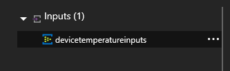

Then select "Upload sample data". A field will appear on the right to select a file for upload.

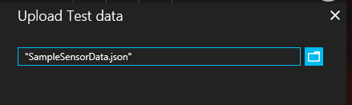

And then simply select **OK**.

This will load the file into the input and you can then click **Test** to run the query. 

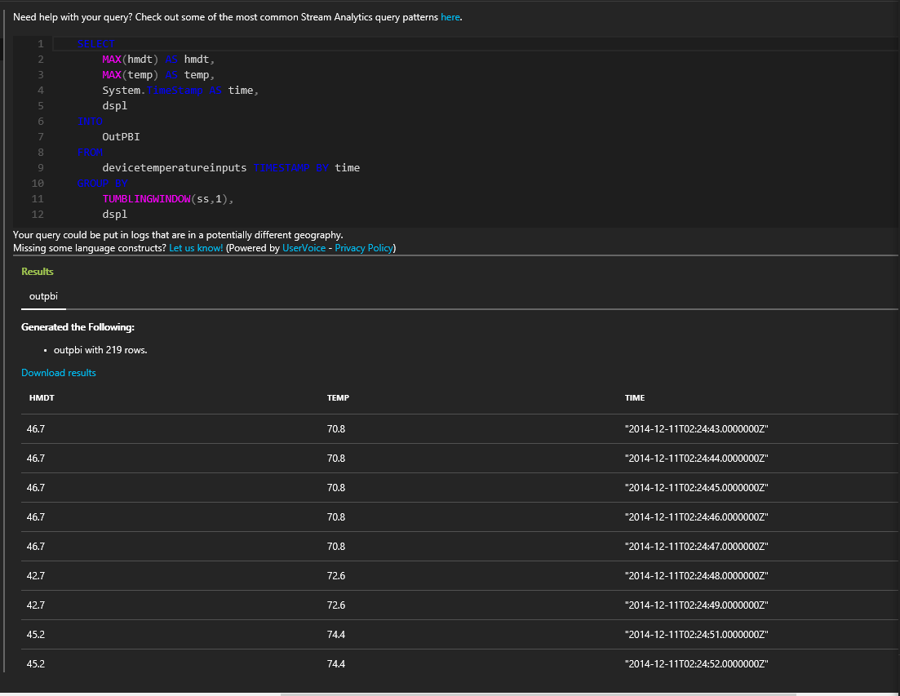

## Create the dashboard in Power BI

Go to [Powerbi.com](https://powerbi.com) and login with your work or school account. If the Stream Analytics job query outputs results, you will see your dataset is already created:

![graphic5][graphic5]

For creating the dashboard, go to the Dashboards option and create a new Dashboard.

![graphic6][graphic6]

In this example we'll label it "Demo Dashboard".

Now click on the dataset created by your Stream Analytics job (pbidemo in our current example). You will be taken to a page to create a chart on top of this dataset. The following is but one example of the reports you can create:

Select Σ temp and time fields. They will automatically go to Value and Axis for the chart:

![graphic7][graphic7]

With this, you will automatically get a chart as below:

![graphic8][graphic8]

In the value section, click on the drop-down for temp and choose **average** for the temperature and on the chart, click on **visualization** and choose **line chart**:

![graphic9][graphic9]

You will now get a line chart of average over time.  Using the pin option as below, you can pin this to your dashboard that you previously created:

![graphic10][graphic10]

Now when you view the dashboard with this pinned report, you will see report updating in real time. Try changing the data in your events – spike temp or something like that and you will see the real-time effect of that reflected in your dashboard.

Note that this tutorial demonstrated how to create but one kind of chart for a dataset. Power BI can help you create other customer business intelligence tools for your organization. For another example of a Power BI dashboard, watch the [Getting Started with Power BI](https://youtu.be/L-Z_6P56aas?t=1m58s) video.

For further information on configuring a Power BI output and to utilize Power BI groups, review the [Power BI section](stream-analytics-define-outputs.md#power-bi) of [Understanding Stream Analytics outputs](stream-analytics-define-outputs.md "Understanding Stream Analytics outputs"). Another helpful resource to learn more about creating Dashboards with Power BI is [Dashboards in Power BI](https://powerbi.microsoft.com/documentation/powerbi-service-dashboards/).

## Limitations and best practices
Power BI employs both concurrency and throughput constraints as described here: [https://powerbi.microsoft.com/pricing](https://powerbi.microsoft.com/pricing "Power BI Pricing")

Currently, you Power BI can be called roughly once per second. Streaming visuals support packets of size 15kb. Beyond that and streaming visuals will fail (but push will continue to work).

Because of those Power BI lands itself most naturally to cases where Azure Stream Analytics does a significant data load reduction.
We recommend using TumblingWindow or HoppingWindow to ensure that data push would be at most 1 push/second and that your query lands within the throughput requirements – you can use the following equation to compute the value to give your window in seconds:

  

As an example – If you have 1,000 devices sending data every second, you are on the Power BI Pro SKU that supports 1,000,000 rows/hour and you want to get average data per device on Power BI you can do at most a push every 4 seconds per device (as shown below):  

  

Which means we would change the original query to:

    SELECT
        MAX(hmdt) AS hmdt,
        MAX(temp) AS temp,
        System.TimeStamp AS time,
        dspl
    INTO
        OutPBI
    FROM
        Input TIMESTAMP BY time
    GROUP BY
        TUMBLINGWINDOW(ss,4),
        dspl


### Renew authorization
You need to re-authenticate your Power BI account if its password has changed since your job was created or last authenticated. If Multi-Factor Authentication (MFA) is configured on your Azure Active Directory (AAD) tenant you will also need to renew Power BI authorization every 2 weeks. A symptom of this issue is no job output and an "Authenticate user error" in the Operation Logs:

![graphic12][graphic12]

Similarly, if a job attempts to start while the token is expired, an error will occur and the job start will fail. The error will look something like below:

 

To resolve this issue, stop your running job and go to your Power BI output.  Click the “Renew authorization” link, and restart your job from the Last Stopped Time to avoid data loss.

 

Once the authorization is refreshed with Power BI you will see a green alert in the authorization area:

 

## Get help
For further assistance, try our [Azure Stream Analytics forum](https://social.msdn.microsoft.com/Forums/en-US/home?forum=AzureStreamAnalytics)

## Next steps
* [Introduction to Azure Stream Analytics](stream-analytics-introduction.md)
* [Get started using Azure Stream Analytics](stream-analytics-get-started.md)
* [Scale Azure Stream Analytics jobs](stream-analytics-scale-jobs.md)
* [Azure Stream Analytics Query Language Reference](https://msdn.microsoft.com/library/azure/dn834998.aspx)
* [Azure Stream Analytics Management REST API Reference](https://msdn.microsoft.com/library/azure/dn835031.aspx)

[graphic1]: ./media/stream-analytics-power-bi-dashboard/1-stream-analytics-power-bi-dashboard.png
[graphic2]: ./media/stream-analytics-power-bi-dashboard/2-stream-analytics-power-bi-dashboard.png
[graphic3]: ./media/stream-analytics-power-bi-dashboard/3-stream-analytics-power-bi-dashboard.png
[graphic4]: ./media/stream-analytics-power-bi-dashboard/4-stream-analytics-power-bi-dashboard.png
[graphic5]: ./media/stream-analytics-power-bi-dashboard/5-stream-analytics-power-bi-dashboard.png
[graphic6]: ./media/stream-analytics-power-bi-dashboard/6-stream-analytics-power-bi-dashboard.png
[graphic7]: ./media/stream-analytics-power-bi-dashboard/7-stream-analytics-power-bi-dashboard.png
[graphic8]: ./media/stream-analytics-power-bi-dashboard/8-stream-analytics-power-bi-dashboard.png
[graphic9]: ./media/stream-analytics-power-bi-dashboard/9-stream-analytics-power-bi-dashboard.png
[graphic10]: ./media/stream-analytics-power-bi-dashboard/10-stream-analytics-power-bi-dashboard.png
[graphic11]: ./media/stream-analytics-power-bi-dashboard/11-stream-analytics-power-bi-dashboard.png
[graphic12]: ./media/stream-analytics-power-bi-dashboard/12-stream-analytics-power-bi-dashboard.png
[graphic13]: ./media/stream-analytics-power-bi-dashboard/13-stream-analytics-power-bi-dashboard.png
