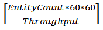
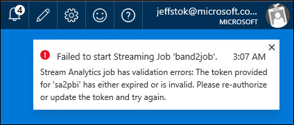
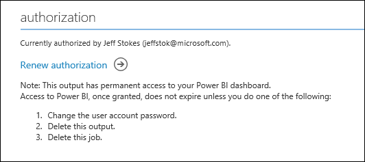
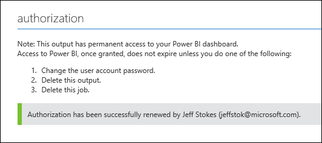

<properties
	pageTitle="Power BI dashboard on Stream Analytics | Microsoft Azure"
	description="Use a real-time streaming Power BI dashboard to gather business intelligence and analyze high-volume data from a Stream Analytics job."
	keywords="analytics dashboard, real-time dashboard"
	services="stream-analytics"
	documentationCenter=""
	authors="jeffstokes72"
	manager="paulettm"
	editor="cgronlun"/>

<tags
	ms.service="stream-analytics"
	ms.devlang="na"
	ms.topic="article"
	ms.tgt_pltfrm="na"
	ms.workload="data-services"
	ms.date="07/27/2016"
	ms.author="jeffstok"/>

#  Stream Analytics & Power BI: A real-time analytics dashboard for streaming data

Azure Stream Analytics allows you to take advantage of one of the leading business intelligence tools, Microsoft Power BI. Learn how to use Azure Stream Analytics to analyze high-volume, streaming data and get the insight in a real-time Power BI analytics dashboard.

Use [Microsoft Power BI](https://powerbi.com/) to build a live dashboard quickly. [Watch a video illustrating the scenario](https://www.youtube.com/watch?v=SGUpT-a99MA).

In this article, learn how create your own custom business intelligence tools by using Power BI as an output for your Azure Stream Analytics jobs and utilize a real-time dashboard.

## Prerequisites

* Microsoft Azure Account
* An input for the Stream Analytics job to consume streaming data from. Stream Analytics accepts input from Azure Event Hubs or Azure Blob storage.  
* Work or school account for Power BI

## Create Azure Stream Analytics job

From [Azure Classic Portal](https://manage.windowsazure.com), click **New, Data Services, Stream Analytics, Quick Create**.

Specifiy the following values, then click **Create Stream Analytics job**:

* **Job Name** - Enter a job name. For example, **DeviceTemperatures**.
* **Region** - Select the region where you want the job located. Consider placing the job and the event hub in the same region to ensure optimal performance and avoid incurring data transfer costs between regions.
* **Storage Account** - Choose the Storage Account that you would like to use to store monitoring data for all Stream Analytics jobs running within this region. You have the option to choose an existing Storage Account or create a new one.

Click **Stream Analytics** in the left pane to list the Stream Analytics jobs.

![graphic1][graphic1]

> [AZURE.TIP] The new job will be listed with a status of **Not Started**. Notice that the **Start** button on the bottom of the page is disabled. This is expected behavior as you must configure the job input, output, query, and so on before you can start the job.

## Specify job input

For this tutorial, we are assuming you are using Event Hub as an input with JSON serialization and UTF-8 encoding.

* Click the job name.
* Click **Inputs** from the top of the page, and then click **Add Input**. The dialog that opens will walk you through a number of steps to set up your input.
*	Select **Data Stream**, and then click the right button.
*	Select **Event Hub**, and then click the right button.
*	Type or select the following values on the third page:
  *	**Input Alias** - Enter a friendly name for this job input. Note that you will be using this name in the query later on.
  * **Event Hub** - If the Event Hub you created is in the same subscription as the Stream Analytics job, select the namespace that the event hub is in.
*	If your event hub is in a different subscription, select **Use Event Hub from Another Subscription** and manually enter information for **Service Bus Namespace**, **Event Hub Name**, **Event Hub Policy Name**, **Event Hub Policy Key**, and **Event Hub Partition Count**.

> [AZURE.NOTE]	This sample uses the default number of partitions, which is 16.

* **Event Hub Name** - Select the name of the Azure Event Hub you have.
* **Event Hub Policy Name** - Select the Event Hub policy for the Event Hub you are using. Ensure that this policy has manage permissions.
*	**Event Hub Consumer Group** – You can leave this empty or specify a consumer group you have on your Event Hub. Note that each consumer group of an Event Hub can have only 5 readers at a time. So, decide the right consumer group for your job accordingly. If you leave the field blank, it will use the default consumer group.

*	Click the right button.
*	Specify the following values:
  *	**Event Serializer Format** - JSON
  *	**Encoding** - UTF8
*	Click the check button to add this source and to verify that Stream Analytics can successfully connect to the Event Hub.

## Add Power BI output

1.  Click **Output** from the top of the page, and then click **Add Output**. You will see Power BI listed as an output option.

    ![graphic2][graphic2]  

2.  Select **Power BI** and then click the right button.
3.  You will see a screen like the following:

    ![graphic3][graphic3]  

4.  In this step, supply a work or school account for the Stream Analytics job output. If you already have Power BI account, select **Authorize Now**. If not, choose **Sign up now**. [Here is a good blog walking through details of Power BI sign up](http://blogs.technet.com/b/powerbisupport/archive/2015/02/06/power-bi-sign-up-walkthrough.aspx).

    ![graphic11][graphic11]  

5.  Next you will see a screen like the following:

    ![graphic4][graphic4]  

Provide values as below:

* **Output Alias** – You can put any output alias that is easy for you to refer to. This output alias is particularly helpful if you decide to have multiple outputs for your job. In that case, you have to refer to this output in your query. For example, let’s use the output alias value = “OutPbi”.
* **Dataset Name** - Provide a dataset name that you want your Power BI output to have. For example, let’s use “pbidemo”.
*	**Table Name** - Provide a table name under the dataset of your Power BI output. Let’s say we call it “pbidemo”. Currently, Power BI output from Stream Analytics jobs may only have one table in a dataset.
*	**Workspace** – Select a workspace in your Power BI tenant under which the dataset will be created.

>	[AZURE.NOTE] You should not explicitly create this dataset and table in your Power BI account. They will be automatically created when you start your Stream Analytics job and the job starts pumping output into Power BI. If your job query doesn’t return any results, the dataset and table will not be created.

*	Click **OK**, **Test Connection** and now you output configuraiton is complete.

>	[AZURE.WARNING] Also be aware that if Power BI already had a dataset and table with the same name as the one you provided in this Stream Analytics job, the existing data will be overwritten.

## Write query

Go to the **Query** tab of your job. Write your query, the output of which you want in your Power BI. For example, it could be something such as the following SQL query:

    SELECT
    	MAX(hmdt) AS hmdt,
    	MAX(temp) AS temp,
    	System.TimeStamp AS time,
    	dspl
    INTO
        OutPBI
    FROM
    	Input TIMESTAMP BY time
    GROUP BY
    	TUMBLINGWINDOW(ss,1),
    	dspl

Start your job. Validate that your event hub is receiving events and your query generates the expected results. If your query outputs 0 rows, Power BI dataset and tables will not be automatically created.

## Create the dashboard in Power BI

Go to [Powerbi.com](https://powerbi.com) and login with your work or school account. If the Stream Analytics job query outputs results, you will see your dataset is already created:

![graphic5][graphic5]

For creating the dashboard, go to the Dashboards option and create a new Dashboard.

![graphic6][graphic6]

In this example we'll lable it "Demo Dashboard".

Now click on the dataset created by your Stream Analytics job (pbidemo in our current example). You will be taken to a page to create a chart on top of this dataset. The following is but one example of the reports you can create:

Select Σ temp and time fields. They will automatically go to Value and Axis for the chart:

![graphic7][graphic7]

With this, you will automatically get a chart as below:

![graphic8][graphic8]

In the value section, click on the drop down for temp and choose **average** for the temperature and on the chart, click on **visualization** and choose **line chart**:

![graphic9][graphic9]

You will now get a line chart of average over time.  Using the pin option as below, you can pin this to your dashboard that you previously created:

![graphic10][graphic10]

Now when you view the dashboard with this pinned report, you will see report updating in real time. Try changing the data in your events – spike temp or something like that and you will see the real-time effect of that reflected in your dashboard.

Note that this tutorial demonstrated how to create but one kind of chart for a dataset. Power BI can help you create other customer business intelligence tools for your organization. For another example of a Power BI dashboard, watch the [Getting Started with Power BI](https://youtu.be/L-Z_6P56aas?t=1m58s) video.

For further information on configuring a Power BI output and to utilize Power BI groups, review the [Power BI section](stream-analytics-define-outputs.md#power-bi) of [Understanding Stream Analytics outputs](stream-analytics-define-outputs.md "Understanding Stream Analytics outputs"). Another helpful resource to learn more about creating Dashboards with Power BI is [Dashboards in Power BI](https://powerbi.microsoft.com/documentation/powerbi-service-dashboards/).

## Limitations and best practices

Power BI employs both concurrency and throughput constraints as described here: [https://powerbi.microsoft.com/pricing](https://powerbi.microsoft.com/pricing "Power BI Pricing")

Because of those Power BI lands itself most naturally to cases where Azure Stream Analytics does a significant data load reduction.
We recommend using TumblingWindow or HoppingWindow to ensure that data push would be at most 1 push/second and that your query lands within the throughput requirements – you can use the following equation to compute the value to give your window in seconds:

  

As an example – If you have 1,000 devices sending data every second, you are on the Power BI Pro SKU that supports 1,000,000 rows/hour and you want to get average data per device on Power BI you can do at most a push every 4 seconds per device (as shown below):  

  

Which means we would change the original query to:

    SELECT
    	MAX(hmdt) AS hmdt,
    	MAX(temp) AS temp,
    	System.TimeStamp AS time,
    	dspl
    INTO
    	OutPBI
    FROM
    	Input TIMESTAMP BY time
    GROUP BY
    	TUMBLINGWINDOW(ss,4),
    	dspl

### PowerBI view refresh

A common question is "Why doesn't the dashboard auto-update in PowerBI?".

To achieve this, in PowerBI utilize Q&A and asking a question such as "Maximum value by temp where Timestamp is today" and pin that tile to the dashboard.

### Renew authorization

You will need to re-authenticate your Power BI account if its password has changed since your job was created or last authenticated. If Multi-Factor Authentication (MFA) is configured on your Azure Active Directory (AAD) tenant you will also need to renew Power BI authorization every 2 weeks. A symptom of this issue is no job output and an "Authenticate user error" in the Operation Logs:

![graphic12][graphic12]

Similarly, if a job attempts to start while the token is expired, an error will occur and the job start will fail. The error will look something like below:

 
 

To resolve this issue, stop your running job and go to your Power BI output.  Click the “Renew authorization” link, and restart your job from the Last Stopped Time to avoid data loss.

 

Once the authorization is refreshed with Power BI you will see a green alert in the authorization area:

 

## Get help
For further assistance, try our [Azure Stream Analytics forum](https://social.msdn.microsoft.com/Forums/en-US/home?forum=AzureStreamAnalytics)

## Next steps

- [Introduction to Azure Stream Analytics](stream-analytics-introduction.md)
- [Get started using Azure Stream Analytics](stream-analytics-get-started.md)
- [Scale Azure Stream Analytics jobs](stream-analytics-scale-jobs.md)
- [Azure Stream Analytics Query Language Reference](https://msdn.microsoft.com/library/azure/dn834998.aspx)
- [Azure Stream Analytics Management REST API Reference](https://msdn.microsoft.com/library/azure/dn835031.aspx)

[graphic1]: ./media/stream-analytics-power-bi-dashboard/1-stream-analytics-power-bi-dashboard.png
[graphic2]: ./media/stream-analytics-power-bi-dashboard/2-stream-analytics-power-bi-dashboard.png
[graphic3]: ./media/stream-analytics-power-bi-dashboard/3-stream-analytics-power-bi-dashboard.png
[graphic4]: ./media/stream-analytics-power-bi-dashboard/4-stream-analytics-power-bi-dashboard.png
[graphic5]: ./media/stream-analytics-power-bi-dashboard/5-stream-analytics-power-bi-dashboard.png
[graphic6]: ./media/stream-analytics-power-bi-dashboard/6-stream-analytics-power-bi-dashboard.png
[graphic7]: ./media/stream-analytics-power-bi-dashboard/7-stream-analytics-power-bi-dashboard.png
[graphic8]: ./media/stream-analytics-power-bi-dashboard/8-stream-analytics-power-bi-dashboard.png
[graphic9]: ./media/stream-analytics-power-bi-dashboard/9-stream-analytics-power-bi-dashboard.png
[graphic10]: ./media/stream-analytics-power-bi-dashboard/10-stream-analytics-power-bi-dashboard.png
[graphic11]: ./media/stream-analytics-power-bi-dashboard/11-stream-analytics-power-bi-dashboard.png
[graphic12]: ./media/stream-analytics-power-bi-dashboard/12-stream-analytics-power-bi-dashboard.png
[graphic13]: ./media/stream-analytics-power-bi-dashboard/13-stream-analytics-power-bi-dashboard.png
