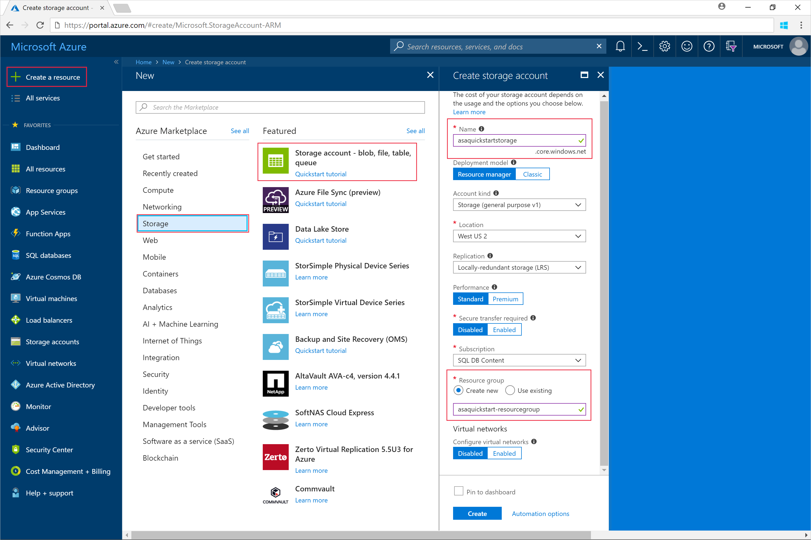
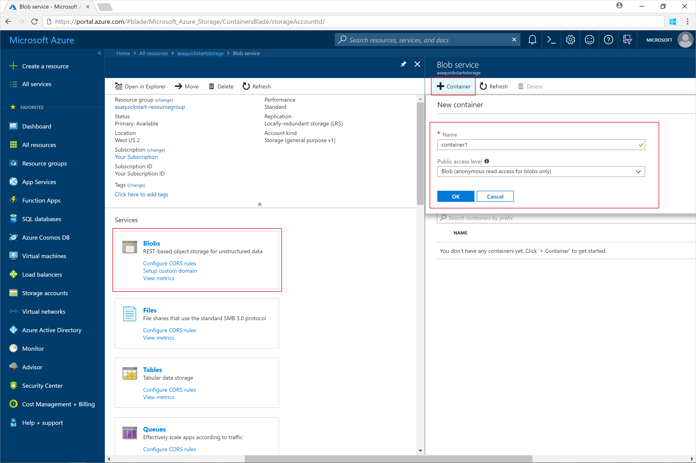
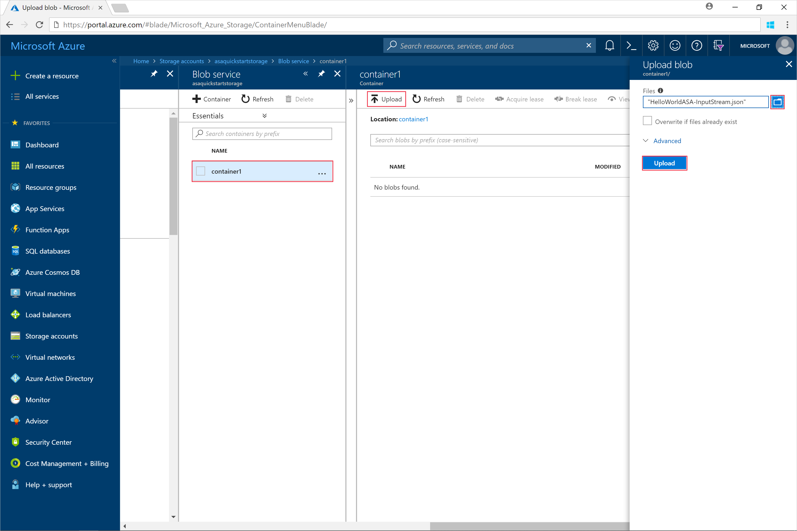
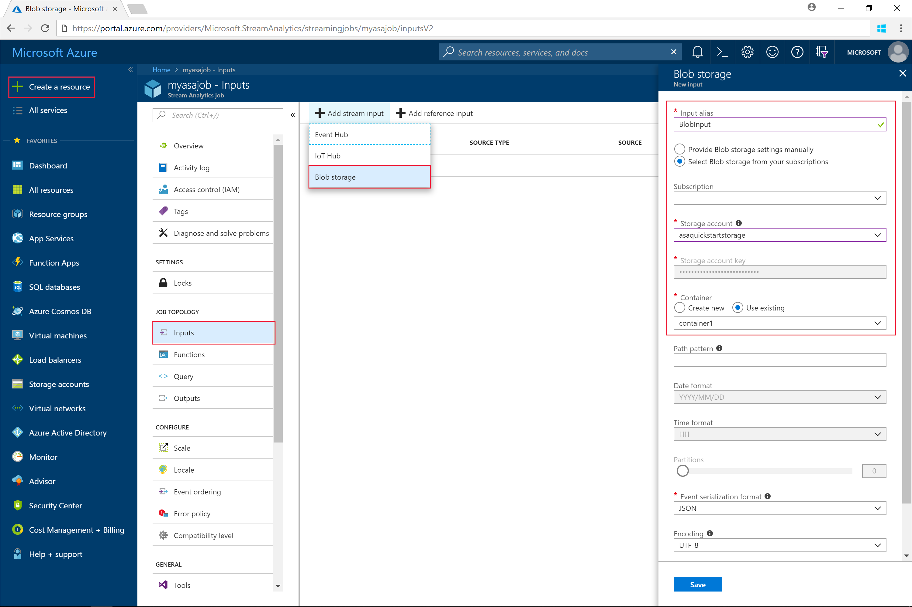
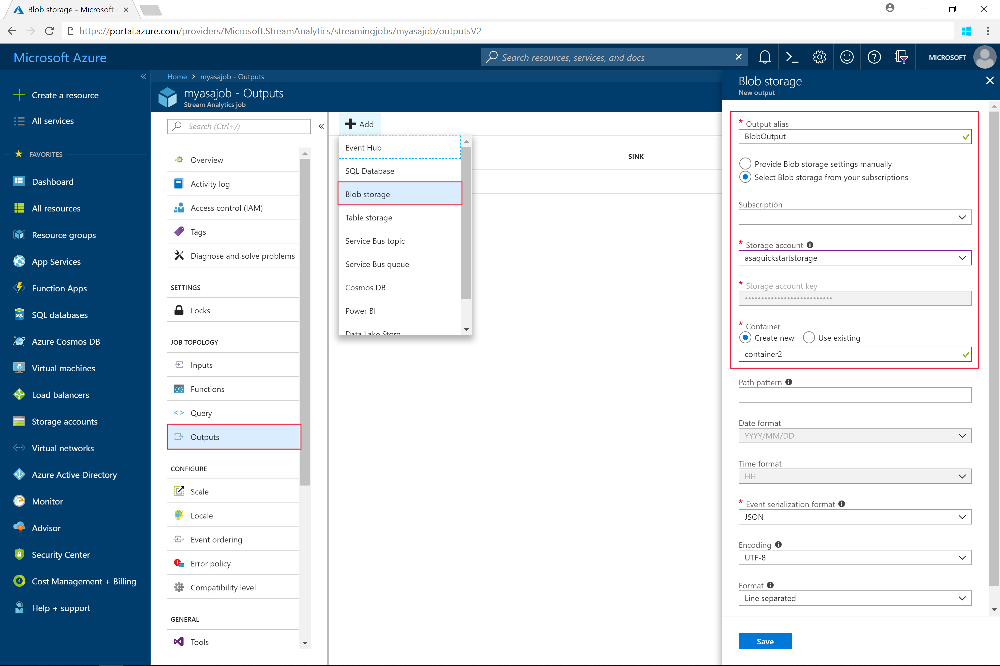
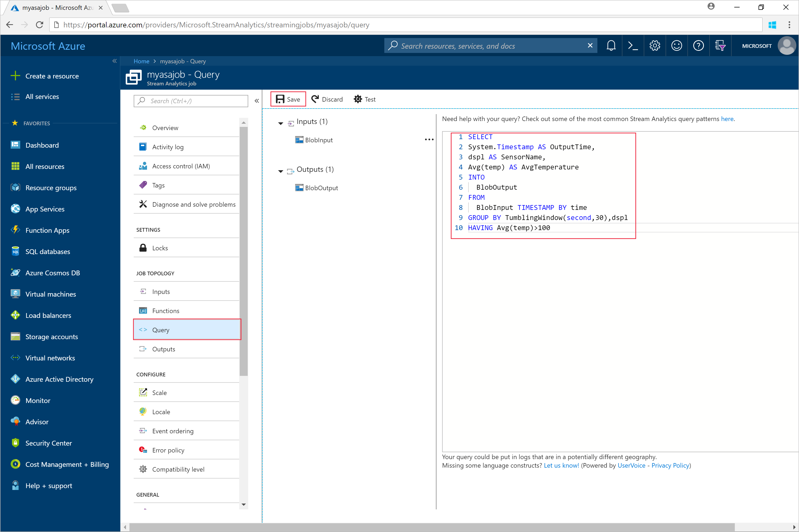
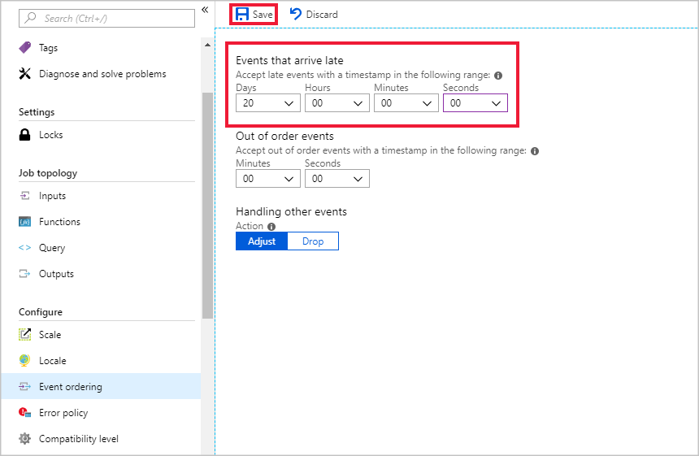
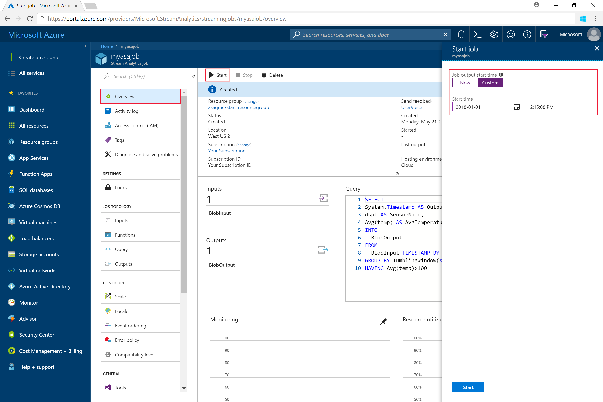
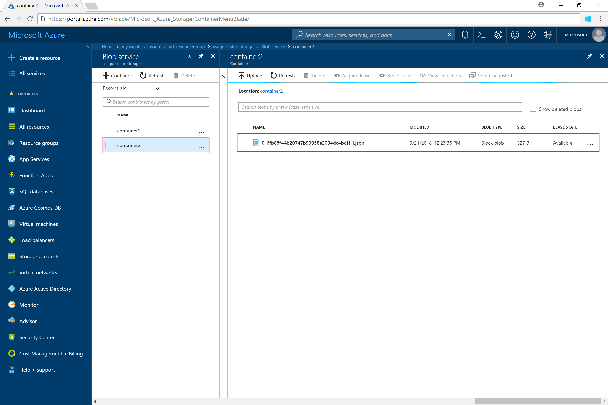

# Quickstart: Create a Stream Analytics job by using the Azure portal

This quickstart shows you how to get started with creating a Stream Analytics job. In this quickstart, you define a Stream Analytics job that reads sample sensor data and filters rows that have average temperature greater than 100 for every 30 seconds. In this article, you read data from blob storage, transform the data, and write the data back to a different container in the same blob storage. The input data file used in this quickstart contains static data for illustrative purposes only. In a real world scenario, you use streaming input data for a Stream Analytics job.

## Before you begin

* If you don't have an Azure subscription, create a [free account](https://azure.microsoft.com/free/).

* Sign in to the [Azure portal](https://portal.azure.com/).

## Prepare the input data

Before defining the Stream Analytics job, you should prepare the data, which is configured as input to the job. To prepare the input data required by the job, run the following steps:

1. Download the [sample sensor data](https://raw.githubusercontent.com/Azure/azure-stream-analytics/master/Samples/GettingStarted/HelloWorldASA-InputStream.json) from GitHub. The sample data contains sensor information in the following JSON format:  

   ```json
   {
     "time": "2018-08-19T21:18:52.0000000",
     "dspl": "sensorC",
     "temp": 87,
     "hmdt": 44
   }
   ```
2. Sign in to the [Azure portal](https://portal.azure.com/).  

3. From the upper left-hand corner of the Azure portal, select **Create a resource** > **Storage** > **Storage account**. Fill out the Storage account job page with **Name** set to "asaquickstartstorage", **Location** set to "West US 2", **Resource group** set to "asaquickstart-resourcegroup" (host the storage account in the same resource group as the Streaming job for increased performance). The remaining settings can be left to their default values.  

   

4. From **All resources** page, find the storage account you created in the previous step. Open the **Overview** page, and then the **Blobs** tile.  

5. From the **Blob Service** page, select **Container**, provide a **Name** for your container, such as *container1* and change the **Public access level** to Private (no anonymous access) > select **OK**.  

   

6. Go to the container you created in the previous step. Select **Upload** and upload the sensor data that you got from the first step.  

   

## Create a Stream Analytics job

1. Sign in to the Azure portal.

2. Select **Create a resource** in the upper left-hand corner of the Azure portal.  

3. Select **Data+Analytics** > **Stream Analytics job** from the results list.  

4. Fill out the Stream Analytics job page with the following information:

   |**Setting**  |**Suggested value**  |**Description**  |
   |---------|---------|---------|
   |Job name   |  myasajob   |   Enter a name to identify your Stream Analytics job. Stream Analytics job name can contain alphanumeric characters, hyphens, and underscores only and it must be between 3 and 63 characters long. |
   |Subscription  | \<Your subscription\> |  Select the Azure subscription that you want to use for this job. |
   |Resource group   |   asaquickstart-resourcegroup  |   Select **Create New** and enter a new resource-group name for your account. |
   |Location  |  \<Select the region that is closest to your users\> | Select geographic location where you can host your Stream Analytics job. Use the location that's closest to your users for better performance and to reduce the data transfer cost. |
   |Streaming units  | 1  |   Streaming units represent the computing resources that are required to execute a job. By default, this value is set to 1. To learn about scaling streaming units, refer to [understanding and adjusting streaming units](stream-analytics-streaming-unit-consumption.md) article.   |
   |Hosting environment  |  Cloud  |   Stream Analytics jobs can be deployed to cloud or edge. Cloud allows you to deploy to Azure Cloud, and Edge allows you to deploy to an IoT edge device. |

   

5. Check the **Pin to dashboard** box to place your job on your dashboard and then select **Create**.  

6. You should see a 'Deployment in progress...' displayed in the top right of your browser window. 

## Configure input to the job

In this section, you will configure blob storage as an input to the Stream Analytics job. Before configuring the input, create a blob storage account.  

### Add the input 

1. Navigate to your Stream Analytics job.  

2. Select **Inputs** > **Add Stream input** > **Blob storage**.  

3. Fill out the **Blob storage** page with the following values:

   |**Setting**  |**Suggested value**  |**Description**  |
   |---------|---------|---------|
   |Input alias  |  BlobInput   |  Enter a name to identify the job’s input.   |
   |Subscription   |  \<Your subscription\> |  Select the Azure subscription that has the storage account you created. The storage account can be in the same or in a different subscription. This example assumes that you have created storage account in the same subscription. |
   |Storage account  |  myasastorageaccount |  Choose or enter the name of the storage account. Storage account names are automatically detected if they are created in the same subscription. |
   |Container  | container1 | Choose the name of the container that has sample data. Container names are automatically detected if they are created in the same subscription. |

4. Leave other options to default values and select **Save** to save the settings.  

   
 
## Configure output to the job

1. Navigate to the Stream Analytics job that you created earlier.  

2. Select **Outputs > Add > Blob storage**.  

3. Fill out the **Blob storage** page with the following values:

   |**Setting**  |**Suggested value**  |**Description**  |
   |---------|---------|---------|
   |Output alias |   BlobOutput   |   Enter a name to identify the job’s output. |
   |Subscription  |  \<Your subscription\>  |  Select the Azure subscription that has the storage account you created. The storage account can be in the same or in a different subscription. This example assumes that you have created storage account in the same subscription. |
   |Storage account |  asaquickstartstorage |   Choose or enter the name of the storage account. Storage account names are automatically detected if they are created in the same subscription.       |
   |Container |   container1  |  Select the existing container that you created in your storage account.   |
   |Path pattern |   output  |  Enter a name to serve as the path within your existing container for the output.   |

4. Leave other options to default values and select **Save** to save the settings.  

   
 
## Define the transformation query

1. Navigate to the Stream Analytics job that you created earlier.  

2. Select **Query** and update the query as follows:  

   ```sql
   SELECT 
   System.Timestamp AS OutputTime,
   dspl AS SensorName,
   Avg(temp) AS AvgTemperature
   INTO
     BlobOutput
   FROM
     BlobInput TIMESTAMP BY time
   GROUP BY TumblingWindow(second,30),dspl
   HAVING Avg(temp)>100
   ```

3. In this example, the query reads the data from blob and copies it to a new file in the blob select **Save**.  

   

## Configure late arrival policy

1. Navigate to the Stream Analytics job that you created earlier.

2. Under **Configure**, select **Event ordering**.

3. Set **Events that arrive late** to 20 days, and select **Save**.

   

## Start the Stream Analytics job and check the output

1. Return to the job overview page and select **Start**.

2. Under **Start job**, select **Custom**, for **Start time** field. Select `2018-01-24` as the start date, but do not change the time. This start date is chosen because it precedes the event timestamp from the sample data. When you're done, select **Start**.

   

3. After few minutes, in the portal, find the storage account & the container that you have configured as output for the job. Select the output path. You can now see the output file in the container. The job takes a few minutes to start for the first time, after it is started, it will continue to run as the data arrives.  

   

## Clean up resources

When no longer needed, delete the resource group, the streaming job, and all related resources. Deleting the job avoids billing the streaming units consumed by the job. If you're planning to use the job in future, you can stop it and restart it later when you need. If you are not going to continue to use this job, delete all resources created by this quickstart by using the following steps:

1. From the left-hand menu in the Azure portal, select **Resource groups** and then select the name of the resource you created.  

2. On your resource group page, select **Delete**, type the name of the resource to delete in the text box, and then select **Delete**.

## Next steps

In this quickstart, you deployed a simple Stream Analytics job. To learn about configuring other input sources and performing real-time detection, continue to the following article:

> [!div class="nextstepaction"]
> [Real-time fraud detection using Azure Stream Analytics](stream-analytics-real-time-fraud-detection.md)

