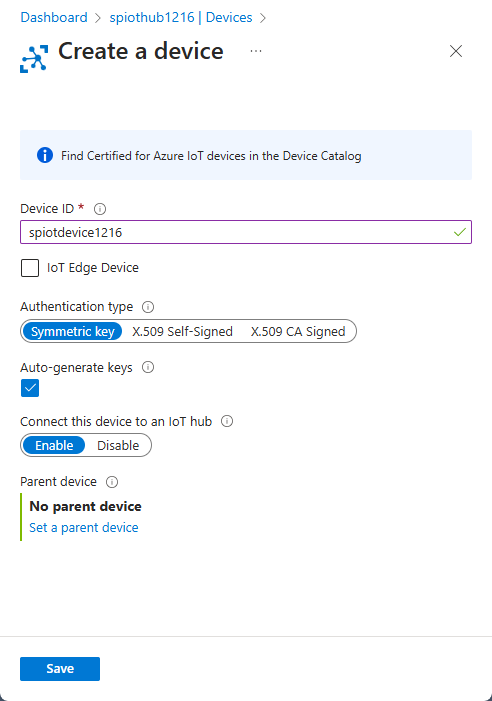
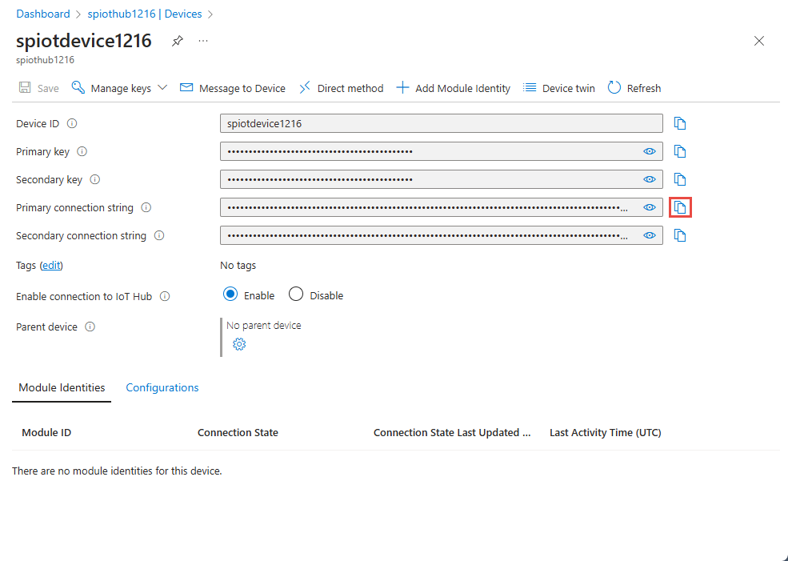
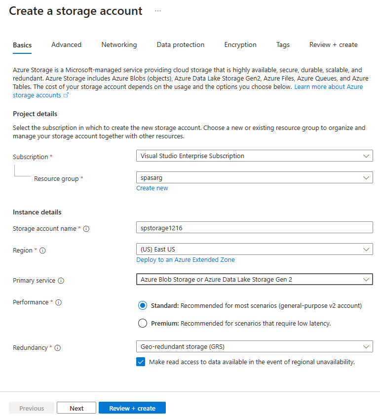
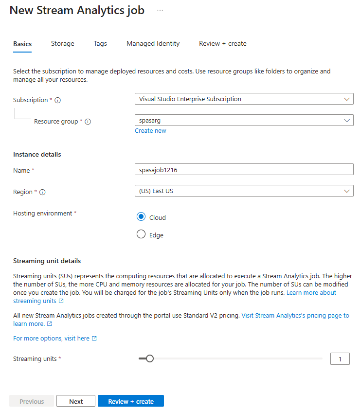
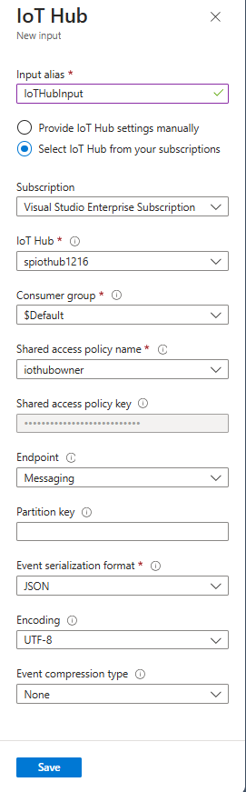
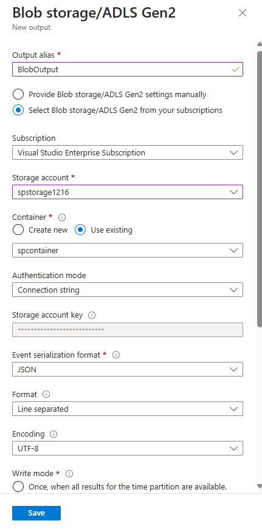
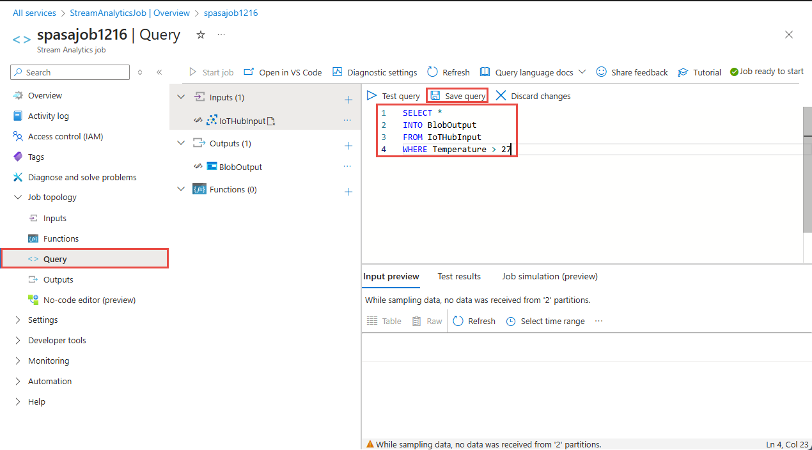

# Quickstart: Create a Stream Analytics job by using the Azure portal

This quickstart shows you how to get started with creating a Stream Analytics job. In this quickstart, you define a Stream Analytics job that reads real-time streaming data and filters messages with a temperature greater than 27. Your Stream Analytics job will read data from IoT Hub, transform the data, and write the data back to a container in blob storage. The input data used in this quickstart is generated by a Raspberry Pi online simulator. 

## Before you begin

* If you don't have an Azure subscription, create a [free account](https://azure.microsoft.com/free/).

* Sign in to the [Azure portal](https://portal.azure.com/).

## Prepare the input data

Before defining the Stream Analytics job, you should prepare the input data. The real-time sensor data is ingested to IoT Hub, which later configured as the job input. To prepare the input data required by the job, complete the following steps:

1. Sign in to the [Azure portal](https://portal.azure.com/).

2. Select **Create a resource** > **Internet of Things** > **IoT Hub**.

3. In the **IoT Hub** pane, enter the following information:
   
   |**Setting**  |**Suggested value**  |**Description**  |
   |---------|---------|---------|
   |Subscription  | \<Your subscription\> |  Select the Azure subscription that you want to use. |
   |Resource group   |   asaquickstart-resourcegroup  |   Select **Create New** and enter a new resource-group name for your account. |
   |Region  |  \<Select the region that is closest to your users\> | Select a geographic location where you can host your IoT Hub. Use the location that's closest to your users. |
   |IoT Hub Name  | MyASAIoTHub  |   Select a name for your IoT Hub.   |

   

4. Select **Next: Set size and scale**.

5. Choose your **Pricing and scale tier**. For this quickstart, select the **F1 - Free** tier if it's still available on your subscription. For more information, see [IoT Hub pricing](https://azure.microsoft.com/pricing/details/iot-hub/).

   

6. Select **Review + create**. Review your IoT Hub information and click **Create**. Your IoT Hub might take a few minutes to create. You can monitor the progress in the **Notifications** pane.

7. In your IoT Hub navigation menu, click **Add** under **IoT devices**. Add a **Device ID** and click **Save**.

   

8. Once the device is created, open the device from the **IoT devices** list. Copy the **Connection string -- primary key** and save it to a notepad to use later.

   

## Create blob storage

1. From the upper left-hand corner of the Azure portal, select **Create a resource** > **Storage** > **Storage account**.

2. In the **Create storage account** pane, enter a storage account name, location, and resource group. Choose the same location and resource group as the IoT Hub you created. Then click **Review + create** to create the account.

   

3. Once your storage account is created, select the **Blobs** tile on the **Overview** pane.

   

4. From the **Blob Service** page, select **Container** and provide a name for your container, such as *container1*. Leave the **Public access level** as **Private (no anonymous access)** and select **OK**.

   

## Create a Stream Analytics job

1. Sign in to the Azure portal.

2. Select **Create a resource** in the upper left-hand corner of the Azure portal.  

3. Select **Analytics** > **Stream Analytics job** from the results list.  

4. Fill out the Stream Analytics job page with the following information:

   |**Setting**  |**Suggested value**  |**Description**  |
   |---------|---------|---------|
   |Job name   |  MyASAJob   |   Enter a name to identify your Stream Analytics job. Stream Analytics job name can contain alphanumeric characters, hyphens, and underscores only and it must be between 3 and 63 characters long. |
   |Subscription  | \<Your subscription\> |  Select the Azure subscription that you want to use for this job. |
   |Resource group   |   asaquickstart-resourcegroup  |   Select the same resource group as your IoT Hub. |
   |Location  |  \<Select the region that is closest to your users\> | Select geographic location where you can host your Stream Analytics job. Use the location that's closest to your users for better performance and to reduce the data transfer cost. |
   |Streaming units  | 1  |   Streaming units represent the computing resources that are required to execute a job. By default, this value is set to 1. To learn about scaling streaming units, refer to [understanding and adjusting streaming units](stream-analytics-streaming-unit-consumption.md) article.   |
   |Hosting environment  |  Cloud  |   Stream Analytics jobs can be deployed to cloud or edge. Cloud allows you to deploy to Azure Cloud, and Edge allows you to deploy to an IoT Edge device. |

   

5. Check the **Pin to dashboard** box to place your job on your dashboard and then select **Create**.  

6. You should see a *Deployment in progress...* notification displayed in the top right of your browser window. 

## Configure job input

In this section, you will configure an IoT Hub device input to the Stream Analytics job. Use the IoT Hub you created in the previous section of the quickstart.

1. Navigate to your Stream Analytics job.  

2. Select **Inputs** > **Add Stream input** > **IoT Hub**.  

3. Fill out the **IoT Hub** page with the following values:

   |**Setting**  |**Suggested value**  |**Description**  |
   |---------|---------|---------|
   |Input alias  |  IoTHubInput   |  Enter a name to identify the job’s input.   |
   |Subscription   |  \<Your subscription\> |  Select the Azure subscription that has the storage account you created. The storage account can be in the same or in a different subscription. This example assumes that you have created storage account in the same subscription. |
   |IoT Hub  |  MyASAIoTHub |  Enter the name of the IoT Hub you created in the previous section. |

4. Leave other options to default values and select **Save** to save the settings.  

   
 
## Configure job output

1. Navigate to the Stream Analytics job that you created earlier.  

2. Select **Outputs** > **Add** > **Blob storage**.  

3. Fill out the **Blob storage** page with the following values:

   |**Setting**  |**Suggested value**  |**Description**  |
   |---------|---------|---------|
   |Output alias |   BlobOutput   |   Enter a name to identify the job’s output. |
   |Subscription  |  \<Your subscription\>  |  Select the Azure subscription that has the storage account you created. The storage account can be in the same or in a different subscription. This example assumes that you have created storage account in the same subscription. |
   |Storage account |  asaquickstartstorage |   Choose or enter the name of the storage account. Storage account names are automatically detected if they are created in the same subscription.       |
   |Container |   container1  |  Select the existing container that you created in your storage account.   |

4. Leave other options to default values and select **Save** to save the settings.  

   
 
## Define the transformation query

1. Navigate to the Stream Analytics job that you created earlier.  

2. Select **Query** and update the query as follows:  

   ```sql
   SELECT *
   INTO BlobOutput
   FROM IoTHubInput
   HAVING Temperature > 27
   ```

3. In this example, the query reads the data from IoT Hub and copies it to a new file in the blob. Select **Save**.  

   

## Run the IoT simulator

1. Open the [Raspberry Pi Azure IoT Online Simulator](https://azure-samples.github.io/raspberry-pi-web-simulator/).

2. Replace the placeholder in Line 15 with the Azure IoT Hub device connection string you saved in a previous section.

3. Click **Run**. The output should show the sensor data and messages that are being sent to your IoT Hub.

   

## Start the Stream Analytics job and check the output

1. Return to the job overview page and select **Start**.

2. Under **Start job**, select **Now**, for the **Job output start time** field. Then, select **Start** to start your job.

3. After few minutes, in the portal, find the storage account & the container that you have configured as output for the job. You can now see the output file in the container. The job takes a few minutes to start for the first time, after it is started, it will continue to run as the data arrives.  

   

## Clean up resources

When no longer needed, delete the resource group, the Stream Analytics job, and all related resources. Deleting the job avoids billing the streaming units consumed by the job. If you're planning to use the job in future, you can stop it and restart it later when you need. If you are not going to continue to use this job, delete all resources created by this quickstart by using the following steps:

1. From the left-hand menu in the Azure portal, select **Resource groups** and then select the name of the resource you created.  

2. On your resource group page, select **Delete**, type the name of the resource to delete in the text box, and then select **Delete**.

## Next steps

In this quickstart, you deployed a simple Stream Analytics job using Azure portal. You can also deploy Stream Analytics jobs using [PowerShell](stream-analytics-quick-create-powershell.md), [Visual Studio](stream-analytics-quick-create-vs.md), and [Visual Studio Code](quick-create-vs-code.md).

To learn about configuring other input sources and performing real-time detection, continue to the following article:

> [!div class="nextstepaction"]
> [Real-time fraud detection using Azure Stream Analytics](stream-analytics-real-time-fraud-detection.md)
