# Get started using Azure Stream Analytics: Real-time fraud detection

This tutorial provides an end-to-end illustration of how to use Azure Stream Analytics. You learn how to: 

* Bring streaming events into an instance of Azure Event Hubs. In this tutorial, you'll use an app that we provide that simulates a stream of mobile-phone metadata records.

* Write SQL-like Stream Analytics queries to transform data, aggregating information or looking for patterns. You will see how to use a query to examine the incoming stream and look for calls that might be fraudulent.

* Send the results to an output sink (storage) that you can analyze for additional insights. In this case, you'll send the suspicious call data to Azure Blob storage.

In  this tutorial, we use the example of real-time fraud detection based on phone-call data. But the technique we illustrate is also suited for other types of fraud detection, such as credit card fraud or identity theft. 

## Scenario: Telecommunications and SIM fraud detection in real time

A telecommunications company has a large volume of data for incoming calls. The company wants to detect fraudulent calls in real time so that they can notify customers or shut down service for a specific number. One type of SIM fraud involves multiple calls from the same identity around the same time but in geographically different locations. To detect this type of fraud, the company needs to examine incoming phone records and look for specific patterns—in this case, for calls made around the same time in different countries. Any phone records that fall into this category are written to storage for subsequent analysis.

## Prerequisites

In this tutorial, you'll simulate phone-call data by using a client app that generates sample phone call metadata. Some of the records that the app produces look like fraudulent calls. 

Before you start, make sure you have the following:

* An Azure account.
* The call-event generator app. You can get this by downloading the [TelcoGenerator.zip file](http://download.microsoft.com/download/8/B/D/8BD50991-8D54-4F59-AB83-3354B69C8A7E/TelcoGenerator.zip) from the Microsoft Download Center. Unzip this package into a folder on your computer. If you want to see the source code and run the app in a debugger, you can get the app source code from [GitHub](https://aka.ms/azure-stream-analytics-telcogenerator). 

    >[!NOTE]
    >Windows might block the downloaded .zip file. If you can't unzip it, right-click the file and select **Properties**. If you see the "This file came from another computer and might be blocked to help protect this computer" message, select the **Unblock** option and then click **Apply**.

If you want to examine the results of the Streaming Analytics job, you also need a tool for viewing the contents of a Azure Blob Storage container. If you use Visual Studio, you can use [Azure Tools for Visual Studio](https://docs.microsoft.com/en-us/azure/vs-azure-tools-storage-resources-server-explorer-browse-manage) or [Visual Studio Cloud Explorer](https://docs.microsoft.com/en-us/azure/vs-azure-tools-resources-managing-with-cloud-explorer). Alternatively, you can install standalone tools like [Azure Storage Explorer](http://storageexplorer.com/) or [Azure Explorer](http://www.cerebrata.com/products/azure-explorer/introduction). 

## Create an Azure event hubs to ingest events

To analyze a data stream, you *ingest* it into Azure. A typical way to ingest data is to use [Azure Event Hubs](../event-hubs/event-hubs-what-is-event-hubs.md), which lets you ingest millions of events per second and then process and store the event information. For this tutorial, you create an event hub and then have the call-event generator app send call data to that event hub. For more about event hubs, see the [Azure Service Bus documentation](https://docs.microsoft.com/en-us/azure/service-bus/).

>[!NOTE]
>For a more detailed version of this procedure, see [Create an Event Hubs namespace and an event hub using the Azure portal](../event-hubs/event-hubs-create.md). 

### Create a namespace and event hub
In this procedure, you first create an event hub namespace, and then you add an event hub to that namepsace. Event hub namespaces are used to logically group related event bus instances. 

1. Log  into the Azure portal and click **New** > **Internet of Things** > **Event Hub**. 

2. In the **Create namespace** blade, enter a namespace name such as `<yourname>-eh-ns-demo`. You can use any name for the namespace, but the name must be valid for a URL and it must be unique across Azure. 
    
3. Select a subscription and create or choose a resource group , then click **Create**. 

    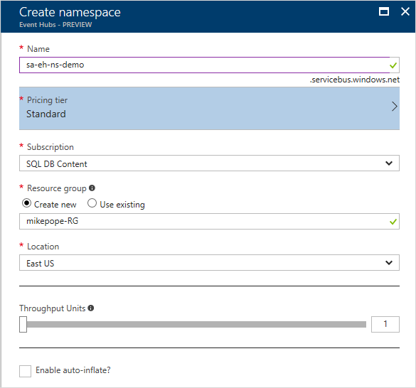
 
4. When the namespace has finished deploying, find the event hub namespace in your list of Azure resources. 

5. Click the new namespace, and in the namespace blade, click **+&nbsp;Event Hub**. 

    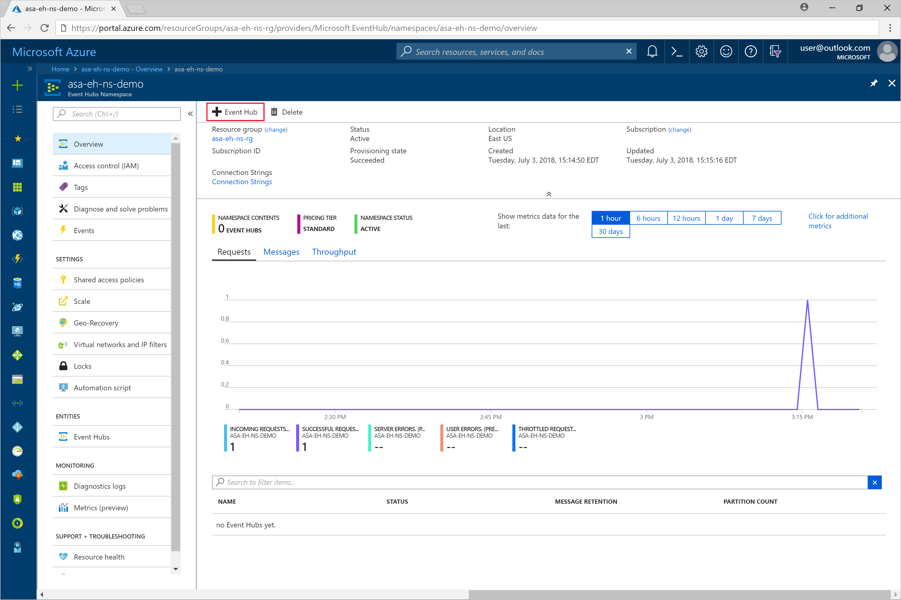    
 
6. Name the new event hub `sa-eh-frauddetection-demo`. You can use a different name. If you do, make a note of it, because you need the name later. You don't need to set any other options for the event hub right now.

    
    
 
7. Click **Create**.
### Grant access to the event hub and get a connection string

Before a process can send data to an event hub, the event hub must have a policy that allows appropriate access. The access policy produces a connection string that includes authorization information.

1.	In the event namespace blade, click **Event Hubs** and then click the name of your new event hub.

2.	In the event hub blade, click **Shared access policies** and then click **+&nbsp;Add**.

    >[!NOTE]
    >Make sure you're working with the event hub, not the event hub namespace.

3.	Add a policy named `sa-policy-manage-demo` and for **Claim**, select **Manage**.

    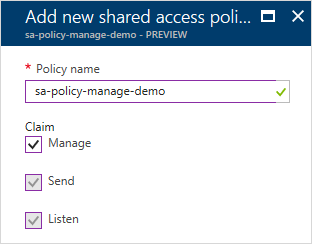
 
4.	Click **Create**.

5.	After the policy has been deployed, click it in the list of shared access policies.

6.	Find the box labeled **CONNECTION STRING-PRIMARY KEY** and click the copy button next to the connection string. 
    
    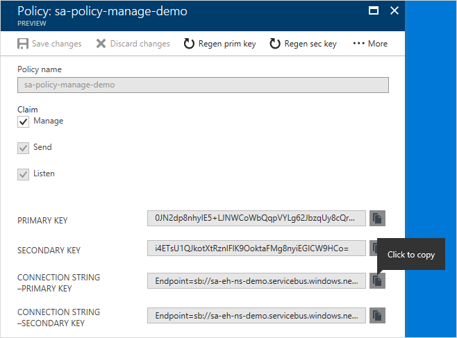
 
7.	Paste the connection string into a text editor. You need this connection string for the next section, after you make some small edits to it.

    The connection string looks like this:

        Endpoint=sb://YOURNAME-eh-ns-demo.servicebus.windows.net/;SharedAccessKeyName=sa-policy-manage-demo;SharedAccessKey=Gw2NFZwU1Di+rxA2T+6hJYAtFExKRXaC2oSQa0ZsPkI=;EntityPath=sa-eh-frauddetection-demo

    Notice that the connection string contains multiple key-value pairs, separated with semicolons: `Endpoint`, `SharedAccessKeyName`, `SharedAccessKey`, and `EntityPath`.  

## Configure and start the event generator application

Before you start the TelcoGenerator app, you configure it so that it will send call records to the event hub you just created.

# Configure the TelcoGeneratorapp

1.	In the editor where you copied the connection string, make a note of the `EntityPath` value, and then remove the `EntityPath` pair (don't forget to remove the semicolon that precedes it). 

2.	In the folder where you unzipped the TelcoGenerator.zip file, open the telcodatagen.exe.config file in an editor. (There is more than one .config file, so be sure that you open the right one.)

3.	In the `<appSettings>` element, do this:

    * Set the value of the `EventHubName` key to the event hub name (that is, to the value of the entity path).
    * Set the value of the `Microsoft.ServiceBus.ConnectionString` key to the connection string. 

    The `<appSettings>` section will look like the following example. (For clarity, we wrapped the lines and removed some characters from the authorization token.)

    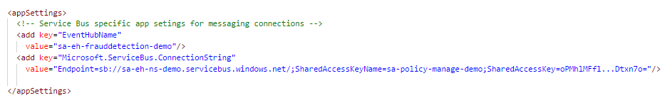
 
4.	Save the file. 

### Start the app
1.	Open a command window and change to the folder where the TelcoGenerator app is unzipped.
2.	Enter the following command:

        telcodatagen.exe 1000 .2 2

    The parameters are: 

    * Number of CDRs per hour. 
    * SIM Card Fraud Probability: How often, as a percentage of all calls, that the app should simulate a fraudulent call. The value .2 means that about 20% of the call records will look fraudulent.
    * Duration in hours. The number of hours that the app should run. You can also stop the app any time by pressing Ctrl+C at the command line.

    After a few seconds, the app starts displaying phone call records on the screen as it sends them to the event hub.

Some of the key fields that you will be using in this real-time fraud detection application are the following:

|**Record**|**Definition**|
|----------|--------------|
|`CallrecTime`|The timestamp for the call start time. |
|`SwitchNum`|The telephone switch used to connect the call. For this example, the switches are strings that represent the country of origin (US, China, UK, Germany, or Australia). |
|`CallingNum`|The phone number of the caller. |
|`CallingIMSI`|The International Mobile Subscriber Identity (IMSI). This is the Unique identifier of the caller. |
|`CalledNum`|The phone number of the call recipient. |
|`CalledIMSI`|International Mobile Subscriber Identity (IMSI). This is the unique identifier of the call recipient. |

## Create a Stream Analytics job to manage streaming data

Now that you have a stream of call events, you can set up a Stream Analytics job. The job will read data from the event hub that you set up. 

### Create the job 

1. In the Azure portal, click **New** > **Internet of Things** > **Stream Analytics job**.

2. Name the job `sa_frauddetection_job_demo`, specify a subscription, resource group, and location.

    It's a good idea to place the job and the event hub in the same region for best performance and so that you don't pay to transfer data between regions.

    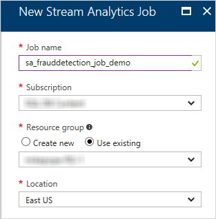

3. Click **Create**.

    The job is created and the portal displays job details. Nothing is running yet, though—you have to configure the job before it can be started.

### Configure job input

1. In the dashboard or the **All resources** blade, find and select the `sa_frauddetection_job_demo` Stream Analytics job. 
2. In the **Job Topology** section of the Stream Analytics job blade, click the **Input** box.

    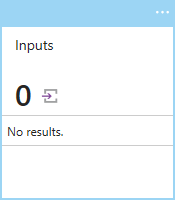
 
3. Click **+&nbsp;Add** and then fill out the blade with these values:

    * **Input alias**: Use the name `CallStream`. If you use a different name, make a note of it because you'll need it later.
    * **Source type**: Select **Data stream**. (**Reference data** refers to static lookup data, which you won't use in this tutorial.)
    * **Source**: Select **Event hub**.
    * **Import option**: Select **Use event hub from current subscription**. 
    * **Service bus namespace**: Select the event hub namespace that you created earlier (`<yourname>-eh-ns-demo`).
    * **Event hub**: Select the event hub that you created earlier (`sa-eh-frauddetection-demo`).
    * **Event hub policy name**: Select the access policy that you created earlier (`sa-policy-manage-demo`).

    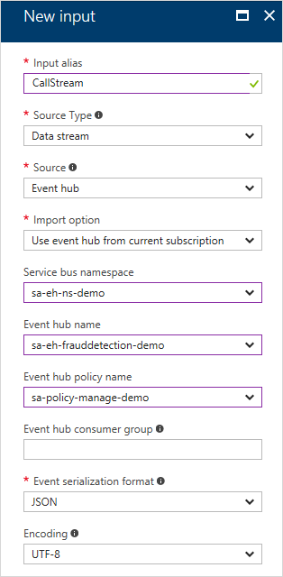

4. Click **Create**.

## Create queries to transform real-time data

At this point, you have a Stream Analytics job set up to read an incoming data stream. The next step is to create a transformation that analyzes the data in real time. You do this by creating a query. Stream Analytics supports a simple, declarative query model that describes transformations for real-time processing. The queries use a SQL-like language that has some extensions specific to stream analytics. 

A very simple query might simply read all the incoming data. However, you often create queries that look for specific data or for relationships in the data. In this section of the tutorial, you will create and test several queries to learn a few ways in which you can transform an input stream for analysis. 

The queries you create here will just display the transformed data to the screen. In a later section, you'll configure an output sink and a query that writes the transformed data to that sink.

To learn more about the language, see the [Azure Stream Analytics Query Language Reference](https://msdn.microsoft.com/library/dn834998.aspx).

### Get sample data for testing queries

The TelcoGenerator app is sending call records to the event hub, and your Stream Analytics job is configured to read from the event hub. You can use a query to test the job to make sure that it's reading correctly. To  test a query in the Azure console, you need sample data. For this walkthrough, you'll extract sample data from the stream that's coming into the event hub.

1. Make sure that the TelcoGenerator app is running and producing call records.
2. In the portal, return to the Streaming Analytics job blade. (If you closed the blade, search for `sa_frauddetection_job_demo` in the **All resources** blade.)
3. Click the **Query** box. Azure lists the inputs and outputs that are configured for the job, and lets you create a query that lets you transform the input stream as it is sent to the output.
4. In the **Query** blade, click the dots next to the `CallStream` input and then select **Sample data from input**.

    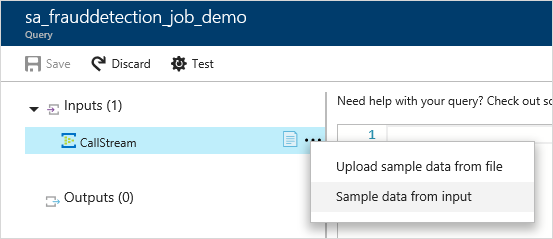

    This opens a blade that lets you specify how much sample data to get, defined in terms of how long to read the input stream.

5. Set **Minutes** to 3 and then click **OK**. 
    
    

    Azure samples 3 minutes' worth of data from the input stream and notifies you when the sample data is ready. (This takes a short while.) 

The sample data is stored temporarily and is available while you have the query window open. If you close the query window, the sample data is discarded, and you'll have to create a new set of sample data. 

As an alternative, you can get a .json file that has sample data in it [from GitHub](https://github.com/Azure/azure-stream-analytics/blob/master/Sample%20Data/telco.json), and then upload that .json file to use as sample data for the `CallStream` input . 

### Test using a pass-through query

If you want to archive every event, you can use a pass-through query to read all the fields in the payload of the event.

1. In the query window, enter this query:

        SELECT 
            *
        FROM 
            CallStream

    >[!NOTE]
    >As with SQL, keywords are not case sensitive, and whitespace is not significant.

    In this query, `CallStream` is the alias that you specified when you created the input. If you used a different alias, use that name instead.

2. Click **Test**.

    The Stream Analytics job runs the query against the sample data and displays the output at the bottom of the window. This tells you that the event hub and the Streaming Analytics job are configured correctly. (As noted, later you'll create an output sink that the query can write data to.)

    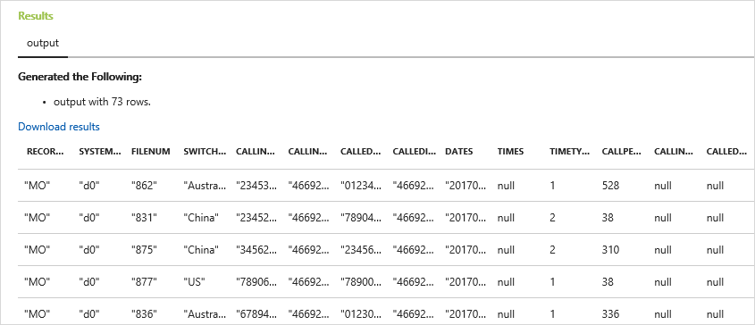

    The exact number of records you see will depend on how many records were captured in your 3-minute sample.
 
### Reduce the number of fields using a column projection

In many cases, your analysis doesn't need all the columns from the input stream. You can use a query to project a smaller set of returned fields than in the pass-through query.

1. Change the query in the code editor to the following:

        SELECT CallRecTime, SwitchNum, CallingIMSI, CallingNum, CalledNum 
        FROM 
            CallStream

2. Click **Test** again. 

    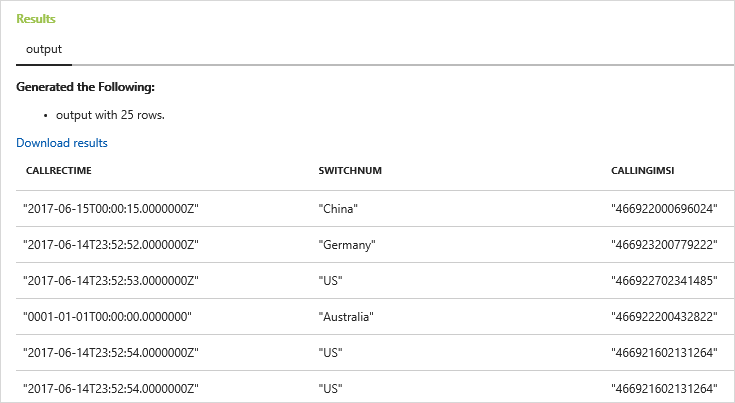
 
### Count incoming calls by region: Tumbling window with aggregation

Suppose you want to count the number of incoming calls per region. In streaming data, when you want to perform aggregate functions like counting, you need to segment the stream into temporal units (since the data stream itself is effectively endless). You do this using a Streaming Analytics [window function](stream-analytics-window-functions.md). You can then work with the data inside that window as a unit.

For this transformation, you want a sequence of temporal windows that don't overlap—each window will have a discrete set of data that you can group and aggregate. This type of window is referred to as a *Tumbling window* . Within the Tumbling window, you can get a count of the incoming calls grouped by `SwitchNum`, which represents the country where the call originated. 

1. Change the query in the code editor to the following:

        SELECT 
            System.Timestamp as WindowEnd, SwitchNum, COUNT(*) as CallCount 
        FROM
            CallStream TIMESTAMP BY CallRecTime 
        GROUP BY TUMBLINGWINDOW(s, 5), SwitchNum

    This query uses the `Timestamp By` keyword in the `FROM` clause to specify which timestamp field in the input stream to use to define the Tumbling window. In this case, the window divides the data into segments by the `CallRecTime` field in each record. (If no field is specified, the windowing operation uses the time that each event arrives at the event hub. See "Arrival Time Vs Application Time" in [Stream Analytics Query Language Reference](https://msdn.microsoft.com/library/azure/dn834998.aspx). 

    The projection includes `System.Timestamp`, which returns a timestamp for the end of each window. 

    To specify that you want to use a Tumbling window, you use the [TUMBLINGWINDOW](https://msdn.microsoft.com/library/dn835055.aspx) function in the `GROUP BY `clause. In the function, you specify a time unit (anywhere from a microsecond to a day) and a window size (how many units). In this example, the Tumbling window consists of 5-second intervals, so you will get a count by country for every 5 seconds' worth of calls.

2. Click **Test** again. In the results, notice that the timestamps under **WindowEnd** are in 5-second increments.

    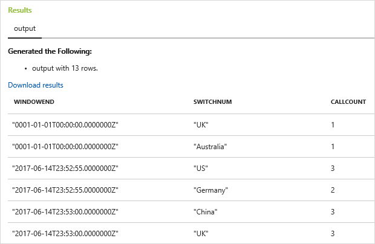
 
### Detect SIM fraud using a self-join

For this example, we can consider fraudulent usage to be calls that originate from the same user but in different locations within 5 seconds of one another. For example, the same user can't legitimately make a call from the US and Australia at the same time. 

To check for these cases, you can use a self-join of the streaming data to join the stream to itself based on the `CallRecTime` value. You can then look for call records where the `CallingIMSI` value (the originating number) is the same, but the `SwitchNum` value (country of origin) is not the same.

When you use a join with streaming data, the join must provide some limits on how far the matching rows can be separated in time. (As noted earlier, the streaming data is effectively endless.) The time bounds for the relationship are specified inside the `ON` clause of the join, using the `DATEDIFF` function . In this case, the join is based on a 5-second interval of call data .

1. Change the query in the code editor to the following: 

        SELECT  System.Timestamp as Time, 
            CS1.CallingIMSI, 
            CS1.CallingNum as CallingNum1, 
            CS2.CallingNum as CallingNum2, 
            CS1.SwitchNum as Switch1, 
            CS2.SwitchNum as Switch2 
        FROM CallStream CS1 TIMESTAMP BY CallRecTime 
            JOIN CallStream CS2 TIMESTAMP BY CallRecTime 
            ON CS1.CallingIMSI = CS2.CallingIMSI 
            AND DATEDIFF(ss, CS1, CS2) BETWEEN 1 AND 5 
        WHERE CS1.SwitchNum != CS2.SwitchNum

    This query is like any SQL join except for the `DATEDIFF` function in the join. This is a version of `DATEDIFF` that's specific to Streaming Analytics, and it must appear in the `ON...BETWEEN` clause. The parameters are a time unit (seconds in this example) and the aliases of the two sources for the join. (This is different from the standard SQL `DATEDIFF` function.) 

    The `WHERE` clause includes the condition that flags the fraudulent call: the originating switches are not the same. 

2. Click **Test** again. 

    

3. Click **Save**. This saves the self-join query as part of the Streaming Analytics job. (It doesn't save the sample data.)

    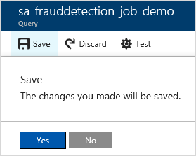

## Create an output sink to store transformed data

You've defined an event stream, an event hub input to ingest events, and a query to perform a transformation over the stream. The last step is to define an output sink for the job—that is, a place to write the transformed stream to. 

You can use many resources as output sinks—a SQL Server database, table storage, Data Lake storage, Power BI, and even another event hub. For this tutorial, you'll write the stream to Azure Blob Storage, which is a typical choice for collecting event information for later analysis, since it accommodates unstructured data .

If you have an existing blob storage account, you can use that. For this tutorial, we'll show you how to create a new storage account just for this tutorial.

### Create an Azure Blob Storage account

1. In the Azure portal, return to the Streaming Analytics job blade. (If you closed the blade, search for `sa_frauddetection_job_demo` in the **All resources** blade.)
2. In the **Job Topology** section, click the **Output** box. 
3. In the **Outputs** blade, click **+&nbsp;Add** and then fill out the blade with these values:

    * **Output alias**: Use the name `CallStream-FraudulentCalls`. 
    * **Sink**: Select **Blob storage**.
    * **Import options**: Select **Use blob storage from current subscription**.
    * **Storage account**. Select **Create new storage account.**
    * **Storage account** (second box). Enter `YOURNAMEsademo`, where `YOURNAME` is your name or another unique string. The name can use only lowercase letters and numbers, and it must be unique across Azure. 
    * **Container**. Enter `sa-fraudulentcalls-demo`.
    The storage account name and container name are used together to provide a URI for the blob storage, like this: 

    `http://yournamesademo.blob.core.windows.net/sa-fraudulentcalls-demo/...`
    
    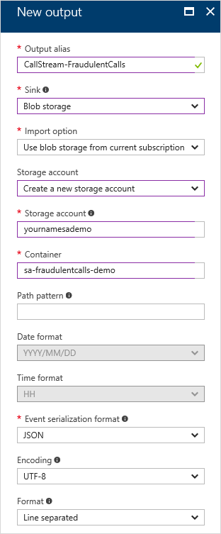
    
4. Click **Create**. 

    Azure creates the storage account and generates a key automatically. 

5. Close the **Outputs** blade. 

### Start the Streaming Analytics job

The job is now configured. You've specified an input (the event hub), a transformation (the query to look for fraudulent calls), and an output (blob storage). You can now start the job. 

1. Make sure the TelcoGenerator app is running.

2. In the job blade, click **Start**.

    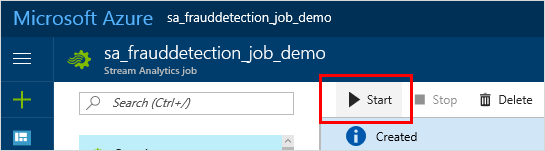

3. In the **Start job** blade, for Job output start time, select **Now**. 

4. Click **Start**. 

    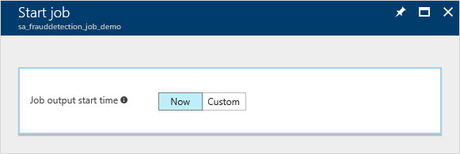

    Azure notifies you when the job has started, and in the job blade, the status is displayed as **Running**.

    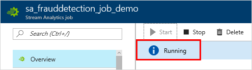
    

## Examine the transformed data

You now have a complete Streaming Analytics job. The job is examining a stream of phone call metadata, looking for fraudulent phone calls in real time, and writing information about those fraudulent calls to storage. 

To complete this tutorial, you might want to look at the data being captured by the Streaming Analytics job. The data is being written to Azure Blog Storage in chunks (files). You can use any tool that reads Azure Blob Storage. As noted in the Prerequisites section, you can use Azure extensions in Visual Studio, or you can use a tool like [Azure Storage Explorer](http://storageexplorer.com/) or [Azure Explorer](http://www.cerebrata.com/products/azure-explorer/introduction). 

When you examine the contents of a file in blob storage, you see something like the following :

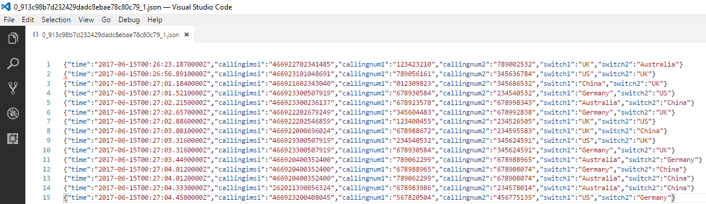
 

## Clean up resources

If you don't need the resources you've created, you can delete them so that you don't incur unnecessary Azure charges. We suggest that you do the following:

1. Stop the Streaming Analytics job. In the **Jobs** blade, click **Stop** at the top.
2. Stop the Telco Generator app. In the command window where you started the app, press Ctrl+C.
3. If you created a new blob storage account just for this tutorial, delete it. 
4. Delete the Streaming Analytics job.
5. Delete the event hub.
6. Delete the event hub namespace.

## Get support

For further assistance, try our [Azure Stream Analytics forum](https://social.msdn.microsoft.com/Forums/home?forum=AzureStreamAnalytics).

## Next steps

You can continue this tutorial with the following articles:

* [Stream Analytics and Power BI: A real-time analytics dashboard for streaming data](stream-analytics-power-bi-dashboard.md). This article shows you how to send the Stream Analytics job TelCo output to Power BI for real-time visualization and analysis.
* [How to store data from Azure Stream Analytics in an Azure Redis Cache using Azure Functions](stream-analytics-functions-redis.md). This article shows how to use Azure Functions to write fraudulent calls to an Azure Redis cache via a Service Bus queue.

For more information about Stream Analytics in general, try these articles:

* [Introduction to Azure Stream Analytics](stream-analytics-introduction.md)
* [Scale Azure Stream Analytics jobs](stream-analytics-scale-jobs.md)
* [Azure Stream Analytics Query Language Reference](https://msdn.microsoft.com/library/azure/dn834998.aspx)
* [Azure Stream Analytics Management REST API Reference](https://msdn.microsoft.com/library/azure/dn835031.aspx)
