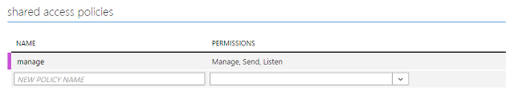
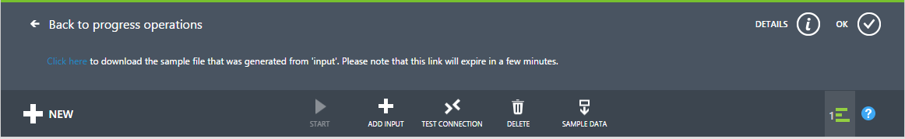
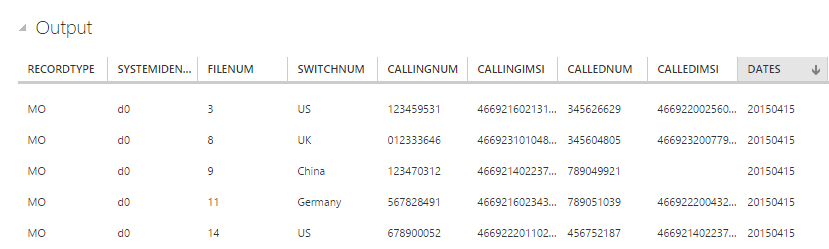
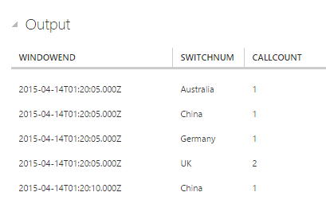

# Get started using Azure Stream Analytics: Real-time fraud detection
Learn how to create an end-to-end solution for real-time fraud detection with Azure Stream Analytics. Bring events into Azure Event Hubs, write Stream Analytics queries for aggregation or alerting, and send the results to an output sink to gain insights over data with real-time processing. Real-time anomaly detection for telecommunications is explained, but the example technique is equally suited for other types of fraud detection such as credit card or identity theft scenarios.

Stream Analytics is a fully managed service that provides low-latency, highly available, scalable, complex event processing over streaming data in the cloud. For more information, see [Introduction to Azure Stream Analytics](stream-analytics-introduction.md).

## Scenario: Telecommunications and SIM fraud detection in real time
A telecommunications company has a large volume of data for incoming calls. The company needs the following from its data:

* Reduce data to a manageable amount and obtain insights about customer usage over time and across geographical regions.
* Detect SIM fraud (multiple calls from the same identity around the same time but in geographically different locations) in real time so that the company can easily respond by notifying customers or shutting down service.

Canonical Internet of Things (IoT) scenarios have a ton of telemetry or data from sensors. Customers want to aggregate the data or receive alerts about anomalies in real time.

## Prerequisites
* Download [TelcoGenerator.zip](http://download.microsoft.com/download/8/B/D/8BD50991-8D54-4F59-AB83-3354B69C8A7E/TelcoGenerator.zip) from the Microsoft Download Center
* Optional: Source code of the event generator from [GitHub](https://aka.ms/azure-stream-analytics-telcogenerator)

## Create Azure Event Hubs input and consumer group
The sample application will generate events and push them to an Event Hubs instance for real-time processing. Service Bus Event Hubs are the preferred method of event ingestion for Stream Analytics. You can learn more about Event Hubs in [Azure Service Bus documentation](/azure/service-bus/).

To create an event hub:

1. In the [Azure portal](https://manage.windowsazure.com/), click **NEW** > **APP SERVICES** > **SERVICE BUS** > **EVENT HUB** > **QUICK CREATE**. Provide a name, region, and new or existing namespace to create a new event hub.  
2. As a best practice, each Stream Analytics job should read from a single event hub consumer group. We will walk you through the process of creating a consumer group later. [Learn more about Consumer Groups](https://msdn.microsoft.com/library/azure/dn836025.aspx). To create a consumer group, go to the newly created event hub,  click the **CONSUMER GROUPS** tab, click **CREATE** on the bottom of the page, and then provide a name for your consumer group.
3. To grant access to the event hub, we will need to create a shared access policy. Click the **CONFIGURE** tab of your event hub.
4. Under **SHARED ACCESS POLICIES**, create a new policy that has **MANAGE** permissions.

   
5. Click **SAVE** at the bottom of the page.
6. Go to the **Dashboard**, click **CONNECTION INFORMATION** at the bottom of the page, and then copy and save the connection information.

## Configure and start the event generator application
We have provided a client application that will generate sample incoming call metadata and push it to Event Hubs. Use the following steps to set up this application.  

1. Download the [TelcoGenerator.zip file](http://download.microsoft.com/download/8/B/D/8BD50991-8D54-4F59-AB83-3354B69C8A7E/TelcoGenerator.zip), and unzip it to a directory.

   > [!NOTE]
   > Windows may block the downloaded zip file. Right-click the file, and select **Properties**. If you see the "This file came from another computer and might be blocked to help protect this computer" message, select the **Unblock** box, and then click apply on the zip file.
   >
   > ​
2. Replace the Microsoft.ServiceBus.ConnectionString and EventHubName values in telcodatagen.exe.config with your event hub connection string and name.

   The connection string that you copied from the Azure portal places the name of the connection at the end. Be sure to remove ";EntityPath=<value>" from the "add key=" field.
3. Start the application. The usage is as follows:

   telcodatagen.exe [#NumCDRsPerHour] [SIM Card Fraud Probability] [#DurationHours]

The following example will generate 1,000 events with a 20 percent probability of fraud over the course of two hours.

    telcodatagen.exe 1000 .2 2

You will see records being sent to your event hub. Some key fields that we will be using in this real-time fraud detection application are defined here:

| Record      | Definition                               |
| ----------- | ---------------------------------------- |
| CallrecTime | Timestamp for the call start time.       |
| SwitchNum   | Telephone switch used to connect the call. |
| CallingNum  | Phone number of the caller.              |
| CallingIMSI | International Mobile Subscriber Identity (IMSI).  Unique identifier of the caller. |
| CalledNum   | Phone number of the call recipient.      |
| CalledIMSI  | International Mobile Subscriber Identity (IMSI).  Unique identifier of the call recipient. |

## Create a Stream Analytics job
Now that we have a stream of telecommunications events, we can set up a Stream Analytics job to analyze these events in real time.

### Provision a Stream Analytics job
1. In the Azure portal, click **NEW** > **DATA SERVICES** > **STREAM ANALYTICS** > **QUICK CREATE**.
2. Specify the following values, and then click **CREATE STREAM ANALYTICS JOB**:

   * **JOB NAME**: Enter a job name.
   * **REGION**: Select the region where you want to run the job. Consider placing the job and the event hub in the same region to ensure better performance and to ensure that you will not be paying to transfer data between regions.
   * **STORAGE ACCOUNT**: Choose the Azure storage account that you would like to use to store monitoring data for all Stream Analytics jobs that run within this region. You have the option to choose an existing storage account or create a new one.
3. Click **STREAM ANALYTICS** in the left pane to list the Stream Analytics jobs.

   

   The new job will be shown with a status of **CREATED**. Notice that the **START** button on the bottom of the page is disabled. You must configure the job input, output, and query before you can start the job.

### Specify job input
1. In your Stream Analytics job, click **INPUTS** at the top of the page, and then click **ADD INPUT**. The dialog box that opens will walk you through several steps to set up your input.
2. Click **DATA STREAM**, and then click the right button.
3. Click **EVENT HUB**, and then click the right button.
4. Type or select the following values on the third page:

   * **INPUT ALIAS**: Enter a friendly name, such as *CallStream*, for this job. Note that you will be using this name in the query later.
   * **EVENT HUB**: If the event hub that you created is in the same subscription as the Stream Analytics job, select the namespace that the event hub is in.

     If your event hub is in a different subscription, select **Use Event Hub from Another Subscription**, and then manually enter information for **SERVICE BUS NAMESPACE**, **EVENT HUB NAME**, **EVENT HUB POLICY NAME**, **EVENT HUB POLICY KEY**, and **EVENT HUB PARTITION COUNT**.
   * **EVENT HUB NAME**: Select the name of the event hub.
   * **EVENT HUB POLICY NAME**: Select the event hub policy that you created earlier in this tutorial.
   * **EVENT HUB CONSUMER GROUP**: Type the name of the consumer group that you created earlier in this tutorial.
5. Click the right button.
6. Specify the following values:

   * **EVENT SERIALIZER FORMAT**: JSON
   * **ENCODING**: UTF8
7. Click the **CHECK** button to add this source and to verify that Stream Analytics can successfully connect to the event hub.

### Specify job query
Stream Analytics supports a simple, declarative query model that describes transformations for real-time processing. To learn more about the language, see the [Azure Stream Analytics Query Language Reference](https://msdn.microsoft.com/library/dn834998.aspx). This tutorial will help you author and test several queries over your real-time stream of call data.

#### Optional: Sample input data
To validate your query against actual job data, you can use the **SAMPLE DATA** feature to extract events from your stream and create a .JSON file of the events for testing.  The following steps show how to do this. We have also provided a sample [telco.json](https://github.com/Azure/azure-stream-analytics/blob/master/Sample%20Data/telco.json) file for testing purposes.

1. Select your event hub input, and then click **SAMPLE DATA** at the bottom of the page.
2. In the dialog box that opens, specify a **START TIME** to start collecting data and a **DURATION** for how much additional data to consume.
3. Click the **CHECK** button to start sampling data from the input.  It can take a minute or two for the data file to be produced.  When the process is finished, click **DETAILS**, download the generated .JSON file, and save it.

   

#### Pass-through query
If you want to archive every event, you can use a pass-through query to read all the fields in the payload of the event or message. To start, do a simple pass-through query that projects all the fields in an event.

1. Click **QUERY** from the top of the Stream Analytics job page.
2. Add the following to the code editor:

     SELECT * FROM CallStream

   > [!IMPORTANT]
   > Make sure that the name of the input source matches the name of the input that you specified earlier.
   >
   > ​
3. Click **Test** under the query editor.
4. Supply a test file. Use one that you created using the previous steps, or use [telco.json](https://github.com/Azure/azure-stream-analytics/blob/master/Samples/SampleDataFiles/Telco.json).
5. Click the **CHECK** button, and see the results displayed below the query definition.

   

### Column projection
We'll now reduce the returned fields to a smaller set.

1. Change the query in the code editor to:

     SELECT CallRecTime, SwitchNum, CallingIMSI, CallingNum, CalledNum
     FROM CallStream
2. Click **Rerun** under the query editor to see the results of the query.

   

### Count of incoming calls by region: Tumbling window with aggregation
To compare the number of incoming calls per region, we'll use a [TumblingWindow](https://msdn.microsoft.com/library/azure/dn835055.aspx) to get the count of incoming calls grouped by **SwitchNum** every five seconds.

1. Change the query in the code editor to:

     SELECT System.Timestamp as WindowEnd, SwitchNum, COUNT(*) as CallCount
     FROM CallStream TIMESTAMP BY CallRecTime
     GROUP BY TUMBLINGWINDOW(s, 5), SwitchNum

   This query uses the **Timestamp By** keyword to specify a timestamp field in the payload to be used in the temporal computation. If this field wasn't specified, the windowing operation would be performed by using the time that each event arrived at the event hub. See ["Arrival Time Vs Application Time" in the Stream Analytics Query Language Reference](https://msdn.microsoft.com/library/azure/dn834998.aspx).

   Note that you can access a timestamp for the end of each window by using the **System.Timestamp** property.
2. Click **Rerun** under the query editor to see the results of the query.

   

### SIM fraud detection with a Self-Join
To identify potentially fraudulent usage, we'll look for calls that originate from the same user but in different locations in less than 5 seconds.  We [join](https://msdn.microsoft.com/library/azure/dn835026.aspx) the stream of call events with itself to check for these cases.

1. Change the query in the code editor to:

     SELECT System.Timestamp as Time, CS1.CallingIMSI, CS1.CallingNum as CallingNum1,
     CS2.CallingNum as CallingNum2, CS1.SwitchNum as Switch1, CS2.SwitchNum as Switch2
     FROM CallStream CS1 TIMESTAMP BY CallRecTime
     JOIN CallStream CS2 TIMESTAMP BY CallRecTime
     ON CS1.CallingIMSI = CS2.CallingIMSI
     AND DATEDIFF(ss, CS1, CS2) BETWEEN 1 AND 5
     WHERE CS1.SwitchNum != CS2.SwitchNum
2. Click **Rerun** under the query editor to see the results of the query.

   

### Create output sink
Now that we have defined an event stream, an event hub input to ingest events, and a query to perform a transformation over the stream, the last step is to define an output sink for the job. We'll write events for fraudulent behavior to Azure Blob storage.

Use the following steps to create a container for Blob storage if you don't already have one.

1. Use an existing storage account or create a new storage account by clicking **NEW > DATA SERVICES > STORAGE > QUICK CREATE**, and follow the instructions.
2. Select the storage account, click **CONTAINERS** at the top of the page, and then click **ADD**.
3. Specify a **NAME** for your container, and set its **ACCESS** to **Public Blob**.

## Specify job output
1. In your Stream Analytics job, click **OUTPUT** at the top of the page, and then click **ADD OUTPUT**. The dialog box that opens will walk you through several steps to set up your output.
2. Click **BLOB STORAGE**, and then click the right button.
3. Type or select the following values on the third page:

   * **OUTPUT ALIAS**: Enter a friendly name for this job output.
   * **SUBSCRIPTION**: If the Blob storage that you created is in the same subscription as the Stream Analytics job, click **Use Storage Account from Current Subscription**. If your storage is in a different subscription, click **Use Storage Account from Another Subscription**, and manually enter information for **STORAGE ACCOUNT**, **STORAGE ACCOUNT KEY**, and **CONTAINER**.
   * **STORAGE ACCOUNT**: Select the name of the storage account.
   * **CONTAINER**: Select the name of the container.
   * **FILENAME PREFIX**: Type a file prefix to use when writing blob output.
4. Click the right button.
5. Specify the following values:

   * **EVENT SERIALIZER FORMAT**: JSON
   * **ENCODING**: UTF8
6. Click the **CHECK** button to add this source and to verify that Stream Analytics can successfully connect to the storage account.

## Start job for real-time processing
Because a job input, query, and output have all been specified, we are ready to start the Stream Analytics job for real-time fraud detection.

1. From the job **DASHBOARD**, click **START** at the bottom of the page.
2. In the dialog box that opens, click **JOB START TIME**, and then click the **CHECK** button on the bottom of the dialog box. The job status will change to **Starting** and will shortly change to **Running**.

## View fraud detection output
Use a tool like [Azure Storage Explorer](http://storageexplorer.com/) or [Azure Explorer](http://www.cerebrata.com/products/azure-explorer/introduction) to view fraudulent events as they are written to your output in real time.  

## Get support
For further assistance, try our [Azure Stream Analytics forum](https://social.msdn.microsoft.com/Forums/home?forum=AzureStreamAnalytics).

## Next steps
* [Introduction to Azure Stream Analytics](stream-analytics-introduction.md)
* [Scale Azure Stream Analytics jobs](stream-analytics-scale-jobs.md)
* [Azure Stream Analytics Query Language Reference](https://msdn.microsoft.com/library/azure/dn834998.aspx)
* [Azure Stream Analytics Management REST API Reference](https://msdn.microsoft.com/library/azure/dn835031.aspx)

