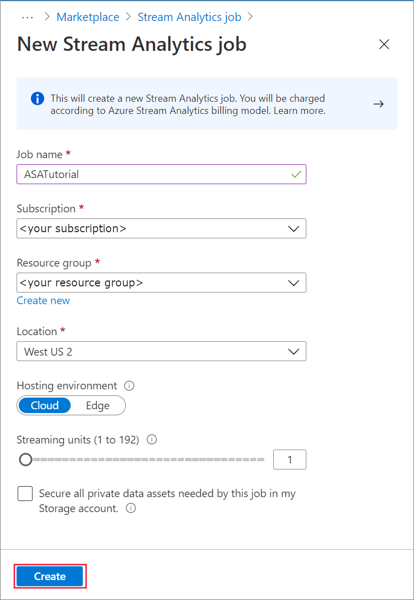
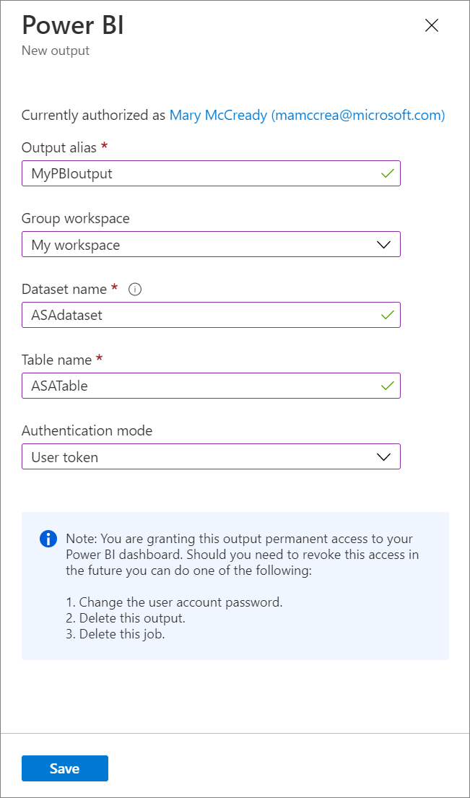
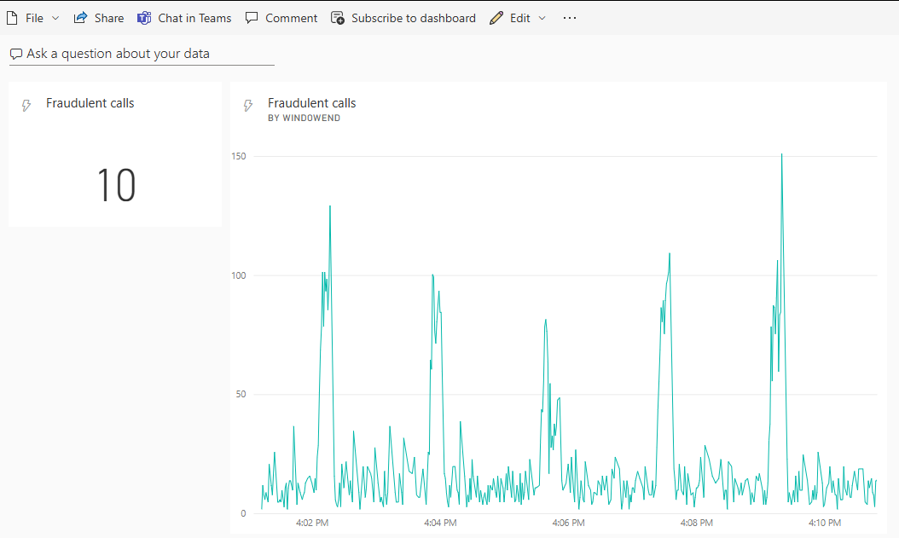

# Tutorial: Analyze fraudulent call data with Stream Analytics and visualize results in Power BI dashboard

This tutorial shows you how to analyze phone call data using Azure Stream Analytics. The phone call data, generated by a client application, contains fraudulent calls, which are detected by the Stream Analytics job. You can use the techniques from this tutorial for other types of fraud detection, such as credit card fraud or identity theft.

In this tutorial, you learn how to:

> [!div class="checklist"]
> * Generate sample phone call data and send it to Azure Event Hubs.
> * Create a Stream Analytics job.
> * Configure job input and output.
> * Define queries to filter fraudulent calls.
> * Test and start the job.
> * Visualize results in Power BI.

## Prerequisites

Before you start, make sure you've completed the following steps:

* If you don't have an **Azure subscription**, create a [free account](https://azure.microsoft.com/free/).
* Download the **phone call event generator app**, [TelcoGenerator.zip](https://aka.ms/asatelcodatagen) from the Microsoft Download Center or get the source code from [GitHub](https://github.com/Azure/azure-stream-analytics/tree/master/DataGenerators/TelcoGeneratorCore).
* You'll need a **Power BI** account.

## Sign in to Azure

Sign in to the [Azure portal](https://portal.azure.com).

## Create an event hub

Before Stream Analytics can analyze the fraudulent calls data stream, the data needs to be sent to Azure. In this tutorial, you'll send data to Azure by using  [Azure Event Hubs](../event-hubs/event-hubs-about.md).

Use the following steps to create an event hub and send call data to that event hub:

1. Sign in to the [Azure portal](https://portal.azure.com/).
2. Select **Create a resource** > **Internet of Things** > **Event Hubs**. 

    :::image type="content" source="media/stream-analytics-real-time-fraud-detection/find-event-hub-resource.png" alt-text="Screenshot showing the Event Hubs creation page.":::
3. Fill out the **Create Namespace** pane with the following values:

   |**Setting**  |**Suggested value** |**Description**  |
   |---------|---------|---------|
   |Subscription     |   \<Your subscription\>      |   Select an Azure subscription where you want to create the event hub.      |
   |Resource group     |   MyASADemoRG      |  Select **Create New** and enter a new resource-group name for your account.       |
   |Namespace name     | asaTutorialEventHubNS        |  A unique name to identify the event hub namespace.       |
   |Location     |   West US2      |    Location where the event hub namespace can be deployed.     |
4. Use default options on the remaining settings and select **Review + create**. Then select **Create** to start the deployment.

    :::image type="content" source="media/stream-analytics-real-time-fraud-detection/create-event-hub-namespace.png" alt-text="Screenshot showing the Create Namespace page.":::
5. After the namespace is deployed successfully, select **Go to resource** to navigate to the **Event Hubs Namespace** page.
6. On the **Event Hubs Namespace** page, select **+Event Hub** on the command bar.

    :::image type="content" source="media/stream-analytics-real-time-fraud-detection/add-event-hub-button.png" alt-text="Screenshot showing the Add event hub button on the Event Hubs Namespace page.":::    
1. On the **Create Event Hub** page, enter a **Name** for the event hub. Set the **Partition Count** to 2.  Use the default options in the remaining settings and select **Create**. Then wait for the deployment to succeed.

    :::image type="content" source="media/stream-analytics-real-time-fraud-detection/create-event-hub-portal.png" alt-text="Screenshot showing the Create event hub page.":::    

### Grant access to the event hub and get a connection string

Before an application can send data to Azure Event Hubs, the event hub must have a policy that allows access. The access policy produces a connection string that includes authorization information.

1. On the **Event Hubs Namespace**, select **Event Hubs** under **Entities** on the left menu, and then select the event hub you created.

    :::image type="content" source="media/stream-analytics-real-time-fraud-detection/select-event-hub.png" alt-text="Screenshot showing the selection of an event hub on the Event Hubs page."::: 
1. On the **Event Hubs instance** page, select **Shared access policies** under **Settings** on the left menu, and then select **+ Add** on the command bar. 
2. Name the policy **MyPolicy**, ensure **Manage** is checked, and then select **Create**.

    :::image type="content" source="media/stream-analytics-real-time-fraud-detection/create-event-hub-access-policy.png" alt-text="Screenshot showing Shared access policies page for an event hub."::: 
3. Once the policy is created, select the policy name to open the policy. Find the **Connection string–primary key**. Select the **copy** button next to the connection string.

   

4. Paste the connection string into a text editor. You need this connection string in the next section.

   The connection string looks as follows:

   `Endpoint=sb://<Your event hub namespace>.servicebus.windows.net/;SharedAccessKeyName=<Your shared access policy name>;SharedAccessKey=<generated key>;EntityPath=<Your event hub name>`

   Notice that the connection string contains multiple key-value pairs separated with semicolons: **Endpoint**, **SharedAccessKeyName**, **SharedAccessKey**, and **EntityPath**.

## Start the event generator application

Before you start the TelcoGenerator app, you should configure it to send data to the Azure Event Hubs you created earlier.

1. Extract the contents of [TelcoGenerator.zip](https://aka.ms/asatelcodatagen) file.
2. Open the `TelcoGenerator\TelcoGenerator\telcodatagen.exe.config` file in a text editor of your choice There's more than one `.config` file, so be sure that you open the correct one.
3. Update the `<appSettings>` element in the config file with the following details:

   * Set the value of the **EventHubName** key to the value of the **EntityPath** at the end of the connection string.
   * Set the value of the **Microsoft.ServiceBus.ConnectionString** key to the connection string **without** the EntityPath value at the end. **Don't forget** to remove the semicolon that precedes the EntityPath value.
4. Save the file.

5. Next open a command window and change to the folder where you unzipped the TelcoGenerator application. Then enter the following command:

   ```cmd
   .\telcodatagen.exe 1000 0.2 2
   ```

   This command takes the following parameters:
   * Number of call data records per hour.
   * Percentage of fraud probability, which is how often the app should simulate a fraudulent call. The value 0.2 means that about 20% of the call records will look fraudulent.
   * Duration in hours, which is the number of hours that the app should run. You can also stop the app at any time by ending the process (**Ctrl+C**) at the command line.

   After a few seconds, the app starts displaying phone call records on the screen as it sends them to the event hub. The phone call data contains the following fields:

   |**Record**  |**Definition**  |
   |---------|---------|
   |CallrecTime    |  The timestamp for the call start time.       |
   |SwitchNum     |  The telephone switch used to connect the call. For this example, the switches are strings that represent the country/region of origin (US, China, UK, Germany, or Australia).       |
   |CallingNum     |  The phone number of the caller.       |
   |CallingIMSI     |  The International Mobile Subscriber Identity (IMSI). It's a unique identifier of the caller.       |
   |CalledNum     |   The phone number of the call recipient.      |
   |CalledIMSI     |  International Mobile Subscriber Identity (IMSI). It's a unique identifier of the call recipient.       |

## Create a Stream Analytics job

Now that you have a stream of call events, you can create a Stream Analytics job that reads data from the event hub.

1. To create a Stream Analytics job, navigate to the [Azure portal](https://portal.azure.com/).
2. Select **Create a resource** and search for **Stream Analytics job**. Select the **Stream Analytics job** tile and select **Create**.
3. Fill out the **New Stream Analytics job** form with the following values:

   |**Setting**  |**Suggested value**  |**Description**  |
   |---------|---------|---------|
   |Subscription    |  \<Your subscription\>   |   Select an Azure subscription where you want to create the job.       |
   |Resource group   |   MyASADemoRG      |   Select **Use existing** and enter a new resource-group name for your account.      |
   |Job name     |  ASATutorial       |   A unique name to identify the event hub namespace.      |
   |Location   |    West US2     |   	Location where the job can be deployed. It's recommended to place the job and the event hub in the same region for best performance and so that you don't pay to transfer data between regions.      |
   |Hosting environment    | Cloud        |     Stream Analytics jobs can be deployed to cloud or edge. **Cloud** allows you to deploy to Azure Cloud, and **Edge** allows you to deploy to an IoT Edge device.    |
   |Streaming units     |    1	     |   	Streaming units represent the computing resources that are required to execute a job. By default, this value is set to 1. To learn about scaling streaming units, see [understanding and adjusting streaming units](stream-analytics-streaming-unit-consumption.md) article.      |
4. Use default options on the remaining settings, select **Create**, and wait for the deployment to succeed.

   
5. After the job is deployed, select **Go to resource** to navigate to the **Stream Analytics job** page. 

## Configure job input

The next step is to define an input source for the job to read data using the event hub you created in the previous section.

2. On the **Stream Analytics job** page, in the **Job Topology** section on the left menu, select **Inputs**.
3. On the **Inputs** page, select **+ Add stream input** and **Event hub**. 

    :::image type="content" source="media/stream-analytics-real-time-fraud-detection/add-input-event-hub-menu.png" lightbox="media/stream-analytics-real-time-fraud-detection/add-input-event-hub-menu.png" alt-text="Screenshot showing the Input page for a Stream Analytics job."::: 
4. Fill out the input form with the following values:

   |**Setting**  |**Suggested value**  |**Description**  |
   |---------|---------|---------|
   |Input alias     |  CallStream       |  Provide a friendly name to identify your input. Input alias can contain alphanumeric characters, hyphens, and underscores only and must be 3-63 characters long.       |
   |Subscription    |   \<Your subscription\>      |   Select the Azure subscription where you created the event hub. The event hub can be in same or a different subscription as the Stream Analytics job.       |
   |Event hub namespace    |  asaTutorialEventHub       |  Select the event hub namespace you created in the previous section. All the event hub namespaces available in your current subscription are listed in the dropdown.       |
   |Event hub name    |   MyEventHub      |  Select the event hub you created in the previous section. All the event hubs available in your current subscription are listed in the dropdown.       |
   | Authentication mode  |   Connection string      |  In this tutorial, you'll use the connection string to connect to the event hub.   |
   |Event hub policy name   |  MyPolicy       |  Select **Use existing**, and then select the policy you created earlier in this tutorial.  |

4. Use default options on the remaining settings and select **Save**.

    :::image type="content" source="media/stream-analytics-real-time-fraud-detection/configure-stream-analytics-input.png" alt-text="Screenshot showing the Event Hubs configuration page for an input."::: 

## Create a consumer group

We recommend that you use a distinct consumer group for each Stream Analytics job. If no consumer group is specified, the Stream Analytics job uses the $Default consumer group. When a job contains a self-join or has multiple inputs, some inputs later might be read by more than one reader. This situation affects the number of readers in a single consumer group.

To add a new consumer group:

1. In the Azure portal, go to your Event Hubs instance.
1. In the left menu, under **Entities**, select **Consumer groups**.
1. Select **+ Consumer group** on the command bar.

   :::image type="content" source="media/stream-analytics-real-time-fraud-detection/create-consumer-group.png" alt-text="Screenshot that shows creating a new consumer group.":::
1. In **Name**, enter a name for your new consumer group. For example, *MyConsumerGroup*.
1. Select **Create**.

## Configure job output

The last step is to define an output sink where the job can write the transformed data. In this tutorial, you output and visualize data with Power BI.

1. From the Azure portal, open **All resources**, and select the *ASATutorial* Stream Analytics job.
2. In the **Job Topology** section of the Stream Analytics job, select the **Outputs** option.
3. Select **+ Add** > **Power BI**. 
4. Fill the output form with the following details:

   |**Setting**  |**Suggested value**  |
   |---------|---------|
   |Output alias  |  MyPBIoutput  |
   |Group workspace| My workspace |
   |Dataset name  |   ASAdataset  |
   |Table name |  ASATable  |
   | Authentication mode | User token |
5. Select **Authorize** and follow the prompts to authenticate Power BI. 

   
6. Select **Save** at the bottom of the **Power BI** page. 

   This tutorial uses the *User token* authentication mode. To use Managed Identity, see [Use Managed Identity to authenticate your Azure Stream Analytics job to Power BI](powerbi-output-managed-identity.md).

## Create queries to transform real-time data

At this point, you have a Stream Analytics job set up to read an incoming data stream. The next step is to create a query that analyzes the data in real time. The queries use a SQL-like language that has some extensions specific to Stream Analytics.

In this section of the tutorial, you create and test several queries to learn a few ways in which you can transform an input stream for analysis. 

The queries you create here will just display the transformed data to the screen. In a later section, you'll write the transformed data to Power BI.

To learn more about the language, see the [Azure Stream Analytics Query Language Reference](/stream-analytics-query/stream-analytics-query-language-reference).

### Test using a pass-through query

If you want to archive every event, you can use a pass-through query to read all the fields in the payload of the event.

1. Navigate to your Stream Analytics job in the Azure portal and select **Query** under **Job topology** on the left menu. 
2. In the query window, enter this query:

   ```SQL
   SELECT 
       *
   FROM 
       CallStream
   ```

    >[!NOTE]
    >As with SQL, keywords are not case-sensitive, and whitespace is not significant.

    In this query, `CallStream` is the alias that you specified when you created the input. If you used a different alias, use that name instead.
3. Select **Test query**.

    The Stream Analytics job runs the query against the sample data from the input and displays the output at the bottom of the window. The results indicate that the Event Hubs and the Streaming Analytics job are configured correctly.

    :::image type="content" source="media/stream-analytics-real-time-fraud-detection/sample-output-passthrough.png" alt-text="Sample output from test query":::

    The exact number of records you see will depend on how many records were captured in the sample.

### Reduce the number of fields using a column projection

In many cases, your analysis doesn't need all the columns from the input stream. You can use a query to project a smaller set of returned fields than in the pass-through query.

Run the following query and notice the output.

```SQL
SELECT CallRecTime, SwitchNum, CallingIMSI, CallingNum, CalledNum 
INTO
    [MyPBIoutput]
FROM 
    CallStream
```

### Count incoming calls by region: Tumbling window with aggregation

Suppose you want to count the number of incoming calls per region. In streaming data, when you want to perform aggregate functions like counting, you need to segment the stream into temporal units, since the data stream itself is effectively endless. You do this using a Streaming Analytics [window function](stream-analytics-window-functions.md). You can then work with the data inside that window as a unit.

For this transformation, you want a sequence of temporal windows that don't overlap—each window will have a discrete set of data that you can group and aggregate. This type of window is referred to as a *Tumbling window*. Within the Tumbling window, you can get a count of the incoming calls grouped by `SwitchNum`, which represents the country/region where the call originated.

1. Paste the following query in the query editor:

    ```SQL
    SELECT 
        System.Timestamp as WindowEnd, SwitchNum, COUNT(*) as CallCount 
    FROM
        CallStream TIMESTAMP BY CallRecTime 
    GROUP BY TUMBLINGWINDOW(s, 5), SwitchNum
    ```

    This query uses the `Timestamp By` keyword in the `FROM` clause to specify which timestamp field in the input stream to use to define the Tumbling window. In this case, the window divides the data into segments by the `CallRecTime` field in each record. (If no field is specified, the windowing operation uses the time that each event arrives at the event hub. See "Arrival Time vs Application Time" in [Stream Analytics Query Language Reference](/stream-analytics-query/stream-analytics-query-language-reference). 

    The projection includes `System.Timestamp`, which returns a timestamp for the end of each window. 

    To specify that you want to use a Tumbling window, you use the [TUMBLINGWINDOW](/stream-analytics-query/tumbling-window-azure-stream-analytics) function in the `GROUP BY` clause. In the function, you specify a time unit (anywhere from a microsecond to a day) and a window size (how many units). In this example, the Tumbling window consists of 5-second intervals, so you'll get a count by country/region for every 5 seconds' worth of calls.

2. Select **Test query**. In the results, notice that the timestamps under **WindowEnd** are in 5-second increments.

### Detect SIM fraud using a self-join

For this example, consider fraudulent usage to be calls that originate from the same user but in different locations within 5 seconds of one another. For example, the same user can't legitimately make a call from the US and Australia at the same time.

To check for these cases, you can use a self-join of the streaming data to join the stream to itself based on the `CallRecTime` value. You can then look for call records where the `CallingIMSI` value (the originating number) is the same, but the `SwitchNum` value (country/region of origin) isn't the same.

When you use a join with streaming data, the join must provide some limits on how far the matching rows can be separated in time. As noted earlier, the streaming data is effectively endless. The time bounds for the relationship are specified inside the `ON` clause of the join, using the `DATEDIFF` function. In this case, the join is based on a 5-second interval of call data.

1. Paste the following query in the query editor:

	```SQL
	SELECT System.Timestamp AS WindowEnd, COUNT(*) AS FraudulentCalls
   	INTO "MyPBIoutput"
   	FROM "CallStream" CS1 TIMESTAMP BY CallRecTime
   	JOIN "CallStream" CS2 TIMESTAMP BY CallRecTime
   	ON CS1.CallingIMSI = CS2.CallingIMSI
   	AND DATEDIFF(ss, CS1, CS2) BETWEEN 1 AND 5
   	WHERE CS1.SwitchNum != CS2.SwitchNum
   	GROUP BY TumblingWindow(Duration(second, 1))
	```

    This query is like any SQL join except for the `DATEDIFF` function in the join. This version of `DATEDIFF` is specific to Streaming Analytics, and it must appear in the `ON...BETWEEN` clause. The parameters are a time unit (seconds in this example) and the aliases of the two sources for the join. This function is different from the standard SQL `DATEDIFF` function.

    The `WHERE` clause includes the condition that flags the fraudulent call: the originating switches aren't the same.

2. Select **Test query**. Review the output, and then select **Save query**.

## Start the job and visualize output

1. To start the job, navigate to the job **Overview** and select **Start**.

2. Select **Now** for job output start time and select **Start**. You can view the job status in the notification bar.

3. Once the job succeeds, navigate to [Power BI](https://powerbi.com/) and sign in with your work or school account. If the Stream Analytics job query is outputting results, the *ASAdataset* dataset you created exists under the **Datasets** tab.

4. From your Power BI workspace, select **+ Create** to create a new dashboard named *Fraudulent Calls*.

5. At the top of the window, select **Edit** and **Add tile**. Then select **Custom Streaming Data** and **Next**. Choose the **ASAdataset** under **Your Datasets**. Select **Card** from the **Visualization type** dropdown, and add **fraudulent calls** to **Fields**. Select **Next** to enter a name for the tile, and then select **Apply** to create the tile.

   

6. Follow the step 5 again with the following options:
   * When you get to Visualization Type, select Line chart.
   * Add an axis and select **windowend**.
   * Add a value and select **fraudulent calls**.
   * For **Time window to display**, select the last 10 minutes.

7. Your dashboard should look like the example below once both tiles are added. Notice that, if your event hub sender application and Streaming Analytics application are running, your Power BI dashboard periodically updates as new data arrives.

   

## Embedding your Power BI Dashboard in a web application

For this part of the tutorial, you'll use a sample [ASP.NET](https://asp.net/) web application created by the Power BI team to embed your dashboard. For more information about embedding dashboards, see [embedding with Power BI](/power-bi/developer/embedding) article.

To set up the application, go to the [PowerBI-Developer-Samples](https://github.com/Microsoft/PowerBI-Developer-Samples) GitHub repository and follow the instructions under the **User Owns Data** section (use the redirect and homepage URLs under the **integrate-web-app** subsection). Since we're using the Dashboard example, use the **integrate-web-app** sample code located in the [GitHub repository](https://github.com/microsoft/PowerBI-Developer-Samples/tree/master/.NET%20Framework/Embed%20for%20your%20organization/).
Once you've got the application running in your browser, follow these steps to embed the dashboard you created earlier into the web page:

1. Select **Sign in to Power BI**, which grants the application access to the dashboards in your Power BI account.

2. Select the **Get Dashboards** button, which displays your account's Dashboards in a table. Find the name of the dashboard you created earlier, **powerbi-embedded-dashboard**, and copy the corresponding **EmbedUrl**.

3. Finally, paste the **EmbedUrl** into the corresponding text field and select **Embed Dashboard**. You can now view the same dashboard embedded within a web application.

## Next steps

In this tutorial, you created a simple Stream Analytics job, analyzed the incoming data, and presented results in a Power BI dashboard. To learn more about Stream Analytics jobs, continue to the next tutorial:

> [!div class="nextstepaction"]
> [Run Azure Functions within Stream Analytics jobs](stream-analytics-with-azure-functions.md)
