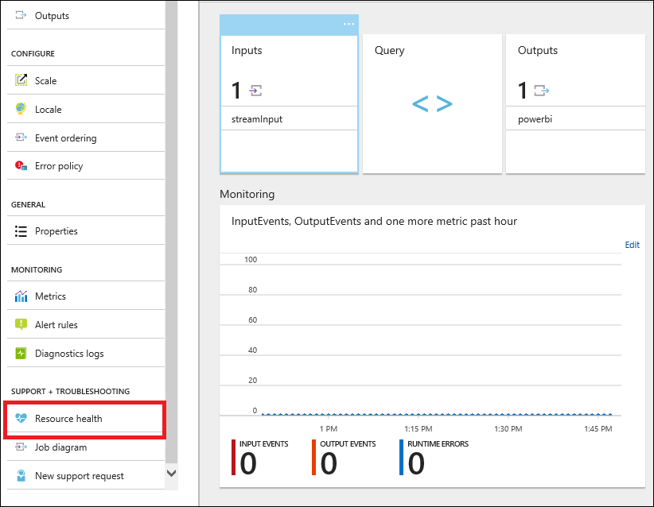
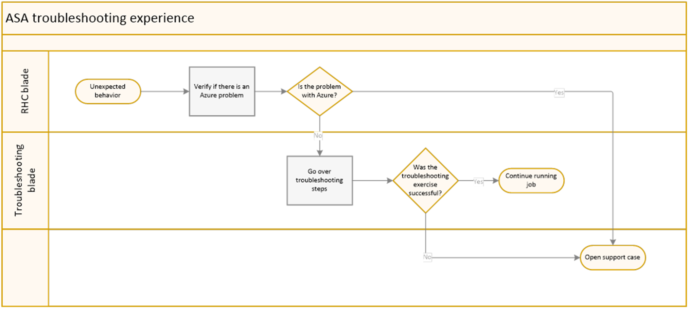

# Stream Analytics Resource health blade

The **Resource health** blade in the Azure portal shows the health of your Azure Stream Analytics jobs. It also shows actionable guidance that can help you troubleshoot problems. 

The **Resource health** blade is intended to help you determine more quickly whether the root of a problem is in the application, or if it is caused by an event in Azure. It can help you know when to open a support case to receive assistance.

## Troubleshooting workflow

To see the resource health for your Stream Analytics jobs, select the **Resource health** blade. 

The following flowchart can help you make decisions about what to look for, and when to open a support case.

## Get help
For additional assistance, try our [Azure Stream Analytics forum](https://social.msdn.microsoft.com/Forums/home?forum=AzureStreamAnalytics).

## Next steps
* [Introduction to Stream Analytics](stream-analytics-introduction.md)
* [Get started with Stream Analytics](stream-analytics-get-started.md)
* [Scale Stream Analytics jobs](stream-analytics-scale-jobs.md)
* [Stream Analytics query language reference](https://msdn.microsoft.com/library/azure/dn834998.aspx)
* [Stream Analytics management REST API reference](https://msdn.microsoft.com/library/azure/dn835031.aspx)