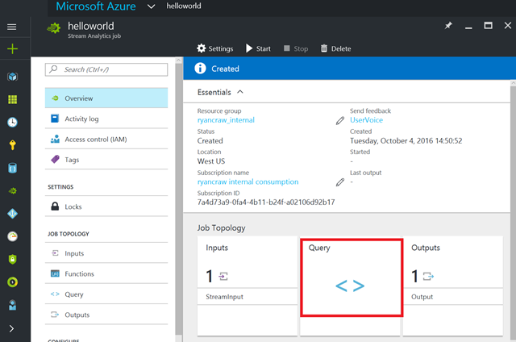
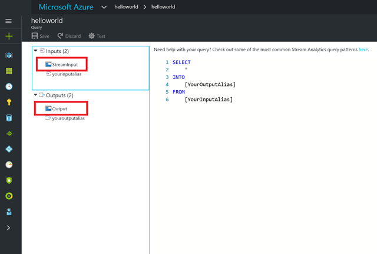
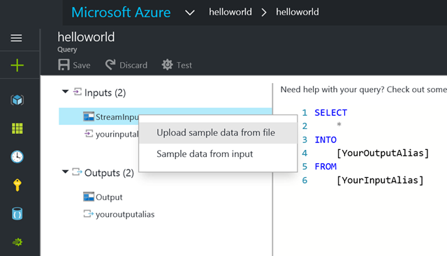
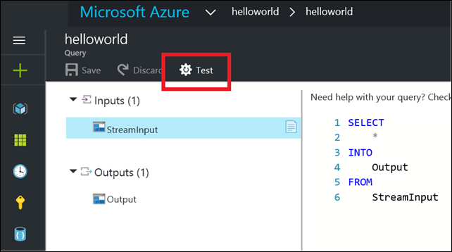
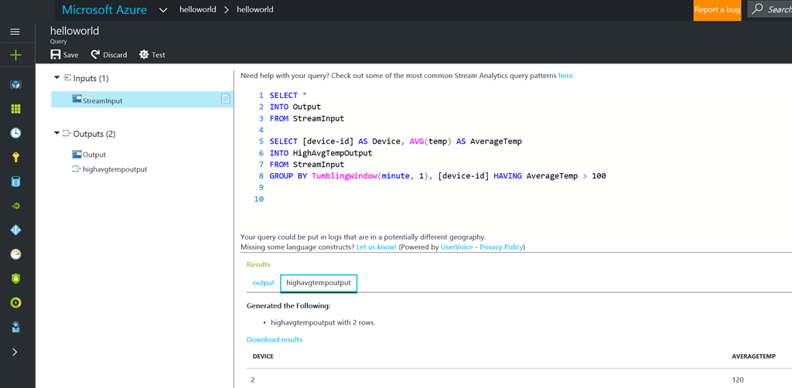

# Azure Stream Analytics input-stream sampling

By using Azure Stream Analytics, you can sample input events that come from a file and test queries in the portal without needing to start or stop a job.

## Testing your query

In the Stream Analytics job details pane, open the **Query editor** blade by clicking the query name under **Query**. (In our example scenario, because no query has been created yet, click the **< >** placeholder.)

The rich editor blade for creating your query is displayed as it was in the previous release. Now the blade has been updated with a new left pane that shows the inputs and outputs that are used by the query and defined for this job.

Also shown are an additional input and output, which are not defined. They come from the new query template that you start with. They change, or even disappear altogether, as you edit the query. You can safely ignore them for now.

To test with sample input data, right-click any of your inputs, and then select **Upload sample data from file**.

After the upload is complete, click **Test** to test this query against the sample data you have just provided.

If you want to save the test output for later use, the output of your query is displayed in the browser with a link to the download results. You can now easily and iteratively modify your query and test it repeatedly to see how the output changes.

In the preceding image, a second output has been added, called **HighAvgTempOutput**.

When you use multiple outputs in a query, you can see the results for each output separately and easily toggle between them.

After you are satisfied with the results, you can save your query, start your job, sit back and watch the magic of Stream Analytics.

## Get help

For further assistance, try our [Azure Stream Analytics forum](https://social.msdn.microsoft.com/Forums/home?forum=AzureStreamAnalytics).

## Next steps
* [Introduction to Azure Stream Analytics](stream-analytics-introduction.md)
* [Get started using Azure Stream Analytics](stream-analytics-real-time-fraud-detection.md)
* [Scale Azure Stream Analytics jobs](stream-analytics-scale-jobs.md)
* [Azure Stream Analytics Query Language Reference](https://msdn.microsoft.com/library/azure/dn834998.aspx)
* [Azure Stream Analytics Management REST API Reference](https://msdn.microsoft.com/library/azure/dn835031.aspx)
