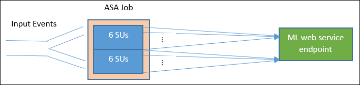
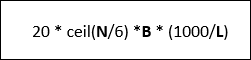
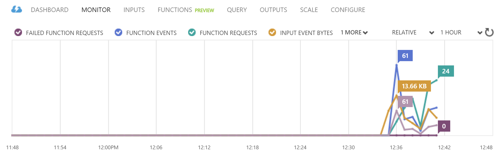

<properties
	pageTitle="Scale your Stream Analytics job with Azure Machine Learning functions | Microsoft Azure"
	description="Learn how to properly scale Stream Analytics jobs (partitioning, SU quantity, and more) when using Azure Machine Learning functions."
	keywords=""
	documentationCenter=""
	services="stream-analytics"
	authors="jeffstokes72"
	manager="paulettm"
	editor="cgronlun"
/>

<tags
	ms.service="stream-analytics"
	ms.devlang="na"
	ms.topic="article"
	ms.tgt_pltfrm="na"
	ms.workload="data-services"
	ms.date="07/27/2016"
	ms.author="jeffstok"
/>

# Scale your Stream Analytics job with Azure Machine Learning functions

It is often quite easy to set up an Stream Analytics job and run some sample data through it. What should we do when we need to run the same job with higher data volume? It requires us to understand how to configure the Stream Analytics job so that it will scale. In this document, we will focus on the special aspects of scaling Stream Analytics jobs with Machine Learning functions. For information on how to scale Stream Analytics jobs in general see the article [Scaling jobs](stream-analytics-scale-jobs.md).

## What is an Azure Machine Learning function in Stream Analytics?

A Machine Learning function in Stream Analytics can be used like a regular function call in the Stream Analytics query language. However, behind the scene, the function calls are actually Azure Machine Learning Web Service requests. Machine Learning web services support “batching” multiple rows, which is called mini-batch, in the same web service API call, to improve overall throughput. Please see the following articles for more details; [Azure Machine Learning functions in Stream Analytics](https://blogs.technet.microsoft.com/machinelearning/2015/12/10/azure-ml-now-available-as-a-function-in-azure-stream-analytics/) and [Azure Machine Learning Web Services](machine-learning/machine-learning-consume-web-services.md#request-response-service-rrs).

## Configure a Stream Analytics job with Machine Learning functions

When configuring a Machine Learning function for Stream Analytics job, there are two parameters to consider, the batch size of the Machine Learning function calls, and the Streaming Units (SUs) provisioned for the Stream Analytics job. To determine the appropriate values for these, first a decision must be made between latency and throughput, that is, latency of the Stream Analytics job, and throughput of each SU. SUs may always be added to a job to increase throughput of a well partitioned Stream Analytics query, although additional SUs increases the cost of running the job.

Therefore it is important to determine the *tolerance* of latency in running a Stream Analytics job. Additional latency from running Azure Machine Learning service requests will naturally increase with batch size, which will compound the latency of the Stream Analytics job. On the other hand, increasing batch size allows the Stream Analytics job to process *more events with the *same number* of Machine Learning web service requests. Often the increase of Machine Learning web service latency is sub-linear to the increase of batch size so it is important to consider the most cost-efficient batch size for a Machine Learning web service in any given situation. The default batch size for the web service requests is 1000 and may be modified either by using the [Stream Analytics REST API](https://msdn.microsoft.com/library/mt653706.aspx "Stream Analytics REST API") or the [PowerShell client for Stream Analytics](stream-analytics-monitor-and-manage-jobs-use-powershell.md "PowerShell client for Stream Analytics").

Once a batch size has been determined, the amount of Streaming Units (SUs) can be determined, based on the number of events that the function needs to process per second. For further information on Streaming Units consult the article [Stream Analytics Scale jobs](stream-analytics-scale-jobs.md#configuring-streaming-units).

In general, there are 20 concurrent connections to the Machine Learning web service for every 6 SUs, except that 1 SU jobs and 3 SU jobs will get 20 concurrent connections also.  For example, if the input data rate is 200,000 events per second and the batch size is left to the default of 1000 the resulting web service latency with 1000 events mini-batch is 200ms. This means every connection can make 5 requests to the Machine Learning web service in a second. With 20 connections, the Stream Analytics job can process 20,000 events in 200ms  and therefore 100,000 events in a second. So to process 200,000 events per second, the Stream Analytics job needs 40 concurrent connections, which comes out to 12 SUs. The diagram below illustrates the requests from the Stream Analytics job to the Machine Learning web service endpoint – Every 6 SUs has 20 concurrent connections to Machine Learning web service at max.

In general, ***B*** for batch size, ***L*** for the web service latency at batch size B in milliseconds, the throughput of an Stream Analytics job with ***N*** SUs is:

An additional consideration may be the 'max concurrent calls' on the Machine Learning web service side, it’s recommended to set this to the maximum value (200 currently).

For more information on this setting please review the [Scaling article for Machine Learning Web Services](../machine-learning/machine-learning-scaling-webservice.md).

## Example – Sentiment Analysis

The following example includes a Stream Analytics job with the sentiment analysis Machine Learning function, as described in the [Stream Analytics Machine Learning integration tutorial](stream-analytics-machine-learning-integration-tutorial.md).

The query is a simple fully partitioned query followed by the **sentiment** function, as shown below:

    WITH subquery AS (
        SELECT text, sentiment(text) as result from input
    )
    
    Select text, result.[Score]
    Into output
    From subquery

Consider the following scenario; with a throughput of 10,000 tweets per second a Stream Analytics job must be created to perform sentiment analysis of the tweets (events). Using 1 SU, could this Stream Analytics job be able to handle the traffic? Using the default batch size of 1000 the job should be able to keep up with the input. Further the added Machine Learning function should generate no more than a second of latency, which is the general default latency of the sentiment analysis Machine Learning web service (with a default batch size of 1000). The Stream Analytics job’s **overall** or end-to-end latency would typically be a few seconds. Take a more detailed look into this Stream Analytics job, *especially* the Machine Learning function calls. Having the batch size as 1000, a throughput of 10,000 events will take about 10 requests to web service. Even with 1 SU, there are enough concurrent connections to accomodate this input traffic.

But what if the input event rate increases by 100x and now the Stream Analytics job needs to process 1,000,000 tweets per second? There are two options:

1.  Increase the batch size, or
2.  Partition the input stream to process the events in parallel

With the first option, the job **latency** will increase.

With the second option, more SUs would need to be provisioned and therefore generate more concurrent Machine Learning web service requests. This means the job **cost** will increase.

Assume the latency of the sentiment analysis Machine Learning web service is 200ms for 1000-event batches or below, 250ms for 5,000-event batches, 300ms for 10,000-event batches or 500ms for 25,000-event batches.

1. Using the first option, (**not** provisioning more SUs), the batch size could be increased to **25,000**. This in turn would allow the job to process 1,000,000 events with 20 concurrent connections to the Machine Learning web service (with a latency of 500ms per call). So the additional latency of the Stream Analytics job due to the sentiment function requests against the Machine Learning web service requests would be increased from **200ms** to **500ms**. However, note that batch size **cannot** be increased infinitely as the Machine Learning web services requires the payload size of a request be 4MB or smaller web service requests timeout after 100 seconds of operation.
2. Using the second option, the batch size is left at 1000, with 200ms web service latency, every 20 concurrent connections to the web service would be able to process 1000 * 20 * 5 events = 100,000 per second. So to process 1,000,000 events per second, the job would need 60 SUs. Compared to the first option, Stream Analytics job would make more web service batch requests, in turn generating an increased cost.

Below is a table for the throughput of the Stream Analytics job for different SUs and batch sizes (in number of events per second).

| SU |   |   |   | batch size (ML latency) |   |
|--------|-------------------------|---------------|---------------|----------------|----------------|
|   |   |   |   |   |   |
|   | 500 (200ms) | 1,000 (200ms) | 5,000 (250ms) | 10,000 (300ms) | 25,000 (500ms) |
| 1 SU | 2,500 | 5,000 | 20,000 | 30,000 | 50,000 |
| 3 SUs | 2,500 | 5,000 | 20,000 | 30,000 | 50,000 |
| 6 SUs | 2,500 | 5,000 | 20,000 | 30,000 | 50,000 |
| 12 SUs | 5,000 | 10,000 | 40,000 | 60,000 | 100,000 |
| 18 SUs | 7,500 | 15,000 | 60,000 | 90,000 | 150,000 |
| 24 SUs | 10,000 | 20,000 | 80,000 | 120,000 | 200,000 |
| … | … | … | … | … | … |
| 60 SUs | 25,000 | 50,000 | 200,000 | 300,000 | 500,000 |

By now, you should already have a good understanding of how Machine Learning functions in Stream Analytics work. You likely also understand that Stream Analytics jobs “pull” data from data sources and each “pull” returns a batch of events for the Stream Analytics job to process. How does this pull model impact the Machine Learning web service requests?

Normally, the batch size we set for Machine Learning functions won’t exactly be divisible by the number of events returned by each Stream Analytics job “pull”. When this occurs the Machine Learning web service will be called with “partial” batches. This is done to not incur additional job latency overhead in coalescing events from pull to pull.

## New function-related monitoring metrics

In the Monitor area of a Stream Analytics job, three additional function-related metrics have been added. They are FUNCTION REQUESTS, FUNCTION EVENTS and FAILED FUNCTION REQUESTS, as shown in the graphic below.

The are defined as follows:

**FUNCTION REQUESTS**: The number of function requests.

**FUNCTION EVENTS**: The number events in the function requests.

**FAILED FUNCTION REQUESTS**: The number of failed function requests.

## Key Takeaways  

To summarize the main points, in order to scale an Stream Analytics job with Machine Learning functions, the following items must be considered:

1.  The input event rate
2.  The tolerated latency for the running Stream Analytics job (and thus the batch size of the Machine Learning web service requests)
3.  The provisioned Stream Analytics SUs and the number of Machine Learning web service requests (the additional function-related costs)

A fully partitioned Stream Analytics query was used as an example. If a more complex query is needed the [Azure Stream Analytics forum](https://social.msdn.microsoft.com/Forums/en-US/home?forum=AzureStreamAnalytics) is a great resource for getting additional help from the Stream Analytics team.

## Next steps

To learn more about Stream Analytics, see:

- [Get started using Azure Stream Analytics](stream-analytics-get-started.md)
- [Scale Azure Stream Analytics jobs](stream-analytics-scale-jobs.md)
- [Azure Stream Analytics Query Language Reference](https://msdn.microsoft.com/library/azure/dn834998.aspx)
- [Azure Stream Analytics Management REST API Reference](https://msdn.microsoft.com/library/azure/dn835031.aspx)
