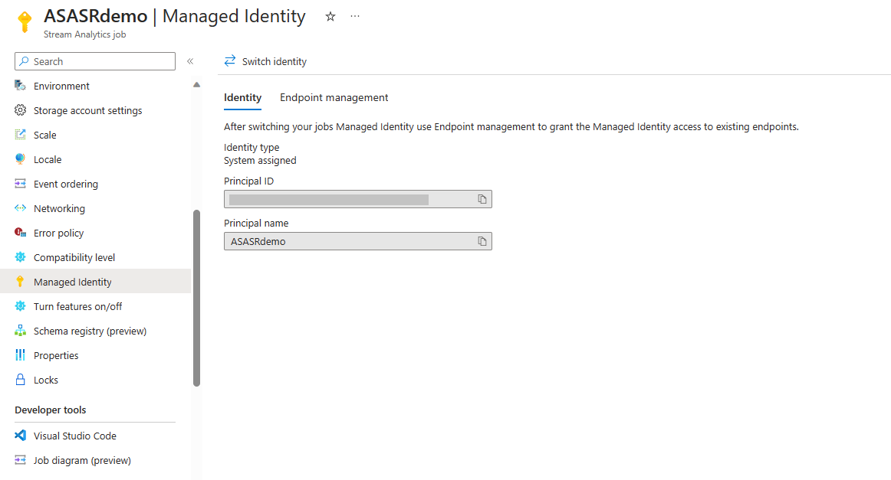
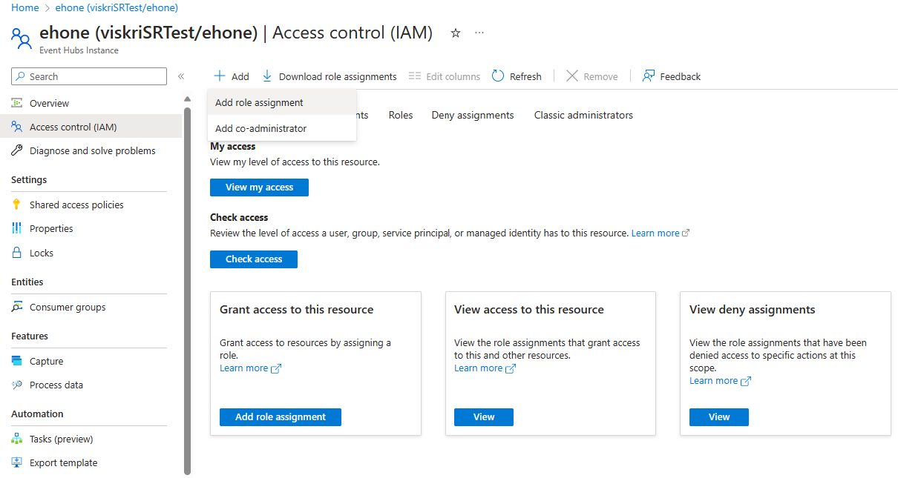
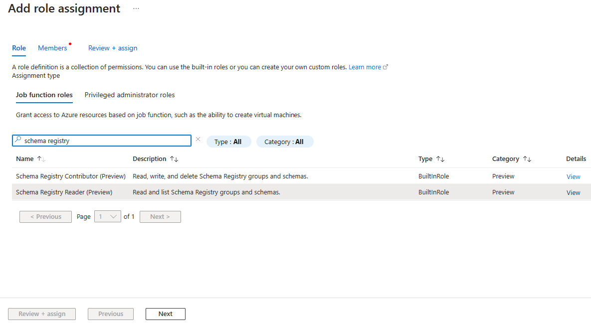
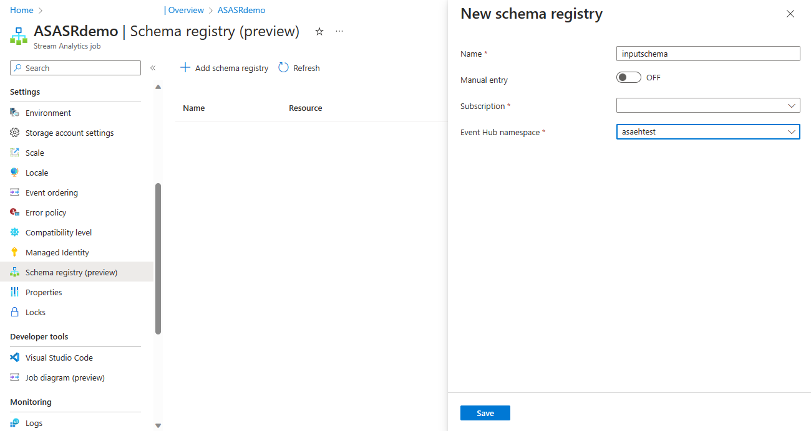
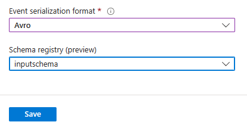

# Integrating with Schema Registry in Azure Stream Analytics (Public Preview)

Azure Event Hubs hosts a [Schema Registry](../event-hubs/schema-registry-overview.md) that acts as a centralized repository for schema. With the integration with the Schema Registry, Azure Stream Analytics can retrieve schema from the Schema Registry and deserialize data from Event Hubs input. By moving schema metadata into the Schema Registry, you can reduce per-message overhead and enables efficient schema validation to ensure the integrity of the data.

This article shows you how to add the Schema Registry to your Stream Analytics job, and connect with the Event Hubs input.

## Prerequisites

Before you start, make sure you have the following:

* An [Event Hubs namespace](../event-hubs/event-hubs-create.md).
* A Schema Group with schemas in a Schema Registry hosted by Azure Event Hubs. [Create an Azure Event Hubs Schema Registry](../event-hubs/create-schema-registry.md) if you don't have one.
* An [Azure Stream Analytics job](stream-analytics-quick-create-portal.md) with [managed identity](stream-analytics-managed-identities-overview.md) enabled.

## Manage the job access to the Schema Registry

To access the Event Hubs Schema Registry, you need to assign [Schema Registry Reader](../event-hubs/schema-registry-concepts.md) role to your Stream Analytics job using security principal.

1. Sign in to the [Azure portal](https://portal.azure.com/) and go to your Stream Analytics job page.
2. Select **Managed Identity** page, and save the **Principal name** for later use. See [Managed Identities](stream-analytics-managed-identities-overview.md) for more details.

    
3. Go to your Event Hubs namespace page that the Schema Registry is hosted. Select **Access Control** and **Add role assignment**.

    
4. Search for **Schema Registry Reader** and click **Next**.

    
5. At **Members** page, select the **Principal name** you saved from step 1 and click on **Review + assign**.

## Add Schema Registry to the Stream Analytics job

1. On the Stream Analytics job portal, select **Schema Registry** under **Settings** on the left menu.
2. Select **Add Schema Registry**
3. On the **New Schema Registry** page, follow the steps below:
    1. For **Name**, enter the alias name for this Schema Registry,
    2. For **Subscription**, select the subscription that has the Event Hubs namespace, hosting the Schema Registry.
    3. For **Event Hubs namespace**, select the namespace that the Schema Registry is under.
    4. If you don't have access to the subscription, you can also use **manual entry**.
    
        

## Configure the Event Hubs input

> [!IMPORTANT]
> Schema formats are used to determine the manner in which a schema is structured and defined. Only AVRO format is supported now. 

1. Navigate to the Inputs page. Add a new Event Hubs input or choose an existing Event Hubs input.
2. To connect the Schema Registry to the selected Event Hubs, scroll down to the bottom of the configuration page.
3. Select **AVRO** for **Event Serialization format**.
4. Select the Schema Registry from the drop-down menu and **Save**.

    

## Preview the input data

Azure Stream Analytics automatically fetches events from the streaming inputs. It provides a convenient way to test the Schema Registry integration without starting or stopping your job.

1. On the Stream Analytics job page, select **Job Topology -> Query** to open the Query editor window.
2. Select the configured Event Hubs input. Make sure there's a file icon next to the selected input.
3. The sample events will automatically appear in the **input preview**.

    

See [Test an Azure Stream Analytics job with sample data](stream-analytics-test-query.md) for more information about query testing.

## Limitations

1. The authentication method of the Schema Registry only supports Managed Identity. The authentication method of the Event Hubs input must be Managed Identity when the Schema Registry is selected.
2. Test connection feature isn't yet available for Schema Registry. The best way to verify the connection built with the Schema Registry is through input preview on query testing page. 

## Next steps

* [Process data from your Event Hubs using Azure Stream Analytics](../event-hubs/process-data-azure-stream-analytics.md)
* [Test your Azure Stream Analytics job with sample data](stream-analytics-test-query.md)
