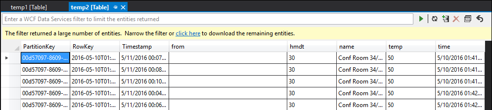

# Debug queries by using SELECT INTO statements

In real-time data processing, knowing what the data looks like in the middle of the query can be helpful. Because inputs or steps of an Azure Stream Analytics job can be read multiple times, you can write extra SELECT INTO statements. Doing so outputs intermediate data into storage and lets you inspect the correctness of the data, just as *watch variables* do when you debug a program.

## Use SELECT INTO to check the data stream

The following example query in an Azure Stream Analytics job has one stream input, two reference data inputs, and an output to Azure Table Storage. The query joins data from the event hub and two reference blobs to get the name and category information:

Note that the job is running, but no events are being produced in the output. On the **Monitoring** tile, shown here, you can see that the input is producing data, but you don’t know which step of the **JOIN** caused all the events to be dropped.

 
In this situation, you can add a few extra SELECT INTO statements to “log” the intermediate JOIN results and the data that's read from the input.

In this example, we've added two new “temporary outputs.” They can be any sink you like. Here we use Azure Storage as an example:

You can then rewrite the query like this:

Now start the job again, and let it run for a few minutes. Then query temp1 and temp2 with Visual Studio Cloud Explorer to produce the following tables:

**temp1 table**

**temp2 table**

As you can see, temp1 and temp2 both have data, and the name column is populated correctly in temp2. However, because there is still no data in output, something is wrong:

By sampling the data, you can be almost certain that the issue is with the second JOIN. You can download the reference data from the blob and take a look:

As you can see, the format of the GUID in this reference data is different from the format of the [from] column in temp2. That’s why the data didn’t arrive in output1 as expected.

You can fix the data format, upload it to reference blob, and try again:

This time, the data in the output is formatted and populated as expected.

## Get help

For further assistance, try our [Azure Stream Analytics forum](https://social.msdn.microsoft.com/Forums/home?forum=AzureStreamAnalytics).

## Next steps

* [Introduction to Azure Stream Analytics](stream-analytics-introduction.md)
* [Get started using Azure Stream Analytics](stream-analytics-real-time-fraud-detection.md)
* [Scale Azure Stream Analytics jobs](stream-analytics-scale-jobs.md)
* [Azure Stream Analytics Query Language Reference](https://msdn.microsoft.com/library/azure/dn834998.aspx)
* [Azure Stream Analytics Management REST API Reference](https://msdn.microsoft.com/library/azure/dn835031.aspx)

