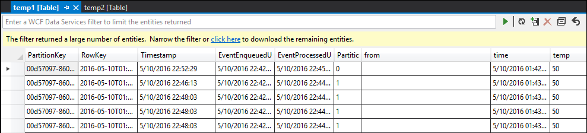
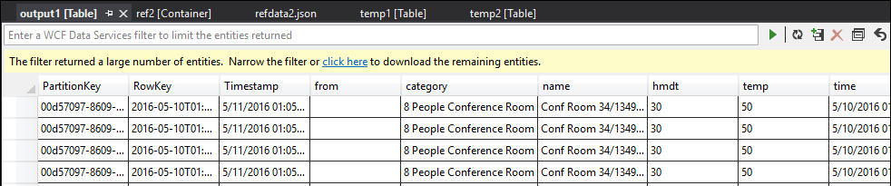

# How to use SELECT INTO statements in Azure Stream Analytics for troubleshooting queries

Knowing what the data looks like in the middle of the query can be very helpful. Since inputs or steps of an Azure Stream Analytics job can be read multiple times, we can write extra **SELECT INTO** statements to output intermediate data into storage and inspect the correctness of the data, just like “watch variables” when debugging a program. Let’s look at an example.

This example query in a Azure Stream Analytics job that has one stream input, two reference data inputs and an output to Azure Table Storage joins data from the event hub and two reference blobs to get the name and category information:

If you notice that the job is running, but no events are being produced in the output. From the Monitoring tile we can see that input is producing data, but we don’t know which step of the **JOIN** caused all the events to be dropped.

 
In this situation, we can add a few extra SELECT INTO statements to “log” the intermediate JOIN results as well as the data read from the input.
Let’s first add two new “temporary outputs”. They can be any sink you like. Here we use Azure Storage as an example:

Then let’s rewrite the query like this:

Now start the job again and let it run for a few minutes. Then we can query temp1 and temp2 with Visual Studio Cloud Explorer:

and

As we can see, temp1 and temp2 both have data, and the name column is populated correctly in temp2. However, there is still no data in output:

Now we are almost certain that the issue is with the 2nd JOIN. Let’s download the reference data from blob and take a look:

Aha! The format of GUID in this reference data is different from the format of the [from] column in temp2. That’s why our data wasn’t arriving in output1 as expected. Let’s fix the data format, upload to reference blob and try again:

And then we got the data in output with name and category nicely populated!

Beyond the scenario we showed in the example, it can also be used to troubleshoot issues when wrong data are produced by a step. 

## Get help
For further assistance, try our [Azure Stream Analytics forum](https://social.msdn.microsoft.com/Forums/en-US/home?forum=AzureStreamAnalytics)

## Next steps
* [Introduction to Azure Stream Analytics](stream-analytics-introduction.md)
* [Get started using Azure Stream Analytics](stream-analytics-get-started.md)
* [Scale Azure Stream Analytics jobs](stream-analytics-scale-jobs.md)
* [Azure Stream Analytics Query Language Reference](https://msdn.microsoft.com/library/azure/dn834998.aspx)
* [Azure Stream Analytics Management REST API Reference](https://msdn.microsoft.com/library/azure/dn835031.aspx)

