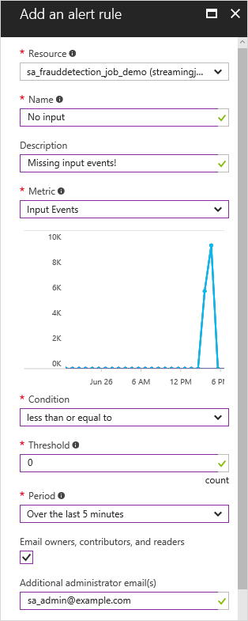

# Set up alerts for Azure Stream Analytics jobs
## Introduction: Monitor page
You can set up alerts to trigger an alert when a metric reaches a condition that you specify. For example, you might set up an alert for a condition like the following:

`If there are zero input events in the last 5 minutes, send email notification to sa-admin@example.com`

Rules can be set up on metrics through the portal, or can be configured [programmatically](https://code.msdn.microsoft.com/windowsazure/Receive-Email-Notifications-199e2c9a) over Operation Logs data.

## Set up alerts in the Azure portal
1. In the Azure portal, open the Stream Analytics job you want to create an alert for. 

2. In the **Job** blade, click the **Monitoring** section.  

3. In the **Metric** blade, click the **Add alert** command.

        

4. Enter a name and a description.

5. Use the selectors to define the condition under which the alert will be sent.

6. Provide information about where the alert should go.

        

For more detail on configuring alerts in the Azure portal, see [Receive alert notifications](../monitoring-and-diagnostics/insights-receive-alert-notifications.md).  

## Get help
For further assistance, try our [Azure Stream Analytics forum](https://social.msdn.microsoft.com/Forums/home?forum=AzureStreamAnalytics)

## Next steps
* [Introduction to Azure Stream Analytics](stream-analytics-introduction.md)
* [Get started using Azure Stream Analytics](stream-analytics-get-started.md)
* [Scale Azure Stream Analytics jobs](stream-analytics-scale-jobs.md)
* [Azure Stream Analytics Query Language Reference](https://msdn.microsoft.com/library/azure/dn834998.aspx)
* [Azure Stream Analytics Management REST API Reference](https://msdn.microsoft.com/library/azure/dn835031.aspx)

