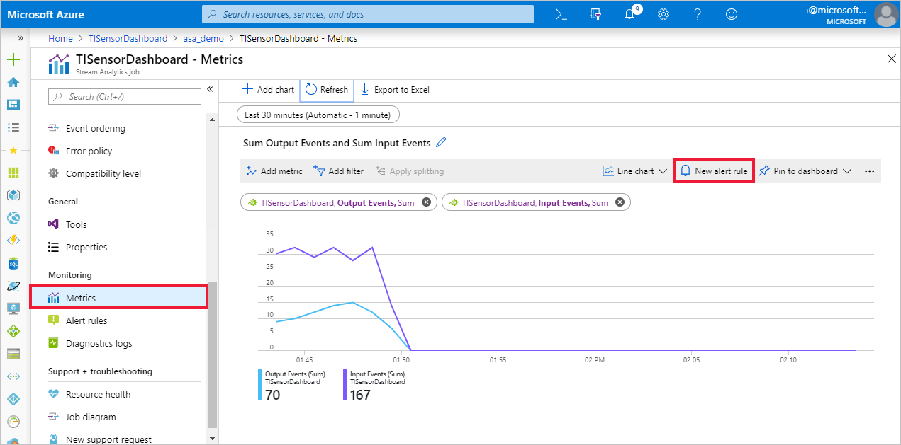
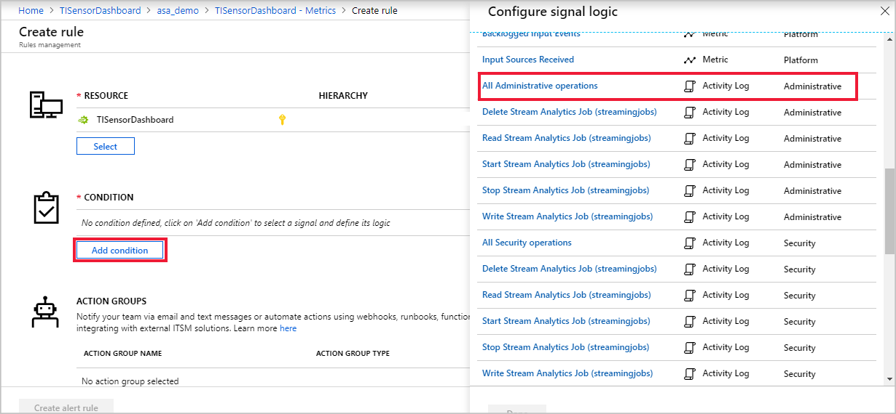
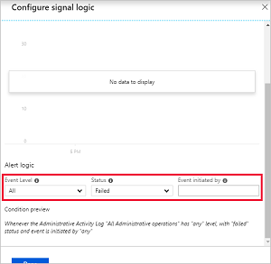
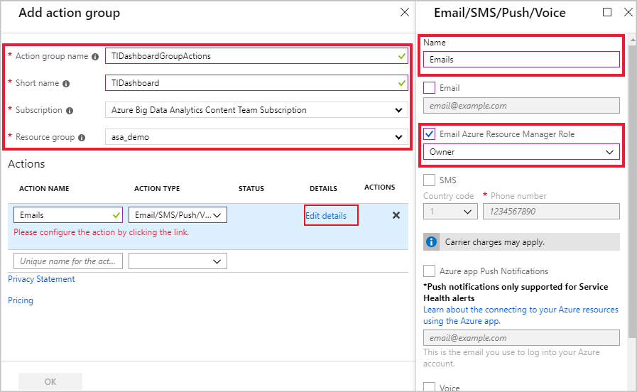
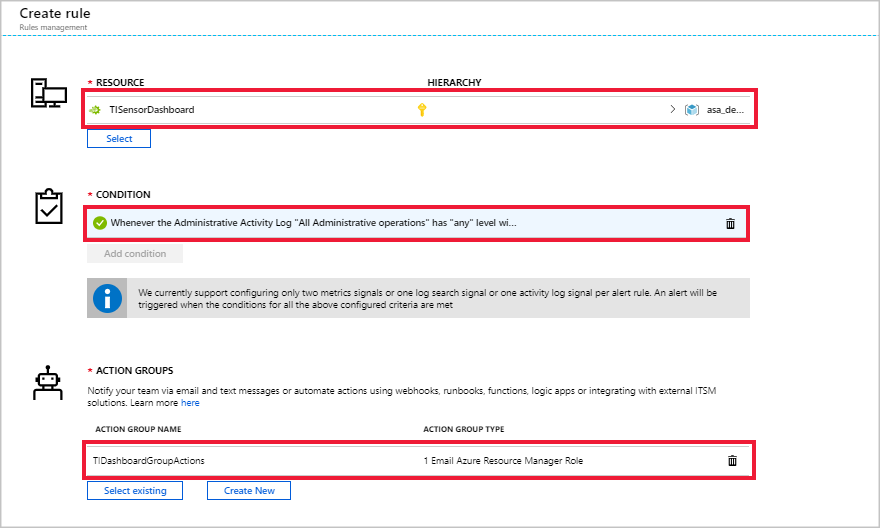
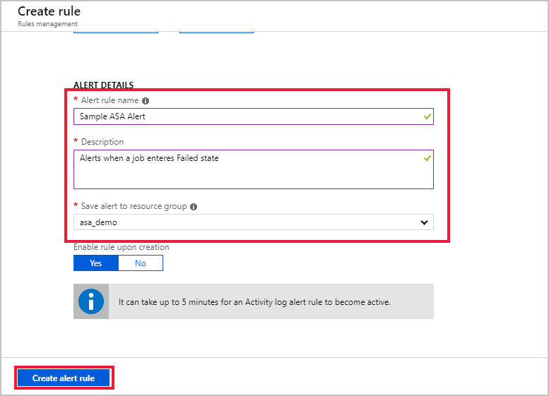

# Set up alerts for Azure Stream Analytics jobs

It's important to monitor your Azure Stream Analytics job to ensure the job is running continuously without any problems. This article describes how to set up alerts for common scenarios that should be monitored. 

You can define rules on metrics from Operation Logs data through the portal, as well as [programmatically](https://code.msdn.microsoft.com/windowsazure/Receive-Email-Notifications-199e2c9a).

## Set up alerts in the Azure portal
### Get alerted when a job stops unexpectedly

The following example demonstrates how to set up alerts for when your job enters a failed state. This alert is recommended for all jobs.

1. In the Azure portal, open the Stream Analytics job you want to create an alert for.

2. On the **Job** page, navigate to the **Monitoring** section.  

3. Select **Metrics**, and then **New alert rule**.

     

4. Your Stream Analytics job name should automatically appear under **RESOURCE**. Click **Add condition**, and select **All Administrative operations** under **Configure signal logic**.

     

5. Under **Configure signal logic**, change **Event Level** to **All** and change **Status** to **Failed**. Leave **Event initiated by** blank and select **Done**.

    

6. Select an existing action group or create a new group. In this example, a new action group called **TIDashboardGroupActions** was created with an **Emails** action that sends an email to users with the **Owner** Azure Resource Manager Role.

   

7. The **RESOURCE**, **CONDITION**, and **ACTION GROUPS** should each have an entry. Note that in order for the alerts to fire, the conditions defined need to be met. For example, you can measure a metric's average value of over the last 15 minutes, every 5 minutes.

   

   Add an **Alert rule name**, **Description**, and your **Resource Group** to the **ALERT DETAILS** and click **Create alert rule** to create the rule for your Stream Analytics job.

   
   
## Scenarios to monitor

The following alerts are recommended for monitoring the performance of your Stream Analytics job. These metrics should be evaluated every minute over the last 5-minute period.

|Metric|Condition|Time Aggregation|Threshold|Corrective Actions|
|-|-|-|-|-|
|SU% Utilization|Greater than|Maximum|80|There are multiple factors that increase SU% Utilization. You can scale with query parallelization or increase the number of streaming units. For more information, see [Leverage query parallelization in Azure Stream Analytics](stream-analytics-parallelization.md).|
|Runtime errors|Greater than|Total|0|Examine the activity or resource logs and make appropriate changes to the inputs, query, or outputs.|
|Watermark delay|Greater than|Maximum|When average value of this metric over the last 15 minutes is greater than late arrival tolerance (in seconds). If you have not modified the late arrival tolerance, the default is set to 5 seconds.|Try increasing the number of SUs or parallelizing your query. For more information on SUs, see [Understand and adjust Streaming Units](stream-analytics-streaming-unit-consumption.md#how-many-sus-are-required-for-a-job). For more information on parallelizing your query, see [Leverage query parallelization in Azure Stream Analytics](stream-analytics-parallelization.md).|
|Input deserialization errors|Greater than|Total|0|Examine the activity or resource logs and make appropriate changes to the input. For more information on resource logs, see [Troubleshoot Azure Stream Analytics using resource logs](stream-analytics-job-diagnostic-logs.md)|

## Get help

For more detail on configuring alerts in the Azure portal, see [Receive alert notifications](../azure-monitor/platform/alerts-overview.md).  

For further assistance, try our [Microsoft Q&A question page for Azure Stream Analytics](https://docs.microsoft.com/answers/topics/azure-stream-analytics.html).

## Next steps
* [Introduction to Azure Stream Analytics](stream-analytics-introduction.md)
* [Get started using Azure Stream Analytics](stream-analytics-get-started.md)
* [Scale Azure Stream Analytics jobs](stream-analytics-scale-jobs.md)
* [Azure Stream Analytics Query Language Reference](https://docs.microsoft.com/stream-analytics-query/stream-analytics-query-language-reference)
* [Azure Stream Analytics Management REST API Reference](https://msdn.microsoft.com/library/azure/dn835031.aspx)

