# Azure Stream Analytics solution patterns

Like many other services in Azure, Stream Analytics is best used with other services to create a larger end-to-end solution. This article discusses simple Azure Stream Analytics solutions and various architectural patterns. You can build on these patterns to develop more complex solutions. The patterns described in this article can be used in a wide variety of scenarios. Examples of scenario-specific patterns are available on [Azure solution architectures](https://azure.microsoft.com/solutions/architecture/?product=stream-analytics).

## Create a Stream Analytics job to power real-time dashboarding experience

With Azure Stream Analytics, you can quickly stand up real-time dashboards and alerts. A simple solution ingests events from Event Hubs or IoT Hub, and [feeds the Power BI dashboard with a streaming data set](/power-bi/service-real-time-streaming). For more information, see the detailed tutorial [Analyze phone call data with Stream Analytics and visualize results in Power BI dashboard](stream-analytics-manage-job.md).

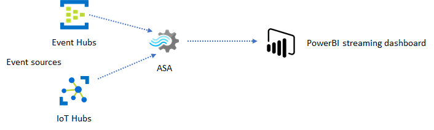

This solution can be built in just a few minutes from Azure portal. There is no extensive coding involved, and SQL language is used to express the business logic.

This solution pattern offers the lowest latency from the event source to the Power BI dashboard in a browser. Azure Stream Analytics is the only Azure service with this built-in capability.

## Use SQL for dashboard

The Power BI dashboard offers low latency, but it cannot be used to produce full fledged Power BI reports. A common reporting pattern is to output your data to a SQL database first. Then use Power BI's SQL connector to query SQL for the latest data.

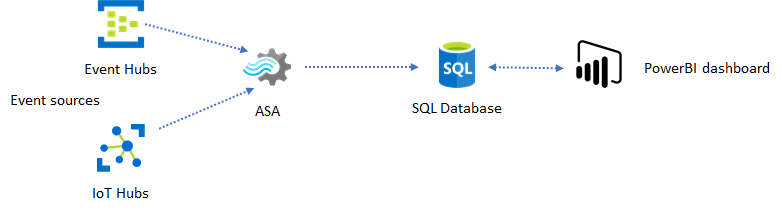

Using SQL database gives you more flexibility but at the expense of a slightly higher latency. This solution is optimal for jobs with latency requirements greater than one second. With this method, you can maximize Power BI capabilities to further slice and dice the data for reports, and much more visualization options. You also gain the flexibility of using other dashboard solutions, such as Tableau.

SQL is not a high throughput data store. The maximum throughput to a SQL database from Azure Stream Analytics is currently around 24 MB/s. If the event sources in your solution produce data at a higher rate, you need to use processing logic in Stream Analytics to reduce the output rate to SQL. Techniques such as filtering, windowed aggregates, pattern matching with temporal joins, and analytic functions can be used. The output rate to SQL can be further optimized using techniques described in [Azure Stream Analytics output to Azure SQL Database](stream-analytics-sql-output-perf.md).

## Incorporate real-time insights into your application with event messaging

The second most popular use of Stream Analytics is to generate real-time alerts. In this solution pattern, business logic in Stream Analytics can be used to detect [temporal and spatial patterns](stream-analytics-geospatial-functions.md) or [anomalies](stream-analytics-machine-learning-anomaly-detection.md), then produce alerting signals. However, unlike the dashboard solution where Stream Analytics uses Power BI as a preferred endpoint, a number of intermediate data sinks can be used. These sinks include Event Hubs, Service Bus, and Azure Functions. You, as the application builder, need to decide which data sink works best for your scenario.

Downstream event consumer logic must be implemented to generate alerts in your existing business workflow. Because you can implement custom logic in Azure Functions, Azure Functions is the fastest way you can perform this integration. A tutorial for using Azure Function as the output for a Stream Analytics job can be found in [Run Azure Functions from Azure Stream Analytics jobs](stream-analytics-with-azure-functions.md). Azure Functions also supports various types of notifications including text and email. Logic App may also be used for such integration, with Event Hubs between Stream Analytics and Logic App.

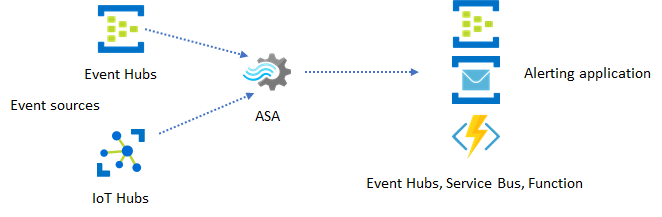

Event Hubs, on the other hand, offers the most flexible integration point. Many other services, like Azure Data Explorer and Time Series Insights can consume events from Event Hubs. Services can be connected directly to the Event Hubs sink from Azure Stream Analytics to complete the solution. Event Hubs is also the highest throughput messaging broker available on Azure for such integration scenarios.

## Dynamic applications and websites

You can create custom real-time visualizations, such as dashboard or map visualization, using Azure Stream Analytics and Azure SignalR Service. Using SignalR, web clients can be updated and show dynamic content in real-time.

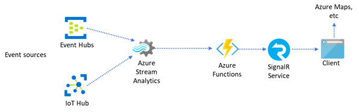

## Incorporate real-time insights into your application through data stores

Most web services and web applications today use a request/response pattern to serve the presentation layer. The request/response pattern is simple to build and can be easily scaled with low response time using a stateless frontend and scalable stores, like Cosmos DB.

High data volume often creates performance bottlenecks in a CRUD-based system. The [event sourcing solution pattern](/azure/architecture/patterns/event-sourcing) is used to address the performance bottlenecks. Temporal patterns and insights are also difficult and inefficient to extract from a traditional data store. Modern high-volume data driven applications often adopt a dataflow-based architecture. Azure Stream Analytics as the compute engine for data in motion is a linchpin in that architecture.

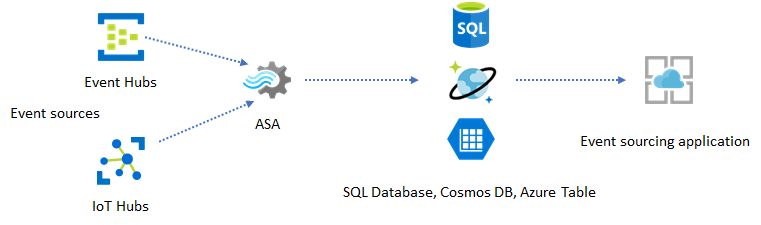

In this solution pattern, events are processed and aggregated into data stores by Azure Stream Analytics. The application layer interacts with data stores using the traditional request/response pattern. Because of Stream Analytics' ability to process a large number of events in real-time, the application is highly scalable without the need to bulk up the data store layer. The data store layer is essentially a materialized view in the system. [Azure Stream Analytics output to Azure Cosmos DB](stream-analytics-documentdb-output.md) describes how Cosmos DB is used as a Stream Analytics output.

In real applications where processing logic is complex and there is the need to upgrade certain parts of the logic independently, multiple Stream Analytics jobs can be composed together with Event Hubs as the intermediary event broker.

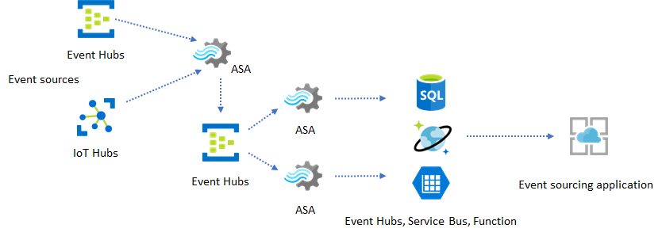

This pattern improves the resiliency and manageability of the system. However, even though Stream Analytics guarantees exactly once processing, there is a small chance that duplicate events may land in the intermediary Event Hubs. It's important for the downstream Stream Analytics job to dedupe events using logic keys in a lookback window. For more information on event delivery, see [Event Delivery Guarantees](/stream-analytics-query/event-delivery-guarantees-azure-stream-analytics) reference.

## Use reference data for application customization

The Azure Stream Analytics reference data feature is designed specifically for end-user customization like alerting threshold, processing rules, and [geofences](geospatial-scenarios.md). The application layer can accept parameter changes and store them in a SQL database. The Stream Analytics job periodically queries for changes from the database and makes the customization parameters accessible through a reference data join. For more information on how to use reference data for application customization, see [SQL reference data](sql-reference-data.md) and [reference data join](/stream-analytics-query/reference-data-join-azure-stream-analytics).

This pattern can also be used to implement a rules engine where the thresholds of the rules are defined from reference data. For more information on rules, see [Process configurable threshold-based rules in Azure Stream Analytics](stream-analytics-threshold-based-rules.md).

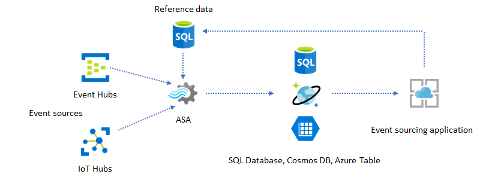

## Add Machine Learning to your real-time insights

Azure Stream Analytics' built-in [Anomaly Detection model](stream-analytics-machine-learning-anomaly-detection.md) is a convenient way to introduce Machine Learning to your real-time application. For a wider range of Machine Learning needs, see [Azure Stream Analytics integrates with Azure Machine Learning's scoring service](stream-analytics-machine-learning-integration-tutorial.md).

For advanced users who want to incorporate online training and scoring into the same Stream Analytics pipeline, see this example of how do that with [linear regression](stream-analytics-high-frequency-trading.md).

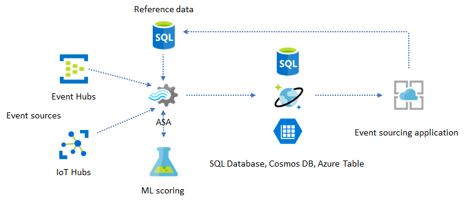

## Near real-time data warehousing

Another common pattern is real-time data warehousing, also called streaming data warehouse. In addition to events arriving at Event Hubs and IoT Hub from your application, [Azure Stream Analytics running on IoT Edge](stream-analytics-edge.md) can be used to fulfill data cleansing, data reduction, and data store and forward needs. Stream Analytics running on IoT Edge can gracefully handle bandwidth limitation and connectivity issues in the system. The SQL output adapter can be used to output to SQL Data Warehouse; however, the maximum throughput is limited to 10 MB/s.

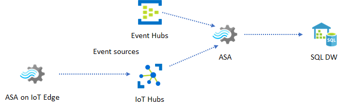

One way to improve the throughput with some latency tradeoff is to archive the events into Azure Blob storage, and then [import them into SQL Data Warehouse with Polybase](../synapse-analytics/sql-data-warehouse/load-data-from-azure-blob-storage-using-polybase.md). You must manually stitch together output from Stream Analytics to blob storage and input from blob storage to SQL Data Warehouse by [archiving the data by timestamp](stream-analytics-custom-path-patterns-blob-storage-output.md) and importing periodically.

In this usage pattern, Azure Stream Analytics is used as a near real-time ETL engine. Newly arriving events are continuously transformed and stored for downstream analytics service consumption.

## Archiving real-time data for analytics

Most data science and analytics activities still happen offline. Data can be archived by Azure Stream Analytics through Azure Data Lake Store Gen2 output and Parquet output formats. This capability removes the friction to feed data directly into Azure Data Lake Analytics, Azure Databricks, and Azure HDInsight. Azure Stream Analytics is used as a near real-time ETL engine in this solution. You can explore archived data in Data Lake using various compute engines.

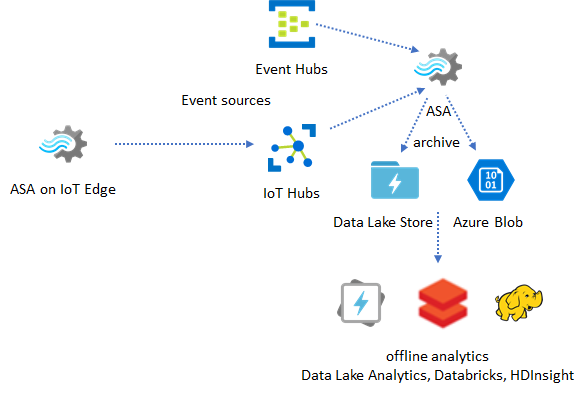

## Use reference data for enrichment

Data enrichment is often a requirement for ETL engines. Azure Stream Analytics supports data enrichment with [reference data](stream-analytics-use-reference-data.md) from both SQL database and Azure Blob storage. Data enrichment can be done for data landing in both Azure Data Lake and SQL Data Warehouse.

## Operationalize insights from archived data

If you combine the offline analytics pattern with the near real-time application pattern, you can create a feedback loop. The feedback loop lets the application automatically adjust for changing patterns in the data. This feedback loop can be as simple as changing the threshold value for alerting, or as complex as retraining Machine Learning models. The same solution architecture can be applied to both ASA jobs running in the cloud and on IoT Edge.

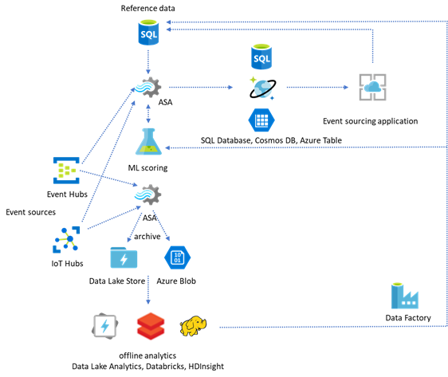

## How to monitor ASA jobs

An Azure Stream Analytics job can be run 24/7 to process incoming events continuously in real time. Its uptime guarantee is crucial to the health of the overall application. While Stream Analytics is the only streaming analytics service in the industry that offers a  [99.9% availability guarantee](https://azure.microsoft.com/support/legal/sla/stream-analytics/v1_0/), you may still incur some level of down time. Over the years, Stream Analytics has introduced metrics, logs, and job states to reflect the health of the jobs. All of them are surfaced through Azure Monitor service and can be further exported to OMS. For more information, see [Understand Stream Analytics job monitoring and how to monitor queries](stream-analytics-monitoring.md).

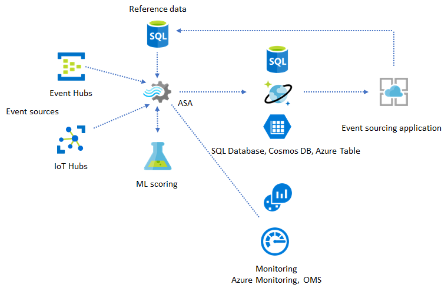

There are two key things to monitor:

- [Job failed state](job-states.md)

    First and foremost, you need to make sure the job is running. Without the job in the running state, no new metrics or logs are generated. Jobs can change to a failed state for various reasons, including having a high SU utilization level (i.e., running out of resources).

- [Watermark delay metrics](https://azure.microsoft.com/blog/new-metric-in-azure-stream-analytics-tracks-latency-of-your-streaming-pipeline/)

    This metric reflects how far behind your processing pipeline is in wall clock time (seconds). Some of the delay is attributed to the inherent processing logic. As a result, monitoring the increasing trend is much more important than monitoring the absolute value. The steady state delay should be addressed by your application design, not by monitoring or alerts.

Upon failure, activity logs and [diagnostics logs](stream-analytics-job-diagnostic-logs.md) are the best places to begin looking for errors.

## Build resilient and mission critical applications

Regardless of Azure Stream Analytics' SLA guarantee and how careful you run your end-to-end application, outages happen. If your application is mission critical, you need to be prepared for outages in order to recover gracefully.

For alerting applications, the most important thing is to detect the next alert. You may choose to restart the job from the current time when recovering, ignoring past alerts. The job start time semantics are by the first output time, not the first input time. The input is rewound backwards an appropriate amount of time to guarantee the first output at the specified time is complete and correct. You won't get partial aggregates and trigger alerts unexpectedly as a result.

You may also choose to start output from some amount of time in the past. Both Event Hubs and IoT Hub's retention policies hold a reasonable amount of data to allow processing from the past. The tradeoff is how fast you can catch up to the current time and start to generate timely new alerts. Data loses its value rapidly over time, so it's important to catch up to the current time quickly. There are two ways to catch up quickly:

- Provision more resources (SU) when catching up.
- Restart from current time.

Restarting from current the time is simple to do, with the tradeoff of leaving a gap during processing. Restarting this way might be OK for alerting scenarios, but can be problematic for dashboard scenarios and is a non-starter for archiving and data warehousing scenarios.

Provisioning more resources can speed up the process, but the effect of having a processing rate surge is complex.

- Test that your job is scalable to a larger number of SUs. Not all queries are scalable. You need to make sure your query is [parallelized](stream-analytics-parallelization.md).

- Make sure there are enough partitions in the upstream Event Hubs or IoT Hub that you can add more Throughput Units (TUs) to scale the input throughput. Remember, each Event Hubs TU maxes out at an output rate of 2 MB/s.

- Make sure you have provisioned enough resources in the output sinks (i.e., SQL Database, Cosmos DB), so they don't throttle the surge in output, which can sometimes cause the system to lock up.

The most important thing is to anticipate the processing rate change, test these scenarios before going into production, and be ready to scale the processing correctly during failure recovery time.

In the extreme scenario that incoming events are all delayed, [it's possible all the delayed events are dropped](stream-analytics-time-handling.md) if you have applied a late arriving window to your job. The dropping of the events may appear to be a mysterious behavior at the beginning; however, considering Stream Analytics is a real-time processing engine, it expects incoming events to be close to the wall clock time. It has to drop events that violate these constraints.

### Lambda Architectures or Backfill process

Fortunately, the previous data archiving pattern can be used to process these late events gracefully. The idea is that the archiving job processes incoming events in arrival time and archives events into the right time bucket in Azure Blob or Azure Data Lake Store with their event time. It doesn't matter how late an event arrives, it will never be dropped. It will always land in the right time bucket. During recovery, it's possible to reprocess the archived events and backfill the results to the store of choice. This is similar to how lambda patterns are implemented.

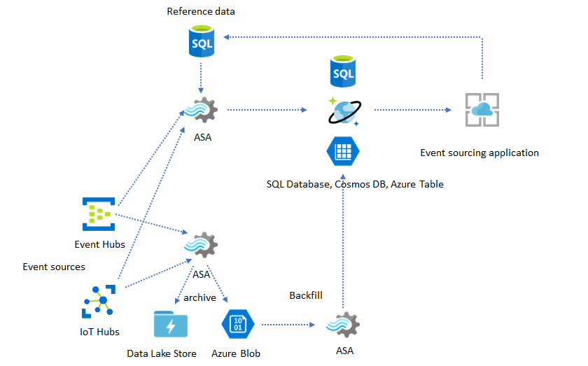

The backfill process has to be done with an offline batch processing system, which most likely has a different programming model than Azure Stream Analytics. This means you have to re-implement the entire processing logic.

For backfilling, it's still important to at least temporarily provision more resource to the output sinks to handle higher throughput than the steady state processing needs.

|Scenarios	|Restart from now only	|Restart from last stopped time	|Restart from now + backfill with archived events|
|---------|---------|---------|---------|
|**Dashboarding**	|Creates gap	|OK for short outage	|Use for long outage |
|**Alerting**	|Acceptable	|OK for short outage	|Not necessary |
|**Event sourcing app**	|Acceptable	|OK for short outage	|Use for long outage |
|**Data warehousing**	|Data loss	|Acceptable	|Not necessary |
|**Offline analytics**	|Data loss	|Acceptable	|Not necessary|

## Putting it all together

It's not hard to imagine that all the solution patterns mentioned above can be combined together in a complex end-to-end system. The combined system can include dashboards, alerting, event sourcing application, data warehousing, and offline analytics capabilities.

The key is to design your system in composable patterns, so each subsystem can be built, tested, upgraded, and recover independently.

## Next steps

You now have seen a variety of solution patterns using Azure Stream Analytics. Next, you can dive deep and create your first Stream Analytics job:

* [Create a Stream Analytics job by using the Azure portal](stream-analytics-quick-create-portal.md).
* [Create a Stream Analytics job by using Azure PowerShell](stream-analytics-quick-create-powershell.md).
* [Create a Stream Analytics job by using Visual Studio](stream-analytics-quick-create-vs.md).
