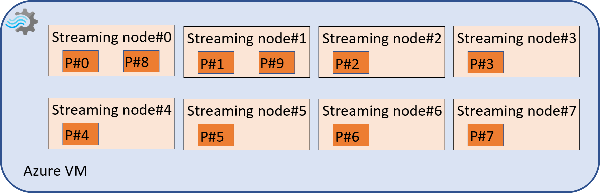

# Azure Stream Analytics streaming units and streaming node

There are some documents available already to describe the streaming units (SUs), such as: [Streaming Units in Azure Stream Analytics](./stream-analytics-streaming-unit-consumption.md) and [Scaling up and out in Azure Stream Analytics jobs](./stream-analytics-scale-jobs.md). There's relationship between streaming units assigned to a job and the streaming node behind.

## Embarrassingly parallel job with partitions evenly distributed across nodes

It's recommended to have stream analytics job to process the similar amount of input data in each of its streaming nodes and make sure each streaming node’s resource utilization (CPU or memory) is in the reasonable range (CPU < 80%, SU < 80%). To achieve this, you'll need to:
1. Partition your input data into several partitions equally in input source, say 10 partitions from event hub.  
2. Decide how many partitions one streaming node should handle as a starting point, say one streaming node to handle two partitions data that means you'll need 10/2 = 5 streaming nodes  
3. Calculate how many SUs you should assign to your job based on the partition counts above, say 5 x 6 = 30 SUs based on “one streaming node needs 6 SUs”.
4. Adjust the initial SUs assigned based on the metrics data with dimension.

With 30 SUs assigned, your job should be an “embarrassingly-parallel” job (or full-parallel) now. 

After starting your “embarrassingly-parallel” job, you can check the CPU or memory utilization in its streaming node dimension in tools, for example, the “CPU % Utilization” with “Split by Node Name” in Azure portal monitoring page. If each of them isn't in the reasonable range, you can consider increasing the SU to 30 x 2 = 60 (that is, 10 x 6 SU = 60 SUs) to have one streaming node to handle one partition data to reduce the amount of data in each streaming node.  

If you still see the high CPU or memory usage in each node after having one streaming node to process one partition data, your job may reach the max input load that one node can process. To further improve this situation, you can repartition your input data into more partitions to have each partition carrying less data than before, then increase the SUs to have more streaming nodes to process these partitions with one streaming node to handle one partition still

## Parallel job with partitions uneven distributed

There's another case that different streaming nodes are handling different number of partitions. For example, in the above case, if 48 SUs are assigned to that job (that is, 48 / 6 = 8 streaming nodes), there will be two streaming nodes are handling four partitions (each of them is handling two partitions) and another six streaming nodes are handling the rest 6 partitions (each of them is handling one partition). This is also a parallel job, but not perfectly as two streaming nodes will work harder than the other six streaming nodes.

## Next steps

* [Analyze job with metric dimensions](./stream-analytics-job-analysis-with-metric-dimensions.md)
* [Understand job monitoring in Azure Stream Analytics](./stream-analytics-monitoring.md)
* [Azure Stream Analytics metrics dimensions](./stream-analytics-job-metrics-dimensions.md)