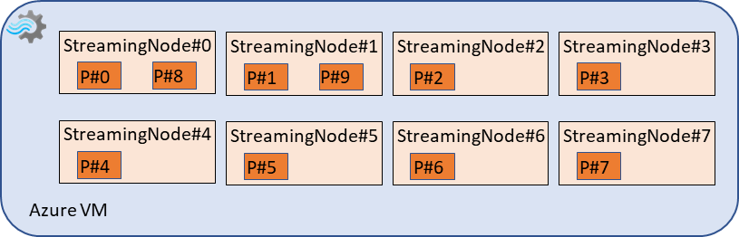

# Streaming Units and Streaming Node

There are some documents available already to describe the Streaming Units (SUs), such as: [Streaming Units in Azure Stream Analytics](./stream-analytics-streaming-unit-consumption.md) and [Scaling up and out in Azure Stream Analytics jobs](./stream-analytics/stream-analytics-scale-jobs.md). There is relationship between Streaming Units assigned to a job and the Streaming Node behind.

## Computation resources of given SUs

Normally, 6 SUs is mapping to 1 Streaming Node computation resource. In the above documents, it is also recommended to use 1 SU, 3 SUs for a small job. In this case, 1 Streaming Node will also be provisioned for this small job. But the corresponding computation resource allocated to this Streaming Node will be relatively smaller than the normal streaming node.

So, if your job requires SUs more than 6 SUs, you will need to assign the SUs with 6 x n (n > 1), such as: 12 SUs, 18 SUs, 24 SUs, etc. so that the corresponding Streaming Nodes could be allocated for your job.

## “Embarrassingly-Parallel” job

It is recommended to have stream  analytics job to process the similar amount of input data in each of its streaming nodes and make sure each streaming node’s resource utilization (CPU or memory) is in the reasonable range (CPU < 80%, SU < 80%). To achieve this, you will need to:
-	Partition your input data into several partitions equally in input source, says 10 partitions from event hub.  
-	Decide how many partitions one streaming node should handle as a starting point, says 1 streaming node to handle 2 partitions data which means you will need 10/2 = 5 streaming nodes  
-	Calculate how many SUs you should assign to your job based on the partition counts above, says 5 x 6 = 30 SUs based on “one streaming node needs 6 SUs”.
-	Adjust the initial SUs assigned based on the metrics data with dimension.

With 30 SUs assigned, your job should be an “embarrassingly-parallel” job (or perfectly parallel) now. Sometimes, we also call it fully-parallel job.

After starting your “embarrassingly-parallel” job, you can check the CPU or memory utilization in its streaming node dimension in tools, e.g., the “CPU % Utilization” with “Split by Node Name” in Azure portal monitoring page. If each of them is not in the reasonable range, you can consider increasing the SU to 30 x 2 = 60 (i.e., 10 x 6 SU = 60 SUs) to have one streaming node to handle one partition data to reduce the amount of data in each streaming node.  

If you still see the high CPU or memory usage in each node after having one streaming node to process one partition data, your job may reach the max input load that one node can process. To further improve this situation, you can re-partition your input data into more partitions to have each partition carrying less data than before, then increase the SUs to have more streaming nodes to process these partitions with one streaming node to handle one partition still

## ““Partially-parallel” job with partitions uneven distributed

There is another case that different streaming nodes are handling different number of partitions. For example, in the above case, if 48 SUs are assigned to that job (i.e., 48 / 6 = 8 streaming nodes), there will be 2 streaming nod   es are handling 4 partitions (each of them is handling 2 partitions) and another 6 streaming nodes are handling the rest 6 partitions (each of them is handling 1 partition). This is also a “fully-parallel” job, but not so perfectly as 2 streaming nodes will work harder than the other 6 streaming nodes.

## Next steps

* [Analyze job with metric dimensions](./stream-analytics-job-analysis-with-metric-dimensions.md)
* [Understand job monitoring in Azure Stream Analytics](./stream-analytics-monitoring.md)
* [Azure Stream Analytics metrics dimensions](./stream-analytics-job-metrics-dimensions.md)