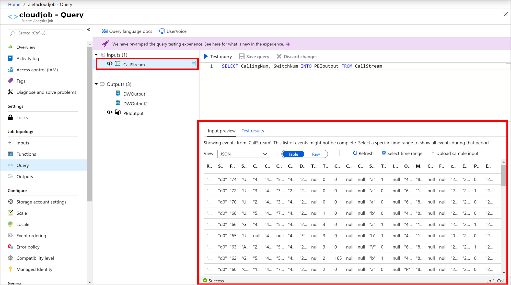
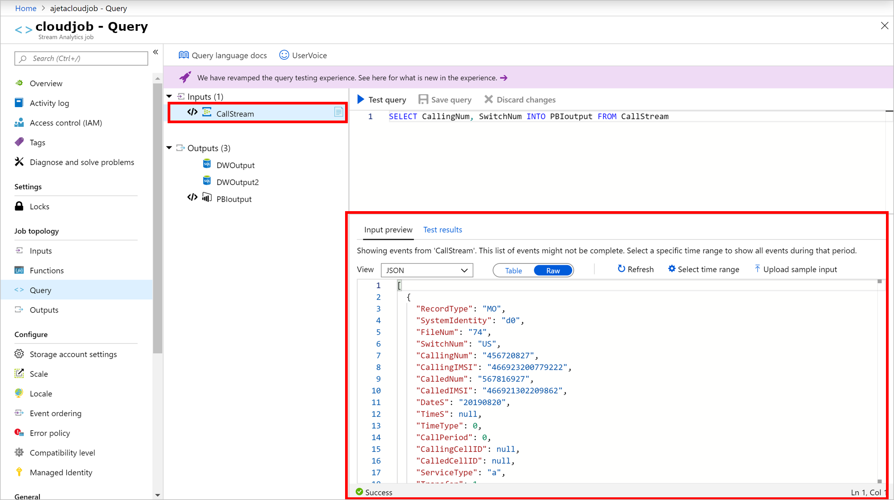
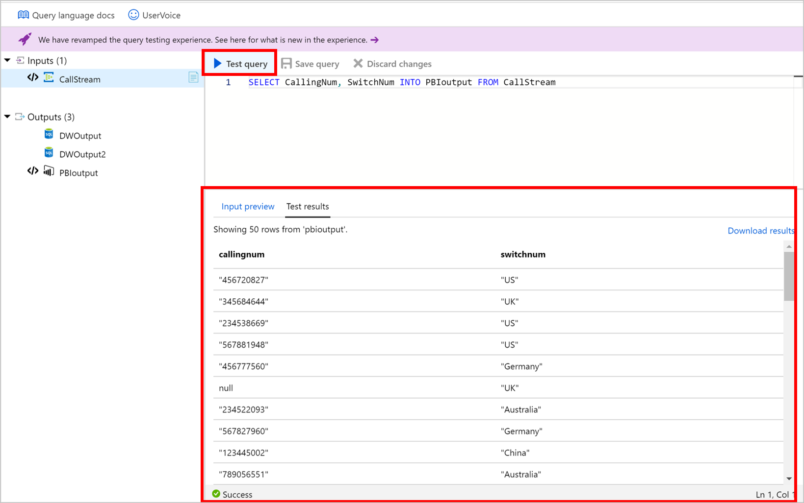
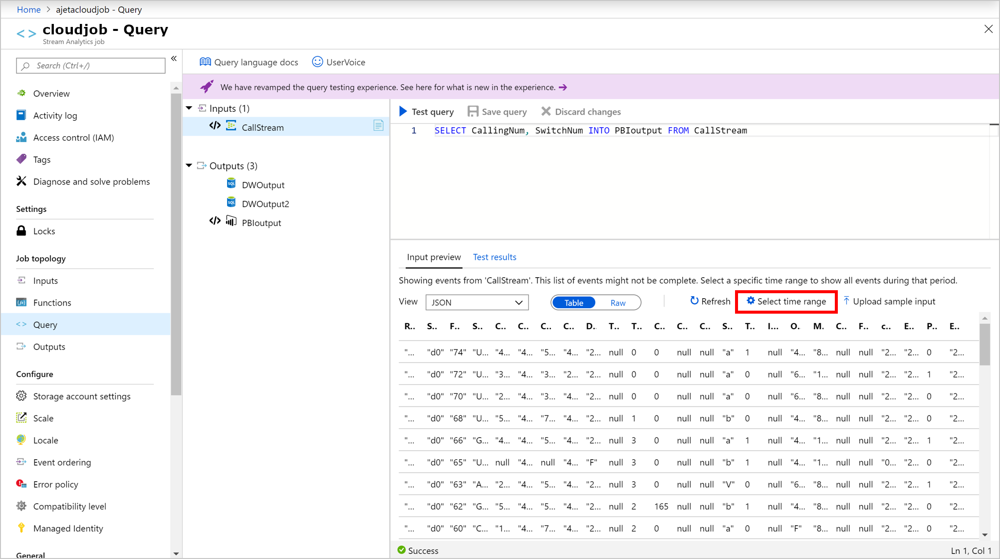
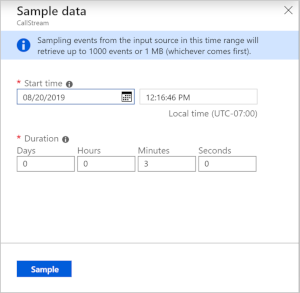
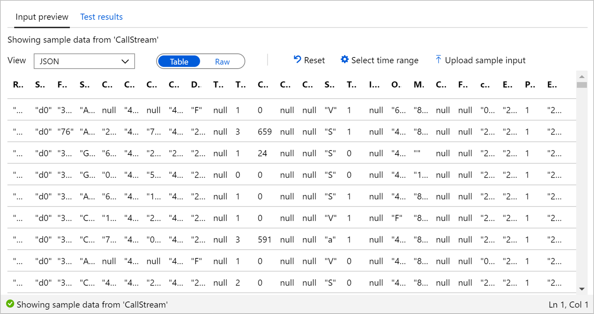
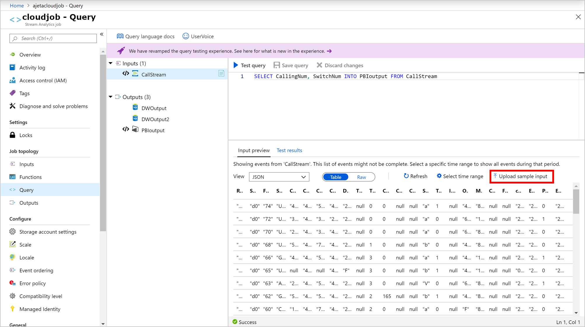
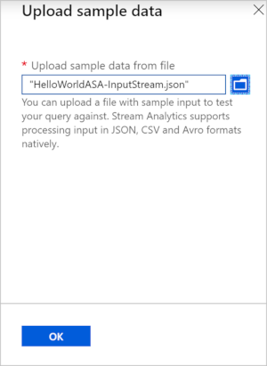
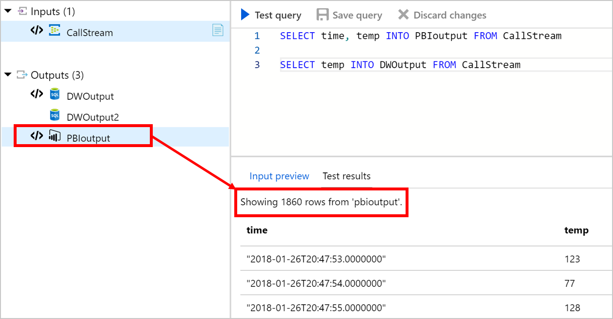

# Test an Azure Stream Analytics job in the portal

In Azure Stream Analytics, you can test your query without starting or stopping your job. You can test queries on incoming data from your streaming sources or upload sample data from a local file on Azure Portal. You can also test queries locally from your local sample data or live data in [Visual Studio](stream-analytics-live-data-local-testing.md) and [Visual Studio Code](visual-studio-code-local-run-live-input.md).

## Automatically sample incoming data from input

Azure Stream Analytics automatically fetches events from your streaming inputs. You can run queries on the default sample or set a specific time frame for the sample.

1. Sign in to the Azure portal.

2. Locate and select your existing Stream Analytics job.

3. On the Stream Analytics job page, under the **Job Topology** heading, select **Query** to open the Query editor window. 

4. To see a sample list of incoming events, select the input with file icon and the sample events will automatically appear in the **Input preview**.

   a. The serialization type for your data is automatically detected if its JSON or CSV. You can manually change it as well to JSON, CSV, AVRO by changing the option in the dropdown menu.
    
   b. Use the selector to view your data in **Table** or **Raw** format.
    
   c. If your data shown isn't current, select **Refresh** to see the latest events.

   The following table is an example of data in the **Table format**:

   

   The following table is an example of data in the **Raw format**:

   

5. To test your query with incoming data, select **Test query**. Results appear in the **Test results** tab. You can also select **Download results** to download the results.

   

6. To test your query against a specific time range of incoming events, select **Select time range**.
   
   

7. Set the time range of the events you want to use to test your query and select **Sample**. Within that time frame, you can retrieve up to 1000 events or 1 MB, whichever comes first.

   

8. Once the events are sampled for selected time range, they appear in the **Input preview** tab.

   

9. Select **Reset** to see the sample list of incoming events. If you select **Reset**, your time range selection will be lost. Select **Test query** to test your query and review the results in the **Test results** tab.

10.	When you make changes to your query, select **Save query** to test the new query logic. This allows you to iteratively modify your query and test it again to see how the output changes.

11.	After you verify the results shown in the browser, you're ready to **Start** the job.

## Upload sample data from a local file

Instead of using live data, you can use sample data from a local file to test your Azure Stream Analytics query.

1. Sign in to the Azure portal.
   
2. Locate your existing Stream Analytics job and select it.

3. On the Stream Analytics job page, under the **Job Topology** heading, select **Query** to open the Query editor window.

4. To test your query with a local file, select **Upload sample input** on the **Input preview** tab. 

   

5. Upload your local file to test the query. You can only upload files with the JSON, CSV, or AVRO formats. Select **OK**.

   

6. As soon as you upload the file, you can also see the file contents in the form as a table or in it's raw format. If you select **Reset**, the sample data will return to the incoming input data explained in the previous section. You can upload any other file to test the query at any time.

7. Select **Test query** to test your query against the uploaded sample file.

8. Test results are shown based on your query. You can change your query and select **Save query** to test the new query logic. This allows you to iteratively modify your query and test it again to see how the output changes.

9. When you use multiple outputs in the query, the results are shown based on selected output. 

   

10. After you verify the results shown in the browser, you can **Start** the job.

## Next steps
* [Build an IoT solution by using Stream Analytics](https://docs.microsoft.com/azure/stream-analytics/stream-analytics-build-an-iot-solution-using-stream-analytics): this tutorial will guide you to build an end-to-end solution with a data generator that will simulate traffic at a toll booth.

* [Azure Stream Analytics Query Language Reference](https://docs.microsoft.com/stream-analytics-query/stream-analytics-query-language-reference)

* [Query examples for common Stream Analytics usage patterns](stream-analytics-stream-analytics-query-patterns.md)

* [Understand inputs for Azure Stream Analytics](stream-analytics-add-inputs.md)

* [Understand outputs from Azure Stream Analytics](stream-analytics-define-outputs.md)
