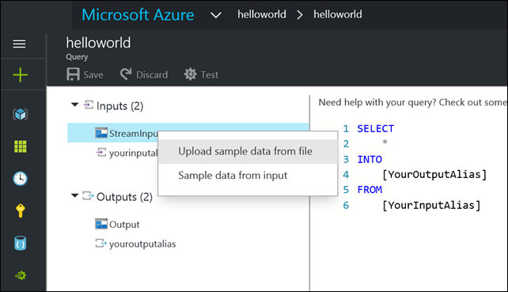
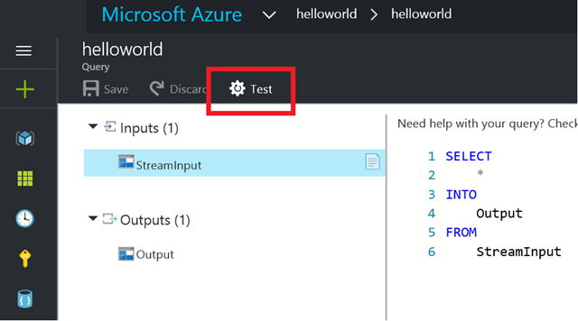
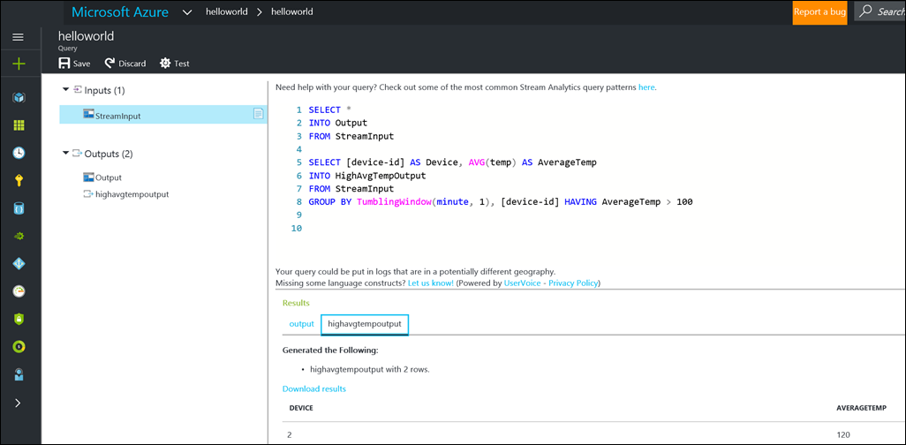

# Test a Stream Analytics query with sample data

By using Azure Stream Analytics, you can sample data from inputs or upload sample data to test queries in the Azure portal without starting or stopping a job.

## Upload or sample data from a live source to test the query

1. Sign in to the Azure portal. 

2. Locate your existing Stream Analytics job and select it.

3. On the Stream Analytics job page, under the **Job Topology** heading, select **Query** to open the Query editor window. 

4. To test your query you can then either sample data from a live input, or upload from a file. The data must be serialized in JSON, CSV or AVRO. Sample input must be encoded in UTF-8 and not compressed. Only comma (,) delimiter is supported for testing CSV input on portal.

    1. Using live input: right-click on any of your inputs. Then select **Sample data from input**. In the next screen, you can set the duration of the sample. Sampling events from a live source will retrieve up to 1000 events or 1 MB (whichever comes first), so the data sampled may not represent the full time interval specified.

    1. Using file: right-click on any of your inputs. Then select **Upload sample data from file**. 

    

5. After the sampling or upload is complete, select **Test** to test this query against the sample data you have provided.

    

6. If you need the test output for later use, the output of your query is displayed in the browser with a link to the download results. 

7. Iteratively modify your query and test it again to see how the output changes.

   

   When you use multiple outputs in a query, the results are shown on separate tabs, and you can easily toggle between them.

8. After you verify the results shown in the browser, **Save** your query. Then **Start** the job, and let it process the incoming events.

## Next steps
> [!div class="nextstepaction"]
> [Azure Stream Analytics Query Language Reference](https://docs.microsoft.com/stream-analytics-query/stream-analytics-query-language-reference)
