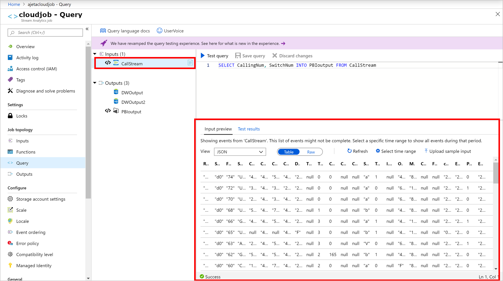
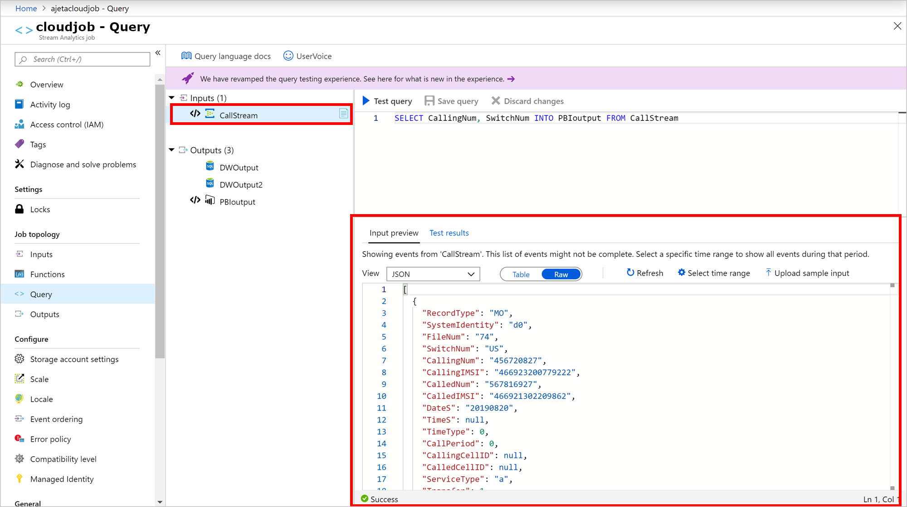
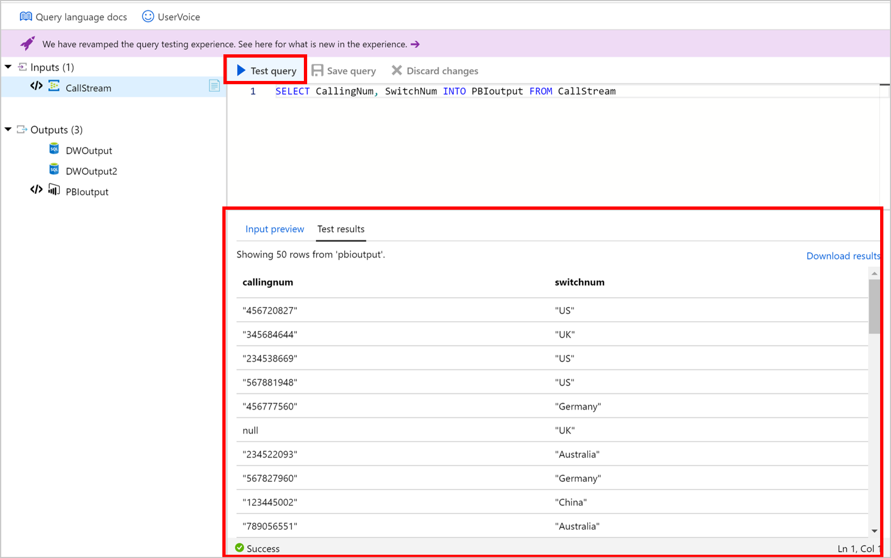
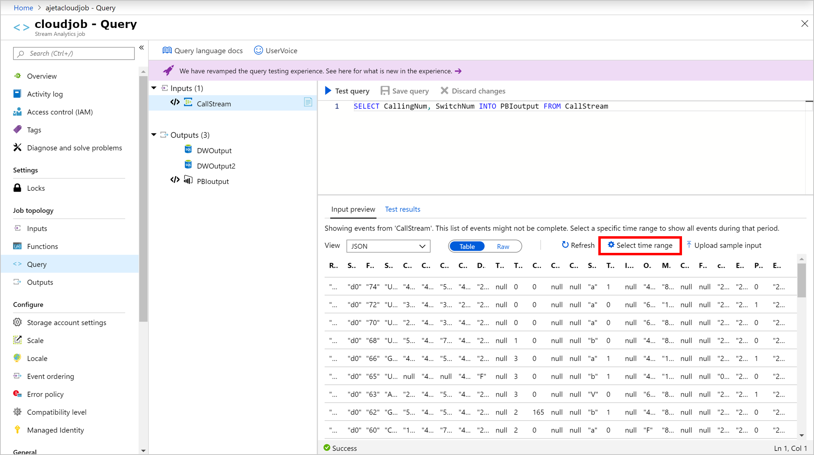
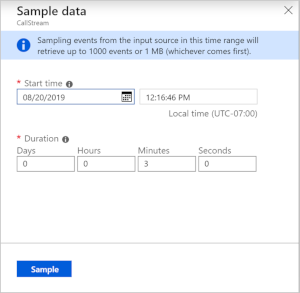
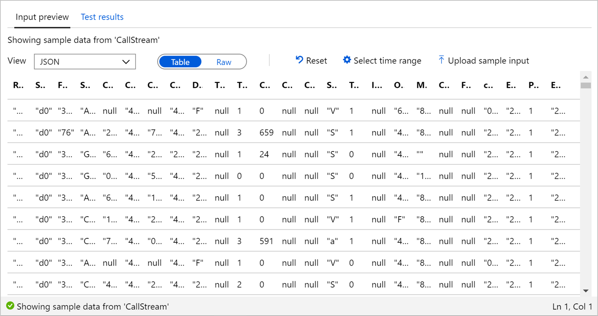
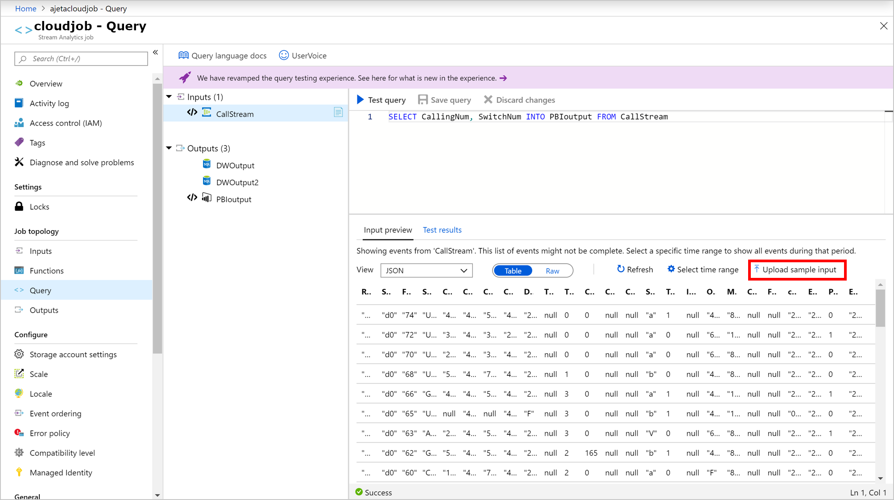
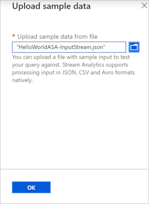
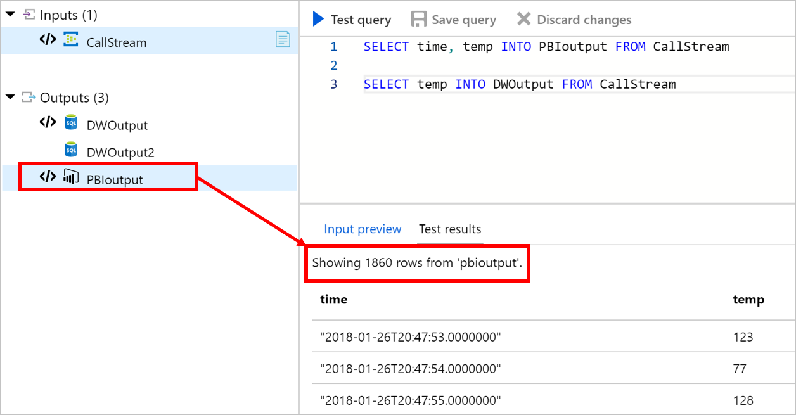

# Test an Azure Stream Analytics job in the portal

In Azure Stream Analytics, you can test your query without starting or stopping your job. You can test queries on incoming data from your streaming sources or upload sample data from a local file on the Azure portal. You can also test queries locally from your local sample data or live data in [Visual Studio](stream-analytics-live-data-local-testing.md) and [Visual Studio Code](visual-studio-code-local-run-live-input.md).

## Automatically sample incoming data from input

Azure Stream Analytics automatically fetches events from your streaming inputs. You can run queries on the default sample or set a specific time frame for the sample.

1. Sign in to the Azure portal.

2. Locate and select your existing Stream Analytics job.

3. On the Stream Analytics job page, under the **Job Topology** heading, select **Query** to open the Query editor window. 

4. To see a sample list of incoming events, select the input with the file icon. The sample events automatically appear in **Input preview**.

   a. The serialization type for your data is automatically detected if it's JSON or CSV. You can manually change it to JSON, CSV, or AVRO by selecting the option in the dropdown menu.
    
   b. Use the selector to view your data in **Table** or **Raw** format.
    
   c. If your data isn't current, select **Refresh** to see the latest events.

   The following table is an example of data in the **Table format**:

   

   The following table is an example of data in the **Raw format**:

   

5. To test your query with incoming data, select **Test query**. Results appear in the **Test results** tab. You can also select **Download results** to download the results.

   

6. To test your query against a specific time range of incoming events, select **Select time range**.
   
   

7. Set the time range of the events you want to use to test your query, and then select **Sample**. Within that time frame, you can retrieve up to 1,000 events or 1 MB, whichever comes first.

   

8. After the events are sampled for the selected time range, they appear in the **Input preview** tab.

   

9. Select **Reset** to see the sample list of incoming events. If you select **Reset**, your time range selection will be lost. Select **Test query** to test your query and review the results in the **Test results** tab.

10. When you make changes to your query, select **Save query** to test the new query logic. This process allows you to iteratively modify your query and test it again to see how the output changes.

11. After you verify the results shown in the browser, you're ready to **Start** the job.

## Upload sample data from a local file

Instead of using live data, you can use sample data from a local file to test your Azure Stream Analytics query.

1. Sign in to the Azure portal.
   
2. Locate your existing Stream Analytics job and select it.

3. On the Stream Analytics job page, under the **Job Topology** heading, select **Query** to open the Query editor window.

4. To test your query with a local file, select **Upload sample input** on the **Input preview** tab. 

   

5. Upload your local file to test the query. You can only upload files with the JSON, CSV, or AVRO formats. Select **OK**.

   

6. After you upload the file, you can see the file contents as a table or in its raw format. If you select **Reset**, the sample data returns to the automatically sampled incoming input data. You can upload any other file to test the query at any time.

7. Select **Test query** to test your query against the uploaded sample file.

8. Test results appear based on your query. You can change your query and select **Save query** to test the new query logic. This process allows you to iteratively modify your query and test it again to see how the output changes.

9. When you use multiple outputs in the query, the results appear based on the selected output. 

   

10. After you verify the results shown in the browser, you can **Start** the job.

## Test query limitations

1. Time policy isn't supported in portal testing:

    * Out-of-order: All incoming events are ordered.
    * Late arrival: There's no late arrival event since Stream Analytics can only use existing data for testing.
   
1. C# UDF isn't supported.

1. All testing runs with a job that has one Streaming Unit.

1. The timeout size is one minute. Any query with a window size greater than one minute can't get any data.

1. Machine learning isn't supported.

1. The sample data API is throttled after five requests in a 15-minute window. After the end of the 15-minute window, you can make more sample data requests. This limitation applies at the subscription level.

## Troubleshoot test query errors

If you get the error "The request size is too big. Please reduce the input data size and try again.", follow these steps:

  * Reduce input size: Test your query with a smaller sample file or with a smaller time range.
  * Reduce query size: To test a selection of query, select a portion of the query, and then select **Test selected query**.

## Related content

* [Build an IoT solution by using Stream Analytics](./stream-analytics-build-an-iot-solution-using-stream-analytics.md)
* [Azure Stream Analytics Query Language Reference](/stream-analytics-query/stream-analytics-query-language-reference)
* [Query examples for common Stream Analytics usage patterns](stream-analytics-stream-analytics-query-patterns.md)
* [Understand inputs for Azure Stream Analytics](stream-analytics-add-inputs.md)
* [Understand outputs from Azure Stream Analytics](stream-analytics-define-outputs.md)
