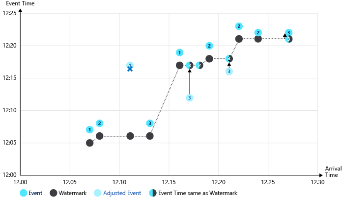

# Understand time handling in Azure Stream Analytics

In this article, you learn how to make design choices to solve practical time handling problems in Azure Stream Analytics jobs. Time handling design decisions are closely related to event ordering factors.

## Background time concepts

To better frame the discussion, let's define some background concepts:

- **Event time**: The time when the original event happened. For example, when a moving car on the highway approaches a toll booth.

- **Processing time**: The time when the event reaches the processing system and is observed. For example, when a toll booth sensor sees the car and the computer system takes a few moments to process the data.

- **Watermark**: An event time marker that indicates up to what point events have been ingressed to the streaming processor. Watermarks let the system indicate clear progress on ingesting the events. By the nature of streams, the incoming event data never stops, so watermarks indicate the progress to a certain point in the stream.

   The watermark concept is important. Watermarks allow Stream Analytics to determine when the system can produce complete, correct, and repeatable results that don’t need to be retracted. The processing can be done in a predictable and repeatable way. For example, if a recount needs to be done for some error handling condition, watermarks are safe starting and ending points.

For additional resources on this subject, see Tyler Akidau's blog posts [Streaming 101](https://www.oreilly.com/ideas/the-world-beyond-batch-streaming-101) and [Streaming 102](https://www.oreilly.com/ideas/the-world-beyond-batch-streaming-102).

## Choose the best starting time

Stream Analytics gives users two choices for picking event time: arrival time and application time.

### Arrival time

Arrival time is assigned at the input source when the event reaches the source. You can access arrival time by using the **EventEnqueuedUtcTime** property for Event Hubs input, the **IoTHub.EnqueuedTime** property for IoT Hub input, and the **BlobProperties.LastModified** property for blob input.

Arrival time is used by default and is best used for data archiving scenarios where temporal logic isn't necessary.

### Application time (also named Event Time)

Application time is assigned when the event is generated, and it's part of the event payload. To process events by application time, use the **Timestamp by** clause in the SELECT query. If **Timestamp by** is absent, events are processed by arrival time.

It's important to use a timestamp in the payload when temporal logic is involved to account for delays in the source system or in the network. The time assigned to an event is available in [SYSTEM.TIMESTAMP](https://docs.microsoft.com/stream-analytics-query/system-timestamp-stream-analytics).

## How time progresses in Azure Stream Analytics

When you use application time, the time progression is based on the incoming events. It's difficult for the stream processing system to know if there are no events, or if events are delayed. For this reason, Azure Stream Analytics generates heuristic watermarks in the following ways for each input partition:

* When there's any incoming event, the watermark is the largest event time Stream Analytics has seen so far minus the out-of-order tolerance window size.

* When there's no incoming event, the watermark is the current estimated arrival time minus the late arrival tolerance window. The estimated arrival time is the time that has elapsed from the last time an input event was seen plus that input event's arrival time.

   The arrival time can only be estimated because the real arrival time is generated on the input event broker, such as Event Hubs, nor on the Azure Stream Analytics VM processing the events.

The design serves two additional purposes other than generating watermarks:

1. The system generates results in a timely fashion with or without incoming events.

   You have control over how timely you want to see the output results. In the Azure portal, on the **Event ordering** page of your Stream Analytics job, you can configure the **Out of order events** setting. When you configure that setting, consider the trade-off of timeliness with tolerance of out-of-order events in the event stream.

   The late arrival tolerance window is necessary to keep generating watermarks, even in the absence of incoming events. At times, there may be a period where no incoming events come in, like when an event input stream is sparse. That problem is exacerbated by the use of multiple partitions in the input event broker.

   Streaming data processing systems without a late arrival tolerance window may suffer from delayed outputs when inputs are sparse and multiple partitions are used.

2. The system behavior needs to be repeatable. Repeatability is an important property of a streaming data processing system.

   The watermark is derived from the arrival time and application time. Both are persisted in the event broker, and thus repeatable. When an arrival time is estimated in the absence of events, Azure Stream Analytics journals the estimated arrival time for repeatability during replay for failure recovery.

When you choose to use **arrival time** as the event time, there you don't need to configure the out-of-order tolerance and late arrival tolerance. Since **arrival time** is guaranteed to be increasing in the input event broker, Azure Stream Analytics simply disregards the configurations.

## Late arriving events

By definition of late arrival tolerance window, for each incoming event, Azure Stream Analytics compares the **event time** with the **arrival time**. If the event time is outside of the tolerance window, you can configure the system to drop the event or adjust the event's time to be within the tolerance.

Once watermarks are generated, the service can potentially receive events with an event time lower than the watermark. You can configure the service to either **drop** those events, or **adjust** the event's time to the watermark value.

As a part of the adjustment, the event's **System.Timestamp** is set to the new value, but the **event time** field itself is not changed. This adjustment is the only situation where an event's **System.Timestamp** can be different from the value in the event time field and may cause unexpected results to be generated.

## Handle time variation with substreams

The heuristic watermark generation mechanism described works well in most of cases where time is mostly synchronized between the various event senders. However, in real life, especially in many IoT scenarios, the system has little control over the clock on the event senders. The event senders could be all sorts of devices in the field, perhaps on different versions of hardware and software.

Instead of using a watermark that is global to all events in an input partition, Stream Analytics has another mechanism called **substreams**. You can utilize substreams in your job by writing a job query that uses the [**TIMESTAMP BY**](/stream-analytics-query/timestamp-by-azure-stream-analytics) clause and the keyword **OVER**. To designate the substream, provide a key column name after the **OVER** keyword, such as a `deviceid`, so that system applies time policies by that column. Each substream gets its own independent watermark. This mechanism is useful to allow timely output generation, when dealing with large clock skews or network delays among event senders.

Substreams are a unique solution provided by Azure Stream Analytics, and are not offered by other streaming data processing systems.

When you use substreams, Stream Analytics applies the late arrival tolerance window to incoming events. The late arrival tolerance decides the maximum amount by which different substreams can be apart from each other. For example, if Device 1 is at Timestamp 1, and Device 2 is at Timestamp 2, the at most late arrival tolerance is  Timestamp 2 minus Timestamp 1. The default setting is 5 seconds and is likely too small for devices with divergent timestamps. We recommend that you start with 5 minutes and make adjustments according to their device clock skew pattern.

## Early arriving events

You may have noticed another concept called early arrival window that looks like the opposite of late arrival tolerance window. This window is fixed at 5 minutes and serves a different purpose from the late arrival tolerance window.

Because Azure Stream Analytics guarantees complete results, you can only specify **job start time** as the first output time of the job, not the input time. The job start time is required so that the complete window is processed, not just from the middle of the window.

Stream Analytics derives the start time from the query specification. However, because the input event broker is only indexed by arrival time, the system has to translate the starting event time to arrival time. The system can start processing events from that point in the input event broker. With the early arriving window limit, the translation is straightforward: starting event time minus the 5-minute early arriving window. This calculation also means that the system drops all events that are seen as having an event time 5 minutes earlier than the arrival time. The [early input events metric](stream-analytics-monitoring.md) is incremented when the events are dropped.

This concept is used to ensure the processing is repeatable no matter where you start to output from. Without such a mechanism, it would not be possible to guarantee repeatability, as many other streaming systems claim they do.

## Side effects of event ordering time tolerances

Stream Analytics jobs have several **Event ordering** options. Two can be configured in the Azure portal: the **Out of order events** setting (out-of-order tolerance), and the **Events that arrive late** setting (late arrival tolerance). The **early arrival** tolerance is fixed and cannot be adjusted. These time policies are used by Stream Analytics to provide strong guarantees. However, these settings do have some sometimes unexpected implications:

1. Accidentally sending events that are too early.

   Early events should not be outputted normally. It's possible that early events are sent to the output if sender’s clock is running too fast though. All early arriving events are dropped, so you will not see any of them from the output.

2. Sending old events to Event Hubs to be processed by Azure Stream Analytics.

   While old events may seem harmless at first, because of the application of the late arrival tolerance, the old events may be dropped. If the events are too old, the **System.Timestamp** value is altered during event ingestion. Due to this behavior, currently Azure Stream Analytics is more suited for near-real-time event processing scenarios, instead of historical event processing scenarios. You can set the **Events that arrive late** time to the largest possible value (20 days) to work around this behavior in some cases.

3. Outputs seem to be delayed.

   The first watermark is generated at the calculated time: the **maximum event time** the system has observed so far, minus the out-of-order tolerance window size. By default, the out-of-order tolerance is configured to zero (00 minutes and 00 seconds). When you set it to a higher, non-zero time value, the streaming job's first output is delayed by that value of time (or greater) due to the first watermark time that is calculated.

4. Inputs are sparse.

   When there is no input in a given partition, the watermark time is calculated as the **arrival time** minus the late arrival tolerance window. As a result, if input events are infrequent and sparse, the output can be delayed by that amount of time. The default **Events that arrive late** value is 5 seconds. You should expect to see some delay when sending input events one at a time, for example. The delays can get worse, when you set **Events that arrive late** window to a large value.

5. **System.Timestamp** value is different from the time in the **event time** field.

   As described previously, the system adjusts event time by the out-of-order tolerance or late arrival tolerance windows. The **System.Timestamp** value of the event is adjusted, but not the **event time** field. This can be used to identify for which events the timestamps adjusted. If the system changed the timestamp due to one of the tolerances, normally they are the same.

## Metrics to observe

You can observe a number of the Event ordering time tolerance effects through [Stream Analytics job metrics](stream-analytics-monitoring.md). The following metrics are relevant:

|Metric  | Description  |
|---------|---------|
| **Out-of-Order Events** | Indicates the number of events received out of order, that were either dropped or given an adjusted timestamp. This metric is directly impacted by the configuration of the **Out of order events** setting on the **Event ordering** page on the job in the Azure portal. |
| **Late Input Events** | Indicates the number of events arriving late from the source. This metric includes events that have been dropped or have had their timestamp was adjusted. This metric is directly impacted by the configuration of the **Events that arrive late** setting in the **Event ordering** page on the job in the Azure portal. |
| **Early Input Events** | Indicates the number of events arriving early from the source that have either been dropped, or their timestamp has been adjusted if they are beyond 5 minutes early. |
| **Watermark Delay** | Indicates the delay of the streaming data processing job. See more information in the following section.|

## Watermark delay details

The **Watermark delay** metric is computed as the wall clock time of the processing node minus the largest watermark it has seen so far. For more information, see the [watermark delay blog post](https://azure.microsoft.com/blog/new-metric-in-azure-stream-analytics-tracks-latency-of-your-streaming-pipeline/).

There can be several reasons this metric value is larger than 0 under normal operation:

1. Inherent processing delay of the streaming pipeline. Normally this delay is nominal.

2. The out-of-order tolerance window introduced delay, because watermark is reduced by the size of the tolerance window.

3. The late arrival window introduced delay, because watermark is reduced by the size the tolerance window.

4. Clock skew of the processing node generating the metric.

There are a number of other resource constraints that can cause the streaming pipeline to slow down. The watermark delay metric can rise due to:

1. Not enough processing resources in Stream Analytics to handle the volume of input events. To scale up resources, see [Understand and adjust Streaming Units](stream-analytics-streaming-unit-consumption.md).

2. Not enough throughput within the input event brokers, so they are throttled. For possible solutions, see [Automatically scale up Azure Event Hubs throughput units](../event-hubs/event-hubs-auto-inflate.md).

3. Output sinks are not provisioned with enough capacity, so they are throttled. The possible solutions vary widely based on the flavor of output service being used.

## Output event frequency

Azure Stream Analytics uses watermark progress as the only trigger to produce output events. Because the watermark is derived from input data, it is repeatable during failure recovery and also in user initiated reprocessing. When using [windowed aggregates](stream-analytics-window-functions.md), the service only produces outputs at the end of the windows. In some cases, users may want to see partial aggregates generated from the windows. Partial aggregates are not supported currently in Azure Stream Analytics.

In other streaming solutions, output events could be materialized at various trigger points, depending on external circumstances. It's possible in some solutions that the output events for a given time window could be generated multiple times. As the input values are refined, the aggregate results become more accurate. Events could be speculated at first, and revised over time. For example, when a certain device is offline from the network, an estimated value could be used by a system. Later on, the same device comes online to the network. Then the actual event data could be included in the input stream. The output results from processing that time window produces more accurate output.

## Illustrated example of watermarks

The following images illustrate how watermarks progress in different circumstances.

This table shows the example data that is charted below. Notice that the event time and the arrival time vary, sometimes matching and sometimes not.

| Event time | Arrival time | DeviceId |
| --- | --- | --- |
| 12:07 | 12:07 | device1
| 12:08 | 12:08 | device2
| 12:17 | 12:11 | device1
| 12:08 | 12:13 | device3
| 12:19 | 12:16 | device1
| 12:12 | 12:17 | device3
| 12:17 | 12:18 | device2
| 12:20 | 12:19 | device2
| 12:16 | 12:21 | device3
| 12:23 | 12:22 | device2
| 12:22 | 12:24 | device2
| 12:21 | 12:27 | device3

In this illustration, the following tolerances are used:

- Early arrival windows is 5 minutes
- Late arriving window is 5 minutes
- Reorder window is 2 minutes

1. Illustration of watermark progressing through these events:

   

   Notable processes illustrated in the preceding graphic:

   1. The first event (device1), and second event (device2) have aligned times and are processed without adjustments. The watermark progresses on each event.

   2. When the third event (device1) is processed, the arrival time (12:11) precedes the event time (12:17). The event arrived 6 minutes early, so the event is dropped due to the 5-minute early arrival tolerance.

      The watermark doesn't progress in this case of an early event.

   3. The fourth event (device3), and fifth event (device1) have aligned times and are processed without adjustment. The watermark progresses on each event.

   4. When the sixth event (device3) is processed, the arrival time (12:17) and the event time (12:12) is below the watermark level. The event time is adjusted to the water mark level (12:17).

   5. When the twelfth event (device3) is processed, the arrival time (12:27) is 6 minutes ahead of the event time (12:21). The late arrival policy is applied. The event time is adjusted (12:22), which is above the watermark (12:21) so no further adjustment is applied.

2. Second illustration of watermark progressing without an early arrival policy:

   

   In this example, no early arrival policy is applied. Outlier events that arrive early raise the watermark significantly. Notice the third event (deviceId1 at time 12:11) is not dropped in this scenario, and the watermark is raised to 12:15. The fourth event time is adjusted forward 7 minutes (12:08 to 12:15) as a result.

3. In the final illustration, substreams are used (OVER the DeviceId). Multiple watermarks are tracked, one per stream. There are fewer events with their times adjusted as a result.

   

## Next steps

- [Azure Stream Analytics event order considerations](stream-analytics-out-of-order-and-late-events.md)
- [Stream Analytics job metrics](stream-analytics-monitoring.md)
