---
title: Deploy an Azure Stream Analytics job with CI/CD using VSTS
description:  This article descriptes how to deploy a Stream Analytics job with CI/CD using VSTS.
services: stream-analytics
author: su-jie
ms.author: sujie
manager: kfile
ms.reviewer: mamccrea
ms.service: stream-analytics
ms.topic: tutorial
ms.date: 4/27/2018
--- 

# Set up the continuous integration and deployment process in VSTS
This tutorial describes how to set up continuous integration and deployment for an Azure Stream Analytics job using Visual Studio Team Services. 

In this tutorial, you learn how to:

> [!div class="checklist"]
> * Add source control to your project
> * Create a build definition in Team Services
> * Create a release definition in Team Services
> * Automatically deploy and upgrade an application


## Prerequisites
Before you start, make sure you have the following:
* If you don't have an Azure subscription, create a [free account](https://azure.microsoft.com/free/?WT.mc_id=A261C142F).
* Install [Visual Studio 2017](https://www.visualstudio.com/) and install the **Azure development** or **Data Storage and Processing** workloads.
* Create a Stream Analytics project in Visual Studio by [following this tutorial](stream-analytics-tools-for-visual-studio.md).
* Create a [Team Services account](https://www.visualstudio.com/docs/setup-admin/team-services/sign-up-for-visual-studio-team-services).

## Configure NuGet package dependency
Add **packages.config** to your solution directory.

       <?xml version="1.0" encoding="utf-8"?>
       <packages>
       <package id="Microsoft.Azure.StreamAnalytics.CICD" version="1.0.0" targetFramework="net452" />
       </packages>


## Share your Visual Studio solution to a new Team Services Git repo
Share your application source files to a team project in Team Services so you can generate builds.  

Create a new local Git repo for your project by selecting **Add to Source Control** -> **Git** on the status bar in the lower right-hand corner of Visual Studio. 

In the **Push** view in **Team Explorer**, select the **Publish Git Repo** button under **Push to Visual Studio Team Services**.
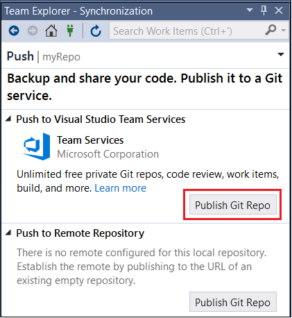

Verify your email and select your account in the **Team Services Domain** drop-down. Enter your repository name and select **Publish repository**.
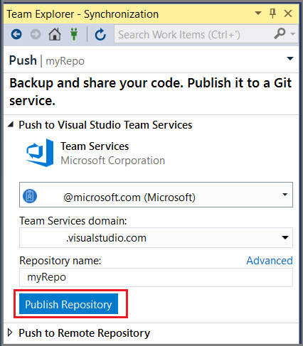

Publishing the repo creates a new team project in your account with the same name as the local repo. To create the repo in an existing team project, click **Advanced** next to **Repository** name and select a team project. You can view your code on the web by selecting **See it on the web**.

## Configure Continuous Delivery with VSTS
A Team Services build definition describes a workflow that is composed of a set of build steps that are executed sequentially. Create a build definition that that produces a Service Fabric application package, and other artifacts, to deploy to a Service Fabric cluster. Learn more about [Team Services build definitions](https://www.visualstudio.com/docs/build/define/create). 

A Team Services release definition describes a workflow that deploys an application package to a cluster. When used together, the build definition and release definition execute the entire workflow starting with source files to ending with a running application in your cluster. Learn more about Team Services [release definitions](https://www.visualstudio.com/docs/release/author-release-definition/more-release-definition).

### Create a build definition
Open a web browser and navigate to your new team project.

1. Select the **Build & Release** tab, then **Builds**, then **+New**.  Select **VSTS Git**.
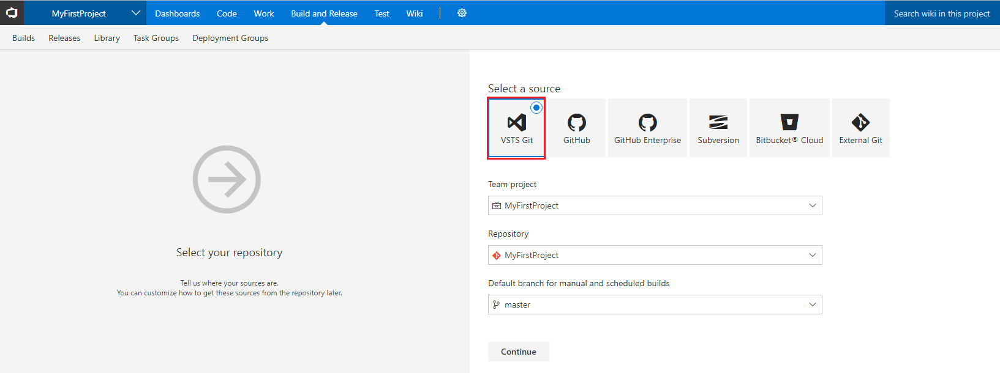

2. In **Select a template**, click **Empty Process** to start with an empty definition. 
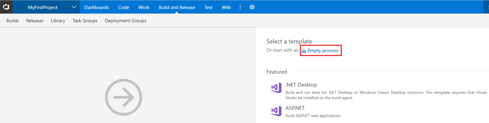 

3. Under **Triggers**, enable continuous integration by setting **Trigger status**.  Select **Save and queue** to manually start a build.  
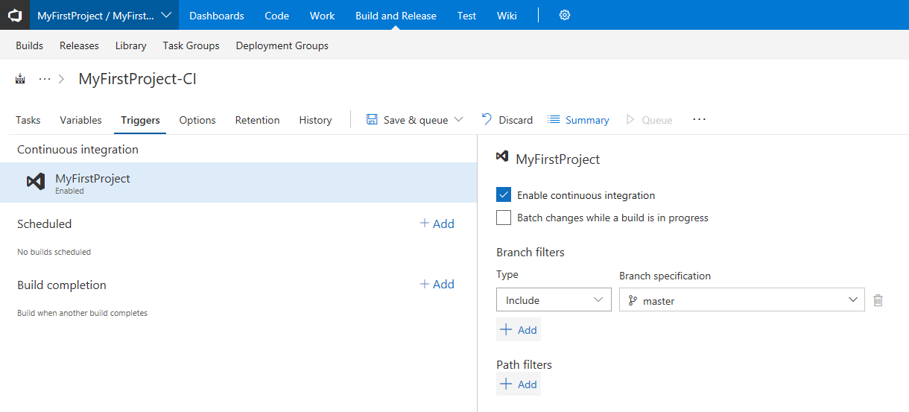 

4. Builds also trigger upon push or check-in. To check your build progress, switch to the **Builds** tab.  Once you verify that the build executes successfully, define a release definition that deploys your application to a cluster. 

3. In **Tasks**, enter "Hosted" as the **Agent queue**. 
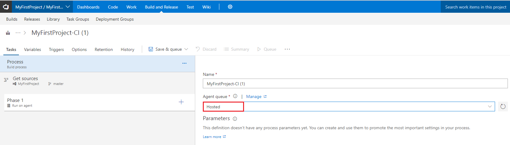 

4. In **Phase 1**, click **+** and add a **NuGet** task.
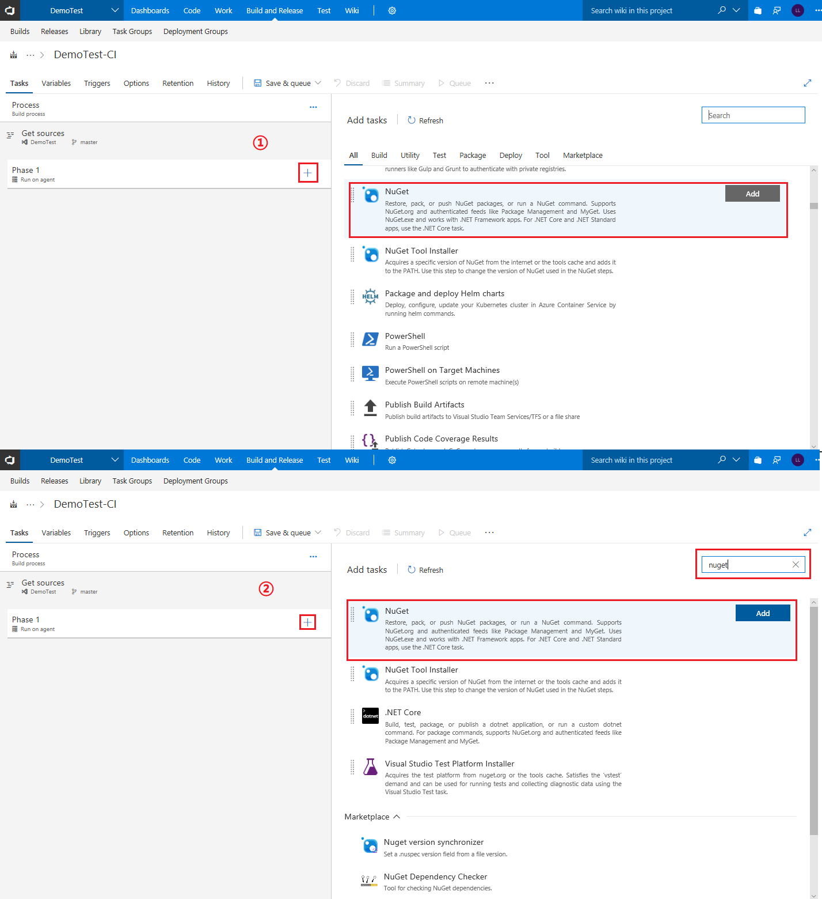 

 

5. In **Phase 1**, click **+** and add a **MSBuild** task.
   Change the **MSBuild Arguments** to the following:

   ```
   /p:CompilerTaskAssemblyFile="Microsoft.WindowsAzure.StreamAnalytics.Common.CompileService.dll"  /p:ASATargetsFilePath="..\Package\build\StreamAnalytics.targets"
   ```
   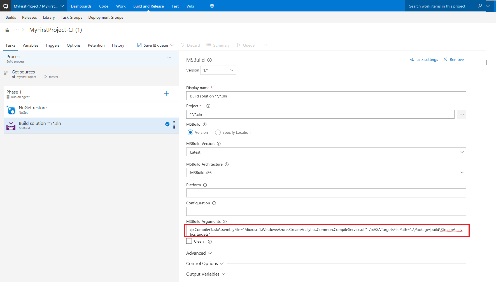 

6. In **Phase 2**, click **+** and add an **Azure Resource Group Deployment** task. 


 * Expand **Azure Details**, choose your subscription.
 * For **Action**, select Create or update resource group.
 * Choose the resource group and location.
 * For **Template**, enter DeployTest\bin\Debug\Deploy\ASADemo2017.JobTemplate.json.
 * For **Template parameters**, enter DeployTest\bin\Debug\Deploy\ASADemo2017.JobTemplate.parameters.json.
 * The content in **Override template parameters** is filled in automatically, you can click “...” to change the values as needed in the pop up window.
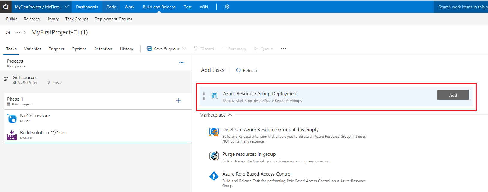
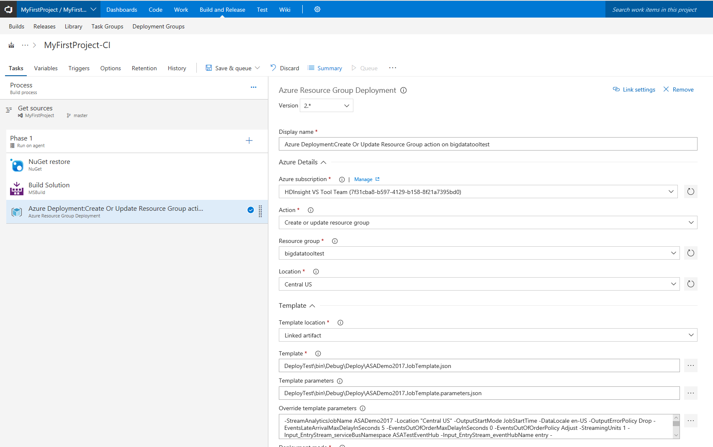


7. Click **Save & Queue** to test it.
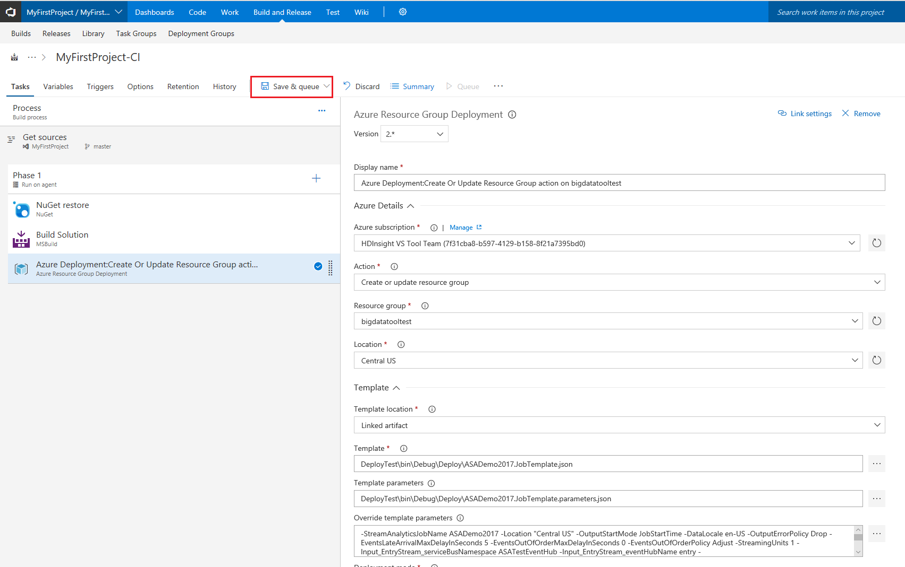


### Commit and push changes, trigger a release
To verify that the continuous integration pipeline is functioning by checking in some code changes to Team Services.    

As you write your code, your changes are automatically tracked by Visual Studio. Commit changes to your local Git repository by selecting the pending changes icon (![Pending][pending]) from the status bar in the bottom right.

On the **Changes** view in Team Explorer, add a message describing your update and commit your changes.

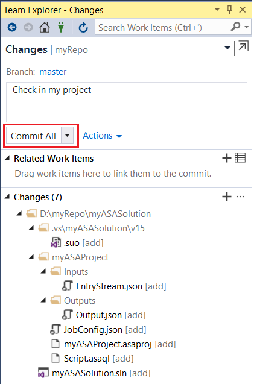

Select the unpublished changes status bar icon (![Unpublished changes][unpublished-changes]) or the Sync view in Team Explorer. Select **Push** to update your code in Team Services/TFS.

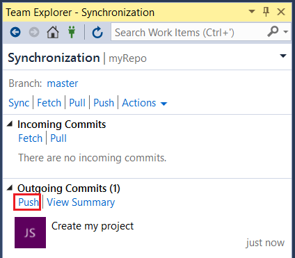

Pushing the changes to Team Services automatically triggers a build.  When the build definition successfully completes, a release is automatically created and starts updating the job on the cluster.


