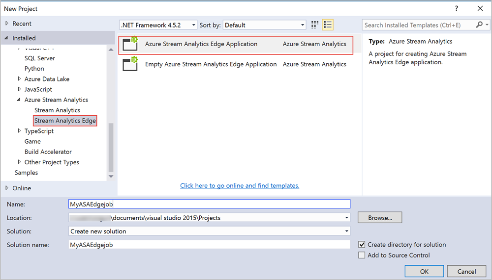
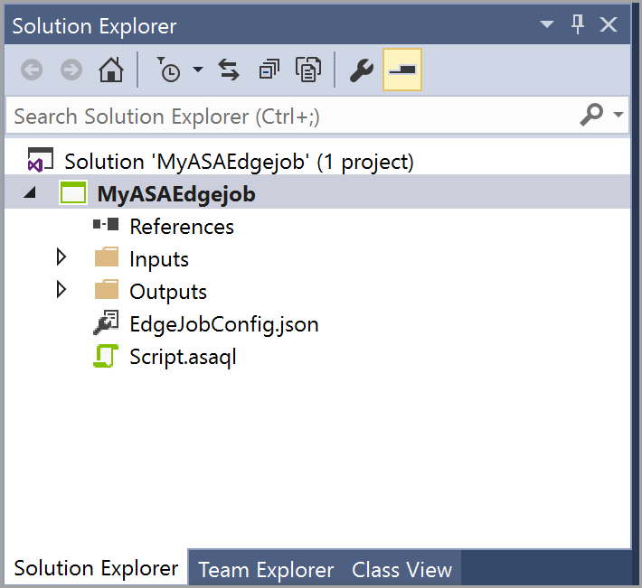
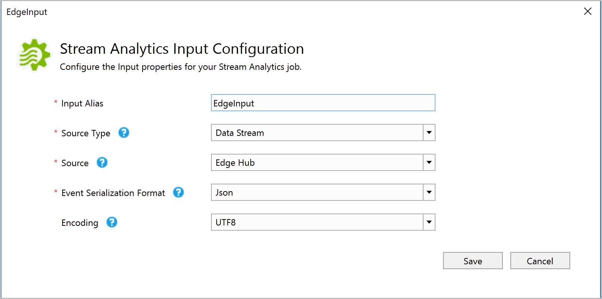
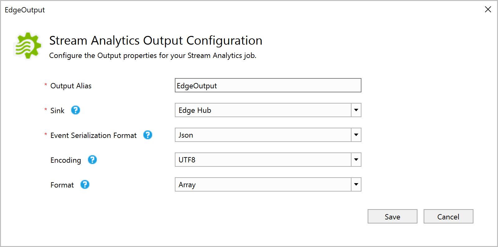
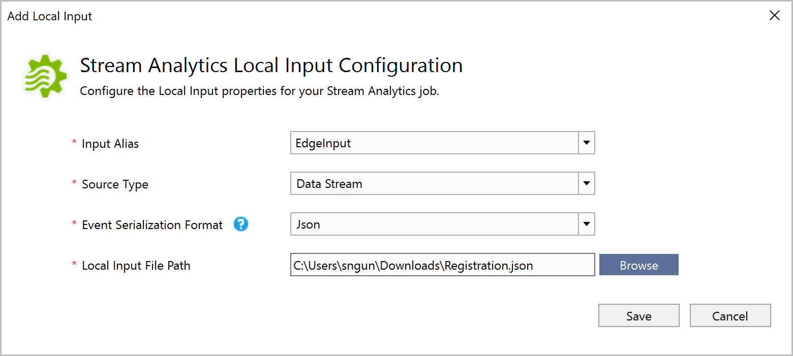
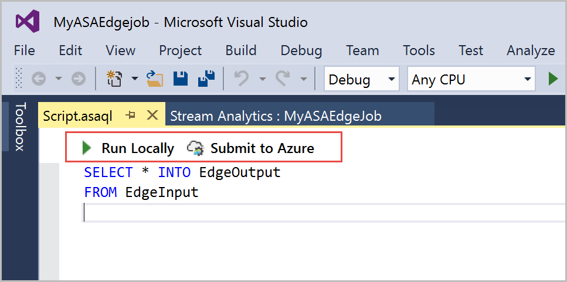
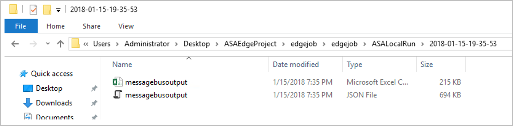
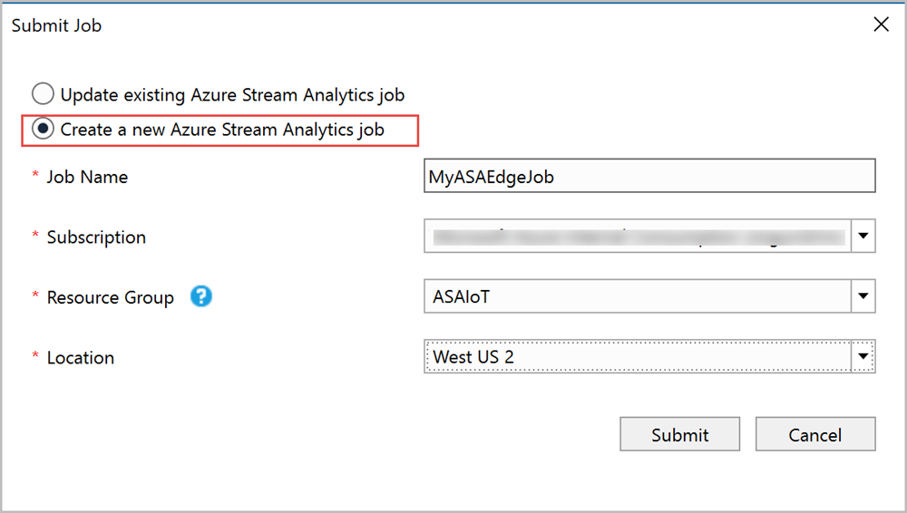
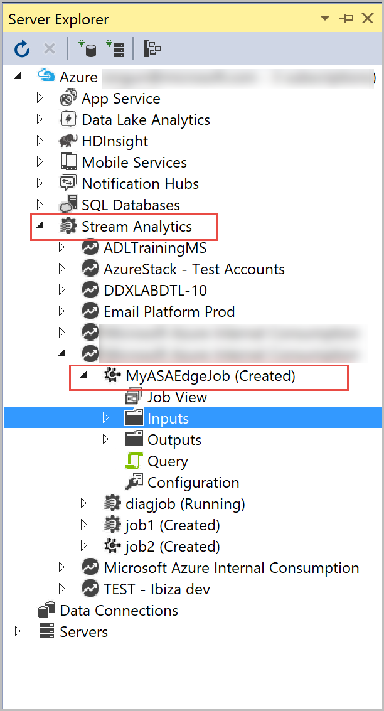
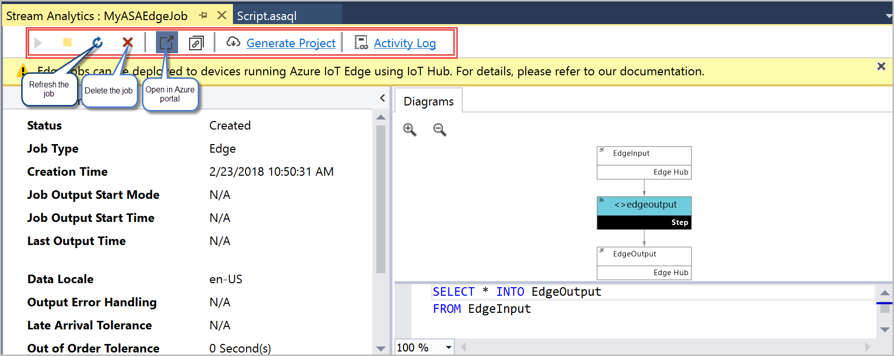

# Develop Stream Analytics Edge jobs using Visual Studio tools

In this tutorial, you learn how to use Stream Analytics tools for Visual Studio. You learn how to author, debug, and create your Stream Analytics Edge jobs. After you create and test the job, you can go to the Azure portal to deploy it to your devices. 

## Prerequisites

You need the following prerequisites to complete this tutorial:

* Install [Visual Studio 2019](https://visualstudio.microsoft.com/downloads/), [Visual Studio 2015](https://www.visualstudio.com/vs/older-downloads/), or [Visual Studio 2013 Update 4](https://www.microsoft.com/download/details.aspx?id=45326). Enterprise (Ultimate/Premium), Professional, and Community editions are supported. Express edition isn't supported.  

* Follow the [installation instructions](stream-analytics-tools-for-visual-studio-edge-jobs.md) to install Stream Analytics tools for Visual Studio.
 
## Create a Stream Analytics Edge project 

From Visual Studio, select **File** > **New** > **Project**. Navigate to the **Templates** list on the left > expand **Azure Stream Analytics** > **Stream Analytics Edge** > **Azure Stream Analytics Edge Application**. Provide a Name, Location, and Solution name for your project and select **OK**.



After the project gets created, navigate to the **Solution Explorer** to view the folder hierarchy.



 
## Choose the correct subscription

1. From your Visual Studio **View** menu, select **Server Explorer**.  

2. Right click on **Azure** > Select **Connect to Microsoft Azure Subscription** > and then sign in with your Azure account.

## Define inputs

1. From the **Solution Explorer**, expand the **Inputs** node you should see an input named **EdgeInput.json**. Double-click to view its settings.  

2. Set Source Type to **Data Stream**. Then set Source to **Edge Hub**, Event Serialization Format to **Json**, and Encoding to **UTF8**. Optionally, you can rename the **Input Alias**, let’s leave it as is for this example. In case you rename the input alias, use the name you specified when defining the query. Select **Save** to save the settings.  
   
 


## Define outputs

1. From the **Solution Explorer**, expand the **Outputs** node you should see an output named **EdgeOutput.json**. Double-click to view its settings.  

2. Make sure to set Sink to select **Edge Hub**, set Event Serialization Format to **Json**, set Encoding to **UTF8**, and set Format **Array**. Optionally, you can rename the **Output Alias**, let’s leave it as is for this example. In case you rename the output alias, use the name you specified when defining the query. Select **Save** to save the settings. 
   
 
## Define the transformation query

Stream Analytics jobs deployed in the Stream Analytics IoT Edge environments support most of [Stream Analytics Query Language reference](https://msdn.microsoft.com/azure/stream-analytics/reference/stream-analytics-query-language-reference?f=255&MSPPError=-2147217396). However, the following operations aren't yet supported for Stream Analytics Edge jobs: 


|**Category**  | **Command**  |
|---------|---------|
|Other operators | <ul><li>PARTITION BY</li><li>TIMESTAMP BY OVER</li><li>JavaScript UDF</li><li>User-defined aggregates (UDA)</li><li>GetMetadataPropertyValue</li><li>Using more than 14 aggregates in a single step</li></ul>   |

When you create a Stream Analytics Edge job in the portal, the compiler will automatically warn you if you aren't using a supported operator.

From your Visual Studio, define the following transformation query in the query editor (**script.asaql file**)

```sql
SELECT * INTO EdgeOutput
FROM EdgeInput 
```

## Test the job locally

To test the query locally, you should upload the sample data. You can get sample data by downloading Registration data from the [GitHub repository](https://github.com/Azure/azure-stream-analytics/blob/master/Sample%20Data/Registration.json) and save it to your local computer. 

1. To upload sample data, right click on **EdgeInput.json** file and choose **Add Local Input**  

2. In the pop-up window > **Browse** the sample data from your local path > Select **Save**.
   
 
3. A file named **local_EdgeInput.json** is added automatically to your inputs folder.  
4. You can either run it locally or submit to Azure. To test the query, select **Run Locally**.  
   
 
5. The command prompt window shows the status of the job. When the job runs successfully, it creates a folder that looks like "2018-02-23-11-31-42" in your project folder path "Visual Studio 2015\Projects\MyASAEdgejob\MyASAEdgejob\ASALocalRun\2018-02-23-11-31-42". Navigate to the folder path to view the results in the local folder:

   You can also sign in to the Azure portal and verify that the job is created. 

   

## Submit the job to Azure

1. Before you submit the job to Azure, you must connect to your Azure Subscription. Open **Server Explorer** > right click on **Azure** > **Connect to Microsoft Azure subscription** > sign in to your Azure subscription.  

2. To submit the job to Azure, navigate to the query editor > select **Submit to Azure**.  

3. A pop-up window opens. Choose to update an existing Stream Analytics Edge job or create a new one. When you update an existing job, it will replace all the job configuration, in this scenario, you'll publish a new job. Select **Create a New Azure Stream Analytics Job** > enter a name for your job something like **MyASAEdgeJob** > choose the required **Subscription**, **Resource Group**, and **Location** > Select **Submit**.

   
 
   Now your Stream Analytics Edge job has been created. You can refer to the [Run jobs on IoT Edge tutorial](stream-analytics-edge.md) to learn how to deploy it to your devices. 

## Manage the job 

You can view the status of job and the job diagram from the Server Explorer. From **Stream Analytics** in **Server Explorer**, expand the subscription and the resource group where you deployed the Stream Analytics Edge job. You can view the MyASAEdgejob with status **Created**. Expand your job node and double-click on it to open the job view.


 
The job view window provides you with operations such as refreshing the job, deleting the job, and opening the job from Azure portal.

 

## Next steps

* [More information on Azure IoT Edge](../iot-edge/about-iot-edge.md)
* [ASA on IoT Edge tutorial](../iot-edge/tutorial-deploy-stream-analytics.md)
* [Send feedback to the team using this survey](https://forms.office.com/Pages/ResponsePage.aspx?id=v4j5cvGGr0GRqy180BHbR2czagZ-i_9Cg6NhAZlH9ypUMjNEM0RDVU9CVTBQWDdYTlk0UDNTTFdUTC4u) 
