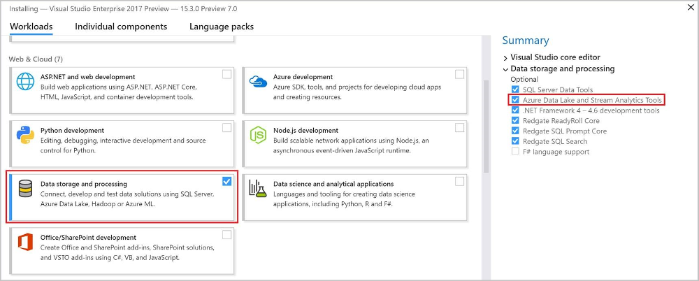
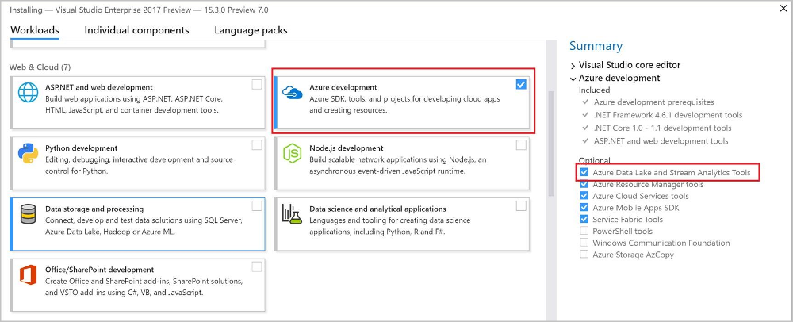
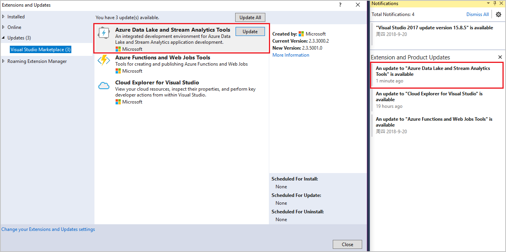

# Install Azure Stream Analytics tools for Visual Studio
Azure Stream Analytics tools support Visual Studio 2017, 2015, and 2013. This article describes how to install and uninstall the tools.

For more information on using the tools, see [Stream Analytics tools for Visual Studio](stream-analytics-quick-create-vs.md).

## Install
### Visual Studio 2017
* Download [Visual Studio 2017 (15.3 or above)](https://www.visualstudio.com/). Enterprise (Ultimate/Premium), Professional, and Community editions are supported. Express edition is not supported. 
* Stream Analytics tools are part of the **Azure development** and **Data storage and processing** workloads in Visual Studio 2017. Enable either one of these two workloads as part of your Visual Studio installation.

Enable the **Data storage and processing** workload as shown:

Enable the **Azure development** workload as shown:

* In the Tools menu, choose **Extensions and Updates**. Find Azure Data Lake and Stream Analytics tools in the installed extensions and click **Update** to install the latest extension. 

### Visual Studio 2013, 2015
* Install Visual Studio 2015 or Visual Studio 2013 Update 4. Enterprise (Ultimate/Premium), Professional, and Community editions are supported. Express edition is not supported. 
* Install the Microsoft Azure SDK for .NET version 2.7.1 or above by using the [Web platform installer](http://www.microsoft.com/web/downloads/platform.aspx).
* Install [Azure Stream Analytics tools for Visual Studio](https://www.microsoft.com/en-us/download/details.aspx?id=49504).

## Update

### Visual Studio 2017
The new version reminder shows up in the Visual Studio notification.

### Visual Studio 2013 and Visual Studio 2015
The installed Stream Analytics tools for Visual Studio check for new versions automatically. Follow the instructions in the pop-up window to install the latest version. 

## Uninstall

### Visual Studio 2017
Double-click the Visual Studio installer, and select **Modify**. Clear the **Azure Data Lake and Stream Analytics Tools** check box from either the **Data storage and processing** workload or the **Azure development** workload.

### Visual Studio 2013 and Visual Studio 2015
Go to Control Panel, and uninstall **Microsoft Azure Data Lake and Stream Analytics tools for Visual Studio**.

