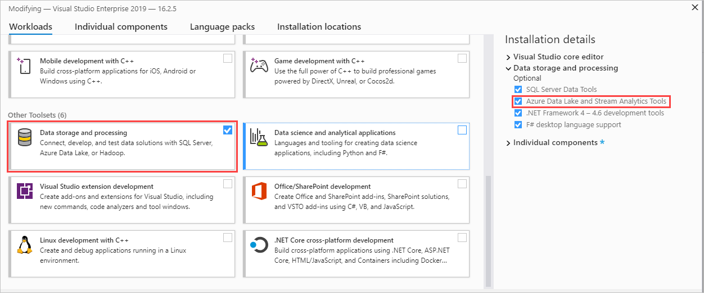
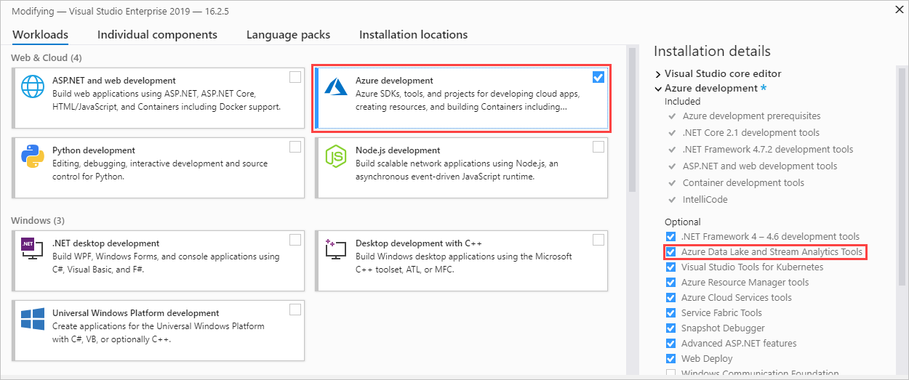
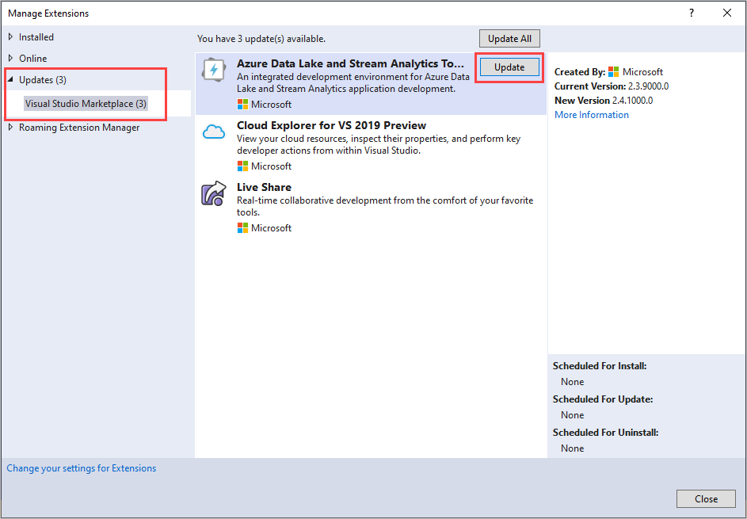

# Install Azure Stream Analytics tools for Visual Studio

Azure Data Lake and Stream Analytics Tools is a Visual Studio extension that you use to author, test, debug, and deploy Azure Stream Analytics jobs from within Visual Studio. When you install the tools, you set up a local development environment so you can build Stream Analytics jobs without switching to the Azure portal.

This article describes how to install and uninstall the tools in Visual Studio 2019 and Visual Studio 2017. For more information on using the tools, see [Quickstart: Create an Azure Stream Analytics job by using Visual Studio](stream-analytics-quick-create-vs.md).

## Supported Visual Studio editions

> [!NOTE]
> For the best local development experience, use [**Stream Analytics tools for Visual Studio Code**](./quick-create-visual-studio-code.md). Stream Analytics tools for Visual Studio 2019 (version 2.6.3000.0) has known feature gaps that won't improve going forward.

Visual Studio Enterprise (Ultimate and Premium), Professional, and Community editions support the tools. Express edition and Visual Studio for Mac don't support them.

Use Visual Studio 2019.

## Install for Visual Studio 2019 and 2017

Azure Data Lake and Stream Analytics Tools are part of the **Azure development** and **Data storage and processing** workloads. Enable either workload during installation. If Visual Studio is already installed, select **Tools** > **Get Tools and Features** to add workloads.

To install the tools:

1. Download [Visual Studio 2019 (Preview 2 or later) or Visual Studio 2017 (15.3 or later)](https://www.visualstudio.com/) and follow the instructions to install.

1. Select the **Data storage and processing** workload:

   

1. Select the **Azure development** workload:

   

After you add the workload, update the tools. This procedure refers to Visual Studio 2019:

1. Select **Extensions** > **Manage Extensions**.

1. In **Manage Extensions**, select **Updates** and choose **Azure Data Lake and Stream Analytics Tools**.

1. Select **Update** to install the latest extension.

   

## Install for Visual Studio 2015 and 2013

Visual Studio Enterprise (Ultimate and Premium), Professional, and Community editions support the tools. Express edition doesn't support them.

To install the tools:

1. Install Visual Studio 2015 or Visual Studio 2013 Update 4.

1. Install the Microsoft Azure SDK for .NET version 2.7.1 or later by using the [Web Platform Installer](https://www.microsoft.com/web/downloads/platform.aspx).

1. Install [Microsoft Azure Data Lake and Stream Analytics Tools for Visual Studio](https://www.microsoft.com/download/details.aspx?id=49504).

## Verify the installation

To confirm that the tools are installed:

1. For Visual Studio 2019 or Visual Studio 2017, select **Extensions** > **Manage Extensions**.

1. Select **Installed** and confirm that **Azure Data Lake and Stream Analytics Tools** appears in the list.

## Update the tools

To update the tools to the latest version:

1. For Visual Studio 2019 and Visual Studio 2017, watch for a new version reminder, which shows up as a Visual Studio notification, and follow it to install the update.

1. For Visual Studio 2015 and Visual Studio 2013, let the tools check for new versions automatically, and then follow the instructions to install the latest version.

## Uninstall from Visual Studio 2019 and 2017

To uninstall Azure Data Lake and Stream Analytics Tools from Visual Studio 2019 or Visual Studio 2017:

1. Select **Tools** > **Get Tools and Features**.

1. In **Modifying**, clear the **Azure Data Lake and Stream Analytics Tools** checkbox. The checkbox appears under either the **Data storage and processing** workload or the **Azure development** workload.

## Uninstall from Visual Studio 2015 and 2013

To uninstall Azure Data Lake and Stream Analytics Tools from Visual Studio 2015 or Visual Studio 2013:

1. Go to **Control Panel** > **Programs and Features**.

1. Uninstall **Microsoft Azure Data Lake and Stream Analytics Tools for Visual Studio**.

## Related content

* [Quickstart: Create an Azure Stream Analytics job by using Visual Studio](stream-analytics-quick-create-vs.md)
* [Quickstart: Create an Azure Stream Analytics job in Visual Studio Code](quick-create-visual-studio-code.md)
