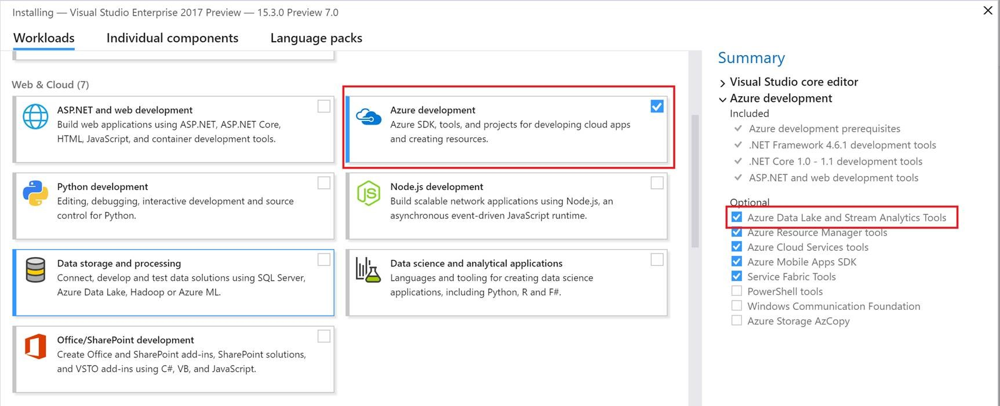

# Installation instructions for Stream Analytics Tools for Visual Studio
Stream Analytics Tools now support Visual Studio 2013, 2015 and 2017. In this document we will introduce how to install and unsintall the tools.

[Learn how to use Stream Analytics Tools for Visual Studio](https://docs.microsoft.com/en-us/azure/stream-analytics/stream-analytics-tools-for-visual-studio)

## Install
### Visual Studio 2017
* Download [Visual Studio 2017 (15.3 or above)](https://www.visualstudio.com/). Enterprise (Ultimate/Premium), Professional, Community editions are supported; Express edition is not supported. 
* Double click the downloaded Visual Studio installer and install Azure Data Lake and Stream Analytics Tools either from **Data Storage and Processing** or **Azure Development workload**.

### Visual Studio 2013, 2015
* Install Visual Studio 2015, Visual Studio 2013 update 4. Enterprise (Ultimate/Premium), Professional, Community editions are supported; Express edition is not supported. 
* Install Microsoft Azure SDK for .NET version 2.7.1 or above using the [Web platform installer](http://www.microsoft.com/web/downloads/platform.aspx).
* Install [Azure Stream Analytics Tools for Visual Studio](http://aka.ms/asatoolsvs).

## Update

### Visual Studio 2017
For now you can go to the [download center](https://www.microsoft.com/en-us/download/details.aspx?id=54630) to download the latest version. In the future we will integrate with Visual Studio 2017 notification framework to notify the update in Visual Studio.

### Visual Studio 2013, 2015
The installed Stream Analytis Tools for Visual Studio check for new versions automatically and you can follow the instructions in the pop up window to install the latest version. 

## Uninstall

### Visual Studio 2017
Double click Visual Studio installer and select **Modify**. Uncheck **Azure Data Lake and Stream Analytics Tools** either from **Data Storage and Processing** or **Azure Development** workload.

### Visual Studio 2013, 2015
Go to control panel and uninstall 'Microsoft Azure Data Lake and Stream Analytics Tools for Visual Studio'.

