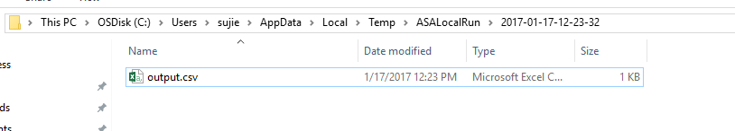

# Use Azure Stream Analytics tools for Visual Studio
Azure Stream Analytics tools for Visual Studio are now generally available. These tools enable a richer experience for Stream Analytics users to troubleshoot as well as write complex queries and even write queries locally. You also can export a Stream Analytics job into a Visual Studio project.

## Introduction
In this tutorial, you learn how to use Stream Analytics tools for Visual Studio to create, author, test locally, manage, and debug your Stream Analytics jobs. 

After completing this tutorial, you will be able to:

* Familiarize yourself with the Stream Analytics tools for Visual Studio.
* Configure and deploy a Stream Analytics job.
* Test your job locally with local sample data.
* Use the monitoring to troubleshoot issues.
* Export existing jobs to projects.

## Prerequisites
You need the following prerequisites to complete this tutorial:

* Finish the steps up to "Create a Stream Analytics job" in the tutorial [Build an IoT solution by using Stream Analytics](https://docs.microsoft.com/azure/stream-analytics/stream-analytics-build-an-iot-solution-using-stream-analytics). 
* Install Visual Studio 2017, Visual Studio 2015, or Visual Studio 2013 Update 4. Enterprise (Ultimate/Premium), Professional, and Community editions are supported. Express edition is not supported. 
* Follow the [installation instructions](https://docs.microsoft.com/en-us/azure/stream-analytics/stream-analytics-tools-for-visual-studio-install) to install Stream Analytics tools for Visual Studio.

## Create a Stream Analytics project
In Visual Studio, select **File** > **New Project**. In the templates list on the left, select **Stream Analytics**, and then select **Azure Stream Analytics Application**.
At the bottom of the page, input the project **Name**, **Location**, and **Solution name** as you do for other projects.

The project **Toll** is generated in **Solution Explorer**.

## Choose the correct subscription
1. On the **View** menu, select **Server Explorer** in Visual Studio.

2. Log in with your Azure account. 

## Define input sources
1. In **Solution Explorer**, expand the **Inputs** node and rename **Input.json** to **EntryStream.json**. Double-click **EntryStream.json**.

2. For **Input Alias**, enter **EntryStream**. Note that the input alias is used in query script.

3. For **Source Type**, select **Data Stream**.

4. For **Source**, select **Event Hub**.

5. For **Service Bus Namespace**, select the **TollData** option in the drop-down list.

6. For **Event Hub name**, select **entry**.

7. For **Event Hub Policy Name**, select **RootManageSharedAccessKey** (the default value).

8. For **Event Serialization Format**, select **Json**, and for **Encoding**, select **UTF8**.
   
   Your settings look like this:
   
   
   
9. At the bottom of the page, select **Save** to finish the wizard. Now you can add another input source to create the exit stream. Right-click the **Inputs** node, and select **New Item**.
   
   
   
10. In the pop-up window, choose **Stream Analytics Input**, and change the **Name** to **ExitStream.json**. Select **Add**.
   
    
   
11. Double-click **ExitStream.json** in the project, and follow the same steps as the entry stream to fill in the fields. For **Event Hub Name**, be sure to enter **exit**, as shown in the following screenshot:
   
    
   
   Now you have defined two input streams.
   
   
   
   Next, you add reference data input for the blob file that contains car registration data.
   
12. Right-click the **Inputs** node in the project, and then follow the same process for the stream inputs. For **Source Type**, select **Reference data**, and for **Input Alias**, enter **Registration**.
   
    
   
13. Select the **Storage** account that contains the option with **TollData**. The container name is **TollData**, and the **Path Pattern** is **registration.json**. This file name is case sensitive and should be lowercase.

14. Select **Save** to finish the wizard.

Now all the inputs are defined.

## Define output
1. In **Solution Explorer**, expand the **Inputs** node and double-click **Output.json**.

2. For **Output Alias**, enter **output**. For **Sink**, select **SQL Database**.

3. For the **Database** name, enter **TollDataDB**.

4. For **User Name**, enter **tolladmin**. For **Password**, enter **123toll!**. For **Table**, enter **TollDataRefJoin**.

5. Select **Save**.

   
 
## Stream Analytics query
This tutorial attempts to answer several business questions that are related to toll data. We constructed queries that can be used in Stream Analytics to provide relevant answers. Before you start your first Stream Analytics job, let's explore a simple scenario and the query syntax.

### Introduction to Stream Analytics query language
Let's say that you need to count the number of vehicles that enter a toll booth. Because this stream of events is continuous, you have to define a period of time. Let's modify the question to be "How many vehicles enter a toll booth every three minutes?" This measurement is commonly referred to as the tumbling count.

Let's look at the Stream Analytics query that answers this question:

        SELECT TollId, System.Timestamp AS WindowEnd, COUNT(*) AS Count 
        FROM EntryStream TIMESTAMP BY EntryTime 
        GROUP BY TUMBLINGWINDOW(minute, 3), TollId 

As you can see, Stream Analytics uses a query language that's like SQL. It adds a few extensions to specify time-related aspects of the query.

For more details, read about [time management](https://msdn.microsoft.com/library/azure/mt582045.aspx) and [windowing](https://msdn.microsoft.com/library/azure/dn835019.aspx) constructs used in the query from MSDN.

Now that you have written your first Stream Analytics query, test it by using sample data files located in your TollApp folder in the following path:

**..\TollApp\TollApp\Data**

This folder contains the following files:

* Entry.json
* Exit.json
* Registration.json

## Question: Number of vehicles entering a toll booth
In the project, double-click **Script.asaql** to open the script in the editor. Paste the script in the previous section into the editor. The query editor supports IntelliSense, syntax coloring, and an error marker.

 
### Test Stream Analytics queries locally
You can first compile the query to see if there is any syntax error.

1. To validate this query against sample data, use local sample data by right-clicking the input and selecting **Add local input**.
   
   
   
2. In the pop-up window, select the sample data from your local path. Select **Save**.
   
   
   
   A file named **local_EntryStream.json** is added automatically to your inputs folder.
   
   
   
3. Select **Run Locally** in the query editor. Or you can press F5.
   
   
   
   You can find the output path from the console output. Press any key to open the result folder.
   
   
   
4. Check the results in the local folder.
   
   
   
   
### Sample input
You also can sample input data from input sources to the local file. Right-click the input configuration file, and select **Sample Data**. 

Note that you can sample only event hubs or IoT hubs for now. Other input sources are not supported. In the pop-up dialog box, fill in the local path to save the sample data. Select **Sample**.

 
You can see the progress in the **Output** window. 

 
### Submit a Stream Analytics query to Azure
1. In the **Query Editor**, select **Submit To Azure** in the script editor.

   
 
2. Select **Create a New Azure Stream Analytics Job**. For **Job Name**, enter **TollApp**. Choose the correct **Subscription** in the drop-down list. Select **Submit**.

   

 
### Start the job
Now your job is created, and the job view opens automatically. 
1. Select the green arrow button to start the job.

   
 
2. Choose the default setting, and select **Start**.
 
   

   You can see the job status changed to **Running**, and there are input/output events.

   

## Check results in Visual Studio
1. Open Visual Studio Server Explorer, and right-click the **TollDataRefJoin** table.

2. Select **Show Table Data** to see the output of your job.
   
   
   

### View job metrics
Some basic job statistics are shown in **Job Metrics**. 

 
## List the job in Server Explorer
In **Server Explorer**, select **Stream Analytics Jobs** and then select **Refresh**. Your job appears under **Stream Analytics jobs**.

## Open the job view
Expand your job node, and double-click on the **Job View** node to open a job view.

## Export an existing job to a project
There are two ways you can export an existing job to a project.
* In **Server Explorer**, under the **Stream Analytics Jobs** node, right-click the job node. Select **Export to New Stream Analytics Project**.
   
   
   
   The generated project appears in **Solution Explorer**.
   
    
   
* In the job view, select **Generate Project**.
   
   
   
## Known issues and limitations
 
* Local testing doesn't work if your query has geo-spatial functions.
* Editor support isn't available for adding or changing JavaScript UDF.
* Local testing doesn't support saving output in JSON format. 
* Support isn't available for Power BI output and ADLS output.

## Next steps
* [Introduction to Azure Stream Analytics](stream-analytics-introduction.md)
* [Get started by using Azure Stream Analytics](stream-analytics-get-started.md)
* [Scale Azure Stream Analytics jobs](stream-analytics-scale-jobs.md)
* [Azure Stream Analytics query language reference](https://msdn.microsoft.com/library/azure/dn834998.aspx)
* [Azure Stream Analytics management REST API reference](https://msdn.microsoft.com/library/azure/dn835031.aspx)

