# Use Azure Stream Analytics Tool for Visual Studio
## Introduction
In this tutorial, you will learn how to use Azure Stream Analytics Tools for Visual Studio to create, author, test locally, manage and debug your Azure Stream Analytics jobs. 

After completing this tutorial, you will be able to:
* Familiarize yourself with the Azure Stream Analytics Tools for Visual Studio.
* Configure and deploy a Stream Analytics job.
* Test your job locally with local sample data.
* Use the monitoring to troubleshoot issues.
* Export existing jobs to projects.

## Prerequisites
You will need the following prerequisites to complete this tutorial:
* Finish the steps before **Create a Stream Analytics job** from the [Build an IoT solution by using Stream Analytics tutorial](https://docs.microsoft.com/azure/stream-analytics/stream-analytics-build-an-iot-solution-using-stream-analytics). 
* Visual Studio 2015, Visual Studio 2013 update 4, or Visual Studio 2012. Enterprise (Ultimate/Premium), Professional, Community editions are supported; Express edition is not supported. Visual Studio 2017 is currently not supported. 
* Microsoft Azure SDK for .NET version 2.7.1 or above.  Install it using the [Web platform installer](http://www.microsoft.com/web/downloads/platform.aspx).
* Installation of [Azure Stream Analytics Tools for Visual Studio](http://aka.ms/asatoolsvs).

## Create a Stream Analytics Project
In Visual Studio, click the **File Menu** and choose **New Project**. Choose **Stream Analytics** from the templates list on the left and then click **Azure Stream Analytics Application**.
Input the Project Name, Location and Solution name at the bottom as you do for other projects.

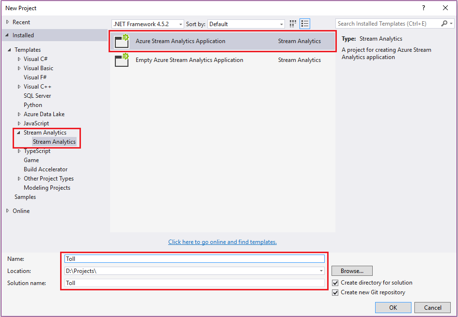

You will see a project **Toll** generated in **Solution Explorer**.

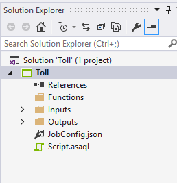

## Choose the correct Subscription
1. Open **Server Explorer** in Visual Studio from **View** menu.
2. Sign in with your Azure Account. 

## Define input sources
1.	In **Solution Explorer**, expand **Inputs** node and rename **Input.json** to **EntryStream.json**. Double click **EntryStream.json**.
2.	Your **INPUT ALIAS** now should be **EntryStream**. Please note that input alias is the one will be used in query script. 
3.	Source Type is **Data Stream**.
4.	Source is **Event hub**.
5.	Service Bus Namescape should be the **tollData** one in the drop down.
6.	Event hub name should be set to **entry**.
7.	Event hub policy name is **RootManageSharedAccessKey** (the default value).
8.	Select **JSON** for **EVENT SERIALIZATION FORMAT** and **UTF8** for **ENCODING**.

    Your settings will look like:

    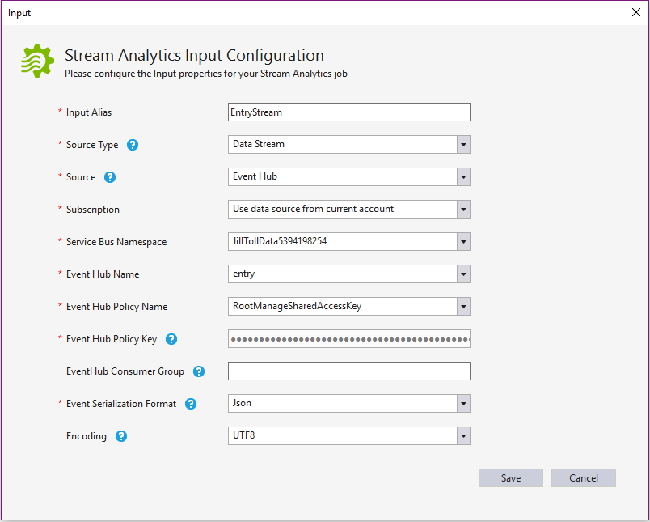
 
9.	Click **Save** at the bottom of the page to finish the wizard. Now you can add another input source to create the exit stream. Right click the inputs node and click **New Item**.

    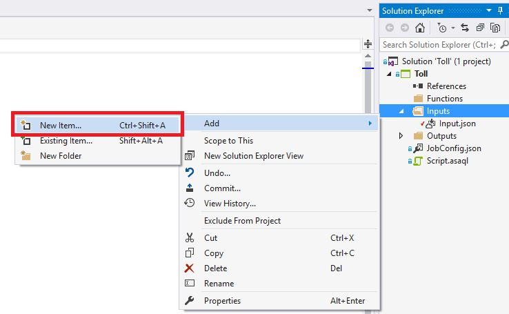
 
10.	In the popped up window, choose **Azure Stream Analytics Input** and change the Name to **ExitStream.json**. Click **Add**.

    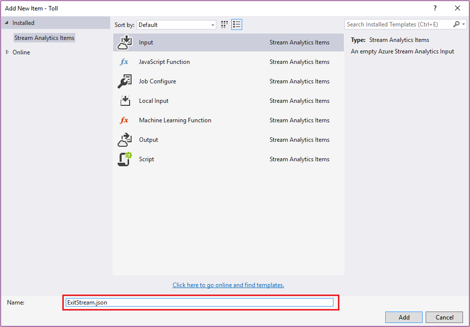
 
11.	Double click **ExitStream.json** in the project and follow the same steps as the entry stream to fill in. Be sure to enter values for Event Hub name as on the following screenshot.

    

    Now you have defined two input streams.

    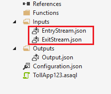
 
    Next, you will add reference data input for the blob file that contains car registration data.

12.	Right click the **Inputs** node in the project, and then follow the same process for the stream inputs but select **REFERENCE DATA** instead of Data Stream and the Input Alias is **Registration**.

    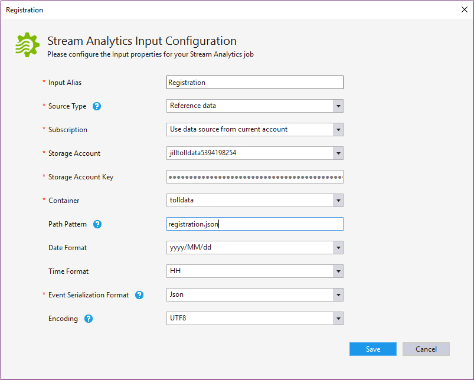

13.	Select Storage account that contains with **tolldata**. The container name should be **tolldata**, and the **PATH PATTERN** should be **registration.json**. This file name is case sensitive and should be lowercase.
14.	Click **Save** to finish the wizard.

Now all inputs are defined.

## Define output
1.	In **Solution Explorer**, expand **Inputs** node and double click **Output.json**.
2.	Set the Output alias to **output** and then Sink to SQL database.
2.	Enter the database name: **TollDataDB**.
3.	Enter **tolladmin** in the **USERNAME** field, **123toll!** in the **PASSWORD** field, and **TollDataRefJoin** in the **TABLE** field.
4.	Click **Save**.

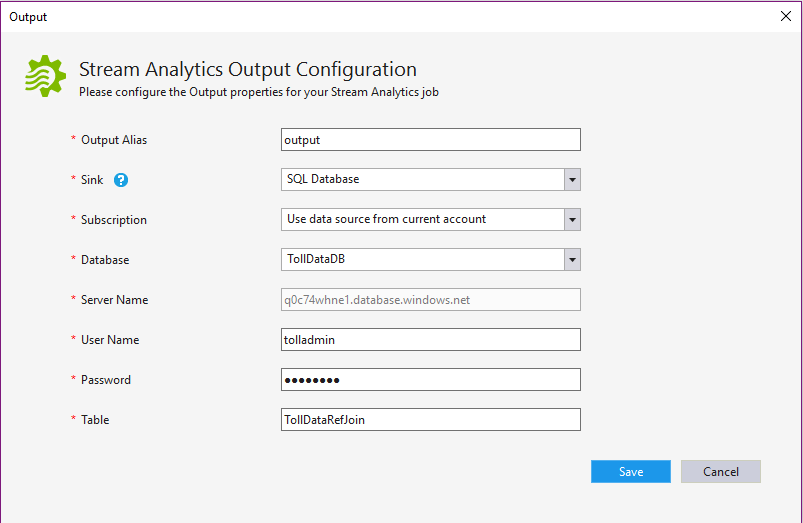
 
## Azure Stream Analytics Query
This tutorial attempts to answer several business questions that are related to toll data and constructs Stream Analytics queries that can be used in Azure Stream Analytics to provide a relevant answer.
Before you start your first Stream Analytics job, let’s explore a simple scenarios and the query syntax.

### Introduction to Azure Stream Analytics query language
Let’s say that you need to count the number of vehicles that enter a toll booth. Because this is a continuous stream of events, you have to define a “period of time.” Let's modify the question to be “How many vehicles enter a toll booth every three minutes?”. This is commonly referred to as the tumbling count.

Let’s look at the Azure Stream Analytics query that answers this question:

        SELECT TollId, System.Timestamp AS WindowEnd, COUNT(*) AS Count 
        FROM EntryStream TIMESTAMP BY EntryTime 
        GROUP BY TUMBLINGWINDOW(minute, 3), TollId 

As you can see, Azure Stream Analytics uses a query language that's like SQL and adds a few extensions to specify time-related aspects of the query.

For more details, read about [Time Management](https://msdn.microsoft.com/library/azure/mt582045.aspx) and [Windowing](https://msdn.microsoft.com/library/azure/dn835019.aspx) constructs used in the query from MSDN.

Now that you have written your first Azure Stream Analytics query, it is time to test it by using sample data files located in your TollApp folder in the following path:

**..\TollApp\TollApp\Data**

This folder contains the following files:
•	Entry.json
•	Exit.json
•	Registration.json

## Question: Number of vehicles entering a toll booth
In the project, double click Script.asaql to open the script in editor and paste the script in previous section into the editor. The query editor suppots Intellisense, syntax coloring and Error marker.

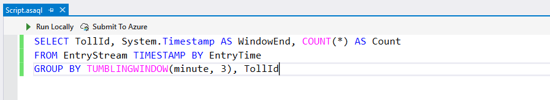
 
### Testing Azure Stream Analytics queries locally

1.	You can first right click on the project and choose **Build** to compile the query to see if there is any syntax error. 

2.	To validate this query against sample data, you can use local sample data by right clicking the input and select **Add local input** from the context menu.

    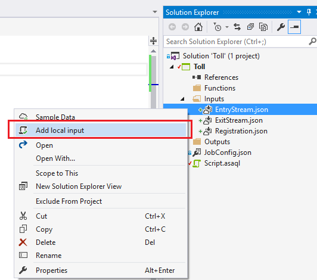
 
    In the pop up window select the sample data from your local path. Click **Save**.

    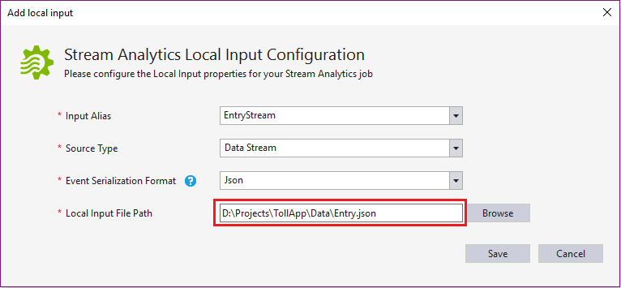
 
    A file named **local_EntryStream.json** will be added automatically to your inputs folder.

    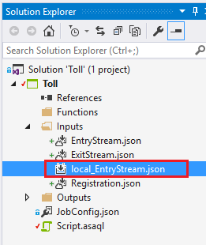
 
3.	Click Run Locally in query editor. Or you can press F5.

    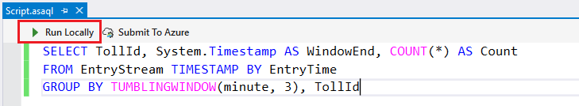

    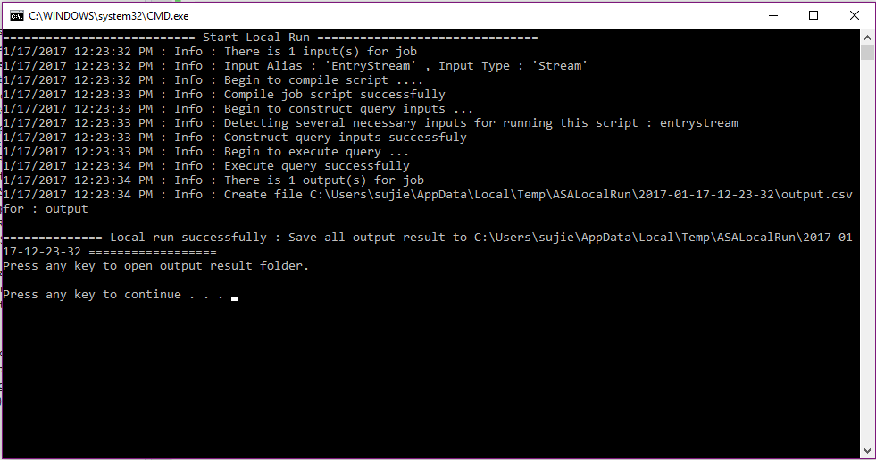

    You can press any key to view the output in ASA Local Run Result window in Visual Studio. 

    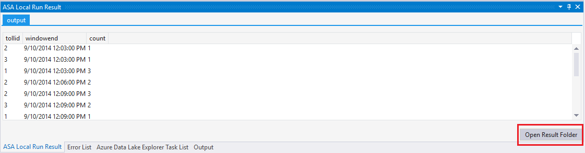

4.  You can open the result folder to check the output files both in CSV and JSON format.

    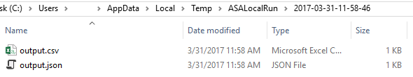
 

### Sample input
You can also sample input data from input sources to local file. Right click the input config file and select **Sample Data**. 

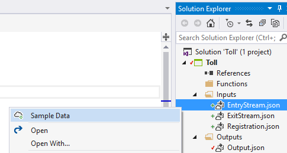

Please note that you can only sample Event Hub or IoT Hub for now. Other input sources are not supported.  In the pop up dialog window, please fill in the local path for saving the sample data. Click **Sample**.

 
You can see the progress in the Output window. 

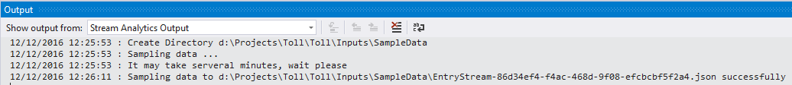
 
### Submit Azure Stream Analytics query to Azure
In **Query Editor**, click **Submit To Azure in script editor**.

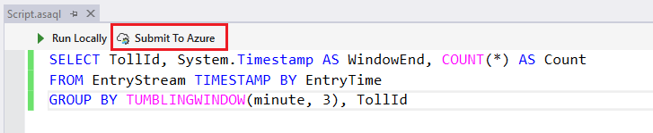
 
Choose Create a New Azure Stream Analytics Job. Input Job Name as below. Choose the correct Subscription. Click Submit.

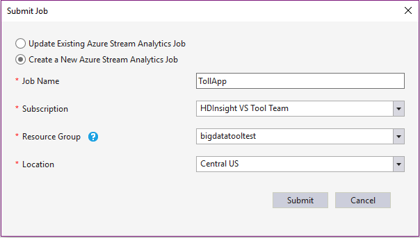

 
### Start Job
Now your job has been created and job view is automatically opened. Click the **GREEN** button to start the job.

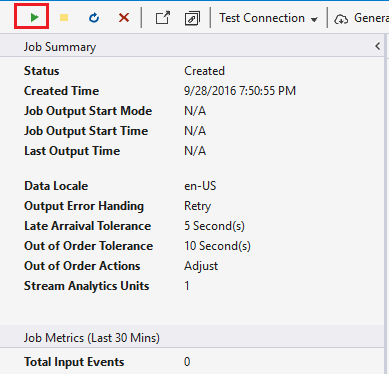
 
Choose the default setting and click **Start**.
 
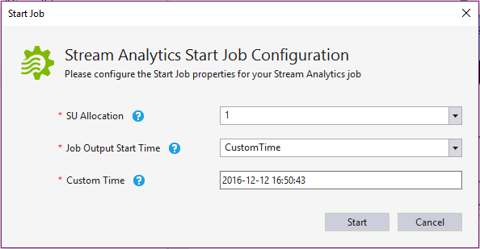

You can see the job status has changed to **Running** and there are input/output events.

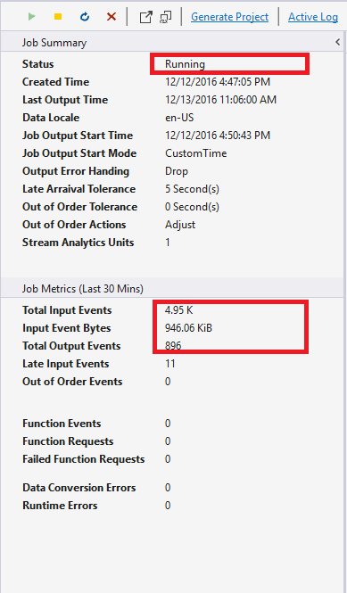

## Check results in Visual Studio
1. Open Visual Studio Server Explorer, and right-click the **TollDataRefJoin** table.
2. Click **Show Table Data** to see the output of your job.
   
    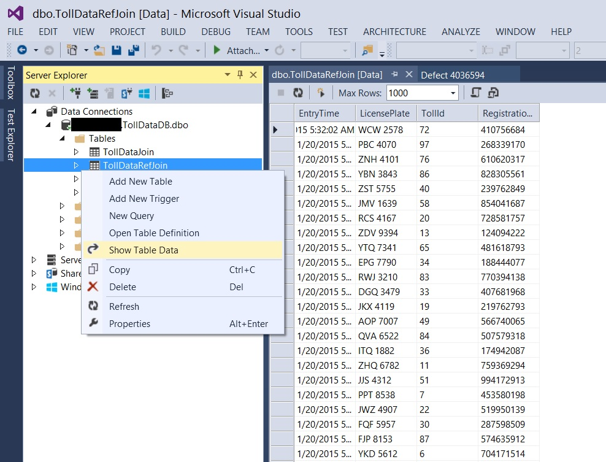

### View job metrics
Some basic job statistics can be found in **Job Metrics**. 

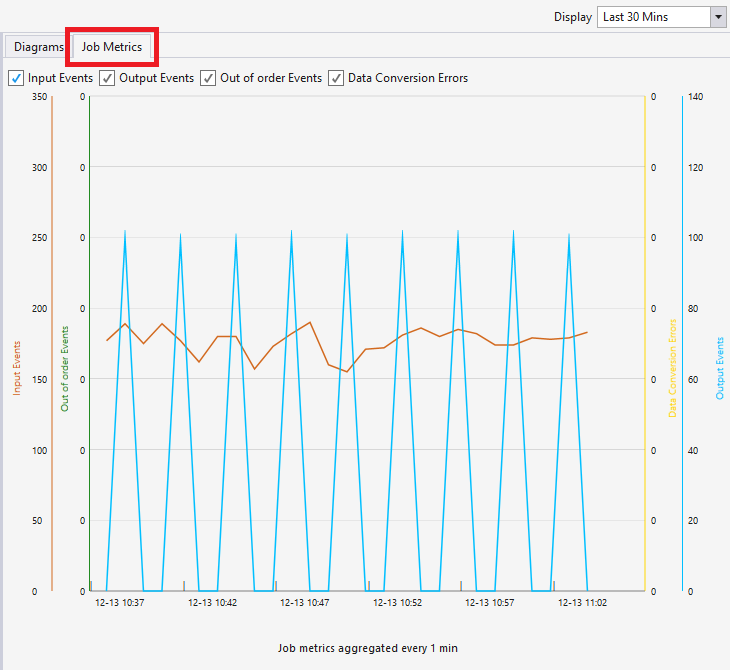

 
## List job in Server Explorer
Click **Stream Analytics Jobs** in **Server Explorer** and click **Refresh**. You should be able to see you job appeared under **Stream Analytics Jobs**.
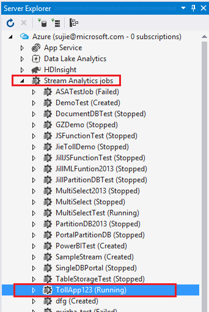

## Open job view
Expand your job node and double click on the **Job View** node to open job view.

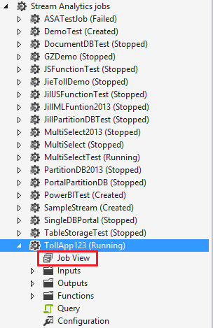

## Export an existing job to a project
There are two ways you can export an existing job to a project.
1. Right click the job node under **Stream Analytics Jobs** node in **Server Explorer**. Click **Export to New Stream Analytics Project** from the context menu.

    

    You will see the gererated project in **Solution Explorer**.

    
 
2. In job view, click **Generate Project**.

    

## Known Issues and Limitations
 
1. No support for Power BI output and ADLS output.
2. No editor support for adding or changing JavaScript UDF.

## Next steps
* [Introduction to Azure Stream Analytics](stream-analytics-introduction.md)
* [Get started using Azure Stream Analytics](stream-analytics-get-started.md)
* [Scale Azure Stream Analytics jobs](stream-analytics-scale-jobs.md)
* [Azure Stream Analytics Query Language Reference](https://msdn.microsoft.com/library/azure/dn834998.aspx)
* [Azure Stream Analytics Management REST API Reference](https://msdn.microsoft.com/library/azure/dn835031.aspx)
