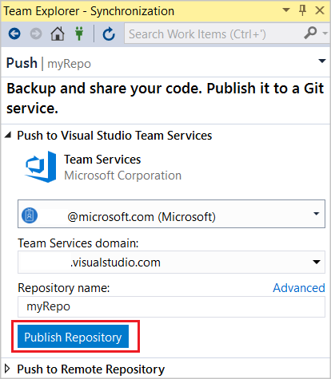
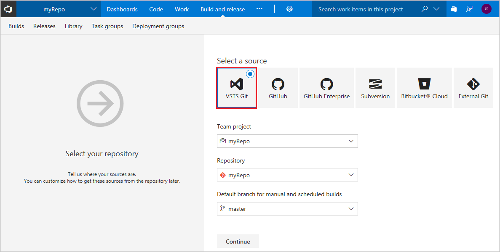
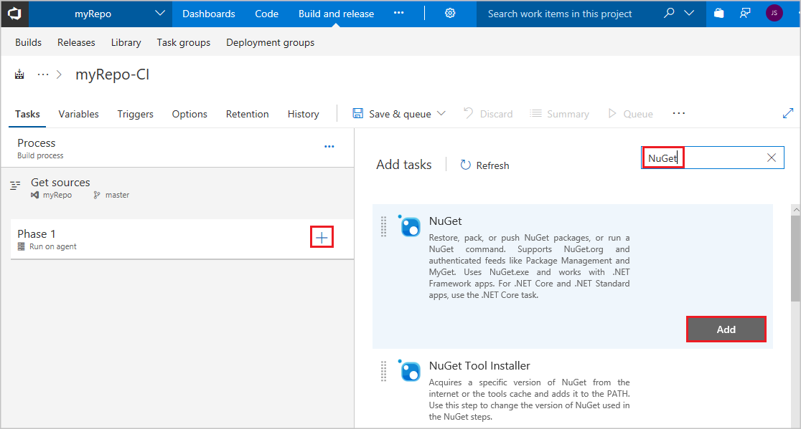
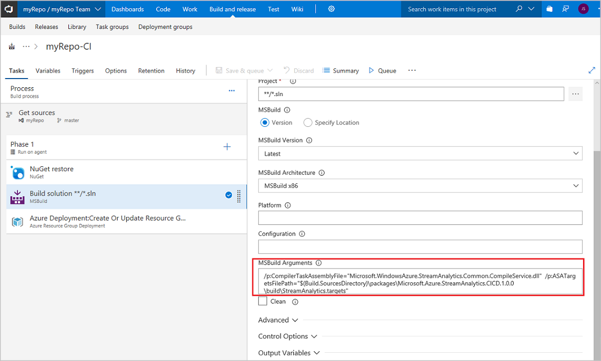
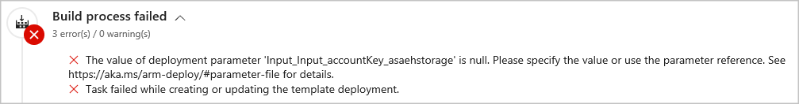

---
title: Deploy an Azure Stream Analytics job with CI/CD using Azure DevOps Services tutorial
description:  This article describes how to deploy a Stream Analytics job with CI/CD using Azure DevOps Services.
services: stream-analytics
author: su-jie
ms.author: sujie
manager: kfile
ms.reviewer: mamccrea
ms.service: stream-analytics
ms.topic: tutorial
ms.date: 7/10/2018
--- 

# Tutorial: Deploy an Azure Stream Analytics job with CI/CD using Azure Pipelines
This tutorial describes how to set up continuous integration and deployment for an Azure Stream Analytics job using Azure Pipelines. 

In this tutorial, you learn how to:

> [!div class="checklist"]
> * Add source control to your project
> * Create a build pipeline in Azure Pipelines
> * Create a release pipeline in Azure Pipelines
> * Automatically deploy and upgrade an application

## Prerequisites
Before you start, make sure you have the following:

* If you don't have an Azure subscription, create a [free account](https://azure.microsoft.com/free/?WT.mc_id=A261C142F).
* Install [Visual Studio](stream-analytics-tools-for-visual-studio-install.md) and the **Azure development** or **Data Storage and Processing** workloads.
* Create a [Stream Analytics project in Visual Studio](https://docs.microsoft.com/azure/stream-analytics/stream-analytics-quick-create-vs).
* Create an [Azure DevOps](https://visualstudio.microsoft.com/team-services/) organization.

## Configure NuGet package dependency
In order to do auto build and auto deployment on an arbitrary machine, you need to use the NuGet package `Microsoft.Azure.StreamAnalytics.CICD`. It provides the MSBuild, local run, and deployment tools that support the continuous integration and deployment process of Stream Analytics Visual Studio projects. For more information, see [Stream Analytics CI/CD tools](stream-analytics-tools-for-visual-studio-cicd.md).

Add **packages.config** to your project directory.

```xml
<?xml version="1.0" encoding="utf-8"?>
<packages>
<package id="Microsoft.Azure.StreamAnalytics.CICD" version="1.0.0" targetFramework="net452" />
</packages>
```

## Share your Visual Studio solution to a new Azure Repos Git repo

Share your application source files to a project in Azure DevOps so you can generate builds.  

1. Create a new local Git repo for your project by selecting **Add to Source Control**, then **Git** on the status bar in the lower right-hand corner of Visual Studio. 

2. In the **Synchronization** view in **Team Explorer**, select the **Publish Git Repo** button under **Push to Azure DevOps Services**.

   

3. Verify your email and select your organization in the **Azure DevOps Services Domain** drop-down. Enter your repository name and select **Publish repository**.

   

    Publishing the repo creates a new project in your organization with the same name as the local repo. To create the repo in an existing project, click **Advanced** next to **Repository name**, and select a project. You can view your code in the browser by selecting **See it on the web**.
 
## Configure continuous delivery with Azure DevOps
An Azure Pipelines build pipeline describes a workflow comprised of build steps that are executed sequentially. Learn more about [Azure Pipelines build pipelines](https://docs.microsoft.com/azure/devops/pipelines/get-started-designer?view=vsts&tabs=new-nav). 

An Azure Pipelines release pipeline describes a workflow that deploys an application package to a cluster. When used together, the build pipeline and release pipeline execute the entire workflow starting with source files and ending with a running application in your cluster. Learn more about Azure Pipelines [release pipelines](https://docs.microsoft.com/azure/devops/pipelines/release/define-multistage-release-process?view=vsts).

### Create a build pipeline
Open a web browser and navigate to the project you just created in [Azure DevOps](https://app.vsaex.visualstudio.com/). 

1. Under the **Build & Release** tab, select **Builds**, and then **+New**.  Select **Azure DevOps Services Git** and **Continue**.
    
    

2. In **Select a template**, click **Empty Process** to start with an empty pipeline.
    
    

3. Under **Triggers**, enable continuous integration by checking **Enable continuous integration** trigger status.  Select **Save and queue** to manually start a build. 
    
    

4. Builds are also triggered upon push or check-in. To check your build progress, switch to the **Builds** tab.  Once you verify that the build executes successfully, you must define a release pipeline that deploys your application to a cluster. Right click on the ellipses next to your build pipeline and select **Edit**.

5.  In **Tasks**, enter "Hosted" as the **Agent queue**.
    
     

6. In **Phase 1**, click **+** and add a **NuGet** task.
    
    

7. Expand **Advanced** and add `$(Build.SourcesDirectory)\packages` to **Destination directory**. Keep the remaining default NuGet configuration values.

   

8. In **Phase 1**, click **+** and add a **MSBuild** task.

   

9. Change the **MSBuild Arguments** to the following:

   ```
   /p:CompilerTaskAssemblyFile="Microsoft.WindowsAzure.StreamAnalytics.Common.CompileService.dll"  /p:ASATargetsFilePath="$(Build.SourcesDirectory)\packages\Microsoft.Azure.StreamAnalytics.CICD.1.0.0\build\StreamAnalytics.targets"
   ```

   

10. In **Phase 1**, click **+** and add an **Azure Resource Group Deployment** task. 
    
    

11. Expand **Azure Details** and fill out the configuration with the following:
    
    |**Setting**  |**Suggested value**  |
    |---------|---------|
    |Subscription  |  Choose your subscription.   |
    |Action  |  Create or update resource group   |
    |Resource Group  |  Enter a resource group name.   |
    |Template  | [Your solution path]\bin\Debug\Deploy\\[Your project name].JobTemplate.json   |
    |Template parameters  | [Your solution path]\bin\Debug\Deploy\\[Your project name].JobTemplate.parameters.json   |
    |Override template parameters  | Type the template parameters to override in the textbox. Example, –storageName fabrikam –adminUsername $(vmusername) -adminPassword $(password) –azureKeyVaultName $(fabrikamFibre). This property is optional, but your build will result in errors if key parameters are not overridden.    |
    
    

12. Click **Save & Queue** to test the build pipeline.
    
    

### Failed build process
You may receive errors for null deployment parameters if you did not override template parameters in the **Azure Resource Group Deployment** task of your build pipeline. Return to the build pipeline and override the null parameters to resolve the error.

   

### Commit and push changes to trigger a release
Verify that the continuous integration pipeline is functioning by checking in some code changes to Azure DevOps.    

As you write your code, your changes are automatically tracked by Visual Studio. Commit changes to your local Git repository by selecting the pending changes icon from the status bar in the bottom right.

1. On the **Changes** view in Team Explorer, add a message describing your update and commit your changes.

    

2. Select the unpublished changes status bar icon or the Sync view in Team Explorer. Select **Push** to update your code in Azure DevOps.

    

Pushing the changes to Azure DevOps Services automatically triggers a build.  When the build pipeline successfully completes, a release is automatically created and starts updating the job on the cluster.

## Clean up resources

When no longer needed, delete the resource group, the streaming job, and all related resources. Deleting the job avoids billing the streaming units consumed by the job. If you're planning to use the job in future, you can stop it and re-start it later when you need. If you are not going to continue to use this job, delete all resources created by this tutorial by using the following steps:

1. From the left-hand menu in the Azure portal, click **Resource groups** and then click the name of the resource you created.  
2. On your resource group page, click **Delete**, type the name of the resource to delete in the text box, and then click **Delete**.

## Next steps

To learn more about using Azure Stream Analytics tools for Visual Studio to set up a continuous integration and deployment process, continue to the set up CI/CD pipeline article:

> [!div class="nextstepaction"]
> [Continuously integrate and develop with Stream Analytics tools](stream-analytics-tools-for-visual-studio-cicd.md)
