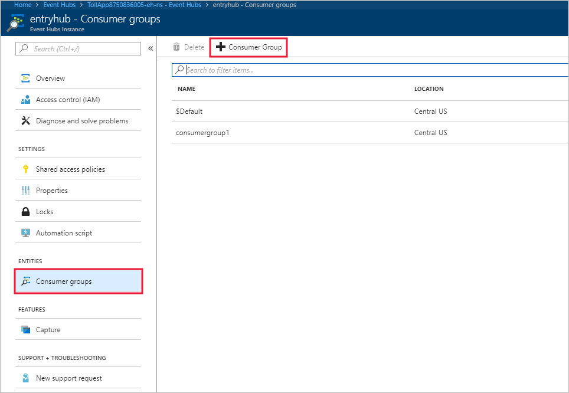

# Troubleshoot input connections

This page describes common issues with input connections and how to troubleshoot them.

## Input events not received by job 
1.  Test your connectivity. Verify connectivity to inputs and outputs by using the **Test Connection** button for each input and output.

2.  Examine your input data.

    To verify that input data is flowing into Event Hub, use [Service Bus Explorer](https://code.msdn.microsoft.com/windowsapps/Service-Bus-Explorer-f2abca5a) to connect to Azure Event Hub (if Event Hub input is used).
        
    Use the [**Sample Data**](stream-analytics-sample-data-input.md) button for each input, and download the input sample data.
        
    Inspect the sample data to understand the shape of the data: the schema and the [data types](https://msdn.microsoft.com/library/azure/dn835065.aspx).

## Malformed input events causes deserialization errors 
Deserialization issues are caused when the input stream of your Stream Analytics job contains malformed messages. For example, a malformed message could be caused by a missing parenthesis or a brace in a JSON object, or an incorrect timestamp format in the time field. 
 
When a Stream Analytics job receives a malformed message from an input, it drops the message and notifies you with a warning. A warning symbol is shown on the **Inputs** tile of your Stream Analytics job. This warning sign exists as long as the job is in running state:


Enable the diagnostics logs to view the details of the warning. For malformed input events, the execution logs contain an entry with the message that looks like: 
<code>Could not deserialize the input event(s) from resource <blob URI> as json.</code>

### What caused the deserialization error
You can take the following steps to analyze the input events in detail to get a clear understanding of what caused the deserialization error. You can then fix the event source to generate events in the right format to prevent you from hitting this issue again.

1. Navigate to the input tile and click on the warning symbols to see the list of issues.

2. The input details tile displays a list of warnings with details about each issue. The example warning message below includes the partition, offset, and sequence numbers where there is malformed JSON data. 

   

3. To find the JSON data with the incorrect format, run the CheckMalformedEvents.cs code available in the [GitHub samples repository](https://github.com/Azure/azure-stream-analytics/tree/master/Samples/CheckMalformedEventsEH). This code reads the partition ID, offset, and prints the data that's located in that offset. 

4. Once you read the data, you can analyze and correct the serialization format.

5. You can also [read events from an IoT Hub with the Service Bus Explorer](https://code.msdn.microsoft.com/How-to-read-events-from-an-1641eb1b).

## Job exceeds maximum Event Hub Receivers
A best practice for using Event Hubs is to use multiple consumer groups to ensure job scalability. The number of readers in the Stream Analytics job for a specific input affects the number of readers in a single consumer group. The precise number of receivers is based on internal implementation details for the scale-out topology logic and is not exposed externally. The number of readers can change when a job is started or during job upgrades.

The error shown when the number of receivers exceeds the maximum is:
`The streaming job failed: Stream Analytics job has validation errors: Job will exceed the maximum amount of Event Hub Receivers.`

> [!NOTE]
> When the number of readers changes during a job upgrade, transient warnings are written to audit logs. Stream Analytics jobs automatically recover from these transient issues.

### Add a consumer group in Event Hubs
To add a new consumer group in your Event Hubs instance, follow these steps:

1. Sign in to the Azure portal.

2. Locate your Event Hubs.

3. Select **Event Hubs** under the **Entities** heading.

4. Select the Event Hub by name.

5. On the **Event Hubs Instance** page, under the **Entities** heading, select **Consumer groups**. A consumer group with name **$Default** is listed.

6. Select **+ Consumer Group** to add a new consumer group. 

   

7. When you created the input in the Stream Analytics job to point to the Event Hub, you specified the consumer group there. $Default is used when none is specified. Once you create a new consumer group, edit the Event Hub input in the Stream Analytics job and specify the name of the new consumer group.


## Readers per partition exceeds Event Hubs limit

If your streaming query syntax references the same input Event Hub resource multiple times, the job engine can use multiple readers per query from that same consumer group. When there are too many references to the same consumer group, the job can exceed the limit of five and thrown an error. In those circumstances, you can further divide by using multiple inputs across multiple consumer groups using the solution described in the following section. 

Scenarios in which the number of readers per partition exceeds the Event Hubs limit of five include the following:

* Multiple SELECT statements: If you use multiple SELECT statements that refer to **same** event hub input, each SELECT statement causes a new receiver to be created.
* UNION: When you use a UNION, it's possible to have multiple inputs that refer to the **same** event hub and consumer group.
* SELF JOIN: When you use a SELF JOIN operation, it's possible to refer to the **same** event hub multiple times.

The following best practices can help mitigate scenarios in which the number of readers per partition exceeds the Event Hubs limit of five.

### Split your query into multiple steps by using a WITH clause

The WITH clause specifies a temporary named result set that can be referenced by a FROM clause in the query. You define the WITH clause in the execution scope of a single SELECT statement.

For example, instead of this query:

```
SELECT foo 
INTO output1
FROM inputEventHub

SELECT bar
INTO output2
FROM inputEventHub 
…
```

Use this query:

```
WITH data AS (
   SELECT * FROM inputEventHub
)

SELECT foo
INTO output1
FROM data

SELECT bar
INTO output2
FROM data
…
```

### Ensure that inputs bind to different consumer groups

For queries in which three or more inputs are connected to the same Event Hubs consumer group, create separate consumer groups. This requires the creation of additional Stream Analytics inputs.

## Get help

For further assistance, try our [Azure Stream Analytics forum](https://social.msdn.microsoft.com/Forums/azure/home?forum=AzureStreamAnalytics).

## Next steps

* [Introduction to Azure Stream Analytics](stream-analytics-introduction.md)
* [Get started using Azure Stream Analytics](stream-analytics-real-time-fraud-detection.md)
* [Scale Azure Stream Analytics jobs](stream-analytics-scale-jobs.md)
* [Azure Stream Analytics Query Language Reference](https://msdn.microsoft.com/library/azure/dn834998.aspx)
* [Azure Stream Analytics Management REST API Reference](https://msdn.microsoft.com/library/azure/dn835031.aspx)