# Troubleshoot Azure Stream Analytics queries

This article describes common issues with developing Stream Analytics queries and how to troubleshoot them.

This article describes common issues with developing Azure Stream Analytics queries, how to troubleshoot query issues, and how to correct the issues. Many troubleshooting steps require resource logs to be enabled for your Stream Analytics job. If you do not have resource logs enabled, see [Troubleshoot Azure Stream Analytics by using resource logs](stream-analytics-job-diagnostic-logs.md).

## Query is not producing expected output

1.  Examine errors by testing locally:

    - On Azure portal, on the **Query** tab, select **Test**. Use the downloaded sample data to [test the query](stream-analytics-test-query.md). Examine any errors and attempt to correct them.   
    - You can also [test your query locally](stream-analytics-live-data-local-testing.md) using Azure Stream Analytics tools for Visual Studio or [Visual Studio Code](visual-studio-code-local-run-live-input.md). 

2.  [Debug queries step by step locally using job diagram](debug-locally-using-job-diagram.md) in Azure Stream Analytics tools for Visual Studio. The job diagram shows how data flows from input sources (Event Hub, IoT Hub, etc.) through multiple query steps and finally to output sinks. Each query step is mapped to a temporary result set defined in the script using the WITH statement. You can view the data, as well as metrics, in each intermediate result set to find the source of the issue.

    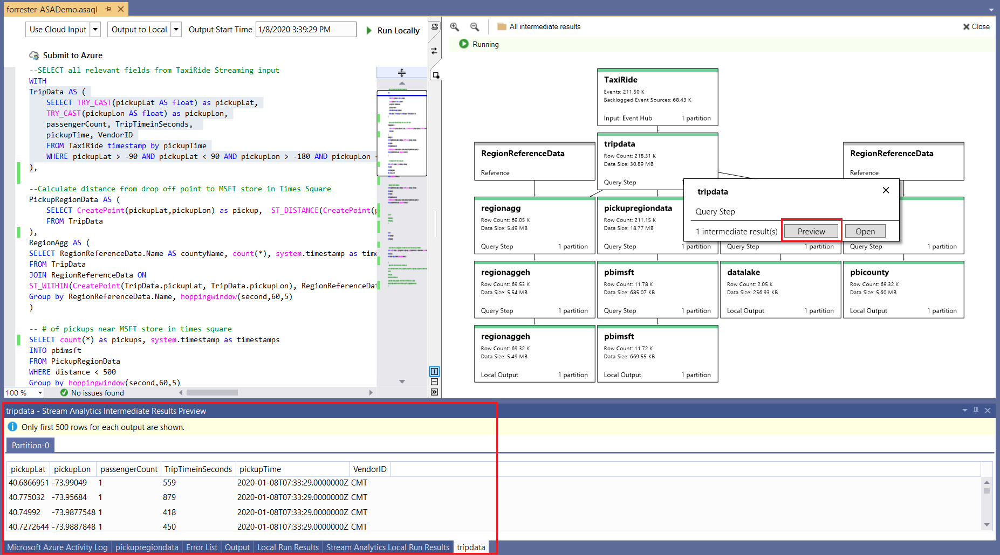

3.  If you use [**Timestamp By**](https://docs.microsoft.com/stream-analytics-query/timestamp-by-azure-stream-analytics), verify that the events have timestamps greater than the [job start time](stream-analytics-out-of-order-and-late-events.md).

4.  Eliminate common pitfalls, such as:
    - A [**WHERE**](https://docs.microsoft.com/stream-analytics-query/where-azure-stream-analytics) clause in the query filtered out all events, preventing any output from being generated.
    - A [**CAST**](https://docs.microsoft.com/stream-analytics-query/cast-azure-stream-analytics) function fails, causing the job to fail. To avoid type cast failures, use [**TRY_CAST**](https://docs.microsoft.com/stream-analytics-query/try-cast-azure-stream-analytics) instead.
    - When you use window functions, wait for the entire window duration to see an output from the query.
    - The timestamp for events precedes the job start time and events are dropped.
    - [**JOIN**](https://docs.microsoft.com/stream-analytics-query/join-azure-stream-analytics) conditions don't match. If there are no matches, there will be zero output.

5.  Ensure event ordering policies are configured as expected. Go to **Settings** and select [**Event Ordering**](stream-analytics-out-of-order-and-late-events.md). The policy is *not* applied when you use the **Test** button to test the query. This result is one difference between testing in-browser versus running the job in production. 

6. Debug by using activity and resource logs:
    - Use [Activity Logs](../azure-resource-manager/resource-group-audit.md), and filter to identify and debug errors.
    - Use [job resource logs](stream-analytics-job-diagnostic-logs.md) to identify and debug errors.

## Resource utilization is high

Ensure you take advantage of parallelization in Azure Stream Analytics. You can learn to [scale with query parallelization](stream-analytics-parallelization.md) of Stream Analytics jobs by configuring input partitions and tuning the analytics query definition.

## Debug queries progressively

In real-time data processing, knowing what the data looks like in the middle of the query can be helpful. You can see this using the job diagram in Visual Studio. If you don't have Visual Studio, you can take additional steps to output intermediate data.

Because inputs or steps of an Azure Stream Analytics job can be read multiple times, you can write extra SELECT INTO statements. Doing so outputs intermediate data into storage and lets you inspect the correctness of the data, just as *watch variables* do when you debug a program.

The following example query in an Azure Stream Analytics job has one stream input, two reference data inputs, and an output to Azure Table Storage. The query joins data from the event hub and two reference blobs to get the name and category information:

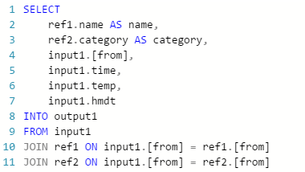

Note that the job is running, but no events are being produced in the output. On the **Monitoring** tile, shown here, you can see that the input is producing data, but you don’t know which step of the **JOIN** caused all the events to be dropped.

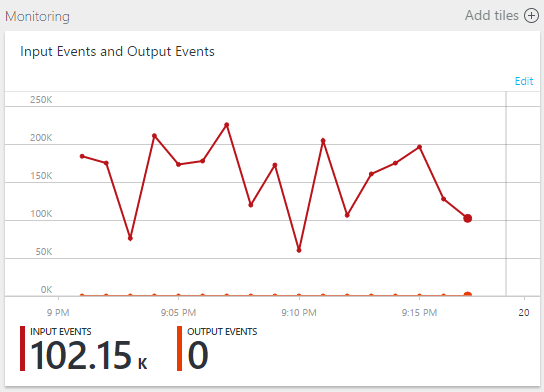

In this situation, you can add a few extra SELECT INTO statements to "log" the intermediate JOIN results and the data that's read from the input.

In this example, we've added two new "temporary outputs." They can be any sink you like. Here we use Azure Storage as an example:

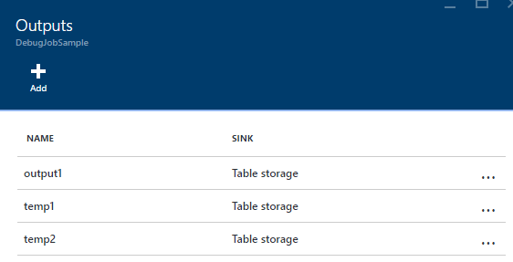

You can then rewrite the query like this:

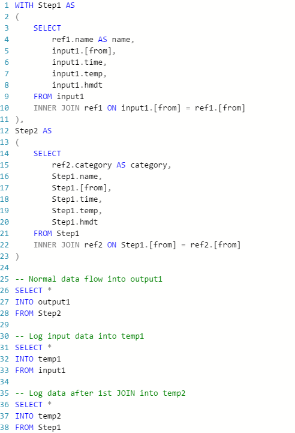

Now start the job again, and let it run for a few minutes. Then query temp1 and temp2 with Visual Studio Cloud Explorer to produce the following tables:

**temp1 table**
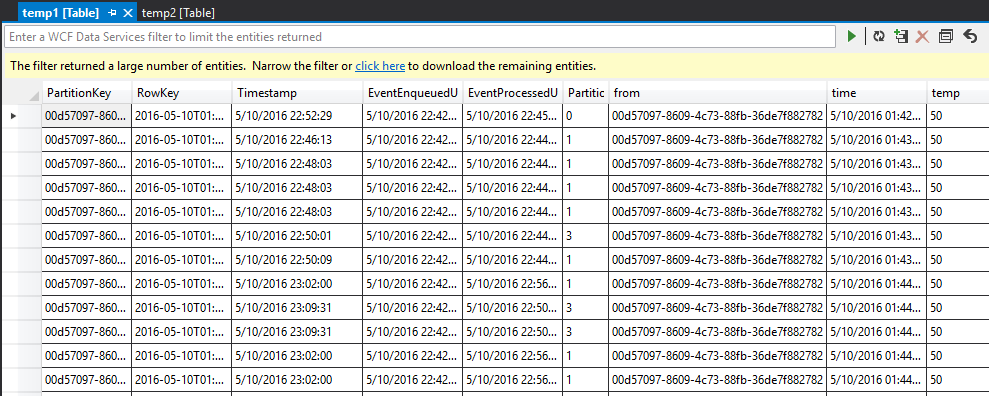

**temp2 table**
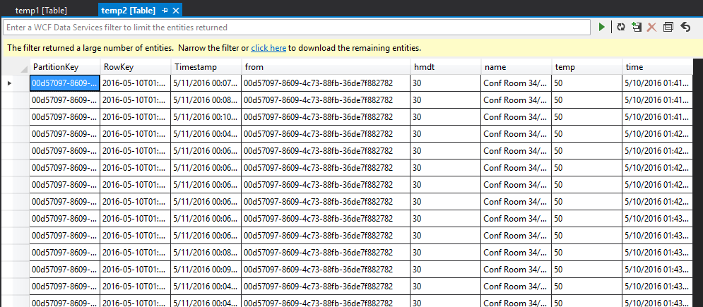

As you can see, temp1 and temp2 both have data, and the name column is populated correctly in temp2. However, because there is still no data in output, something is wrong:

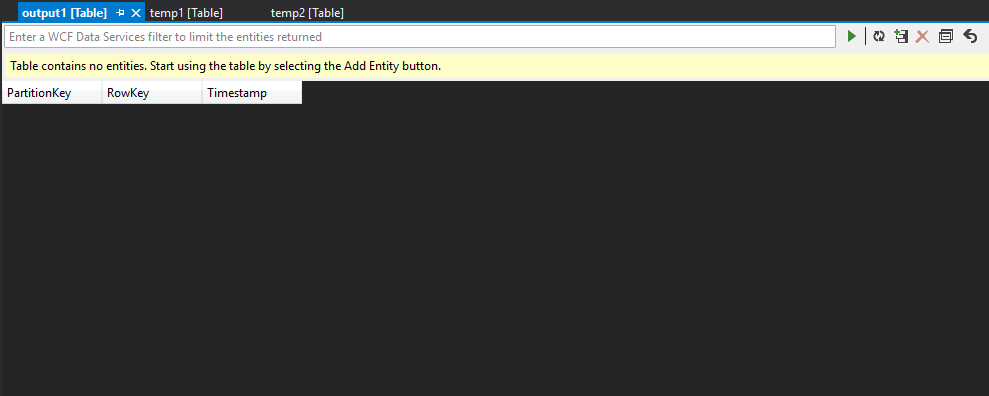

By sampling the data, you can be almost certain that the issue is with the second JOIN. You can download the reference data from the blob and take a look:

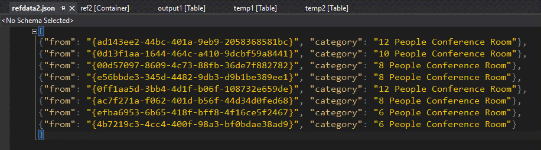

As you can see, the format of the GUID in this reference data is different from the format of the [from] column in temp2. That’s why the data didn’t arrive in output1 as expected.

You can fix the data format, upload it to reference blob, and try again:

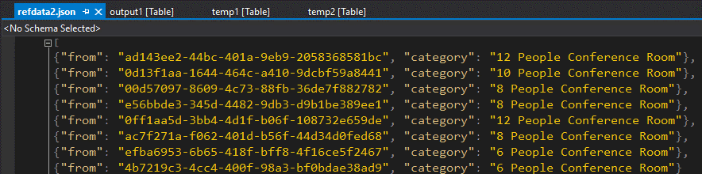

This time, the data in the output is formatted and populated as expected.

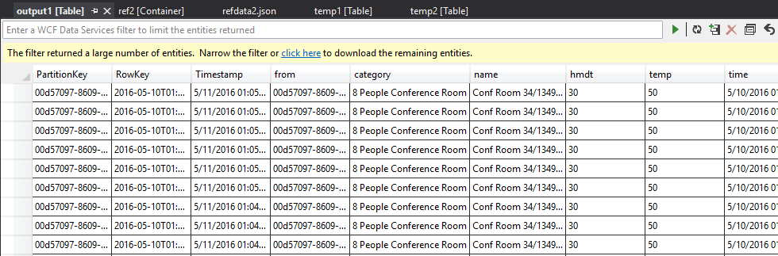

## Get help

For further assistance, try our [Microsoft Q&A question page for Azure Stream Analytics](https://docs.microsoft.com/answers/topics/azure-stream-analytics.html).

## Next steps

* [Introduction to Azure Stream Analytics](stream-analytics-introduction.md)
* [Get started using Azure Stream Analytics](stream-analytics-real-time-fraud-detection.md)
* [Scale Azure Stream Analytics jobs](stream-analytics-scale-jobs.md)
* [Azure Stream Analytics Query Language Reference](https://docs.microsoft.com/stream-analytics-query/stream-analytics-query-language-reference)
* [Azure Stream Analytics Management REST API Reference](https://msdn.microsoft.com/library/azure/dn835031.aspx)
