# Troubleshoot Azure Stream Analytics queries

This article describes common issues with developing Azure Stream Analytics queries, how to troubleshoot query issues, and how to correct the issues. Many troubleshooting steps require you to enable resource logs for your Stream Analytics job. If you don't have resource logs enabled, see [Troubleshoot Azure Stream Analytics by using resource logs](stream-analytics-job-diagnostic-logs.md).

## Query isn't producing expected output

1.  Examine errors by testing locally:

    - In the Azure portal, on the **Query** tab, select **Test**. Use the downloaded sample data to [test the query](stream-analytics-test-query.md). Examine any errors and attempt to correct them.
    - You can also [test your query locally](stream-analytics-live-data-local-testing.md) by using Azure Stream Analytics tools for Visual Studio or [Visual Studio Code](visual-studio-code-local-run-live-input.md).

1.  [Debug queries step by step locally using job diagram](debug-locally-using-job-diagram-vs-code.md) in Azure Stream Analytics tools for Visual Studio Code. The job diagram shows how data flows from input sources, for example, Azure Event Hubs and Azure IoT Hub, through multiple query steps and finally to output sinks. The script maps each query step to a temporary result set that you define by using the WITH statement. View the data and metrics in each intermediate result set to find the source of the issue.

    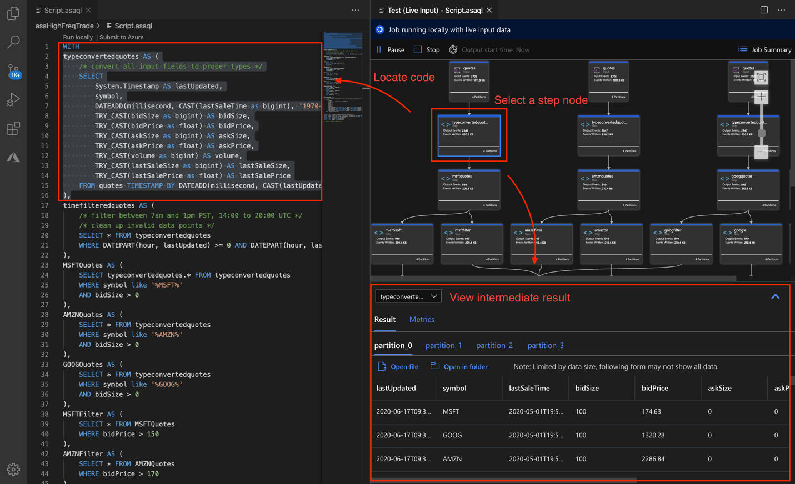

1.  If you use [**Timestamp By**](/stream-analytics-query/timestamp-by-azure-stream-analytics), verify that the events have timestamps greater than the [job start time](./stream-analytics-time-handling.md).

1.  Eliminate common pitfalls, such as:
    - A [**WHERE**](/stream-analytics-query/where-azure-stream-analytics) clause in the query filtered out all events, so the query produces no output.
    - A [**CAST**](/stream-analytics-query/cast-azure-stream-analytics) function fails, causing the job to fail. To avoid type cast failures, use [**TRY_CAST**](/stream-analytics-query/try-cast-azure-stream-analytics) instead.
    - When you use window functions, wait for the entire window duration to see an output from the query.
    - The timestamp for events precedes the job start time, so the job drops the events.
    - [**JOIN**](/stream-analytics-query/join-azure-stream-analytics) conditions don't match. If there are no matches, the query produces no output.

1.  Ensure that you configure event ordering policies as expected. Go to **Settings** and select [**Event Ordering**](./stream-analytics-time-handling.md). The **Test** button doesn't apply the policy when you test the query. This result is one difference between testing in-browser and running the job in production.

1. Debug by using activity and resource logs:
    - Use [Activity Logs](/azure/azure-monitor/essentials/activity-log), and filter to identify and debug errors.
    - Use [job resource logs](stream-analytics-job-diagnostic-logs.md) to identify and debug errors.

### Debug queries progressively

In real-time data processing, it helps to know what the data looks like in the middle of the query. To view the intermediate data, use the job diagram in Visual Studio. If you don't have Visual Studio, you can take extra steps to output intermediate data.

Because Azure Stream Analytics can read inputs or steps of a job multiple times, you can write extra `SELECT INTO` statements. Doing so outputs intermediate data into storage and lets you check the correctness of the data, just as *watch variables* do when you debug a program.

The following example query in an Azure Stream Analytics job has one stream input, two reference data inputs, and an output to Azure Table Storage. The query joins data from the event hub and two reference blobs to get the name and category information:

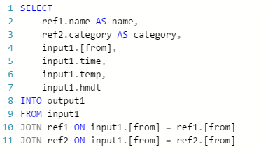

The job is running, but it produces no events in the output. On the **Monitoring** tile, shown here, you can see that the input is producing data, but you don't know which step of the **JOIN** dropped all the events.

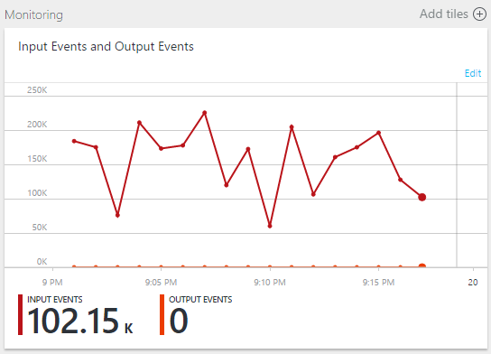

In this situation, you can add a few extra `SELECT INTO` statements to "log" the intermediate `JOIN` results and the data that's read from the input.

In this example, we added two new "temporary outputs." They can be any sink you like. Here we use Azure Storage as an example:

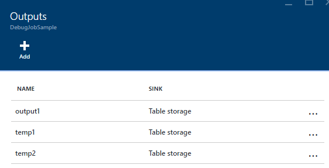

You can then rewrite the query like this:

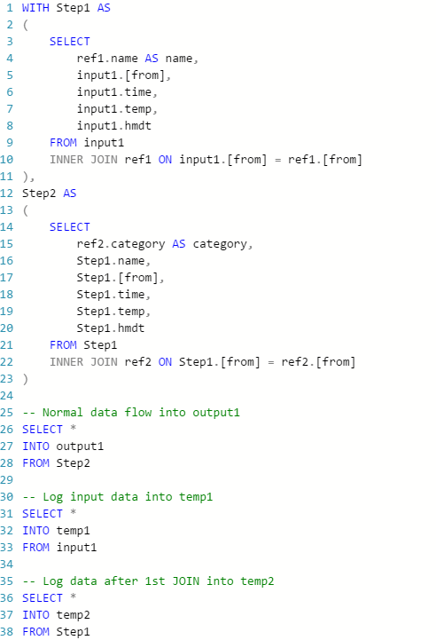

Now start the job again, and let it run for a few minutes. Then query `temp1` and `temp2` with Visual Studio Cloud Explorer to produce the following tables:

**temp1 table**
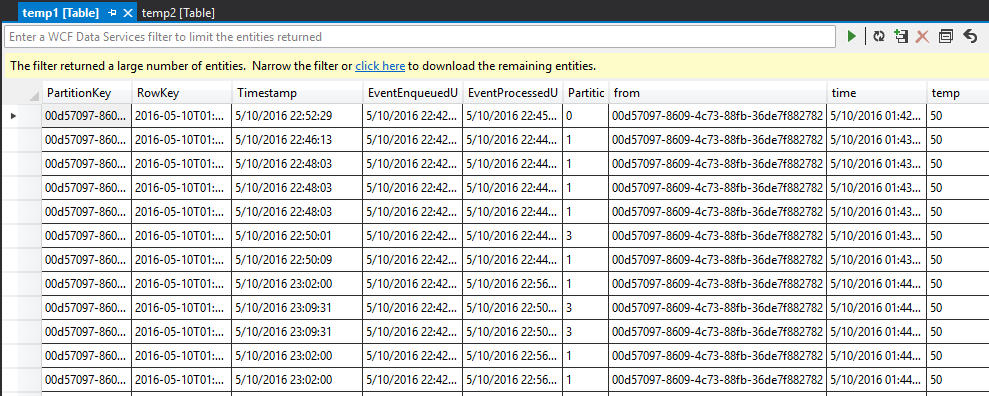

**temp2 table**
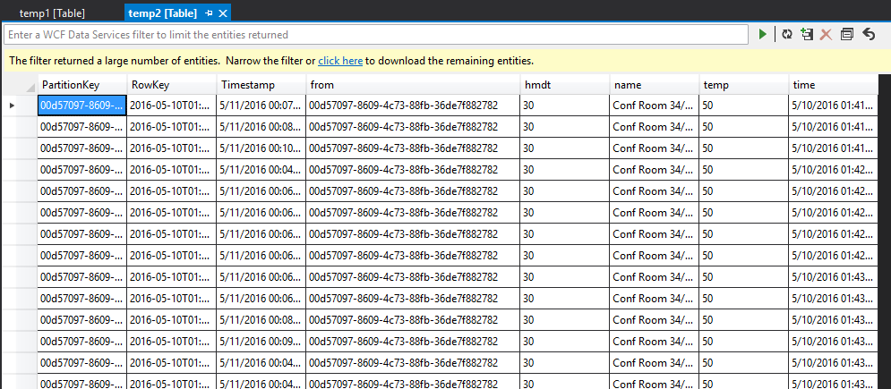

As you can see, `temp1` and `temp2` both have data, and the `name` column is populated correctly in `temp2`. However, because output still has no data, something is wrong:

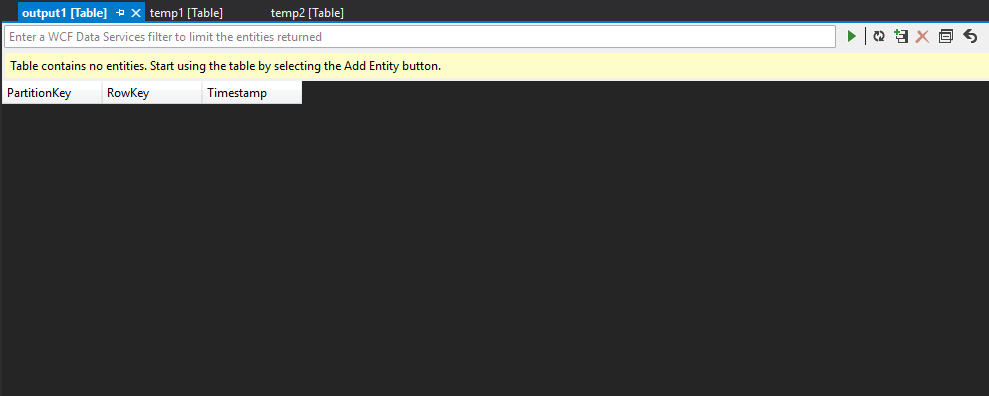

By sampling the data, you can be almost certain that the issue is with the second `JOIN`. You can download the reference data from the blob and take a look:

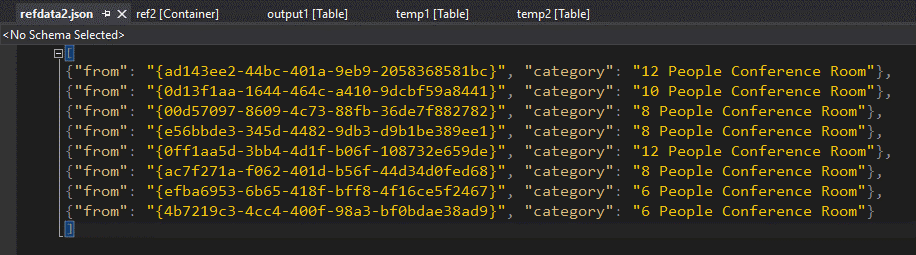

As you can see, the format of the GUID in this reference data is different from the format of the `[from]` column in `temp2`. That's why the data didn't arrive in `output1` as expected.

Fix the data format, upload it to the reference blob, and try again:

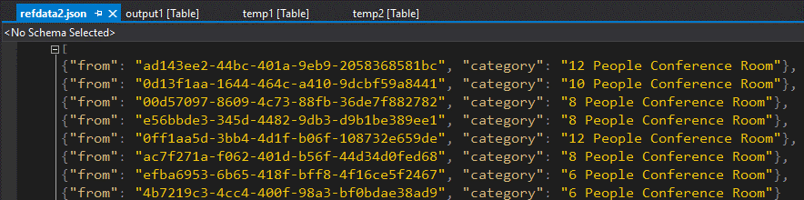

This time, the data in the output is formatted and populated as expected.

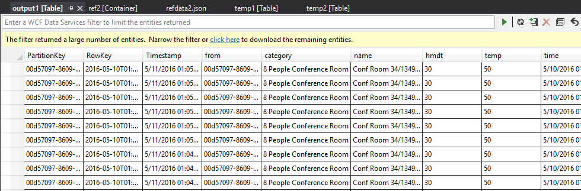

## Resource utilization is high

Ensure you take advantage of parallelization in Azure Stream Analytics. Learn to [scale with query parallelization](stream-analytics-parallelization.md) of Stream Analytics jobs by configuring input partitions and tuning the analytics query definition.

If resource utilization is consistently over 80%, the watermark delay is rising, and the number of backlogged events is rising, consider increasing streaming units. High utilization indicates that the job is using close to the maximum allocated resources.

## Get help

For further assistance, try our [Microsoft Q&A question page for Azure Stream Analytics](/answers/tags/179/azure-stream-analytics).

## Related content

* [Introduction to Azure Stream Analytics](stream-analytics-introduction.md)
* [Get started using Azure Stream Analytics](stream-analytics-real-time-fraud-detection.md)
* [Scale Azure Stream Analytics jobs](stream-analytics-scale-jobs.md)
* [Azure Stream Analytics Query Language Reference](/stream-analytics-query/stream-analytics-query-language-reference)
* [Azure Stream Analytics Management REST API Reference](/rest/api/streamanalytics/)
