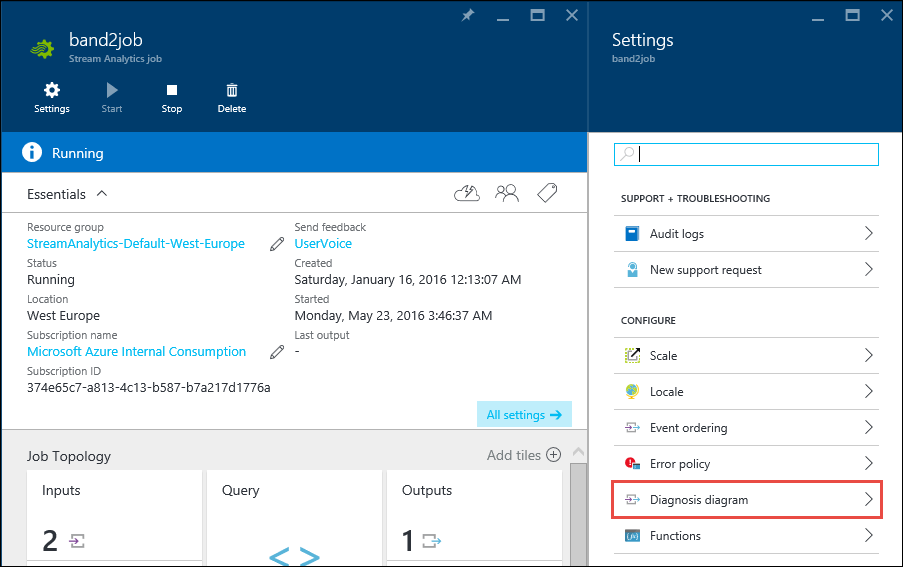
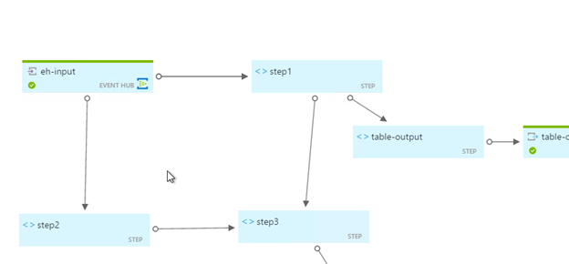
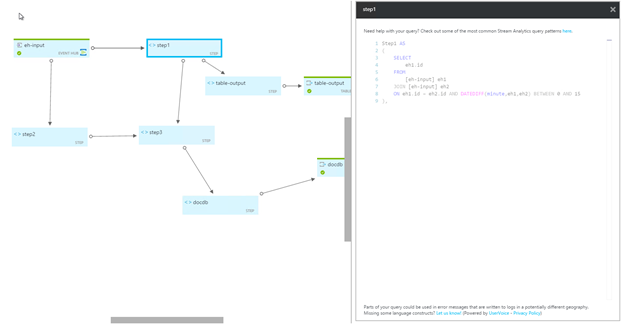

<properties
	pageTitle="Troubleshooting and visualization of Stream Analytics jobs | Microsoft Azure"
	description="Learn how to visualize a Stream Analytics job pipeline for self-service troubleshooting using the diagnostics diagram feature."
	keywords=""
	documentationCenter=""
	services="stream-analytics"
	authors="jeffstokes72"
	manager="paulettm"
	editor="cgronlun"
/>

<tags
	ms.service="stream-analytics"
	ms.devlang="na"
	ms.topic="article"
	ms.tgt_pltfrm="na"
	ms.workload="data-services"
	ms.date="05/31/2016"
	ms.author="jeffstok"
/>

# Visualize a Stream Analytics job pipeline for troubleshooting

Stream Analytics provides the ability to visualize the pipeline showing the inputs, outputs and high level processing components to enable the identification and isolation of issues. In addition, it provides information on the state of all of the inputs, outputs along with intermediate query steps. 

When a job that was previously producing the expected output stops producing the expected output the visualization solution can be used by customers to quickly isolate the source of the problem. For example, when one or more inputs stop producing events, the visualization tool can help identify the inputs that have diagnostic messages.
 
Additionally when the connectivity with one or more inputs and outputs is broken the visualization can, at a glance, assist to identify the inputs and outputs with connectivity problems.

## Using the diagnosis diagram tool

To access this visualizer, simply click on the “Diagnosis diagram” button in the “Settings” blade of the of the Stream Analytics job.

Every input and output is color coded to indicate the current state of that component, as shown below.

When the user wants to look at intermediate query steps to understand the data flow patterns inside a job, the visualization tool provides a view of the breakdown of the query into its component steps and the flow sequence. Clicking on each intermediate query step will show the corresponding section in a query editing pane as illustrated. 

## Next steps

- [Introduction to Azure Stream Analytics](stream-analytics-introduction.md)
- [Get started using Azure Stream Analytics](stream-analytics-get-started.md)
- [Scale Azure Stream Analytics jobs](stream-analytics-scale-jobs.md)
- [Azure Stream Analytics Query Language Reference](https://msdn.microsoft.com/library/azure/dn834998.aspx)
- [Azure Stream Analytics Management REST API Reference](https://msdn.microsoft.com/library/azure/dn835031.aspx)
