<properties 
	pageTitle="Build a real time processing job in Stream Analytics | Microsoft Azure" 
	description="Stream Analytics tollbooth tutorial using both streaming and reference data"
	keywords="reference data"
	documentationCenter=""
	services="stream-analytics"
	authors="jeffstokes72" 
	manager="paulettm" 
	editor="cgronlun"
/>

<tags 
	ms.service="stream-analytics" 
	ms.devlang="na" 
	ms.topic="article" 
	ms.tgt_pltfrm="na" 
	ms.workload="data-services" 
	ms.date="01/11/2016" 
	ms.author="jeffstok"
/>

# Build a real time processing job in Stream Analytics

Azure Stream Analytics data stream processing service enables developers to easily tackle the space of data in motion by combining streams of data such as click-streams, logs and device generated events with historical records or reference data to derive business insights easily and quickly. Follow this tutorial to gain insights on real-time data streams and leverage reference data sets for thresholds and comparisons. Being a fully managed, real-time stream computation service hosted in Microsoft Azure, Stream Analytics provides built-in resiliency, low latency, and scalability to quickly address a variety of use cases.

This tutorial describes a toll booth scenario. Tolling stations are a common phenomenon encountered worldwide. Each toll station has multiple toll booths, which may be manual – meaning that the vehicle stops at the toll to pay, or automated – where a sensor placed on top of the booth scans a sensor affixed to the windshield of a vehicle as it passes the toll booth. It is easy to visualize the passage of vehicles through these toll stations as an event stream over which interesting operations can be performed.
  
  
  
## Configure environment
To perform this lab, a Microsoft Azure subscription is required. Microsoft offers free trial for Microsoft Azure services as described below.
If you do not have an Azure account, you can request a free trial version by going to [http://azure.microsoft.com/pricing/free-trial/](https://azure.microsoft.com/pricing/free-trial/ "Build a real time processing job in Stream Analytics - Free Trial Link").  

Note that to sign up for a free trial, you will need a mobile device that can receive text messages and a valid credit card. Also be sure to follow the “Clean up your Azure account” section steps at the end of this exercise so that you can make the most use of your $200 free Azure credit.

A download of data will be necessary for this tutorial. The current version can be found in the [Stream Analytics GitHub Samples](https://github.com/streamanalytics/samples/releases) area. Download the zip and extract to a local working directory for later use.

## Data streams

The data input for this tutorial consists of two data streams produced by sensors installed in the entrance and exit of the toll stations In addition, a static look up data set with vehicle registration data is leveraged.

### Entry data stream
Entry data stream contains information about cars entering toll stations.  
  
| Toll Id | EntryTime               | License Plate | State | Make   | Model   | Vehicle Type | Vehicle Weight | Toll  | Tag       |
|---------|-------------------------|---------------|-------|--------|---------|--------------|----------------|-------|-----------|
| 1       | 2014-09-10 12:01:00.000 | JNB7001       | NY    | Honda  | CRV     | 1            | 0              | 7     |           |
| 1       | 2014-09-10 12:02:00.000 | YXZ1001       | NY    | Toyota | Camry   | 1            | 0              | 4     | 123456789 |
| 3       | 2014-09-10 12:02:00.000 | ABC1004       | CT    | Ford   | Taurus  | 1            | 0              | 5     | 456789123 |
| 2       | 2014-09-10 12:03:00.000 | XYZ1003       | CT    | Toyota | Corolla | 1            | 0              | 4     |           |
| 1       | 2014-09-10 12:03:00.000 | BNJ1007       | NY    | Honda  | CRV     | 1            | 0              | 5     | 789123456 |
| 2       | 2014-09-10 12:05:00.000 | CDE1007       | NJ    | Toyota | 4x4     | 1            | 0              | 6     | 321987654 |
  
  
The data field definitions are as follows:  
  
| Data Field    | Data Definition                                                                                |
|---------------|------------------------------------------------------------------------------------------------|
| ---           | ---                                                                                            |
| TollID        | Toll booth ID uniquely identifying a toll booth                                                |
| EntryTime     | The date and time of entry of the vehicle to Toll Booth in UTC format                          |
| LicensePlate  | License Plate number of the vehicle                                                            |
| State         | Is a State in United States                                                                    |
| Make          | The manufacturer of the automobile                                                             |
| Model         | Model number of the automobile                                                                 |
| VehicleType   | 1 for Passenger and 2 for Commercial vehicles                                                  |
| VehicleWeight | Vehicle weight in tons; 0 for passenger vehicles                                               |
| Toll          | The toll value in USD                                                                          |
| Tag           | e-Tag on the automobile that automates payment, left blank where the payment was done manually |
  
### Exit data stream
Exit data stream contains information about cars exiting the toll station.  
  
| TollId | ExitTime | LicensePlate |
|---|---|---|
| 1 | 2014-09-10T12:03:00.0000000Z | JNB7001 |
| 1 | 2014-09-10T12:03:00.0000000Z | YXZ1001 |
| 3 | 2014-09-10T12:04:00.0000000Z | ABC1004 |
| 2 | 2014-09-10T12:07:00.0000000Z | XYZ1003 |
| 1 | 2014-09-10T12:08:00.0000000Z | BNJ1007 |
| 2 | 2014-09-10T12:07:00.0000000Z | CDE1007 |
  
The data field definitions are as follows:  
  
| Data Field | Data Definition |
|---|---|
| TollID | Toll booth ID uniquely identifying a toll booth |
| ExitTime | The date and time of exit of the vehicle from Toll Booth in UTC format |
| LicensePlate | License Plate number of the vehicle |

### Commercial vehicle data (reference data)
In addition to the streamed data from the toll sensors, a static snapshot of the commercial vehicle registrations database is leveraged as reference data.  
  
| LicensePlate | RegistrationId | Expired |
|---|---|---|
| SVT6023 | 285429838 | 1 |
| XLZ3463 | 362715656 | 0 |
| BAC1005 | 876133137 | 1 |
| RIV8632 | 992711956 | 0 |
| SNY7188 | 592133890 | 0 |
| ELH9896 | 678427724 | 1 |
  
  
| Data Field | Data Definition |
|---|---|
| LicensePlate | License Plate number of the vehicle |
| RegistrationID | Registration number of the vehicle |
| Expired | This field is 0 if the vehicle registration is active, 1 if it is expired |
  
## Provision Resources
This tutorial will walk through the creation of 2 Azure Event Hubs to receive the “Entry” and “Exit” data streams. Azure SQL Database is used to output the job results. Azure Blob Storage will be used to  store reference data about vehicle registrations.

Download the TollApp sample with manual. The current version can be found in the [Stream Analytics GitHub Samples](https://github.com/streamanalytics/samples/releases) area. Download the zip and extract to a local working directory. The `Setup.ps1` PowerShell script in the local working directory the zip is extracted to can be used to create all the required resources. In the interest of time for this tutorial execute the script to setup the environment. Download and save the supporting TollApp folder and files as well. Be sure to download the latest available release.

Open a “Microsoft Azure PowerShell” window as Administrator. If Azure PowerShell is not yet installed, follow the instructions at [http://azure.microsoft.com/documentation/articles/install-configure-powershell/](./install-configure-powershell.md) install it.

Now set the ExecutionPolicy for PowerShell so the script can run. Be sure the Azure PowerShell window is running as Administrator. Type `Set-ExecutionPolicy unrestricted` and hit enter. When prompted, type “Y”.
  
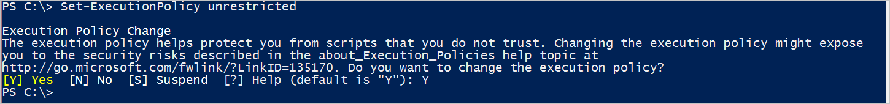  
  
Next type `Get-ExecutionPolicy` and hit enter to validate the command worked.
  
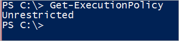  
  
Change directories in the PowerShell window to the directory with the downloaded scripts and generator application.
  
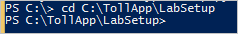  
  
Type `.\Setup.ps1` to set up the Azure account, create and configure all required resources and start generating events.

The script will open the “Sign In” page for Windows Azure. Enter account credentials as requested.
  
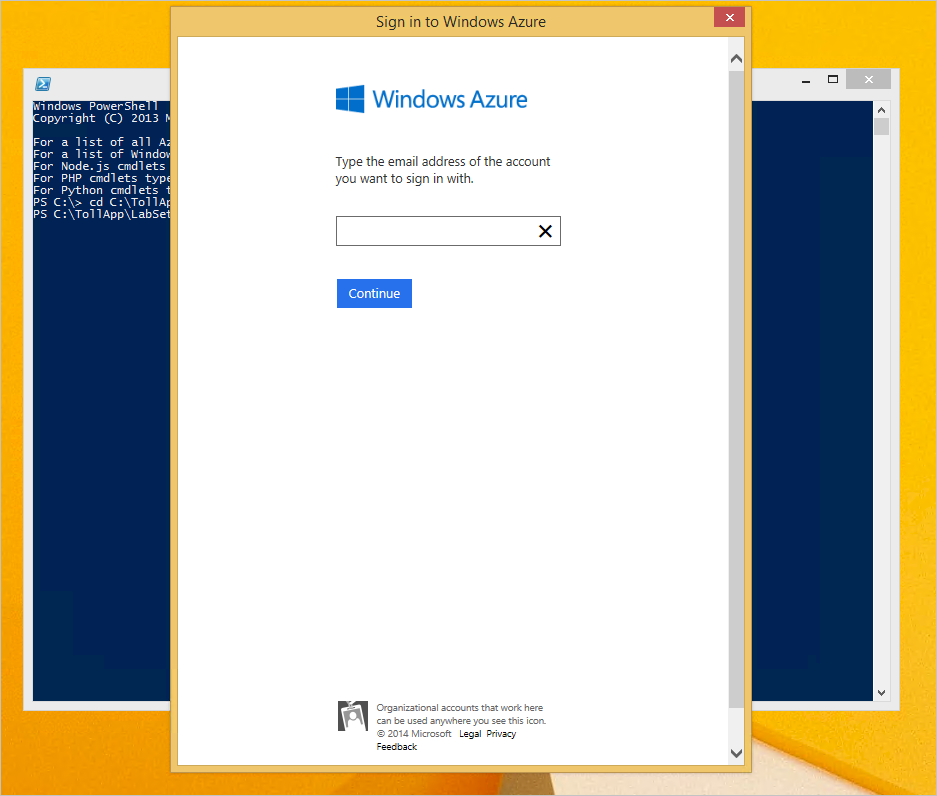  
  
Please note that if the Azure account has access to multiple subscriptions, the script will prompt to enter the subscription name for use in the lab.

The script can take several minutes to run. Once completed, the output should look like the screenshot below.
  
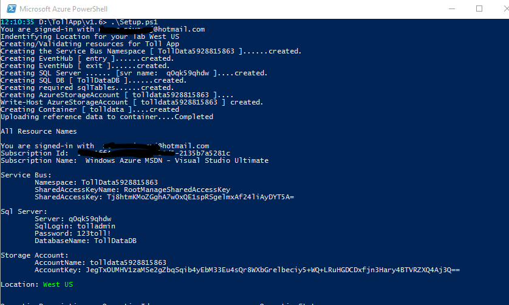  
  
Another window will be present, similar to the screen shot below. This is the simulator application that sends events to Event Hub. It is required to run the lab exercises. **Do not stop the application or close this window until the the lab is finished.**
  
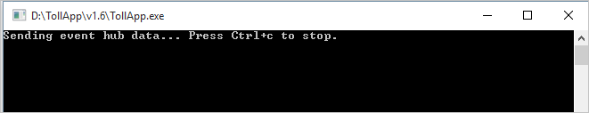  
  
The created resources should populate in Azure Management Portal and be visible. To verify and see the objects go to [https://manage.windowsazure.com](https://manage.windowsazure.com "Build a real time processing job in Stream Analytics manage Windows Azure link") and login with the same account credentials used for the script setup.

### Event Hub Review
Click on “Service Bus” menu item on the left side of the Azure Management Portal to see Event Hubs created by the script from the previous section.
Note that by default all available namespaces in the subscription are visible. Click on the one starting with “TollData”. (TollData4637388511 in this example). Click on “Event Hubs” tab.
  
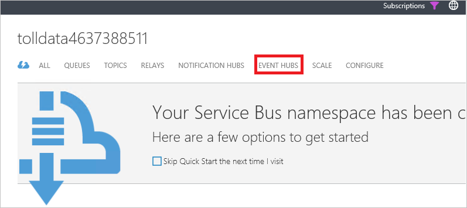  
  
Two Event Hubs should be visible, named entry and exit created in this namespace.
  
  
  
### Azure Storage Container Review
Click on “Storage” menu item on the left side of the Azure Management Portal to see storage container used in the Lab.
Click on the one starting with “tolldata”. (tolldata4637388511 in this example). Open “Containers” tab to see the created container.
  
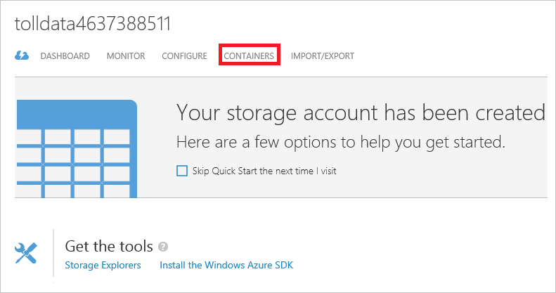  
  
Click on “tolldata” container to see uploaded JSON file with vehicle registration data.
  
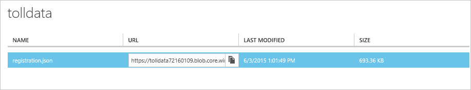  
  
### Azure SQL Database Review
Click on “SQL Databases” menu item on the left side of the Azure Management Portal to see Azure SQL Database that will be used in the Lab. Click on “TollDataDB” and copy the server name without the port number (<serverName>.database.windows.net for example). This will be needed in the next step.
  
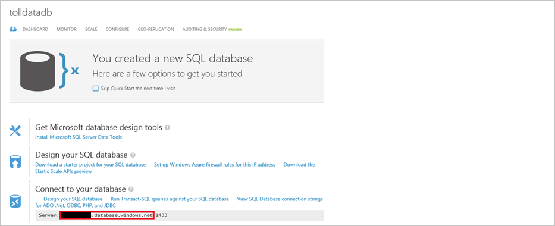  
  
## Connect Visual Studio to Azure SQL Database
Visual Studio will be leveraged to review the query results in the output database.  
  
To do so connect to the Azure database (the destination) from Visual Studio:  
  
1. Open Visual Studio then click “Tools” and then “Connect to Database…” menu item.  
2. If prompted, select “Microsoft SQL Server” as a data source.  
    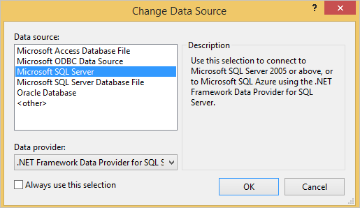  
3. In the Server Name field paste the name of the SQL Server copied in the previous section from Azure Portal (i.e. <serverName>.database.windows.net).  
4. In the Authentication field choose SQL Server Authentication.  
5. Enter a LOGIN NAME as “tolladmin” and LOGIN PASSWORD as “123toll!”.  
6. Choose TollDataDB as the database.  
      
7. Click OK.  
8. Open Server Explorer.  
    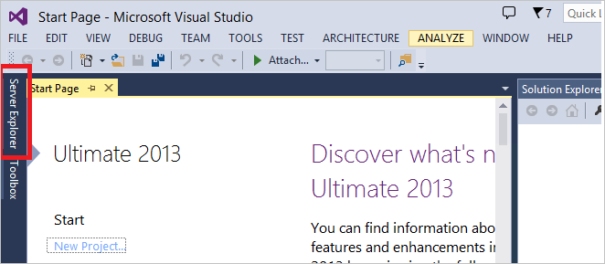  
9. Review the four tables created in the TollDataDB database.  
    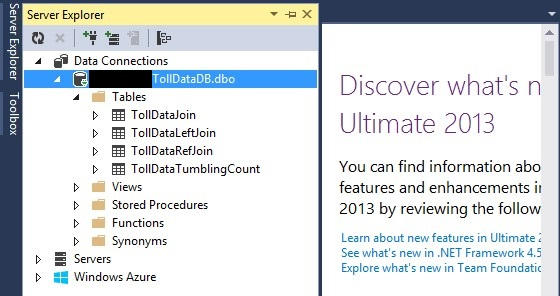  

## Event Generator - TollApp Sample Project
The PowerShell script automatically starts sending events using the TollApp sample application program. No additional steps are needed. However, if you are interested in the implementation details, you can find the source code of the TollApp application under in GitHub samples/TollApp.
  
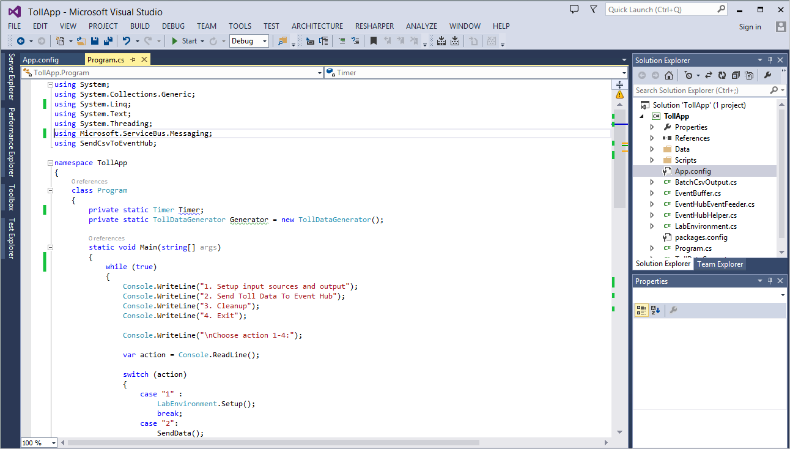  
  
## Create the Stream Analytics Job
In the Azure portal select Stream Analytics and click “New” in the bottom left hand corner of the page to create a new job. Then click “Quick Create” and select "South Central US" as the region.
  
  
  
For “Regional Monitoring Storage Account” setting, select “Create new storage account” and give it any unique name. Azure Stream Analytics will use this account to store monitoring information for your future jobs. Then click “Create Stream Analytics Job” at the bottom of the page.
  
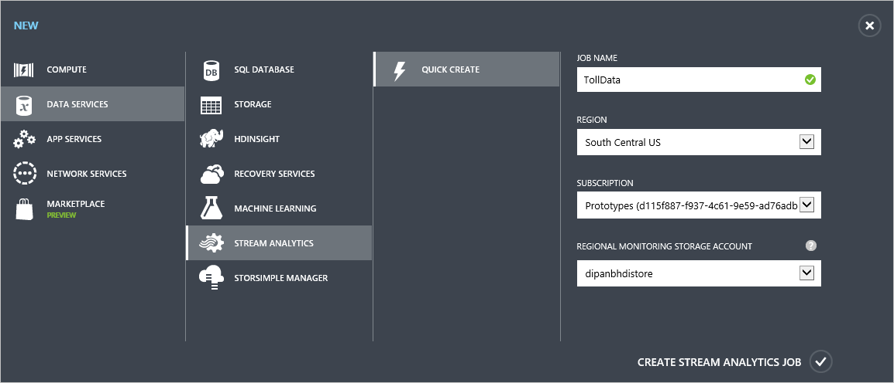  
  
## Define Input Sources
Select the created analytics job in the portal. Then select the  “Inputs” tab to define the source data and select “Add an Input”.
  
  
  
1. Select “Data Stream” on the first page.  
2. Select “Event Hub” on the second page of the wizard.  
3. Enter “EntryStream” as Input Alias.  
4. Click on “Event Hub” drop down and select the one starting with “TollData” (e.g. TollData9518658221).  
5. Select “entry” as Event Hub name and “all” as Event Hub policy name.  

The settings will look like:
  
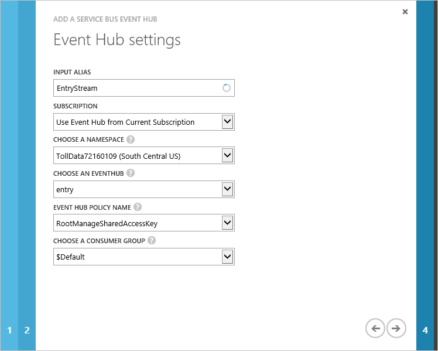  
  
On the next page verify the values are set as JSON and UTF8 encoding. Then simply select OK at the bottom of the dialog to finish the wizard.

Follow the same sequence of steps to create the second Event Hub Input for the stream with toll exit events. Validate that on 3rd page values as as shown on the screenshot below.
  
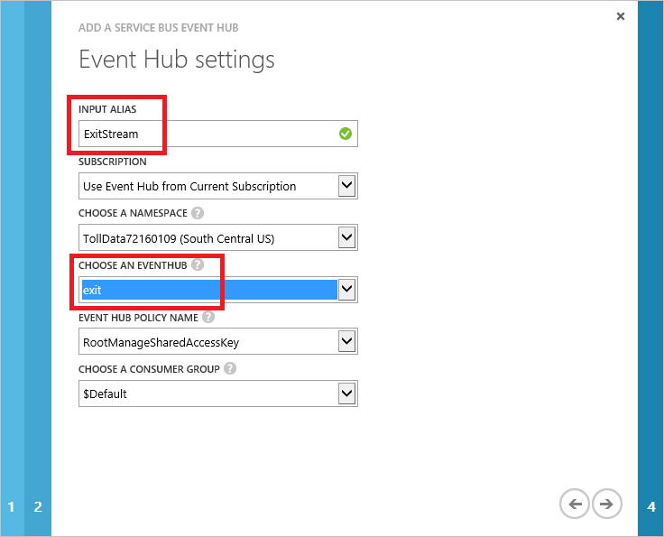  
  
You now have two input streams defined like the display below:
  
  
  
Next, add “Reference” data input for the blob file with car registration data. Click “Add Input”. Select “Reference Data” On the next page, select the storage account starting with “tolldata”. Container name should be “tolldata” and blob name under Pattern Path should be “registration.json”. This file name is case sensitive and should be all in lowercase. Select the values as shown below on the next page and click OK to finish the wizard.
  
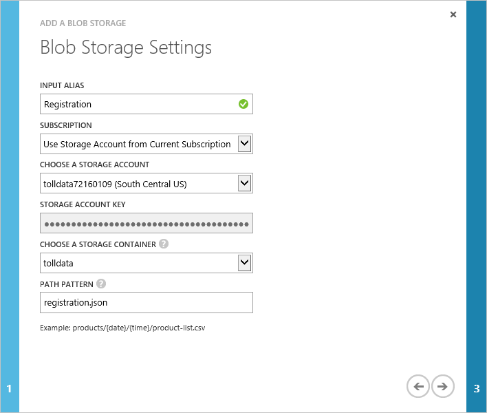  
  
At this point in the tutorial, all data inputs are defined.
  
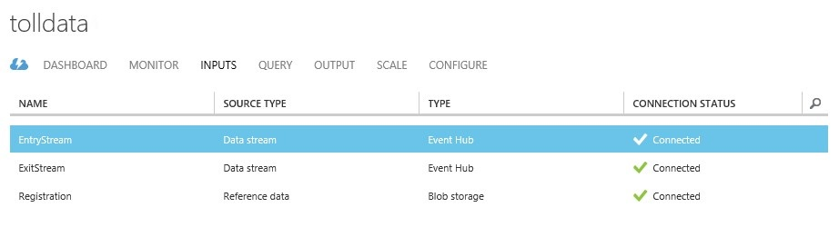  
  
## Define Output Data Connections
  
1.  Go to “Output” tab and click “Add an output”.  
2.  Select “Sql Database”.  
3.  Select the server name that was used in “Connect to Database from Visual Studio”.  
4.  The database name should be "TollDataDB".  
5.  Enter “tolladmin” as the user name and “123toll!” as the password.  
6.  The table name should be set to “TollDataRefJoin”.  

The settings should look as below:
  
  
  
## Azure Stream Analytics Job Query
The Query tab contains a T-SQL query that performs the transformation over the incoming data. Throughout the lab questions will be presented and addressed by using the toll booth data stream and Stream Analytics queries to provide an answer. Before starting the first Azure Stream Analytics job, explore a few scenarios and query syntax.

For an example exercise, count the number of vehicles that enter a toll booth. Since this is a continuous stream of events, it is essential that a “period of time” be defined. Therefore the question would to be “Number of vehicles entering a toll booth every 3 minutes”. In Stream Analytics Query Language this is referred to as the Tumbling Count. Examine the query that could be used to answer this question:

    SELECT TollId, System.Timestamp AS WindowEnd, COUNT(*) AS Count
    FROM EntryStream TIMESTAMP BY EntryTime
    GROUP BY TUMBLINGWINDOW(minute, 3), TollId

From the example above, one can observe that Stream Analytics utilizes a SQL-like query language with a few additional extensions to enable specifying time related aspects of the query.

## Timestamp concepts

In any temporal system like Azure Stream Analytics, it’s essential to understand the progress of time. Every event that flows through the system comes with a timestamp. In other words, every event in the system depicts a point in time. This timestamp may be defined by the Application (e.g. specific field in the event) or the user can specify it in the query using the “TIMESTAMP BY” clause (e.g. EntryTime column in the example provided).

Alternatively, the system can assign the timestamp based on the event arrival time. Please note that in this case the value of the timestamp is potentially subject to certain factors such as network latencies. This can negatively affect accuracy of the further computations and analysis. The timestamp property of any event can be accessed using the System.Timestamp property (which needs to be used with an alias). For any aggregate event like Sum(), Avg(), etc., produced as output from a window operation, it will also have a timestamp property like any other input event entering into the system. This timestamp of the output event aligns to the end time of the window.

    SELECT TollId, System.Timestamp AS WindowEnd , COUNT (*) AS Count
    FROM EntryStream TIMESTAMP BY EntryTime
    GROUP BY TUMBLINGWINDOW (minute,3), TollId

## Time Windows - time line
In applications that process real-time events, a common requirement is to perform some set-based computation (aggregation) or other operations over subsets of events that fall within some period of time. In Azure Stream Analytics, these subsets of events are defined through windows. A window contains event data along a time line and enables you to perform various operations against the events within that window. For example, you may want to sum the values of payload fields in a given window as shown in the following illustration.

Stream Analytics supports several functions to define window aggregates (Tumbling, Hopping, Sliding windows). Please refer to the Query Language Reference Guide in MSDN for more details.

Our sample query uses TumblingWindow function to specify the size of the window

`GROUP BY TUMBLINGWINDOW(minute,3)`

## Validating Stream Analytics queries

Now that we have written our first Azure Stream Analytics query, it is time to test it out using sample data files located in your TollApp folder in the path below:

..\TollApp\TollApp\LabSetup\Data

This folder contains the following files:  
  
1. Entry.json
2. Exit.json
3. Registration.json

### QUESTION 1 - NUMBER OF VEHICLES ENTERING A TOLL BOOTH
Open the Azure Management portal and navigate to your created Azure Stream Analytic job. Open the Query tab and copy paste Query from the previous section.
To validate this query against sample data, click the Test button. 
  
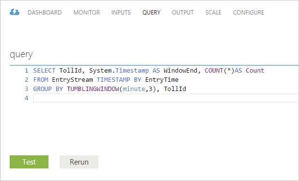  
  
In the dialog that opens, navigate to Entry.json, a file with sample data from the EntryTime event stream.
  
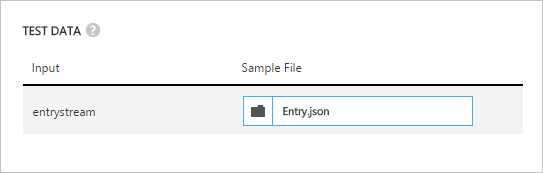  
  
Validate that the output of the query is as expected:
  
  
  
### QUESTION 2 - REPORT TOTAL TIME FOR EACH CAR TO PASS THROUGH THE TOLL BOOTH
We want to find average time required for the car to pass the toll to assess efficiency and customer experience.
For this we need to join the stream containing EntryTime with the stream containing ExitTime. We will join the streams on TollId and LicencePlate columns. JOIN operator requires specifying a temporal wiggle room describing acceptable time difference between the joined events. We will use DATEDIFF function to specify that events should be no more than 15 minutes from each other. We will also apply DATEDIFF function to Exit and Entry times to compute actual time a car spends in the toll. Note the difference of the use of DATEDIFF when used in a SELECT statement compared to a JOIN condition.
  
  
  
To test this query, update the query on the Query tab of your job:

    SELECT EntryStream.TollId, EntryTime, ExitStream.ExitTime, EntryStream.LicensePlate, DATEDIFF (minute , EntryStream.EntryTime, ExitStream .ExitTime) AS Duration InMinutes
    FROM EntryStream TIMESTAMP BY EntryTime
    JOIN ExitStream TIMESTAMP BY ExitTim e
    ON (Entry Stream.TollId= ExitStream.TollId AND EntryStream.LicensePlate = ExitStream.LicensePlate)
    AND DATEDIFF (minute, EntryStream, ExitStream ) BETWEEN 0 AND 15

Click test and specify sample input files for EntryTime and ExitTime.
  
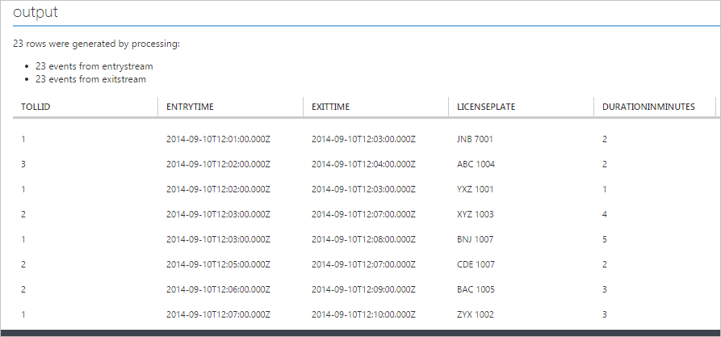  
  
Click the checkbox to test the query and view output:
  
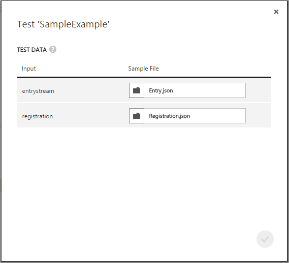  
  
### QUESTION 3 – REPORT ALL COMMERCIAL VEHICLES WITH EXPIRED REGISTRATION
Azure Stream Analytics can use static snapshots of data to join with temporal data streams. To demonstrate this capability we will use the following sample question.
If a commercial vehicle is registered with the Toll Company, they can pass through the toll booth without being stopped for inspection. We will use Commercial Vehicle Registration lookup table to identify all commercial vehicles with expired registration.

    SELECT EntryStream.EntryTime, EntryStream.LicensePlate, EntryStream.TollId, Registration.RegistrationId
    FROM EntryStream TIMESTAMP BY EntryTime
    JOIN Registration
    ON EntryStream.LicensePlate = Registration.LicensePlate
    WHERE Registration.Expired = '1'

Note that testing a query with Reference Data requires that an input source for the Reference Data is defined, which we have done in Step 5.
To test this query, paste the query into the Query tab, click Test, and specify the 2 input sources:
  
  
  
View the output of the query:
  
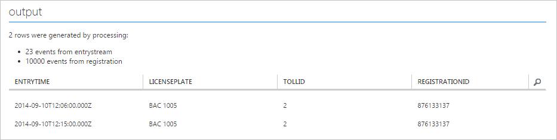  
  
## START THE STREAM ANALYTICS JOB

Now as we have written our first Azure Stream Analytics query, it is time to finish the configuration and start the job. Save the query from Question 3, which will produce output that matches the schema of our output table TollDataRefJoin. Navigate to the job Dashboard and click Start.
  
  
  
In the dialog that appears, change the Start Output time to Custom Time. Edit the Hour and set it to an hour back. This will ensure that all events are processed from the Event Hub since the moment the job started generating the events in the beginning of the lab. Now click the check mark to start the job. Starting the job can take a few minutes. The status on the top-level page for Stream Analytics should update.
  
  
  
## CHECK RESULTS IN VISUAL STUDIO

Open Visual Studio Server Explorer and right click TollDataRefJoin table. Select “Show Table Data” to see the output of the job.

  
  
  
## SCALING OUT AZURE STREAM ANALYTICS JOBS

Azure Stream Analytics is designed to elastically scale and be able to handle high load of data. The Azure Stream Analytics query can use a PARTITION BY clause to tell the system that this step will scale out. PartitionId is a special column added by the system that matches the partition id of the input (Event Hub).

	SELECT TollId, System.Timestamp AS WindowEnd , COUNT (*) AS Count
	FROM EntryStream TIMESTAM P BY EntryTime PARTITION BY PartitionId
	GROUP BY TUMBLINGWINDOW (minute,3), TollId , PartitionId

Stop the current job, update the query in Query tab and open Scale tab. Streaming units define the amount of compute power the job can receive. Move the slider to 6.
  
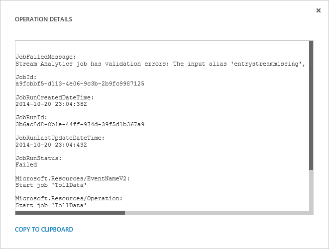  
  
Please go to the output tab and change SQL table name to “TollDataTumblingCountPartitioned”.

Now, if you start the job, Azure Stream Analytics will be able to distribute work across more compute resources and achieve better throughput. Please note that TollApp application is also sending events partitioned by TollId.
  
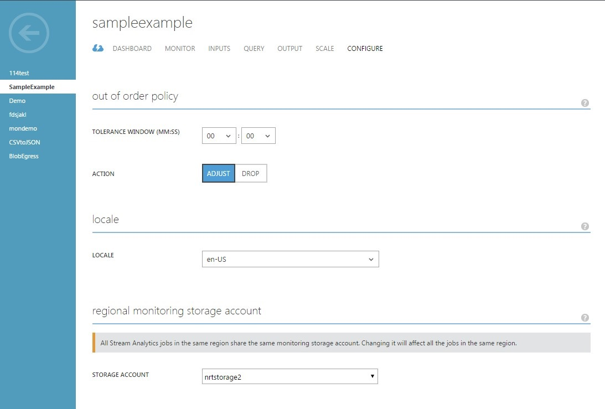  
  
## Monitoring jobs

Monitoring tab contains statistics about the running job.
  
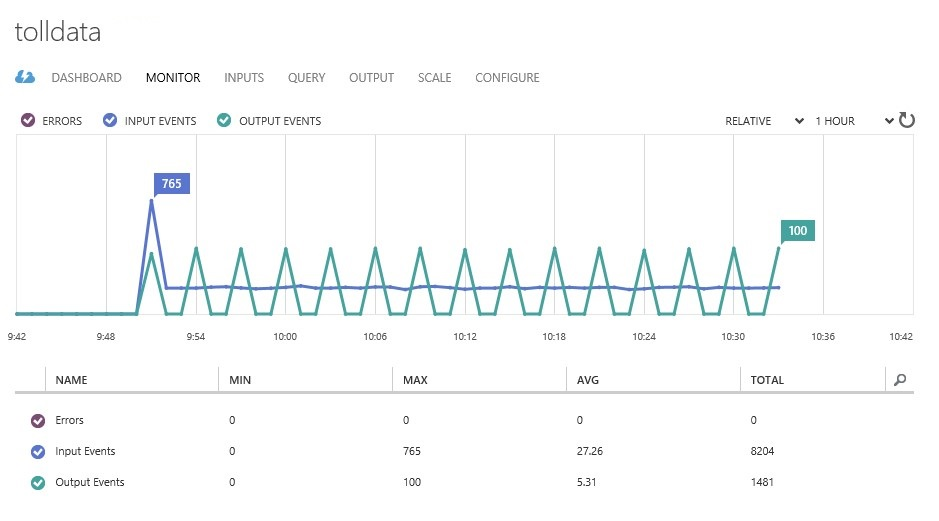  
  
You can access Operation Logs from the Dashboard tab.
  
  
  
  
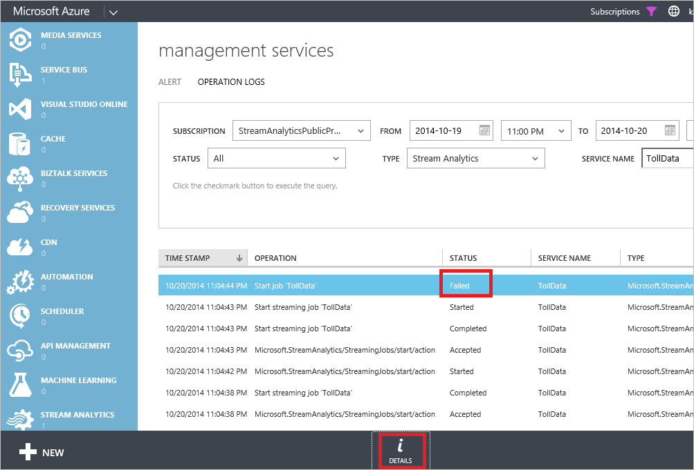  
  
To see additional information about a particular event, select the event and click “Details” button.
  
  
  
## Ordering events

The order of the events is very important for the Stream Analytics query to produce correct answers. Since all the events are transmitted over the network, there is no guarantee that they will arrive in the same order as they were sent. There are two types of policies that can be used to specify how out of order events should be handled. They are Adjust (default) and Drop.

**ADJUST POLICY (DEFAULT)**
The Adjust Policy is the default policy setting for an Azure Stream Analytics job. In this mode, the timestamp of any late arriving out of order event is changed and adjusted to the timestamp of the last received event.

**DROP POLICY**
Setting the policy as Drop instructs Stream Analytics to drop all events that occur out of order. This is especially useful if the job needs to prioritize low latency over absolute correctness.

**TOLERANCE WINDOW**
There are cases where the amount of expected disorder can be estimated by the user. For example if you think your events are not going to be delayed for more than 30 sec, you can set that as your Tolerance Window and provide a leeway for your incoming events. In this case all events arriving within 30 seconds will be sent to the engine in proper order. It is important to understand that you are introducing a latency for the amount of time you set in the tolerance window and if you have a high throughput of events, you are also adding memory pressure.
  
  
  

## Conclusion

In this lab we provided introduction to the Azure Stream Analytics service. We demonstrated how to configure inputs and outputs for the Stream Analytics job. Using the Toll Data sample scenario we explained common types of problems that arise in the space of data in motion and how they can be solved with simple SQL-like queries in Azure Stream Analytics. We described SQL extension constructs for working with temporal data. We showed how to join data streams, how to enrich the data stream with static reference data. We explained how to scale out a query to achieve higher throughput.
While this lab provides good introductory coverage, it is not complete by any means. Please refer to documentation on MSDN to learn more about Azure Stream Analytics.

## Cleanup the Azure Account

Stop the Stream Analytics Job from the Azure Portal.
To cleanup the Azure Account, in the PowerShell window type “.\Cleanup.ps1” This will start the script that deletes resources used in the lab.
Please note, **that resources are identified by the name. Make sure you carefully review each item before confirming removal.**
  
  
  
