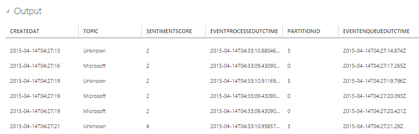
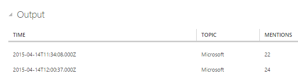

<properties
	pageTitle="Real-time Twitter sentiment analysis with Stream Analytics | Microsoft Azure"
	description="Learn how to use Stream Analytics for real-time Twitter sentiment analysis. Step-by-step guidance from event generation to data on a live dashboard."
	keywords="real-time twitter trend analysis, sentiment analysis, social media analysis, trend analysis example"
	services="stream-analytics"
	documentationCenter=""
	authors="jeffstokes72"
	manager="paulettm"
	editor="cgronlun"/>

<tags
	ms.service="stream-analytics"
	ms.devlang="na"
	ms.topic="article"
	ms.tgt_pltfrm="na"
	ms.workload="big-data"
	ms.date="07/27/2016"
	ms.author="jeffstok"/>

# Social media analysis: Real-time Twitter sentiment analysis in Azure Stream Analytics

Learn how to build a sentiment analysis solution for social media analytics by bringing real-time Twitter events into Event Hubs. You'll write a Stream Analytics query to analyze the data and then either store the results for later perusal or use a dashboard to provide insights in real time using [Power BI](https://powerbi.com/).

Social media analytics tools help organizations understand trending topics, meaning subjects and attitudes with a high volume of posts in social media. Sentiment analysis - also called "opinion mining" - uses social media analytics tools to determine attitudes toward a product, idea, and so on. Real-time Twitter trend analysis is a great example because the hashtag subscription model allows you to listen to particular keywords and develop sentiment analysis on the feed. 

## Scenario - Sentiment Analysis in Real Time

A news media website is interested in getting an edge over its competitors by featuring site content that is immediately relevant to its readers. They use social media analysis on topics relevant to their readers by doing real time sentiment analysis on Twitter data. Specifically, to identify what topics are trending in real time on Twitter, they need real-time analytics about the tweet volume and sentiment for key topics. So in essence they need a sentiment analysis analytics engine based on this social media feed.

## Prerequisites
1.	Twitter account and [OAuth access token](https://dev.twitter.com/oauth/overview/application-owner-access-tokens) 
2.	[TwitterClient.zip](http://download.microsoft.com/download/1/7/4/1744EE47-63D0-4B9D-9ECF-E379D15F4586/TwitterClient.zip) from the Microsoft Download Center
3.	Optional: Source code for twitter client from [Github](https://github.com/Azure/azure-stream-analytics/tree/master/DataGenerators/TwitterClient) 

## Create an Event Hub input and a Consumer Group

The sample application will generate events and push them to an Event Hubs instance (an Event Hub, for short). Service Bus Event Hubs are the preferred method of event ingestion for Stream Analytics. See Event Hubs documentation in [Service Bus documentation](/documentation/services/service-bus/)

Follow the steps below to create an Event Hub.

1.	In the Azure Portal click **NEW** > **APP SERVICES** > **SERVICE BUS** > **EVENT HUB** > **QUICK CREATE** and provide a name, region, and new or existing namespace to create a new Event Hub.  
2.	As a best practice, each Stream Analytics job should read from a single Event Hubs Consumer Group. We will walk you through the process of creating a Consumer Group below and you can learn more about them here.  To create a Consumer Group, navigate to the newly created Event Hub and click the **CONSUMER GROUPS** tab, then click **CREATE** on the bottom of the page and provide a name for your Consumer Group.
3.	To grant access to the Event Hub, we will need to create a shared access policy.  Click the **CONFIGURE** tab of your Event Hub.
4.	Under **SHARED ACCESS POLICIES**, create a new policy with **MANAGE** permissions.

  	

5.	Click **SAVE** at the bottom of the page.
6.	Navigate to the **DASHBOARD** and click **CONNECTION INFORMATION** at the bottom of the page and copy and save the connection information. (Use the copy icon that appears under the search icon.)

## Configure and start the Twitter client application

We have provided a client application that will tap into Twitter data via [Twitter's Streaming APIs](https://dev.twitter.com/streaming/overview) to collect Tweet events about a parameterized set of topics. The 3rd party open source tool [Sentiment140](http://help.sentiment140.com/) is used to assign a sentiment value to each tweet (0: negative, 2: neutral, 4: positive) and then Tweet events are pushed to Event Hub.  

Follow these steps to set up the application:

1.	[Download the TwitterClient solution](http://download.microsoft.com/download/1/7/4/1744EE47-63D0-4B9D-9ECF-E379D15F4586/TwitterClient.zip)
2.	Open TwitterClient.exe.config and replace oauth_consumer_key, oauth_consumer_secret, oauth_token, oauth_token_secret with Twitter tokens with your values.  

	[Steps to generate an OAuth access token](https://dev.twitter.com/oauth/overview/application-owner-access-tokens)  

	Note that you will need to make an empty application to generate a token.  
3.	Replace the EventHubConnectionString and EventHubName values in TwitterClient.exe.config with your Event Hub connection string and name. The connection string you copied earlier gives you both the Event hub connection string and the name, so be aware to separate them and put each in the correct field.
4.	*Optional:* Adjust the keywords to search for.  As a default, this application looks for "Azure,Skype,XBox,Microsoft,Seattle".  You can adjust the values for twitter_keywords in TwitterClient.exe.config, if desired.
5.	Run **TwitterClient.exe** to start your application. You will see Tweet events with the CreatedAt, Topic, and SentimentScore values being sent to your Event Hub:

	

## Create Stream Analytics job

Now that we have Tweet events streaming in real-time from Twitter, we can set up a Stream Analytics job to analyze these events in real time.

### Provision a Stream Analytics job

1.	In the [Azure Portal](https://manage.windowsazure.com/), click **NEW** > **DATA SERVICES** > **STREAM ANALYTICS** > **QUICK CREATE**.
2.	Specify the following values, and then click **CREATE STREAM ANALYTICS JOB**:

	* **JOB NAME**: Enter a job name.
	* **REGION**: Select the region where you want to run the job. Consider placing the job and the event hub in the same region to ensure better performance and to ensure that you will not be paying to transfer data between regions.
	* **STORAGE ACCOUNT**: Choose the Storage account that you would like to use to store monitoring data for all Stream Analytics jobs running within this region. You have the option to choose an existing Storage account or to create a new one.

3.	Click **STREAM ANALYTICS** in the left pane to list the Stream Analytics jobs.  
	

4.	The new job will be shown with a status of **CREATED**. Notice that the **START** button on the bottom of the page is disabled. You must configure the job input, output, and query before you can start the job.

### Specify job input
1.	In your Stream Analytics job click **INPUTS** from the top of the page, and then click **ADD INPUT**. The dialog that opens will walk you through a number of steps to set up your input.
2.	Select **DATA STREAM**, and then click the right button.
3.	Select **EVENT HUB**, and then click the right button.
4.	Type or select the following values on the third page:

	* **INPUT ALIAS**: Enter a friendly name for this job input, such as TwitterStream. Note that you will be using this name in the query later on.
	**EVENT HUB**: If the Event Hub you created is in the same subscription as the Stream Analytics job, select the namespace that the event hub is in.

		If your event hub is in a different subscription, select **Use Event Hub from Another Subscription**, and then manually enter information for **SERVICE BUS NAMESPACE**, **EVENT HUB NAME**, **EVENT HUB POLICY NAME**, **EVENT HUB POLICY KEY**, and **EVENT HUB PARTITION COUNT**.

	* **EVENT HUB NAME**: Select the name of the Event Hub
	* **EVENT HUB POLICY NAME**: Select the event-hub policy created earlier in this tutorial.
	* **EVENT HUB CONSUMER GROUP**: Type in the Consumer Group created earlier in this tutorial.
5.	Click the right button.
6.	Specify the following values:

	* **EVENT SERIALIZER FORMAT**: JSON
	* **ENCODING**: UTF8

7.	Click the check button to add this source and to verify that Stream Analytics can successfully connect to the event hub.

### Specify job query

Stream Analytics supports a simple, declarative query model for describing transformations. To learn more about the language, see the [Azure Stream Analytics Query Language Reference](https://msdn.microsoft.com/library/azure/dn834998.aspx).  This tutorial will help you author and test several queries over Twitter data.

#### Sample data input

To validate your query against actual job data, you can use the SAMPLE DATA feature to extract events from your stream and create a .JSON file of the events for testing.

1.	Select on your Event Hub input and click **SAMPLE DATA** at the bottom of the page.
2.	In the dialog that appears, specify a **START TIME** to start collecting data from and a **DURATION** for how much additional data to consume.
3.	Click the **DETAILS** button, and then the **Click here** link to download and save the .JSON file that is generated.

#### Pass-through query
To start with, we will do a simple pass-through query that projects all the fields in an event.

1.	Click **QUERY** from the top of the Stream Analytics job page.
2.	In the code editor, replace the initial query template with the following:

		SELECT * FROM TwitterStream

	Make sure that the name of the input source matches the name of the input you specified earlier.

3.	Click **TEST** under the query editor
4.	Browse to your sample .JSON file
5.	Click the check button and see the results displayed below the query definition.

	

#### Count of tweets by topic: Tumbling window with aggregation

To compare the number of mentions between topics, we'll leverage a [TumblingWindow](https://msdn.microsoft.com/library/azure/dn835055.aspx) to get the count of mentions by topic every 5 seconds.

1.	Change the query in the code editor to:

		SELECT System.Timestamp as Time, Topic, COUNT(*)
		FROM TwitterStream TIMESTAMP BY CreatedAt
		GROUP BY TUMBLINGWINDOW(s, 5), Topic

	Note that this query uses the **TIMESTAMP BY** keyword to specify a timestamp field in the payload to be used in the temporal computation.  If this field wasn't specified, the windowing operation would be performed using the time each event arrived at Event Hub.  Learn more under "Arrival Time Vs Application Time" in the [Stream Analytics Query Reference](https://msdn.microsoft.com/library/azure/dn834998.aspx).

	This query also accesses a timestamp for the end of each window with **System.Timestamp**.

2.	Click **RERUN** under the query editor to see the results of the query.

#### Identifying trending topics: Sliding window

To identify trending topics we'll look for topics that cross a threshold value for mentions in a given amount of time.  For the purposes of this tutorial, we'll check for topics that are mentioned more than 20 times in the last 5 seconds using a [SlidingWindow](https://msdn.microsoft.com/library/azure/dn835051.aspx).

1.	Change the query in the code editor to:

		SELECT System.Timestamp as Time, Topic, COUNT(*) as Mentions
		FROM TwitterStream TIMESTAMP BY CreatedAt
		GROUP BY SLIDINGWINDOW(s, 5), topic
		HAVING COUNT(*) > 20

2.	Click **RERUN** under the query editor to see the results of the query.

	

#### Count of mentions and sentiment: Tumbling window with aggregation

The final query we will test uses a TumblingWindow to obtain the number of mentions and average, minimum, maximum, and standard deviation of sentiment score for each topic every 5 seconds.

1.	Change the query in the code editor to:

		SELECT System.Timestamp as Time, Topic, COUNT(*), AVG(SentimentScore), MIN(SentimentScore),
    	Max(SentimentScore), STDEV(SentimentScore)
		FROM TwitterStream TIMESTAMP BY CreatedAt
		GROUP BY TUMBLINGWINDOW(s, 5), Topic

2.	Click **RERUN** under the query editor to see the results of the query.
3.	This is the query we will use for our dashboard.  Click **SAVE** at the bottom of the page.

## Create output sink

Now that we have defined an event stream, an Event Hub input to ingest events, and a query to perform a transformation over the stream, the last step is to define an output sink for the job.  We'll write the aggregated tweet events from our job query to an Azure Blob.  You could also push your results to SQL Database, Table Store or Event Hub, depending on your specific application needs.

Follow the steps below to create a container for Blob storage, if you don't already have one:

1.	Use an existing Storage account or create a new Storage account by clicking **NEW** > **DATA SERVICES** > **STORAGE** > **QUICK CREATE** > and following the instructions on  the screen.
2.	Select the Storage account and then click **CONTAINERS** at the top of the page, and then click **ADD**.
3.	Specify a **NAME** for your container and set its **ACCESS** to Public Blob.

## Specify job output

1.	In your Stream Analytics job, click **OUTPUT** at the top of the page, and then click **ADD OUTPUT**. The dialog that opens will walk you through a number of steps to set up your output.
2.	Select **BLOB STORAGE**, and then click the right button.
3.	Type or select the following values on the third page:

	* **OUTPUT ALIAS**: Enter a friendly name for this job output
	* **SUBSCRIPTION**: If the Blob Storage you created is in the same subscription as the Stream Analytics job, select **Use Storage Account from Current Subscription**.  If your storage is in a different subscription, select **Use Storage Account from Another Subscription** and manually enter information for **STORAGE ACCOUNT**, **STORAGE ACCOUNT KEY**, **CONTAINER**.
	* **STORAGE ACCOUNT**: Select the name of the Storage Account
	* **CONTAINER**: Select the name of the Container
	* **FILENAME PREFIX**: Type in a file prefix to use when writing blob output

4.	Click the right button.
5.	Specify the following values:
	* **EVENT SERIALIZER FORMAT**: JSON
	* **ENCODING**: UTF8
6.	Click the check button to add this source and to verify that Stream Analytics can successfully connect to the storage account.

## Start job

Since a job input, query and output have all been specified, we are ready to start the Stream Analytics job.

1.	From the job **DASHBOARD**, click **START** at the bottom of the page.
2.	In the dialog that appears, select **JOB START TIME**, and then click the checkmark button on the bottom of the dialog. The job status will change to **Starting** and will shortly move to **Running**.

## View output for sentiment analysis

Once your job is running and processing the real-time Twitter stream, choose how you want to view the output for sentiment analysis. Use a tool like [Azure Storage Explorer](https://azurestorageexplorer.codeplex.com/) or [Azure Explorer](http://www.cerebrata.com/products/azure-explorer/introduction) to view your job output in real time. From here, you could extend your application to include a customized dashboard over your output, like the one pictured below using [Power BI](https://powerbi.com/).

## Get support
For further assistance, try our [Azure Stream Analytics forum](https://social.msdn.microsoft.com/Forums/en-US/home?forum=AzureStreamAnalytics). 

## Next steps

- [Introduction to Azure Stream Analytics](stream-analytics-introduction.md)
- [Get started using Azure Stream Analytics](stream-analytics-get-started.md)
- [Scale Azure Stream Analytics jobs](stream-analytics-scale-jobs.md)
- [Azure Stream Analytics Query Language Reference](https://msdn.microsoft.com/library/azure/dn834998.aspx)
- [Azure Stream Analytics Management REST API Reference](https://msdn.microsoft.com/library/azure/dn835031.aspx)
 
