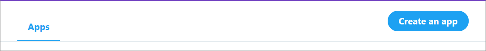
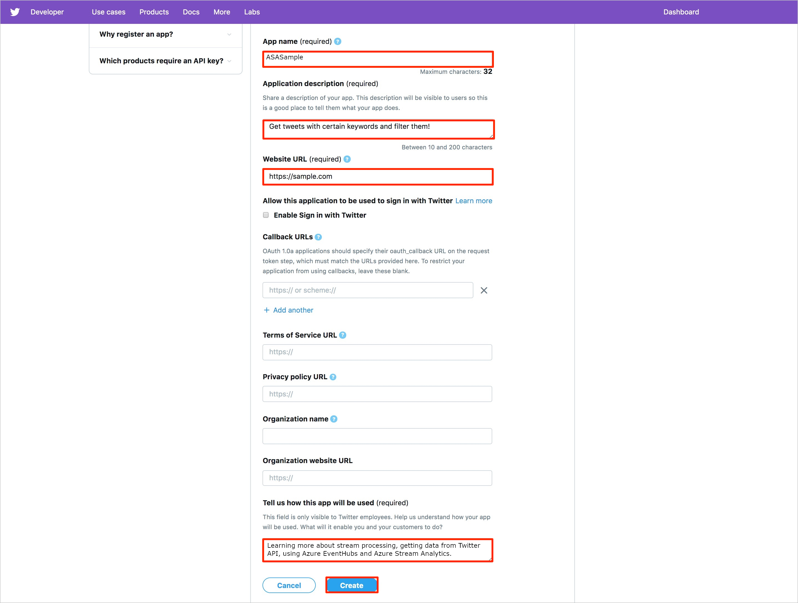

# Real-time Twitter sentiment analysis in Azure Stream Analytics

This article teaches you how to build a social media sentiment analysis solution by bringing real-time Twitter events into Azure Event Hubs. You write an Azure Stream Analytics query to analyze the data and store the results for later use or create a [Power BI](https://powerbi.com/) dashboard to provide insights in real-time.

Social media analytics tools help organizations understand trending topics. Trending topics are subjects and attitudes that have a high volume of posts on social media. Sentiment analysis, which is also called *opinion mining*, uses social media analytics tools to determine attitudes toward a product or idea. 

Real-time Twitter trend analysis is a great example of an analytics tool because the hashtag subscription model enables you to listen to specific keywords (hashtags) and develop sentiment analysis of the feed.

## Scenario: Social media sentiment analysis in real time

A company that has a news media website is interested in gaining an advantage over its competitors by featuring site content that is immediately relevant to its readers. The company uses social media analysis on topics that are relevant to readers by doing real-time sentiment analysis of Twitter data.

To identify trending topics in real time on Twitter, the company needs real-time analytics about the tweet volume and sentiment for key topics.

## Prerequisites

In this how-to guide, you use a client application that connects to Twitter and looks for tweets that have certain hashtags (which you can set). To run the application and analyze the tweets using Azure Streaming Analytics, you must have the following:

* If you don't have an Azure subscription, create a [free account](https://azure.microsoft.com/free/).

* A [Twitter](https://twitter.com) account.

* The TwitterClientCore application, which reads the Twitter feed. To get this application, download [TwitterClientCore](https://github.com/Azure/azure-stream-analytics/tree/master/DataGenerators/TwitterClientCore).

* Install the [.NET Core CLI](https://docs.microsoft.com/dotnet/core/tools/?tabs=netcore2x) version 2.1.0.

## Create an event hub for streaming input

The sample application generates events and pushes them to an Azure event hub. Azure Event Hubs are the preferred method of event ingestion for Stream Analytics. For more information, see the [Azure Event Hubs documentation](../event-hubs/event-hubs-what-is-event-hubs.md).

### Create an event hub namespace and event hub
In this section, you create an event hub namespace and add an event hub to that namespace. Event hub namespaces are used to logically group related event bus instances. 

1. Log  in to the Azure portal and select **Create a resource**. Then. search for **Event Hubs** and select **Create**.

2. On the **Create Namespace** page, enter a namespace name. You can use any name for the namespace, but the name must be valid for a URL, and it must be unique across Azure. 
    
3. Select a pricing tier and subscription, and create or choose a resource group. Then, choose a location and select **Create**. 
 
4. When the namespace has finished deploying, navigate to your resource group and find the event hub namespace in your list of Azure resources. 

5. From the new namespace, select **+&nbsp;Event Hub**. 

6. Name the new event hub *socialtwitter-eh*. You can use a different name. If you do, make a note of it, because you need the name later. You don't need to set any other options for the event hub.
 
7. Select **Create**.

### Grant access to the event hub

Before a process can send data to an event hub, the event hub needs a policy that allows access. The access policy produces a connection string that includes authorization information.

1.	In the navigation bar on the left side of your event hubs namespace, select **Event Hubs**, which is located in the **Entities** section. Then, select the event hub you just created.

2.	In the navigation bar on the left side, select **Shared access policies** located under **Settings**.

    >[!NOTE]
    >There is a Shared access policies option under for the event hub namespace and for the event hub. Make sure you're working in the context of your event hub, not the overall event hub namespace.

3.	From the access policy page, select **+ Add**. Then enter *socialtwitter-access* for the **Policy name** and check the **Manage** checkbox.
 
4.	Select **Create**.

5.	After the policy has been deployed, select the policy from the list of shared access policies.

6.	Find the box labeled **Connection string primary-key** and select the copy button next to the connection string.
 
7.	Paste the connection string into a text editor. You need this connection string for the next section after you make some small edits.

   The connection string looks like this:
   
   ```
   Endpoint=sb://EVENTHUBS-NAMESPACE.servicebus.windows.net/;SharedAccessKeyName=socialtwitter-access;SharedAccessKey=Gw2NFZw6r...FxKbXaC2op6a0ZsPkI=;EntityPath=socialtwitter-eh
   ```

   Notice that the connection string contains multiple key-value pairs, separated with semicolons: `Endpoint`, `SharedAccessKeyName`, `SharedAccessKey`, and `EntityPath`.  

   > [!NOTE]
   > For security, parts of the connection string in the example have been removed.

## Configure and start the Twitter client application

The client application gets tweet events directly from Twitter. In order to do so, it needs permission to call the Twitter Streaming APIs. To configure that permission, you create an application in Twitter, which generates unique credentials (such as an OAuth token). You can then configure the client application to use these credentials when it makes API calls. 

### Create a Twitter application
If you do not already have a Twitter application that you can use for this how-to guide, you can create one. You must already have a Twitter account.

> [!NOTE]
> The exact process in Twitter for creating an application and getting the keys, secrets, and token might change. If these instructions don't match what you see on the Twitter site, refer to the Twitter developer documentation.

1. From a web browser, go to [Twitter For Developers](https://developer.twitter.com/en/apps), create a developer account, and select **Create an app**. You might see a message saying that you need to apply for a Twitter developer account. Feel free to do so, and after your application has been approved, you should see a confirmation email. It could take several days to be approved for a developer account.

   

2. In the **Create an application** page, provide the details for the new app, and then select **Create your Twitter application**.

   

3. In the application page, select the **Keys and Tokens** tab and copy the values for **Consumer API Key** and **Consumer API Secret Key**. Also, select **Create** under **Access Token and Access Token Secret** to generate the access tokens. Copy the values for **Access Token** and **Access Token Secret**.

   Save the values that you retrieved for the Twitter application. You need the values later.

> [!NOTE]
> The keys and secrets for the Twitter application provide access to your Twitter account. Treat this information as sensitive, the same as you do your Twitter password. For example, don't embed this information in an application that you give to others. 

### Configure the client application

We've created a client application that connects to Twitter data using [Twitter's Streaming APIs](https://dev.twitter.com/streaming/overview) to collect tweet events about a specific set of topics.

Before the application runs, it requires certain information from you, like the Twitter keys and the event hub connection string.

1. Make sure you've downloaded the [TwitterClientCore](https://github.com/Azure/azure-stream-analytics/tree/master/DataGenerators/TwitterClientCore) application, as listed in the prerequisites.

2. Use a text editor to open the *App.config* file. Make the following changes to the `<appSettings>` element:

   * Set `oauth_consumer_key` to the Twitter Consumer Key (API key). 
   * Set `oauth_consumer_secret` to the Twitter Consumer Secret (API secret key).
   * Set `oauth_token` to the Twitter Access token.
   * Set `oauth_token_secret` to the Twitter Access token secret.
   * Set `EventHubNameConnectionString` to the connection string.
   * Set `EventHubName` to the event hub name (that is  the value of the entity path).

3. Open the command line and navigate to the directory where your TwitterClientCore app is located. Use the command `dotnet build` to build the project. Then use the command `dotnet run` to run the app. The app sends Tweets to your Event Hub.

## Create a Stream Analytics job

Now that tweet events are streaming in real time from Twitter, you can set up a Stream Analytics job to analyze these events in real time.

1. In the Azure portal, navigate to your resource group and select **+ Add**. Then search for **Stream Analytics job** and select **Create**.

2. Name the job `socialtwitter-sa-job` and specify a subscription, resource group, and location.

    It's a good idea to place the job and the event hub in the same region for best performance and so that you don't pay to transfer data between regions.

3. Select **Create**. Then navigate to your job when the deployment is finished.

## Specify the job input

1. In your Stream Analytics job, select **Inputs** from the left menu under **Job Topology**.

2. Select **+&nbsp;Add stream input** > **Event Hub**. Fill out the **New input** form with the following information:

   |**Setting**  |**Suggested value**  |**Description**  |
   |---------|---------|---------|
   |Input alias| *TwitterStream* | Enter an alias for the input. |
   |Subscription  | \<Your subscription\> |  Select the Azure subscription that you want to use. |
   |Event Hub namespace | *asa-twitter-eventhub* |
   |Event Hub name | *socialtwitter-eh* | Choose *Use existing*. Then select the Event Hub you created.|
   |Event compression type| GZip | The data compression type.|

   Leave the remaining default values and select **Save**.

## Specify the job query

Stream Analytics supports a simple, declarative query model that describes transformations. To learn more about the language, see the [Azure Stream Analytics Query Language Reference](https://docs.microsoft.com/stream-analytics-query/stream-analytics-query-language-reference). This how-to guide helps you author and test several queries over Twitter data.

To compare the number of mentions among topics, you can use a [Tumbling window](https://docs.microsoft.com/stream-analytics-query/tumbling-window-azure-stream-analytics) to get the count of mentions by topic every five seconds.

1. In your job **Overview**, select **Edit query** near the top right of the Query box. Azure lists the inputs and outputs that are configured for the job and lets you create a query to transform the input stream as it is sent to the output.

2. Change the query in the query editor to the following:

   ```sql
   SELECT *
   FROM TwitterStream
   ```

3. Event data from the messages should appear in the **Input preview** window below your query. Ensure the **View** is set to **JSON**. If you do not see any data, ensure that your data generator is sending events to your event hub, and that you've selected **GZip** as the compression type for the input.

4. Select **Test query** and notice the results in the **Test results** window below your query.

5. Change the query in the code editor to the following and select **Test query**:

   ```sql
   SELECT System.Timestamp as Time, text
   FROM TwitterStream
   WHERE text LIKE '%Azure%'
   ```

6. This query returns all tweets that include the keyword *Azure*.

## Create an output sink

You have now defined an event stream, an event hub input to ingest events, and a query to perform a transformation over the stream. The last step is to define an output sink for the job.  

In this how-to guide, you write the aggregated tweet events from the job query to Azure Blob storage.  You can also push your results to Azure SQL Database, Azure Table storage, Event Hubs, or Power BI, depending on your application needs.

## Specify the job output

1. Under the **Job Topology** section on the left navigation menu, select **Outputs**. 

2. In the **Outputs** page, click **+&nbsp;Add** and **Blob storage/Data Lake Storage Gen2**:

   * **Output alias**: Use the name `TwitterStream-Output`. 
   * **Import options**: Select **Select storage from your subscriptions**.
   * **Storage account**. Select your storage account.
   * **Container**. Select **Create new** and enter `socialtwitter`.
   
4. Select **Save**.   

## Start the job

A job input, query, and output are specified. You are ready to start the Stream Analytics job.

1. Make sure the TwitterClientCore application is running. 

2. In the job overview, select **Start**.

3. On the **Start job** page, for **Job output start time**, select **Now** and then select **Start**.

## Get support
For further assistance, try our [Microsoft Q&A question page for Azure Stream Analytics](https://docs.microsoft.com/answers/topics/azure-stream-analytics.html).

## Next steps
* [Introduction to Azure Stream Analytics](stream-analytics-introduction.md)
* [Get started using Azure Stream Analytics](stream-analytics-real-time-fraud-detection.md)
* [Scale Azure Stream Analytics jobs](stream-analytics-scale-jobs.md)
* [Azure Stream Analytics Query Language Reference](https://docs.microsoft.com/stream-analytics-query/stream-analytics-query-language-reference)
* [Azure Stream Analytics Management REST API Reference](https://msdn.microsoft.com/library/azure/dn835031.aspx)
