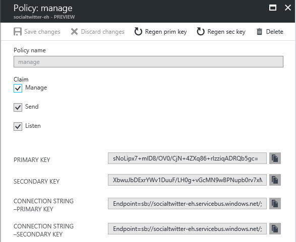
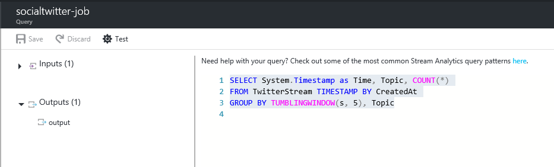

# Real-time Twitter sentiment analysis in Azure Stream Analytics

Learn how to build a sentiment analysis solution for social media analytics by bringing real-time Twitter events into Azure Event Hubs. In this scenario, you write an Azure Stream Analytics query to analyze the data. Then you either store the results for later use or use a dashboard and [Power BI](https://powerbi.com/) to provide insights in real time.

Social media analytics tools help organizations understand trending topics. Trending topics are subjects and attitudes that have a high volume of posts in social media. Sentiment analysis, which is also called *opinion mining*, uses social media analytics tools to determine attitudes toward a product, idea, and so on.

Real-time Twitter trend analysis is a great example of an analytics tool, because the hashtag subscription model enables you to listen to specific keywords and develop sentiment analysis of the feed.

## Scenario: Social media sentiment analysis in real time

A company that has a news media website is interested in gaining an advantage over its competitors by featuring site content that is immediately relevant to its readers. The company uses social media analysis on topics that are relevant to readers by doing real-time sentiment analysis of Twitter data.

Specifically, to identify trending topics in real time on Twitter, the company needs real-time analytics about the tweet volume and sentiment for key topics. In other words, the need is a sentiment analysis analytics engine that's based on this social media feed.

## Prerequisites

* An Azure subscription
* A Twitter account and [OAuth access token](https://dev.twitter.com/oauth/overview/application-owner-access-tokens)
* The [TwitterWPFClient.zip](https://github.com/Azure/azure-stream-analytics/blob/master/Samples/TwitterClient/TwitterWPFClient.zip) file from GitHub
* Optional: The source code for the Twitter client from [GitHub](https://aka.ms/azure-stream-analytics-twitterclient)

## Create an event hub input

The sample application generates events and pushes them to an Event Hubs instance (an event hub, for short). Azure Service Bus event hubs are the preferred method of event ingestion for Stream Analytics. For more information, review the event hub documentation at [Azure Service Bus documentation](/azure/service-bus/).

### Create an event hub

Take the following steps to create an event hub:

1. In the [Azure portal](https://portal.azure.com), select **NEW**, type **Event Hubs**, and then select **Event Hubs** from the resulting search. Then select **Create**.

2. Provide a name for the event hub, and then create a resource group. We've specified `socialtwitter-eh` and `socialtwitter-rg` respectively. Select the option to pin the account to the dashboard, and then select the **Create** button.

3. After the deployment is complete, select the event hub. Then, under **Entities**, select **Event Hubs**.

4. To create the event hub, select the **+ Event Hub** button. Provide your name again (ours was `socialtwitter-eh`), and then select **Create**.

5. To grant access to the event hub, we need to create a shared access policy. Select the event hub, and then, under **Settings**, select **Shared access policies**.

6. Under **Shared access policies**, create a policy with **MANAGE** permissions by selecting **+ Add**. Give the policy a name, check **MANAGE**, and then select **Create**.

7. Select your new policy after it has been created, and then select the copy button for the **CONNECTION STRING - PRIMARY KEY** entity. We need this later in the exercise. Then return to the dashboard.



## Configure and start the Twitter client application

We have created a client application that connects to Twitter data via [Twitter's Streaming APIs](https://dev.twitter.com/streaming/overview) to collect Tweet events about a parameterized set of topics. The [Sentiment140](http://help.sentiment140.com/) open source tool assigns a sentiment value to each tweet as follows:

* 0 = negative
* 2 = neutral
* 4 = positive

Then Tweet events are pushed to the event hub.  

### Set up the application
 Follow these steps to set up the application:

1. [Download the TwitterWPFClient.zip](https://github.com/Azure/azure-stream-analytics/blob/master/Samples/TwitterClient/TwitterWPFClient.zip), and then unzip it.

2. Run the `TwitterWPFClient.exe` application. Then enter your data for the Twitter API Key and Secret, Twitter Access Token and Secret, and also the event hub information. Finally, define which keywords you want to determine sentiment for.

### Generate an OAuth access token
For more information, see [Steps to generate an OAuth access token](https://dev.twitter.com/oauth/overview/application-owner-access-tokens).  

 To generate a token, you need to make an empty application.  

1. Replace the EventHubConnectionString and EventHubName values in TwitterWpfClient.exe.config with the connection string and name of your event hub. The connection string that you copied earlier gives you both the connection string and the name of your event hub. Be sure to separate them and put each in the correct field. For example, consider the following connection string:

 ```
    Endpoint=sb://your.servicebus.windows.net/;SharedAccessKeyName=yourpolicy;SharedAccessKey=yoursharedaccesskey;EntityPath=yourhub
 ```  

   The TwitterWpfClient.exe.config file should contain your settings as shown in the following example:

 ```
      add key="EventHubConnectionString" value="Endpoint=sb://your.servicebus.windows.net/;SharedAccessKeyName=yourpolicy;SharedAccessKey=yoursharedaccesskey"
      add key="EventHubName" value="yourhub"
   ```
   > [!NOTE]
   > The text "EntityPath=" does **not** appear in the EventHubName value.

    You can also enter the values for your Twitter and Azure connection information directly into the client. The same logic applies    where "EntityPath=" is not used.

   

2. **Optional:** Adjust the keywords to search for. By default, this application looks for some game keywords.  You can adjust the values for **twitter_keywords** in TwitterWpfClient.exe.config, if desired.

3. Run TwitterWpfClient.exe. Then select the green start button to collect social sentiment. You see Tweet events with the **CreatedAt**, **Topic**, and **SentimentScore** values being sent to your event hub.

## Create a Stream Analytics job

Now that Tweet events are streaming in real time from Twitter, we can set up a Stream Analytics job to analyze these events in real time.

### Provision a Stream Analytics job

To provision a Stream Analytics job, take the following steps:

1. In the [Azure portal](https://portal.azure.com/), select **NEW**, type **STREAM ANALYTICS**, and then select the Stream Analytics tile result.

2. Specify the following values, and then select **CREATE**.

   * **JOB NAME**: Enter a job name.

   * **Resource group**: Select the resource group that you created earlier in this exercise from the "use existing" option.

   * **STORAGE ACCOUNT**: Choose the Azure storage account that you want to use to store the monitoring data for all Stream Analytics jobs that run within this region. You have the option to choose an existing storage account or to create a new one.   


After the job has been created, it opens in the Azure portal.

## Specify the job input
To specify the job input, take the following steps:

1. In your Stream Analytics job, in **Job Topology** in the middle of the job pane, select **INPUTS**. Then select **ADD**.

    Next, the portal prompts you for some of the following information. Most of the default values work, and are defined here:

   * **INPUT ALIAS**: Enter a friendly name for this job input, such as `TwitterStream`. You use this name in the query later.  

   * **EVENT HUB NAME**: Select the name of the event hub.

   * **EVENT HUB POLICY NAME**: Select the event hub policy that you created earlier in this tutorial.

2. Select the **Create** button.

## Specify the job query

Stream Analytics supports a simple, declarative query model that describes transformations. To learn more about the language, see the [Azure Stream Analytics Query Language Reference](https://msdn.microsoft.com/library/azure/dn834998.aspx).  This tutorial helps you author and test several queries over Twitter data.

To compare the number of mentions among topics, we use a [Tumbling Window](https://msdn.microsoft.com/library/azure/dn835055.aspx) to get the count of mentions by topic every five seconds.

Change the query in the code editor to the following, and then select **Save**:

```
SELECT System.Timestamp as Time, Topic, COUNT(*)
FROM TwitterStream TIMESTAMP BY CreatedAt
GROUP BY TUMBLINGWINDOW(s, 5), Topic
```   

This query uses the **TIMESTAMP BY** keyword to specify a timestamp field in the payload to be used in the temporal computation. If this field isn't specified, the windowing operation is performed by using the time that each event arrived at the event hub. Learn more in the "Arrival Time vs Application Time" section of [Stream Analytics Query Reference](https://msdn.microsoft.com/library/azure/dn834998.aspx).

This query also accesses a timestamp for the end of each window by using the **System.Timestamp** property.



## Create an output sink

Now that we have defined an event stream, an event hub input to ingest events, and a query to perform a transformation over the stream, the last step is to define an output sink for the job.  

We write the aggregated tweet events from our job query to Azure Blob storage.  You can also push your results to Azure SQL Database, Azure Table storage, or Event Hubs, depending on your specific application needs.

## Specify the job output
To specify the job output, take the following steps:

1. In your Stream Analytics job, select **OUTPUT** in **Job Topology**, and then select **ADD**.

2. Type or select the following values in the pane:

   * **OUTPUT ALIAS**: Enter a friendly name for this job output. This demonstration uses `Output`.

   * **Sink**: Select **Blob storage**.

   * **STORAGE ACCOUNT**: Select **Create a new storage account**.

    * **STORAGE account**: Give the new storage account a name (`socialtwitter` in this example).

    * **CONTAINER**: Give the new container a name (`socialtwitter` in this example).

3. Leave the rest of the entries as default values. Finally, select **Create**.

## Start the job

Because a job input, query, and output have all been specified, we are ready to start the Stream Analytics job.

To start the job, take the following steps:

1. In the job overview pane, at the top of the page, select **START**.

2. In the dialog box that opens, select **JOB START TIME**, and then select the **CHECK** button on the bottom of the dialog box. The job status changes first to **Starting** and then to **Running**.


## View output for sentiment analysis

After your job has started running and is processing the real-time Twitter stream, choose how you want to view the output for sentiment analysis.

Use a tool like [Azure Storage Explorer](https://http://storageexplorer.com/) or [Azure Explorer](http://www.cerebrata.com/products/azure-explorer/introduction) to view your job output in real time. From here, you can use [Power BI](https://powerbi.com/) to extend your application to include a customized dashboard like the one shown in the following screenshot.


## Create another query to identify trending topics

Another sample query that we created for this scenario is based on [Sliding Window](https://msdn.microsoft.com/library/azure/dn835051.aspx). To identify trending topics, we look for topics that cross a threshold value for mentions in a given amount of time.

For the purposes of this tutorial, we check for topics that are mentioned more than 20 times in the last 5 seconds.

```
SELECT System.Timestamp as Time, Topic, COUNT(*) as Mentions
FROM TwitterStream TIMESTAMP BY CreatedAt
GROUP BY SLIDINGWINDOW(s, 5), topic
HAVING COUNT(*) > 20
```

## Use field headers

The field labels you can use in this exercise are listed in this table. Feel free to experiment in the query editor.

JSON property | Definition
--- | ---
CreatedAt | The time that the tweet was created
Topic | The topic that matches the specified keyword
SentimentScore | The sentiment score from Sentiment140
Author | The Twitter handle that sent the tweet
Text | The full body of the tweet


## Get support
For further assistance, try our [Azure Stream Analytics forum](https://social.msdn.microsoft.com/Forums/home?forum=AzureStreamAnalytics).

## Next steps
* [Introduction to Azure Stream Analytics](stream-analytics-introduction.md)
* [Get started using Azure Stream Analytics](stream-analytics-get-started.md)
* [Scale Azure Stream Analytics jobs](stream-analytics-scale-jobs.md)
* [Azure Stream Analytics Query Language Reference](https://msdn.microsoft.com/library/azure/dn834998.aspx)
* [Azure Stream Analytics Management REST API Reference](https://msdn.microsoft.com/library/azure/dn835031.aspx)
