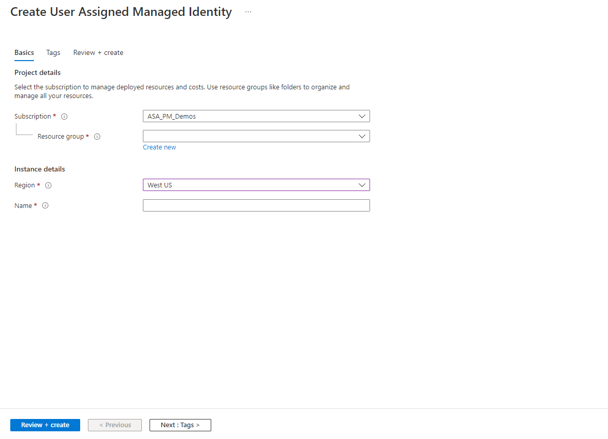
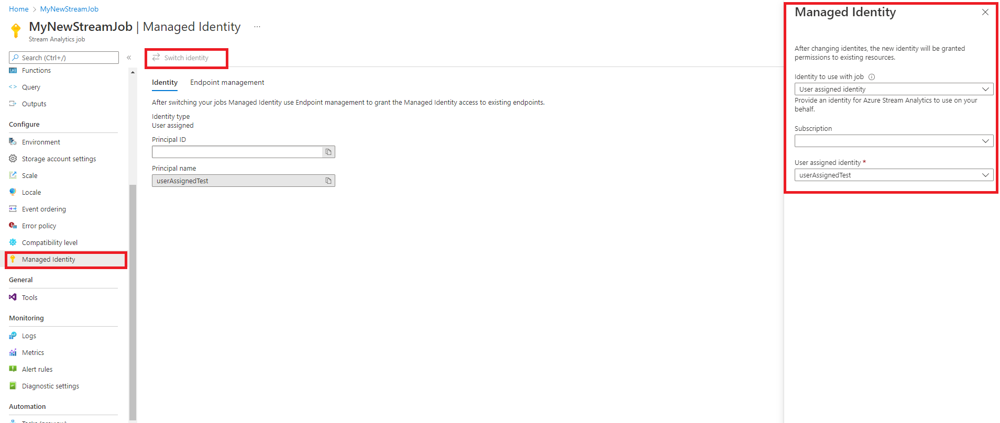

# User-assigned managed identities for Azure Stream Analytics (preview)

Azure Stream Analytics currently allows you to use user-assigned managed identities to authenticate to your job's inputs and outputs.

In this article, you learn how to create a user-assigned managed identity for your Azure Stream Analytics job by using the Azure portal.

> [!IMPORTANT] 
> Regardless of the type of identity chosen, a managed identity is a service principal of a special type that may only be used with Azure resources. The corresponding service principal is automatically removed when the managed identity is deleted.

## Create a user-assigned managed identity

To create a user-assigned managed identity, your account needs the [Managed Identity Contributor role](../role-based-access-control/built-in-roles.md#managed-identity-contributor) assignment.

> [!NOTE] 
> Only alphanumeric characters (0-9, a-z, and A-Z) and the hyphen (-) are supported when you create user-assigned managed identities. For the assignment to a virtual machine or virtual machine scale set to work correctly, the name is limited to 24 characters. For more information, see [**FAQs and known issues**](../active-directory/managed-identities-azure-resources/known-issues.md)

   
   
1.	Sign in to the Azure portal by using an account associated with the Azure subscription to create the user-assigned managed identity.
2.	In the search box, enter **Managed Identities**. Under **Services**, select **Managed Identities**.
3.	Select **Add**, and enter values in the following boxes in the **Create User Assigned Managed Identity** pane:
    * **Subscription**: Choose the subscription to create the user-assigned managed identity under.
    * **Resource group**: Choose a resource group to create the user-assigned managed identity in, or select **Create new** to create a new resource group.
    * **Region**: Choose a region to deploy the user-assigned managed identity, for example, **West US**.
    * **Name**: Enter the name for your user-assigned managed identity, for example, UAI1.
4. Select **Review + create** to review changes
5. Select **Create**

For more information on how to manager user-assigned managed identities please visit the [Managed user-assigned managed identities page](../active-directory/managed-identities-azure-resources/how-manage-user-assigned-managed-identities.md?pivots=identity-mi-methods-azp).

## Switching to user-assigned managed identity
If you have an existing job, you can switch to a user-assigned identity by following the instructions below:

After creating your user-assigned identity and configuring your input and output, you can switch to user-assigned identity by navigating to the **Managed Identity** tab on the left side under **Configure**.

   

1.	Click on the **managed identity tab** under **configure**.
2.	Select on **Switch Identity** and select the identity to use with the job.
3.	Select the subscription where your user-assigned identity is located and select the name of your identity.
4.	Review and **save**

## Endpoint management
> [!NOTE] 
> After switching to a user-assigned identity for the job, you may have to re-grant access to the inputs and outputs associated with the stream analytics job to use the user-assigned identity for your job to run

1.	Select **Endpoint management** and grant access to each input and output under connection.
2.	Under **connection status** click on **try regranting access** to switch from system-assigned to user-assigned. 
3.	Wait for a few minutes for the input/output to be granted access to the job.

You can select each input and output on the endpoint management to manually configure an adapter to the job.

## Next steps

* [Quickstart: Create a Stream Analytics job by using the Azure portal](stream-analytics-quick-create-portal.md)
