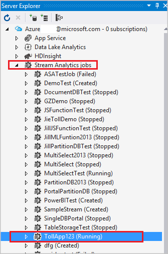
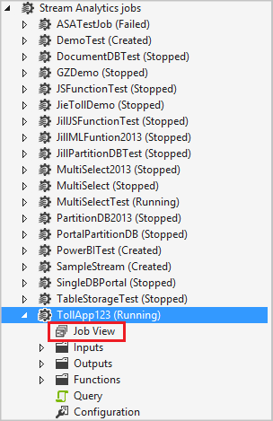
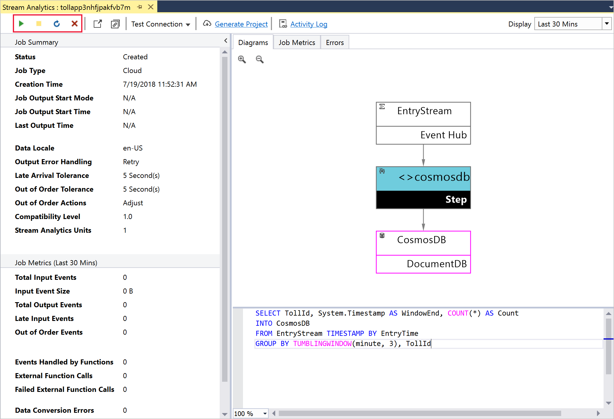
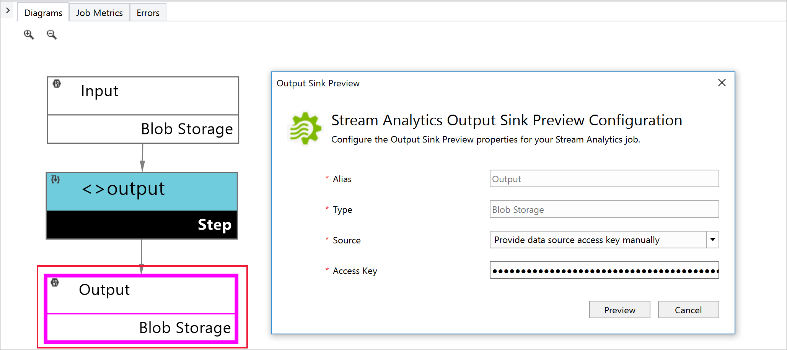
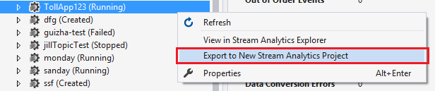
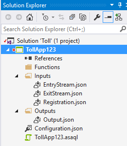
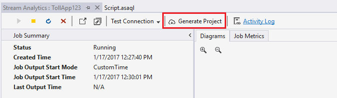
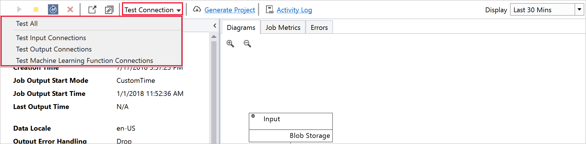
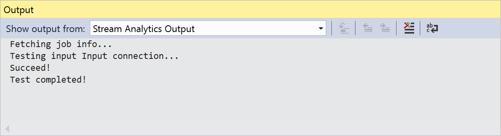

# Use Visual Studio to view Azure Stream Analytics jobs

Azure Stream Analytics tools for Visual Studio makes it easy for developers to manage their Stream Analytics jobs directly from the IDE. With Azure Stream Analytics tools, you can:
- [Create new jobs](stream-analytics-quick-create-vs.md)
- Start, stop, and [monitor jobs](stream-analytics-monitor-jobs-use-vs.md)
- Check job results
- Export existing jobs to a project
- Test input and output connections
- [Run queries locally](stream-analytics-vs-tools-local-run.md)

Learn how to [install Azure Stream Analytics tools for Visual Studio](stream-analytics-tools-for-visual-studio-install.md).

## Explore the job view

You can use the job view to interact with Azure Stream Analytics jobs from Visual Studio.

### Open the job view

1. In **Server Explorer**, select **Stream Analytics jobs** and then select **Refresh**. Your job should appear under **Stream Analytics jobs**.

    

2. Expand your job node, and double-click on the **Job View** node to open a job view.
    
   

### Start and stop jobs

Azure Stream Analytics jobs can be fully managed from the job view in Visual Studio. Use the controls to start, stop, or delete a job.
    
   

## Check job results

Stream Analytics tools for Visual Studio currently supports output preview for Azure Data Lake Storage and blob storage. To view result, simply double click the output node of the job diagram in **Job View** and enter the appropriate credentials.

   

## Export jobs to a project

There are two ways you can export an existing job to a project.

1. In **Server Explorer**, under the Stream Analytics Jobs node, right-click the job node. Select **Export to New Stream Analytics Project**.
    
   
    
    The generated project appears in **Solution Explorer**.
    
   

2. In the job view, select **Generate Project**.
    
   

## Test connections

Input and output connections can be tested from the **Job View** by selecting an option from the **Test Connection** dropdown.

   

The **Test Connection** results are displayed in the **Output** window.

   

## Next steps

* [Monitor and manage Azure Stream Analytics jobs using Visual Studio](stream-analytics-monitor-jobs-use-vs.md)
* [Quickstart: Create a Stream Analytics job using Visual Studio](stream-analytics-quick-create-vs.md)
* [Tutorial: Deploy an Azure Stream Analytics job with CI/CD using Azure Pipelines](stream-analytics-tools-visual-studio-cicd-vsts.md)
* [Continuously integrate and develop with Stream Analytics tools](stream-analytics-tools-for-visual-studio-cicd.md)
