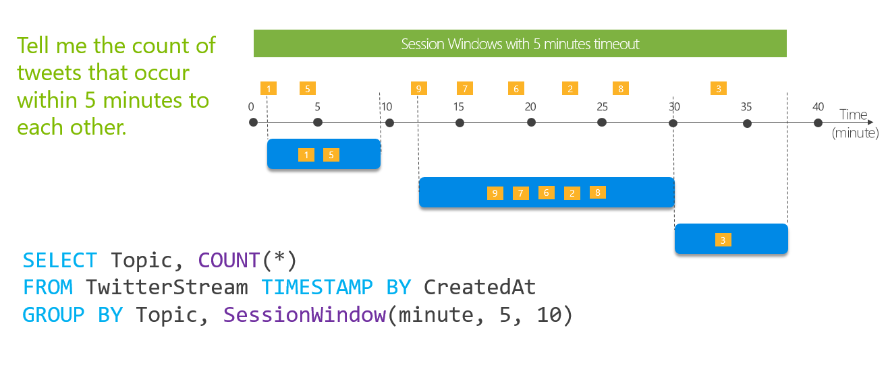
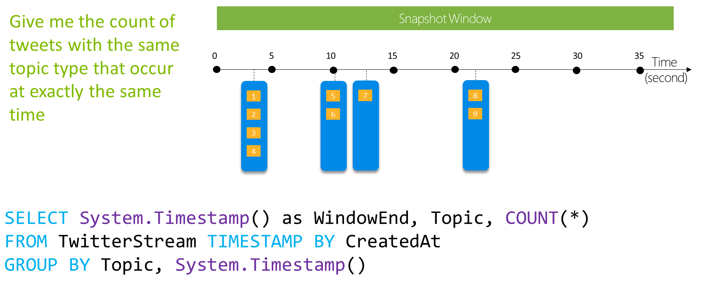

# Introduction to Stream Analytics windowing functions

In time-streaming scenarios, performing operations on the data contained in temporal windows is a common pattern. Stream Analytics has native support for windowing functions, enabling developers to author complex stream processing jobs with minimal effort.

There are five kinds of temporal windows to choose from: [**Tumbling**](/stream-analytics-query/tumbling-window-azure-stream-analytics), [**Hopping**](/stream-analytics-query/hopping-window-azure-stream-analytics), [**Sliding**](/stream-analytics-query/sliding-window-azure-stream-analytics), [**Session**](/stream-analytics-query/session-window-azure-stream-analytics), and [**Snapshot**](/stream-analytics-query/snapshot-window-azure-stream-analytics) windows.  You use the window functions in the [**GROUP BY**](/stream-analytics-query/group-by-azure-stream-analytics) clause of the query syntax in your Stream Analytics jobs. You can also aggregate events over multiple windows using the [**Windows()** function](/stream-analytics-query/windows-azure-stream-analytics).

All the [windowing](/stream-analytics-query/windowing-azure-stream-analytics) operations output results at the **end** of the window. Note that when you start a stream analytics job, you can specify the *Job output start time* and the system will automatically fetch previous events in the incoming streams to output the first window at the specified time; for example when you start with the *Now* option, it will start to emit data immediately.
The output of the window will be a single event based on the aggregate function used. The output event will have the time stamp of the end of the window and all window functions are defined with a fixed length.


## Tumbling window

[**Tumbling**](/stream-analytics-query/tumbling-window-azure-stream-analytics) window functions are used to segment a data stream into distinct time segments and perform a function against them, such as the example below. The key differentiators of a Tumbling window are that they repeat, do not overlap, and an event cannot belong to more than one tumbling window.


With the following input data (illustrated above):

|Stamp|CreatedAt|TimeZone|
|-|-|-|
|1|2021-10-26T10:15:01|PST|
|5|2021-10-26T10:15:03|PST|
|4|2021-10-26T10:15:06|PST|
|...|...|...|

The following query:

```SQL
SELECT System.Timestamp() as WindowEndTime, TimeZone, COUNT(*) AS Count
FROM TwitterStream TIMESTAMP BY CreatedAt
GROUP BY TimeZone, TumblingWindow(second,10)
```

Will return:

|WindowEndTime|TimeZone|Count|
|-|-|-|
|2021-10-26T10:15:10|PST|5|
|2021-10-26T10:15:20|PST|2|
|2021-10-26T10:15:30|PST|4|

## Hopping window

[**Hopping**](/stream-analytics-query/hopping-window-azure-stream-analytics) window functions hop forward in time by a fixed period. It may be easy to think of them as Tumbling windows that can overlap and be emitted more often than the window size. Events can belong to more than one Hopping window result set. To make a Hopping window the same as a Tumbling window, specify the hop size to be the same as the window size.


With the following input data (illustrated above):

|Stamp|CreatedAt|Topic|
|-|-|-|
|1|2021-10-26T10:15:01|Streaming|
|5|2021-10-26T10:15:03|Streaming|
|4|2021-10-26T10:15:06|Streaming|
|...|...|...|

The following query:

```SQL
SELECT System.Timestamp() as WindowEndTime, Topic, COUNT(*) AS Count
FROM TwitterStream TIMESTAMP BY CreatedAt
GROUP BY Topic, HoppingWindow(second,10,5)
```

Will return:

|WindowEndTime|Topic|Count|
|-|-|-|
|2021-10-26T10:15:10|Streaming|5|
|2021-10-26T10:15:15|Streaming|3|
|2021-10-26T10:15:20|Streaming|2|
|2021-10-26T10:15:25|Streaming|4|
|2021-10-26T10:15:30|Streaming|4|

## Sliding window

[**Sliding**](/stream-analytics-query/sliding-window-azure-stream-analytics) windows, unlike Tumbling or Hopping windows, output events only for points in time when the content of the window actually changes. In other words, when an event enters or exits the window. So, every window has at least one event. Similar to Hopping windows, events can belong to more than one sliding window.


With the following input data (illustrated above):

|Stamp|CreatedAt|Topic|
|-|-|-|
|1|2021-10-26T10:15:10|Streaming|
|5|2021-10-26T10:15:12|Streaming|
|9|2021-10-26T10:15:15|Streaming|
|7|2021-10-26T10:15:15|Streaming|
|8|2021-10-26T10:15:27|Streaming|

The following query:

```SQL
SELECT System.Timestamp() as WindowEndTime, Topic, COUNT(*) AS Count
FROM TwitterStream TIMESTAMP BY CreatedAt
GROUP BY Topic, SlidingWindow(second,10)
HAVING COUNT(*) >=3
```

Will return:

|WindowEndTime|Topic|Count|
|-|-|-|
|2021-10-26T10:15:15|Streaming|4|
|2021-10-26T10:15:20|Streaming|3|

## Session window

[**Session**](/stream-analytics-query/session-window-azure-stream-analytics) window functions group events that arrive at similar times, filtering out periods of time where there is no data. It has three main parameters: timeout, maximum duration, and partitioning key (optional).



A session window begins when the first event occurs. If another event occurs within the specified timeout from the last ingested event, then the window extends to include the new event. Otherwise if no events occur within the timeout, then the window is closed at the timeout.

If events keep occurring within the specified timeout, the session window will keep extending until maximum duration is reached. The maximum duration checking intervals are set to be the same size as the specified max duration. For example, if the max duration is 10, then the checks on if the window exceed maximum duration will happen at t = 0, 10, 20, 30, etc.

When a partition key is provided, the events are grouped together by the key and session window is applied to each group independently. This partitioning is useful for cases where you need different session windows for different users or devices.

With the following input data (illustrated above):

|Stamp|CreatedAt|Topic|
|-|-|-|
|1|2021-10-26T10:15:01|Streaming|
|2|2021-10-26T10:15:04|Streaming|
|3|2021-10-26T10:15:13|Streaming|
|...|...|...|

The following query:

```SQL
SELECT System.Timestamp() as WindowEndTime, Topic, COUNT(*) AS Count
FROM TwitterStream TIMESTAMP BY CreatedAt
GROUP BY Topic, SessionWindow(second,5,10)
```

Will return:

|WindowEndTime|Topic|Count|
|-|-|-|
|2021-10-26T10:15:09|Streaming|2|
|2021-10-26T10:15:24|Streaming|4|
|2021-10-26T10:15:31|Streaming|2|
|2021-10-26T10:15:39|Streaming|1|

## Snapshot window

[**Snapshot**](/stream-analytics-query/snapshot-window-azure-stream-analytics) windows group events that have the same timestamp. Unlike other windowing types, which require a specific window function (such as [SessionWindow()](/stream-analytics-query/session-window-azure-stream-analytics)), you can apply a snapshot window by adding System.Timestamp() to the GROUP BY clause.



With the following input data (illustrated above):

|Stamp|CreatedAt|Topic|
|-|-|-|
|1|2021-10-26T10:15:04|Streaming|
|2|2021-10-26T10:15:04|Streaming|
|3|2021-10-26T10:15:04|Streaming|
|...|...|...|

The following query:

```SQL
SELECT System.Timestamp() as WindowEndTime, Topic, COUNT(*) AS Count
FROM TwitterStream TIMESTAMP BY CreatedAt
GROUP BY Topic, System.Timestamp()
```

Will return:

|WindowEndTime|Topic|Count|
|-|-|-|
|2021-10-26T10:15:04|Streaming|4|
|2021-10-26T10:15:10|Streaming|2|
|2021-10-26T10:15:13|Streaming|1|
|2021-10-26T10:15:22|Streaming|2|

## Next steps

* [Introduction to Azure Stream Analytics](stream-analytics-introduction.md)
* [Get started using Azure Stream Analytics](stream-analytics-real-time-fraud-detection.md)
* [Scale Azure Stream Analytics jobs](stream-analytics-scale-jobs.md)
* [Azure Stream Analytics Query Language Reference](/stream-analytics-query/stream-analytics-query-language-reference)
* [Azure Stream Analytics Management REST API Reference](/rest/api/streamanalytics/)
