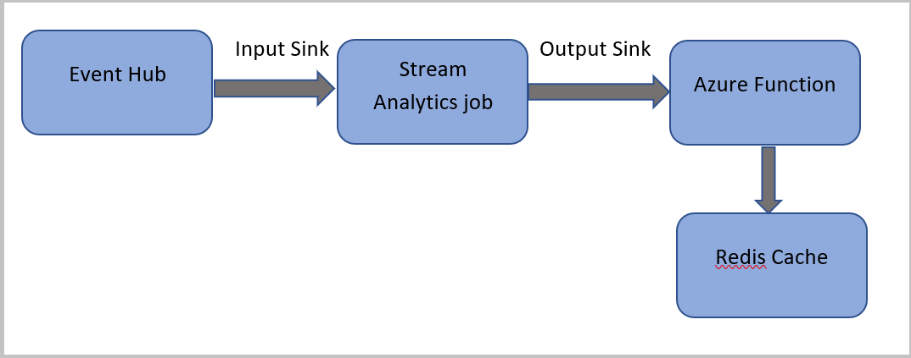

# Tutorial: Run Azure Functions from Azure Stream Analytics jobs

You can run Azure Functions from Azure Stream Analytics by configuring Functions as one of the sinks (outputs) to the Stream Analytics job. Functions are an event-driven, compute-on-demand experience that lets you implement code that is triggered by events occurring in Azure or third-party services. This ability of Functions to respond to triggers makes it a natural output to Stream Analytics jobs.

Stream Analytics invokes Functions through HTTP triggers. The Functions output adapter allows users to connect Functions to Stream Analytics, such that the events can be triggered based on Stream Analytics queries.

> [!NOTE]
> Connection to Azure Functions inside a virtual network (VNet) from an Stream Analytics job that is running in a multi-tenant cluster is not supported.

In this tutorial, you learn how to:

> [!div class="checklist"]
> * Create and run a Stream Analytics job
> * Create an Azure Cache for Redis instance
> * Create an Azure Function
> * Check Azure Cache for Redis for results

If you don’t have an Azure subscription, create a [free account](https://azure.microsoft.com/free/?WT.mc_id=A261C142F) before you begin.

## Configure a Stream Analytics job to run a function

This section demonstrates how to configure a Stream Analytics job to run a function that writes data to Azure Cache for Redis. The Stream Analytics job reads events from Azure Event Hubs, and runs a query that invokes the function. This function reads data from the Stream Analytics job, and writes it to Azure Cache for Redis.




## Prerequisites

Before you start, make sure you've completed the following steps:

* If you don't have an **Azure subscription**, create a [free account](https://azure.microsoft.com/free/).
* Download the **phone call event generator app**, [TelcoGenerator.zip](https://aka.ms/asatelcodatagen) from the Microsoft Download Center or get the source code from [GitHub](https://github.com/Azure/azure-stream-analytics/tree/master/DataGenerators/TelcoGeneratorCore).

[!INCLUDE [event-generator-app](./includes/event-generator-app.md)]

## Create an Azure Cache for Redis instance

1. Create a cache in Azure Cache for Redis by using the steps described in [Create a cache](../azure-cache-for-redis/cache-dotnet-how-to-use-azure-redis-cache.md#create-a-cache).

2. After you create the cache, under **Settings**, select **Access Keys**. Make a note of the **Primary connection string**.

    :::image type="content" source="./media/stream-analytics-with-azure-functions/redis-cache-connection-string.png" alt-text="Screenshot showing the selection of the Access Key menu item.":::

## Create a function in Azure Functions that can write data to Azure Cache for Redis

1. See the [Create a function app](../azure-functions/functions-get-started.md) section of the Functions documentation. This sample was built on:

   - Azure Functions runtime [version 4](../azure-functions/functions-versions.md?pivots=programming-language-csharp&tabs=in-process%2cv4)
   - [.NET 6.0](/dotnet/core/whats-new/dotnet-6)
   - StackExchange.Redis [2.2.8](https://www.nuget.org/packages/StackExchange.Redis/)

2. Create a default HttpTrigger function app in **Visual Studio Code** by following this [tutorial](../azure-functions/create-first-function-vs-code-csharp.md?tabs=in-process). The following information is used: language: `C#`, runtime: `.NET 6` (under function v4), template:  `HTTP trigger`.

3. Install the Redis client library by running the following command in a terminal located in the project folder:

    ```PowerShell
    dotnet add package StackExchange.Redis --version 2.2.88
    ```

4. Add the `RedisConnectionString` and `RedisDatabaseIndex` items in the `Values` section of your `local.settings.json`, filling in the connection string of the destination server:


    ```JSON
    {
        "IsEncrypted": false,
        "Values": {
            "AzureWebJobsStorage": "",
            "FUNCTIONS_WORKER_RUNTIME": "dotnet",
            "RedisConnectionString": "Your Redis Connection String",
            "RedisDatabaseIndex":"0"
        }
    }
    ```

    The Redis Database Index is the number from 0 to 15 identifying the database on the instance.

5. Replace the entire function (.cs file in the project) by the following code snippet. Update the namespace, class name, and function name by your own:

    ```C#
    using System;
    using System.IO;
    using System.Threading.Tasks;
    using Microsoft.AspNetCore.Mvc;
    using Microsoft.Azure.WebJobs;
    using Microsoft.Azure.WebJobs.Extensions.Http;
    using Microsoft.AspNetCore.Http;
    using Microsoft.Extensions.Logging;
    using Newtonsoft.Json;

    using StackExchange.Redis;

    namespace Company.Function
    {
        public static class HttpTrigger1{
            [FunctionName("HttpTrigger1")]
            public static async Task<IActionResult> Run(
                [HttpTrigger(AuthorizationLevel.Function, "get","post", Route = null)] HttpRequest req,
                ILogger log)
            {
                // Extract the body from the request
                string requestBody = await new StreamReader(req.Body).ReadToEndAsync();
                if (string.IsNullOrEmpty(requestBody)) {return new StatusCodeResult(204);} // 204, ASA connectivity check

                dynamic data = JsonConvert.DeserializeObject(requestBody);

                // Reject if too large, as per the doc
                if (data.ToString().Length > 262144) {return new StatusCodeResult(413);} //HttpStatusCode.RequestEntityTooLarge

                string RedisConnectionString = Environment.GetEnvironmentVariable("RedisConnectionString");
                int RedisDatabaseIndex = int.Parse(Environment.GetEnvironmentVariable("RedisDatabaseIndex"));

                using (var connection = ConnectionMultiplexer.Connect(RedisConnectionString))
                {
                    // Connection refers to a property that returns a ConnectionMultiplexer
                    IDatabase db = connection.GetDatabase(RedisDatabaseIndex);

                    // Parse items and send to binding
                    for (var i = 0; i < data.Count; i++)
                    {
                        string key = data[i].Time + " - " + data[i].CallingNum1;

                        db.StringSet(key, data[i].ToString());
                        log.LogInformation($"Object put in database. Key is {key} and value is {data[i].ToString()}");

                        // Simple get of data types from the cache
                        string value = db.StringGet(key);
                        log.LogInformation($"Database got: {key} => {value}");

                    }
                }
                return new OkResult(); // 200
            }
        }
    }
   ```

   When Stream Analytics receives the "HTTP Request Entity Too Large" exception from the function, it reduces the size of the batches it sends to functions. The following code ensures that Stream Analytics doesn't send oversized batches. Make sure that the maximum batch count and size values used in the function are consistent with the values entered in the Stream Analytics portal.

5. The function can now be [published](../azure-functions/create-first-function-vs-code-csharp.md#publish-the-project-to-azure) to Azure.

6. Open the function on the Azure portal, and set [application settings](../azure-functions/functions-how-to-use-azure-function-app-settings.md?tabs=portal#settings) for `RedisConnectionString` and `RedisDatabaseIndex`.

## Update the Stream Analytics job with the function as output

1. Open your Stream Analytics job on the Azure portal.

2. Browse to your function, and select **Overview** > **Outputs** > **Add**. To add a new output, select **Azure Function** for the sink option. The Functions output adapter has the following properties:

   |**Property name**|**Description**|
   |---|---|
   |Output alias| A user-friendly name that you use in the job's query to reference the output. |
   |Import option| You can use the function from the current subscription, or provide the settings manually if the function is located in another subscription. |
   |Function App| Name of your Functions app. |
   |Function| Name of the function in your Functions app (name of your run.csx function).|
   |Max Batch Size|Sets the maximum size for each output batch, which is sent to your function in bytes. By default, this value is set to 262,144 bytes (256 KB).|
   |Max Batch Count|Specifies the maximum number of events in each batch that is sent to the function. The default value is 100. This property is optional.|
   |Key|Allows you to use a function from another subscription. Provide the key value to access your function. This property is optional.|

3. Provide a name for the output alias. In this tutorial, it's named **saop1**, but you can use any name of your choice. Fill in other details.

4. Open your Stream Analytics job, and update the query to the following. 

    > [!IMPORTANT]
    > If you didn't name your output sink **saop1**, remember to change it in the query.

   ```sql
    SELECT
            System.Timestamp as Time, CS1.CallingIMSI, CS1.CallingNum as CallingNum1,
            CS2.CallingNum as CallingNum2, CS1.SwitchNum as Switch1, CS2.SwitchNum as Switch2
        INTO saop1
        FROM CallStream CS1 TIMESTAMP BY CallRecTime
           JOIN CallStream CS2 TIMESTAMP BY CallRecTime
            ON CS1.CallingIMSI = CS2.CallingIMSI AND DATEDIFF(ss, CS1, CS2) BETWEEN 1 AND 5
        WHERE CS1.SwitchNum != CS2.SwitchNum
   ```

5. Start the telcodatagen.exe application by running the following command in command line. The command uses the format `telcodatagen.exe [#NumCDRsPerHour] [SIM Card Fraud Probability] [#DurationHours]`.

   ```cmd
   telcodatagen.exe 1000 0.2 2
   ```

6.	Start the Stream Analytics job.
7. On the **Monitor** page for your Azure function, you see that the function is invoked. 

    :::image type="content" source="./media/stream-analytics-with-azure-functions/function-invocations.png" alt-text="Screenshot showing the Monitor page for Azure Functions with function invocations.":::
1. On the **Azure Cache for Redis** page your cache, select **Metrics** on the left menu, add **Cache Write** metric, and set the duration to **last hour**. You see the chart similar to the following image.

    :::image type="content" source="./media/stream-analytics-with-azure-functions/redis-cache-write-metric.png" alt-text="Screenshot showing the Metrics page for your Azure Cache for Redis.":::

## Check Azure Cache for Redis for results

### Get the key from Azure Functions logs
First, get the key for a record inserted into Azure Cache for Redis. In the code, the key is calculated in the Azure function as shown in the following code snippet: 

```csharp
string key = data[i].Time + " - " + data[i].CallingNum1;

db.StringSet(key, data[i].ToString());
log.LogInformation($"Object put in database. Key is {key} and value is {data[i].ToString()}");
```
1. Browse to the Azure portal, and find your Azure Functions app. 
1. Select **Functions** on the left menu.
1. Select **HTTPTrigger1** from the list of functions. 
1. Select **Monitor** on the left menu.
1. Switch to the **Logs** tab. 
1. Note down a key from the informational message as shown in the following screenshot. You use this key to find the value in Azure Cache for Redis.

    :::image type="content" source="./media/stream-analytics-with-azure-functions/key-azure-functions-log.png" alt-text="Screenshot showing the Monitor Logs page for the Azure function. ":::

### Use the key to find the record in Azure Cache for Redis

1. Browse to the Azure portal, and find your Azure Cache for Redis. Select **Console**.
2. Use [Azure Cache for Redis commands](https://redis.io/commands) to verify that your data is in Azure Cache for Redis. (The command takes the format Get {key}.) Use the key you copied from the Monitor logs for the Azure function (in the previous section).

   **Get "KEY-FROM-THE-PREVIOUS-SECTION"**

   This command should print the value for the specified key:

    :::image type="content" source="./media/stream-analytics-with-azure-functions/redis-console.png" alt-text="Screenshot showing the Redis Cache console showing the output of the Get command.":::

## Error handling and retries

If a failure occurs while sending events to Azure Functions, Stream Analytics retries most operations. All http exceptions are retried until success except for http error 413 (entity too large). An entity too large error is treated as a data error that is subjected to the [retry or drop policy](stream-analytics-output-error-policy.md).

> [!NOTE]
> The timeout for HTTP requests from Stream Analytics to Azure Functions is set to 100 seconds. If your Azure Functions app takes more than 100 seconds to process a batch, Stream Analytics errors out and will rety for the batch.

Retrying for timeouts may result in duplicate events written to the output sink. When Stream Analytics retries for a failed batch, it retries for all the events in the batch. For example, consider a batch of 20 events that are sent to Azure Functions from Stream Analytics. Assume that Azure Functions takes 100 seconds to process the first 10 events in that batch. After 100 seconds, Stream Analytics suspends the request since it hasn't received a positive response from Azure Functions, and another request is sent for the same batch. The first 10 events in the batch are processed again by Azure Functions, which causes a duplicate.

## Known issues

In the Azure portal, when you try to reset the Max Batch Size/ Max Batch Count value to empty (default), the value changes back to the previously entered value upon save. Manually enter the default values for these fields in this case.

The use of [HTTP routing](/sandbox/functions-recipes/routes?tabs=csharp) on your Azure Functions is currently not supported by Stream Analytics.

Support to connect to Azure Functions hosted in a virtual network isn't enabled.

## Clean up resources

When no longer needed, delete the resource group, the streaming job, and all related resources. Deleting the job avoids billing the streaming units consumed by the job. If you're planning to use the job in future, you can stop it and restart it later when you need. If you aren't going to continue to use this job, delete all resources created by this quickstart by using the following steps:

1. From the left-hand menu in the Azure portal, select **Resource groups** and then select the name of the resource you created.
2. On your resource group page, select **Delete**, type the name of the resource to delete in the text box, and then select **Delete**.

## Next steps

In this tutorial, you've created a simple Stream Analytics job that runs an Azure Function. To learn more about Stream Analytics jobs, continue to the next tutorial:

> [!div class="nextstepaction"]
> [Update or merge records in Azure SQL Database with Azure Functions](sql-database-upsert.md)
> [Run JavaScript user-defined functions within Stream Analytics jobs](stream-analytics-javascript-user-defined-functions.md)