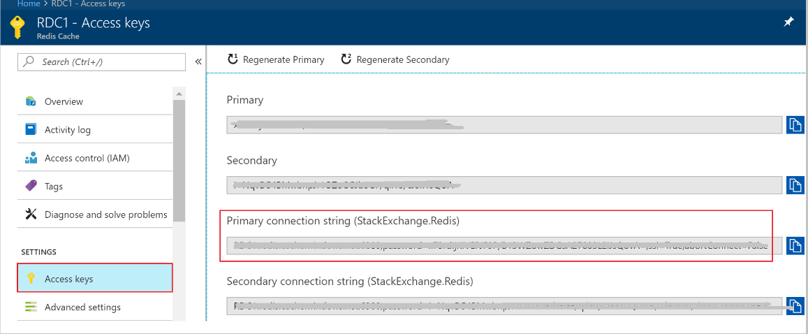
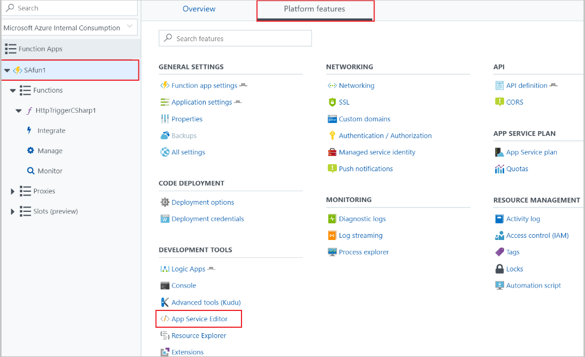
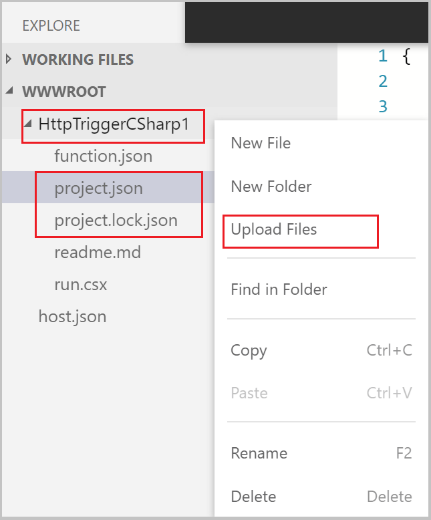

# Run Azure Functions from Azure Stream Analytics jobs 

You can run Azure Functions from Azure Stream Analytics by configuring Functions as one of the output sinks to the Stream Analytics job. Functions are an event-driven, compute-on-demand experience that lets you implement code that is triggered by events occurring in Azure or third-party services. This ability of Functions to respond to triggers makes it a natural output to Stream Analytics jobs.

Stream Analytics invokes Functions through HTTP triggers. The Functions output adapter allows users to connect Functions to Stream Analytics, such that the events can be triggered based on Stream Analytics queries. 

In this tutorial, you learn how to:

> [!div class="checklist"]
> * Create a Stream Analytics job
> * Create an Azure function
> * Configure Azure function as output to your job

If you don’t have an Azure subscription, create a [free account](https://azure.microsoft.com/free/?WT.mc_id=A261C142F) before you begin.

## Configure a Stream Analytics job to run a function 

This section demonstrates how to configure a Stream Analytics job to run a function that writes data to Azure Redis Cache. The Stream Analytics job reads events from Azure Event Hubs, and runs a query that invokes the function. This function reads data from the Stream Analytics job, and writes it to Azure Redis Cache.


The following steps are required to achieve this task:
* [Create a Stream Analytics job with Event Hubs as input](#create-stream-analytics-job-with-event-hub-as-input)  
* [Create an Azure Redis Cache instance](#create-an-azure-redis-cache)  
* [Create a function in Azure Functions that can write data to the Azure Redis Cache](#create-an-azure-function-that-can-write-data-to-the-redis-cache)    
* [Update the Stream Analytics job with the function as output](#update-the-stream-analytic-job-with-azure-function-as-output)  
* [Check Azure Redis Cache for results](#check-redis-cache-for-results)  

## Create a Stream Analytics job with Event Hubs as input

Follow the [Real-time fraud detection](stream-analytics-real-time-fraud-detection.md) tutorial to create an event hub, start the event generator application, and create a Stream Analytics job. (Skip the steps to create the query and the output. Instead, see the following sections to set up Functions output.)

## Create an Azure Redis Cache instance

1. Create a cache in Azure Redis Cache by using the steps described in [Create a cache](../redis-cache/cache-dotnet-how-to-use-azure-redis-cache.md#create-a-cache).  

2. After you create the cache, under **Settings**, select **Access Keys**. Make a note of the **Primary connection string**.

   

## Create a function in Azure Functions that can write data to Azure Redis Cache

1. See the [Create a function app](../azure-functions/functions-create-first-azure-function.md#create-a-function-app) section of the Functions documentation. This walks you through how to create a function app and an [HTTP-triggered function in Azure Functions](../azure-functions/functions-create-first-azure-function.md#create-function), by using the CSharp language.  

2. Browse to the **run.csx** function. Update it with the following code. (Make sure to replace "\<your redis cache connection string goes here\>" with the Azure Redis Cache primary connection string that you retrieved in the previous section.)  

   ```csharp
   using System;
   using System.Net;
   using System.Threading.Tasks;
   using StackExchange.Redis;
   using Newtonsoft.Json;
   using System.Configuration;

   public static async Task<HttpResponseMessage> Run(HttpRequestMessage req, TraceWriter log)
   {
      log.Info($"C# HTTP trigger function processed a request. RequestUri={req.RequestUri}");
    
      // Get the request body
      dynamic dataArray = await req.Content.ReadAsAsync<object>();

      // Throw an HTTP Request Entity Too Large exception when the incoming batch(dataArray) is greater than 256 KB. Make sure that the size value is consistent with the value entered in the Stream Analytics portal.

      if (dataArray.ToString().Length > 262144)
      {        
         return new HttpResponseMessage(HttpStatusCode.RequestEntityTooLarge);
      }
      var connection = ConnectionMultiplexer.Connect("<your redis cache connection string goes here>");
      log.Info($"Connection string.. {connection}");
    
      // Connection refers to a property that returns a ConnectionMultiplexer
      IDatabase db = connection.GetDatabase();
      log.Info($"Created database {db}");
    
      log.Info($"Message Count {dataArray.Count}");

      // Perform cache operations using the cache object. For example, the following code block adds few integral data types to the cache
      for (var i = 0; i < dataArray.Count; i++)
      {
        string time = dataArray[i].time;
        string callingnum1 = dataArray[i].callingnum1;
        string key = time + " - " + callingnum1;
        db.StringSet(key, dataArray[i].ToString());
        log.Info($"Object put in database. Key is {key} and value is {dataArray[i].ToString()}");
       
      // Simple get of data types from the cache
      string value = db.StringGet(key);
      log.Info($"Database got: {value}");
      }

      return req.CreateResponse(HttpStatusCode.OK, "Got");
    }    

   ```

   When Stream Analytics receives the "HTTP Request Entity Too Large" exception from the function, it reduces the size of the batches it sends to Functions. In your function, use the following code to check that Stream Analytics doesn’t send oversized batches. Make sure that the maximum batch count and size values used in the function are consistent with the values entered in the Stream Analytics portal.

   ```csharp
   if (dataArray.ToString().Length > 262144)
      {        
        return new HttpResponseMessage(HttpStatusCode.RequestEntityTooLarge);
      }
   ```

3. In a text editor of your choice, create a JSON file named **project.json**. Use the following code, and save it on your local computer. This file contains the NuGet package dependencies required by the C# function.  
   
   ```json
       {
         "frameworks": {
             "net46": {
                 "dependencies": {
                     "StackExchange.Redis":"1.1.603",
                     "Newtonsoft.Json": "9.0.1"
                 }
             }
         }
     }

   ```
 
4. Go back to the Azure portal. From the **Platform features** tab, browse to your function. Under **Development Tools**, select **App Service Editor**. 
 
   

5. In the App Service Editor, right-click your root directory, and upload the **project.json** file. After the upload is successful, refresh the page. You should now see an autogenerated file named **project.lock.json**. The autogenerated file contains references to the .dll files that are specified in the project.json file.  

   

 

## Update the Stream Analytics job with the function as output

1. Open your Stream Analytics job on the Azure portal.  

2. Browse to your function, and select **Overview** > **Outputs** > **Add**. To add a new output, select **Azure Function** for the sink option. The new Functions output adapter is available, with the following properties:  

   |**Property name**|**Description**|
   |---|---|
   |Output alias| A user-friendly name that you use in the job's query to reference the output. |
   |Import option| You can use the function from the current subscription, or provide the settings manually if the function is located in another subscription. |
   |Function App| Name of your Functions app. |
   |Function| Name of the function in your Functions app (name of your run.csx function).|
   |Max Batch Size|Sets the maximum size for each output batch, which is sent to your function. By default, this value is set to 256 KB.|
   |Max Batch Count|Specifies the maximum number of events in each batch that is sent to the function. The default value is 100. This property is optional.|
   |Key|Allows you to use a function from another subscription. Provide the key value to access your function. This property is optional.|

3. Provide a name for the output alias. In this tutorial, we name it **saop1** (you can use any name of your choice). Fill in other details.  

4. Open your Stream Analytics job, and update the query to the following. (Make sure to replace the "saop1" text if you have named the output sink differently.)  

   ```sql
    SELECT 
            System.Timestamp as Time, CS1.CallingIMSI, CS1.CallingNum as CallingNum1, 
            CS2.CallingNum as CallingNum2, CS1.SwitchNum as Switch1, CS2.SwitchNum as Switch2
        INTO saop1
        FROM CallStream CS1 TIMESTAMP BY CallRecTime
           JOIN CallStream CS2 TIMESTAMP BY CallRecTime
            ON CS1.CallingIMSI = CS2.CallingIMSI AND DATEDIFF(ss, CS1, CS2) BETWEEN 1 AND 5
        WHERE CS1.SwitchNum != CS2.SwitchNum
   ```

5. Start the telcodatagen.exe application by running the following command in command line (use the format `telcodatagen.exe [#NumCDRsPerHour] [SIM Card Fraud Probability] [#DurationHours]`):  
   
   **telcodatagen.exe 1000 .2 2**
    
6.	Start the Stream Analytics job.

## Check Azure Redis Cache for results

1. Browse to the Azure portal, and find your Azure Redis Cache. Select **Console**.  

2. Use [Redis cache commands](https://redis.io/commands) to verify that your data is in Redis cache. (The command takes the format Get {key}.) For example:

   **Get "12/19/2017 21:32:24 - 123414732"**

   This command should print the value for the specified key:

   

## Known issues

In the Azure portal, when you try to reset the Max Batch Size/ Max Batch Count value to empty (default), the value changes back to the previously entered value upon save. Manually enter the default values for these fields in this case.

## Clean up resources

When no longer needed, delete the resource group, the streaming job, and all related resources. Deleting the job avoids billing the streaming units consumed by the job. If you're planning to use the job in future, you can stop it and re-start it later when you need. If you are not going to continue to use this job, delete all resources created by this quickstart by using the following steps:

1. From the left-hand menu in the Azure portal, click **Resource groups** and then click the name of the resource you created.  
2. On your resource group page, click **Delete**, type the name of the resource to delete in the text box, and then click **Delete**.

## Next steps

In this tutorial, you have create a simple Stream Analytics job, that runs an Azure Function, to learn more about Stream Analytics jobs, continue to the next tutorial:

> [!div class="nextstepaction"]
> [Run JavaScript user-defined functions within Stream Analytics jobs](stream-analytics-javascript-user-defined-functions.md)