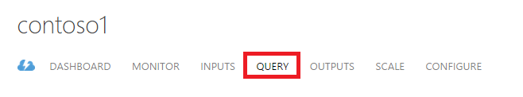
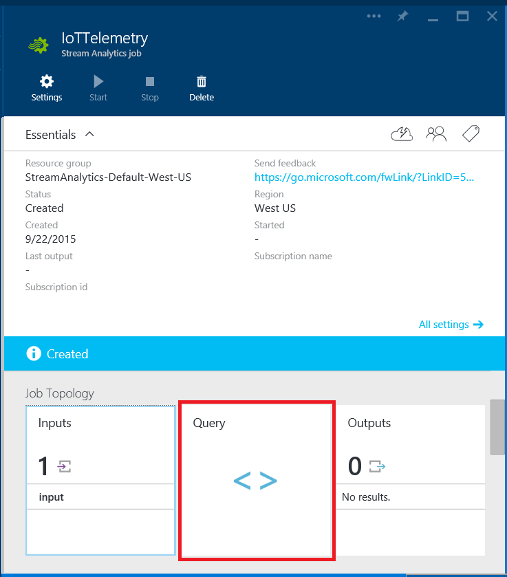
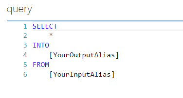
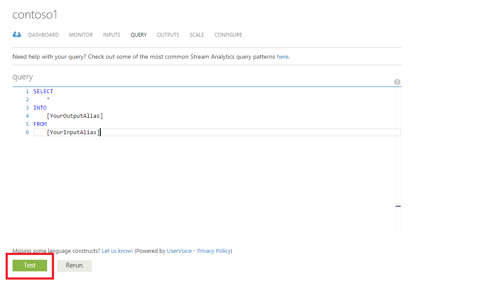
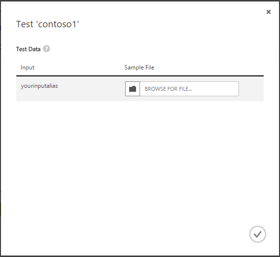
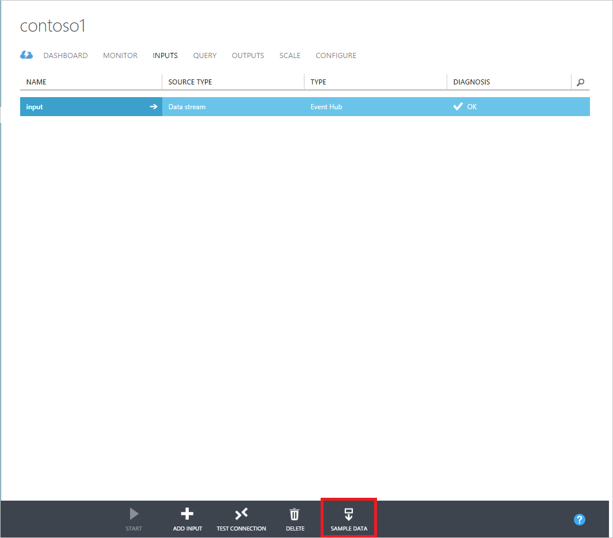
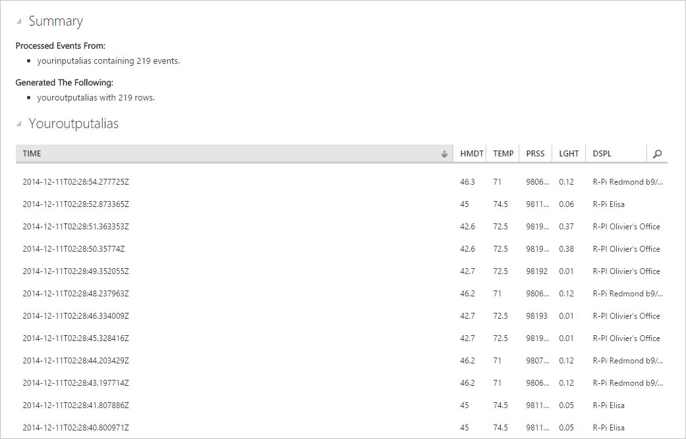

<properties 
	pageTitle="How to write queries in Stream Analytics | Microsoft Azure" 
	description="Write queries in Stream Analytics and query data | learning path segment."
	keywords="how to write queries, query data, write a query, writing queries"
	documentationCenter=""
	services="stream-analytics"
	authors="jeffstokes72" 
	manager="paulettm" 
	editor="cgronlun"/>

<tags 
	ms.service="stream-analytics" 
	ms.devlang="na" 
	ms.topic="article" 
	ms.tgt_pltfrm="na" 
	ms.workload="data-services" 
	ms.date="07/27/2016" 
	ms.author="jeffstok"/>

# How to write queries in Stream Analytics

Writing queries for stream processing logic in Azure Stream Analytics is implemented as a "standing query" that is defined before a job starts and executed on data as it reaches the job. The data transformation is expressed in a SQL-like query language, which is largely a subset of T-SQL with some added language extensions like [Windowing](https://msdn.microsoft.com/library/azure/dn835019.aspx) used to express temporal semantics.

## Writing Queries: ##

1. In your Stream Analytics Job in the Azure Management portal, click **Query**.

      

    In the Azure Portal, click **Query**.

      

2.	New jobs have a query template to help get you started. The query template performs a "pass-through" query that projects all fields from input events into the output.  

    - If you have defined at least one input and output for your job, you can replace the placeholder "[YourOutputAlias]" and "[YourInputAlias]" fields with the aliases of the input and output that you wish use first. In addition, you can still author and test your query in the Azure Classic Portal without defining inputs and outputs on the job.
    - If you wish to perform more processing than a simple pass-through, you can edit the query definition. To get started with query authoring, take a look at some common query patterns are captured [here](stream-analytics-stream-analytics-query-patterns.md).  
  
      

## To validate query data is working: ##

You can test that your query behaves as expected by running it in the browser over one or more local JSON files containing test data. This will not start the job or have any billing implications.

> [AZURE.NOTE] Currently in-browser query testing is not supported in the Azure Portal.  

1.	Make sure that there are no errors in the query (otherwise the Test button will be disabled) and then click the Test button.  

      

2.	You will be prompted to specify files for each of the inputs referenced in the query. In this example, the template query is left as-is, so the dialog is prompting for an input named "yourinputalias".  

      

3.	Browse to a test file. Several sample files are available on [github](https://github.com/Azure/azure-stream-analytics/tree/master/Sample Data) and you can also retrieve sample data from your own data stream inputs via the Sample Data function on the inputs tab.  

      

4.	After closing the dialog, your query will be run over the test data and you will see the results at the bottom of the Query page.  

      

## Get help
For further assistance, try our [Azure Stream Analytics forum](https://social.msdn.microsoft.com/Forums/en-US/home?forum=AzureStreamAnalytics)

## Next steps

- [Introduction to Azure Stream Analytics](stream-analytics-introduction.md)
- [Get started using Azure Stream Analytics](stream-analytics-get-started.md)
- [Scale Azure Stream Analytics jobs](stream-analytics-scale-jobs.md)
- [Azure Stream Analytics Query Language Reference](https://msdn.microsoft.com/library/azure/dn834998.aspx)
- [Azure Stream Analytics Management REST API Reference](https://msdn.microsoft.com/library/azure/dn835031.aspx)